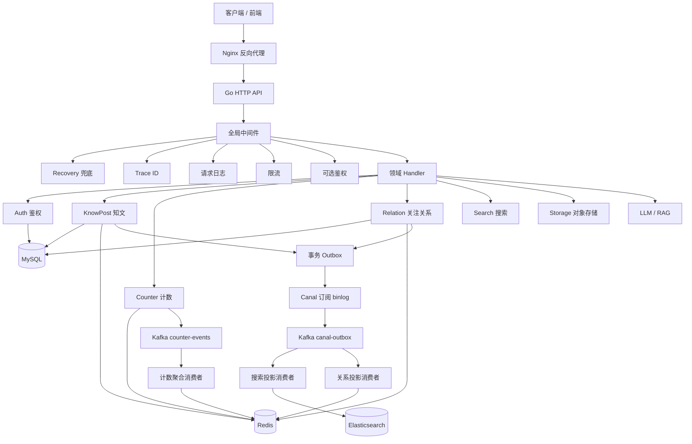
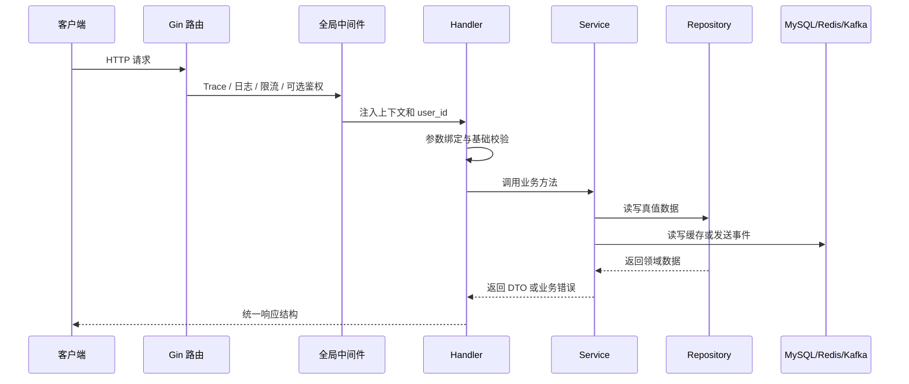
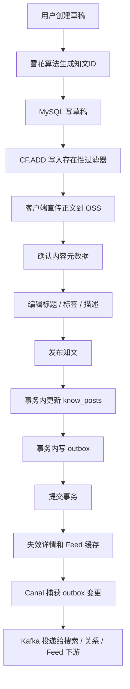
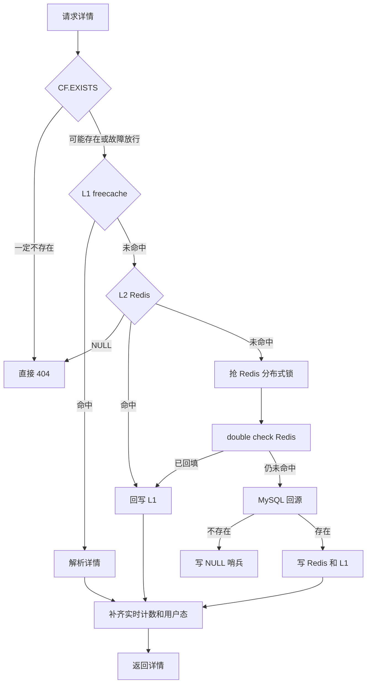
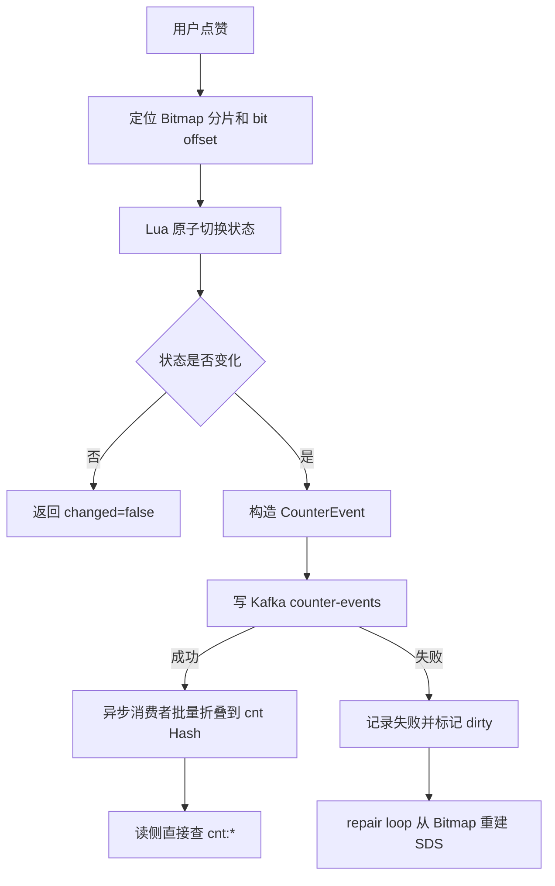
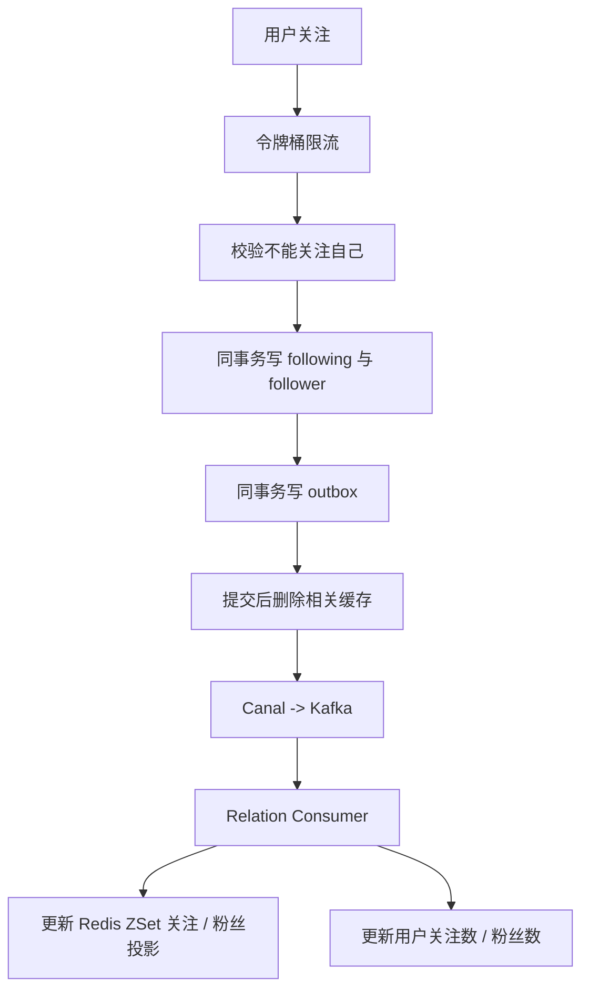
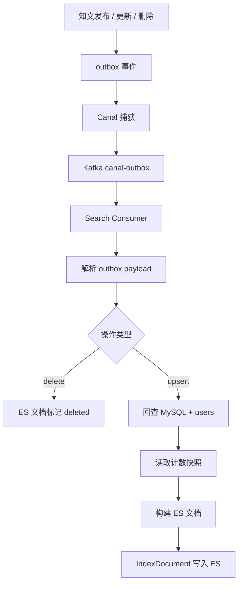

# 知光平台 (ZhiGuang) - Go 重构版

知识获取与分享社区后端服务，从 Java Spring Boot 重构为 Go 语言实现。

## 当前状态

- HTTP 服务使用 Gin，入口是 `cmd/server/main.go`
- 依赖装配走共享 bootstrap，入口在 `internal/bootstrap/app.go`
- 本地开发推荐方式：
  依赖服务走 Docker Compose
  Go 应用继续本机运行
- 搜索能力支持全文检索和 completion suggester
- `knowpost` 变更会通过事务内 outbox + Canal/Kafka 消费链路投递到 Elasticsearch
- `knowpost` 的缓存回源使用 Redis 分布式锁 + 手写看门狗续约，避免长尾回源时锁提前过期
- `canal.enabled=true` 时，启动 `Canal -> Kafka(canal-outbox) -> relation/search consumers` 链路
- `canal.enabled=false` 时，不启动上述 outbox 异步投影；**不会**自动切换 outbox DirectPoll
- like/fav 走独立 topic `counter-events`（AggregationConsumer + 进程内 dirty repairLoop）
- 写扩散 `internal/fanout`：**Consumer/算法已实现**，但 **Publisher 未注入发布路径**（半接线）；与 `canal-outbox` 不是同一 topic
- 跨模块流程图与接线核对：[`docs/跨模块流程图.md`](docs/跨模块流程图.md)
- Kafka 本地环境已调整为 3 broker；`counter-events` 与 `canal-outbox` 主题使用 3 副本并要求 `min.insync.replicas=2`
- `docker-compose.yml` 已包含本地 Canal 服务，默认会订阅 `zhiguang.outbox`
- Canal 配置通过自定义镜像内置，`conf/example` 与 `logs` 使用 Docker 命名卷持久化
- LLM/RAG、OSS 存储在配置不完整时会自动降级为 `503`，不会阻塞服务启动

## 技术栈

| 组件 | Go 实现 |
|------|---------|
| HTTP 框架 | Gin |
| SQL 访问层 | sqlx |
| 本地缓存 | freecache |
| Redis 客户端 | go-redis/v9 |
| 消息队列 | segmentio/kafka-go |
| 搜索引擎 | go-elasticsearch v8 |
| JWT 认证 | golang-jwt/v5 + bcrypt |
| 对象存储 | aliyun-oss-go-sdk |
| AI 服务 | HTTP 直调 DeepSeek/OpenAI 兼容接口 |

## 后端结构

后端采用 Go 常见的 `cmd + internal + pkg` 结构，并按业务域组织代码：

- `cmd/server`
  - 程序启动入口
- `internal/bootstrap`
  - 应用装配
- `internal/database`
  - MySQL / Redis 连接工厂
- `internal/server`
  - Gin 路由和应用容器
- `internal/<domain>`
  - 按领域组织业务代码，例如 `auth`、`knowpost`、`relation`、`search`

领域包内部遵循统一职责边界：

- `handler.go`
  - HTTP 入口层，负责收参、鉴权、调用 service、写响应
- `service.go`
  - 业务编排层，负责规则、事务和跨组件协同
- `repository.go`
  - 数据访问层，负责 SQL 与持久层读写
- `model.go`
  - 领域模型与数据库映射结构
- `dto.go`
  - 请求体、响应体等传输结构

部分复杂领域会在上述基础上增加更细粒度文件，例如：

- `detail_service.go`
- `feed_service.go`
- `write_service.go`
- `outbox_consumer.go`
- `cache.go`
- `helper.go`
- `id.go`

## 本地开发

### 前置条件

- Go 1.25.0+（与 `go.mod` 一致）
- Docker Desktop 或可用的 Docker daemon
- `openssl`

### 两种启动模式

| 模式 | 命令 | 适用场景 |
|------|------|----------|
| **模式 A：全 Docker 跑前后端** | `make dev-up` | 完整体验，一键启动 |
| **模式 B：Docker 跑中间件 + 本机跑 Go 服务** | `docker compose up -d mysql redis kafka kafka2 kafka3 zookeeper kafka-init elasticsearch canal` + `make run` | 开发调试，热重载，断点调试 |

两种模式共用同一份 `docker-compose.yml`，区别仅在于是否构建 Go 应用镜像和前端镜像。

---

### 模式 A：全 Docker 跑前后端

#### 1. 启动 Docker 服务

```bash
make dev-up
```

会启动所有服务：

- Frontend（Nginx, `http://localhost`）
- Go API Server（`http://localhost:8080`）
- MySQL 8.0.30
- Redis Stack（`redis/redis-stack-server`，含 RedisBloom `CF.*` 供知文存在性过滤）
- Kafka（3 brokers）+ Zookeeper
- Canal Server
- Elasticsearch 8.5.0

#### 2. 初始化数据库

```bash
make db-init
```

#### 3. 访问

- 前端页面：`http://localhost`
- 前端健康检查：`http://localhost/health`
- 前端代理 API：`http://localhost/api/v1/...`

---

### 模式 B：Docker 跑中间件 + 本机跑 Go 服务（推荐开发）

#### 1. 启动中间件

```bash
docker compose up -d mysql redis kafka kafka2 kafka3 zookeeper kafka-init elasticsearch canal
```

> 如果不需要异步投影能力，可以跳过 Canal：
> ```bash
> docker compose up -d mysql redis kafka kafka2 kafka3 zookeeper kafka-init elasticsearch
> ```

#### 2. 初始化数据库

```bash
make db-init
```

#### 3. 生成本地 JWT 密钥

```bash
make gen-jwt-keys
```

会生成：

- `config/keys/private.pem`
- `config/keys/public.pem`

#### 4. 创建本地配置

```bash
cp config/config-local.yaml.example config/config-local.yaml
```

> **配置对齐说明**：
>
> 1. **`${...}` 变量不会自动展开**：Go 应用的 `yaml.Unmarshal` **不会**展开 `${DB_PASSWORD:-root123}` 这类 shell 变量。`config/config-docker.yaml` 中的 `${...}` 语法仅供 Docker Compose 的 `environment` 字段使用。**本机运行必须使用 `config/config-local.yaml`**，其中密码直接写明文。
>
> 2. **Canal 配置校验**：`canal.enabled=true` 时，配置校验要求 `canal.username` 和 `canal.password` 均非空（见 `pkg/config/config.go:629`）。如果不需要 Canal 异步投影，请将 `canal.enabled` 设为 `false`。
>
> 3. **Elasticsearch 配置**：即使 `canal.enabled=false`，`elasticsearch.uris` 也必须配置（至少一个地址），否则校验失败。搜索查询接口会返回 `503` 但不会阻塞启动。

默认本地配置已经指向本机开发环境暴露的端口：

- MySQL: `localhost:3306`
- Redis Stack: 容器内 `redis:6379`（宿主机默认不映射；集成测可用 `REDIS_BLOOM_ADDR`）
- Kafka: `localhost:9092,9093,9094`
- Elasticsearch: `localhost:9200`

#### 5. 运行 Go 服务

```bash
make run
```

默认等价于：

```bash
env GOCACHE=$(pwd)/.gocache go run ./cmd/server -config config/config-local.yaml
```

#### 6. 访问

- API 服务：`http://localhost:8080`
- 健康检查：`http://localhost:8080/health`
- 就绪检查：`http://localhost:8080/ready`
- 如需前端，可单独启动前端开发服务器（见 `frontend/` 目录）

---

### 常用命令

```bash
make test       # 运行全部测试（含覆盖率）
make test-short # 快速测试，跳过依赖外部服务的用例
make lint       # 运行 golangci-lint
make dev-logs   # 跟踪 Docker Compose 日志
make dev-down   # 停止全部 Docker 服务
```

**关于测试对外部依赖的要求**：绝大多数用例使用 `miniredis` / `go-sqlmock` 就地起桩，无需外部服务。少数限流集成用例（`pkg/middleware/tests`）需要真实 Redis 的 `TIME` 与 ZSET 语义，会连接 `localhost:6379`；连不上时这些用例**自动 skip 而非失败**，因此本机没起 Redis 也能跑通 `make test`。若要完整验证限流行为，先 `docker compose up -d redis`。

### Docker 构建说明

如果你使用：

```bash
docker compose build
```

当前仓库的 `Dockerfile` 已做这些优化：

- Alpine `apk` 默认走国内镜像源
- Go modules 默认走 `goproxy.cn`
- 移除了无效的 `gcc/musl-dev` 安装步骤，因为服务使用 `CGO_ENABLED=0`

前端 `frontend/Dockerfile` 也已做容器化处理：

- 构建阶段使用 `node:22-alpine`
- 运行阶段使用 `nginx:alpine`
- Nginx 会把 `/api` 代理到 Docker Compose 内部的 `app:8080`
- 浏览器访问 `http://localhost` 即可打开前端页面

当前 `docker-compose.yml` 的生产化约束：

- 后端 `app` 不再直接暴露宿主机 `8080`
- 中间件端口默认不再暴露到宿主机
- 如果需要从宿主机直接调试 MySQL/Redis/ES，需要临时加端口映射或使用 `docker compose exec`

因此：

- 第一次构建仍然会下载基础镜像和 Go 依赖，时间取决于本机网络
- 第二次及之后的构建会明显更快
- 如果再次出现长时间卡在 `apk add`，通常是 Docker Desktop 网络或镜像源连通性问题，不是 Go 编译本身的问题

## 可选能力降级说明

以下能力在配置不完整时不会阻塞服务启动，对应接口会返回 `503`。

| 能力 | 必要配置项 | 降级接口 | 启动影响 |
|------|-----------|----------|---------|
| **搜索** | `elasticsearch.uris`、`elasticsearch.index_name` | `GET /api/v1/search?q=xxx`、`GET /api/v1/search/suggest?prefix=xxx` | 不阻塞，ES 查询接口返回 503 |
| **LLM / RAG** | `llm.deepseek.api_key`、`llm.deepseek.base_url`、`llm.deepseek.model`、`llm.openai.api_key`、`llm.openai.base_url`、`elasticsearch.uris` | `POST /api/v1/knowposts/:id/description/suggest`、`POST /api/v1/knowposts/:id/rag/query` | 不阻塞，LLM 接口返回 503 |
| **OSS 存储** | `oss.endpoint`、`oss.access_key_id`、`oss.access_key_secret`、`oss.bucket` | `POST /api/v1/storage/presign` | 不阻塞，存储接口返回 503 |

> 注意：`elasticsearch.uris` 在配置校验层是必填项（至少一个地址），但 ES 初始化失败后搜索/LLM 接口会降级为 503，主服务仍可启动。

## 后台 Runner 启动条件

| Runner | 启动条件 | 职责 |
|--------|----------|------|
| `AggregationConsumer` | **始终启动**（依赖 Kafka reader） | 消费 `counter-events` 主题，内嵌 **dirty repairLoop** 从 Bitmap 修复 SDS |
| `hotKeyRunner` | **始终启动** | HotKeyDetector 后台 flush 本地计数到 Redis |
| `FanoutConsumer` | Kafka brokers 非空时启动 | 消费 `fanout` 主题（**生产端未闭环**，通常无消息） |
| `canal.Bridge` | `canal.enabled=true` | 订阅 MySQL binlog，将 outbox 变更写入 `canal-outbox` topic |
| `relationOutboxConsumer` | `canal.enabled=true` | 消费 `canal-outbox` 中关系类事件，投影 Redis ZSet + HIncrBy 用户计数 |
| `searchOutboxConsumer` | `canal.enabled=true` 且 ES 可用 | 消费 `canal-outbox` 中知文类事件，回查 MySQL + 补计数后写入 ES |

**不存在的独立 Runner**：
- `CounterFailureWorker`（失败表无周期自动重放；有 `ReplayFailedMessages` 方法但 bootstrap 未挂周期任务）
- outbox `DirectPoll` / `PollConsumer`（`canal.enabled=false` 时 **不会** 自动启用）

## API 路由速查表

所有业务路由均挂载在 `/api/v1` 前缀下。全局中间件链（按执行顺序）：

`Recovery → Trace → Logger → ErrorLog → Metrics → RateLimit → CORS → OptionalAuth`

其中：

- **Recovery 排在首位**。Gin 中间件按注册顺序形成调用链，`gin.Recovery()` 只能兜住排在它**之后**的环节。此前它被放在链尾，Trace / Logger / Metrics / RateLimit / CORS 任一处 panic 都不会被捕获。
- **Metrics** 仅在 `prometheus.enabled=true` 时挂载。
- **RateLimit** 仅在装配了 `handlers.RateLimiter` 时挂载。
- **OptionalAuth** 是可选鉴权，不拒绝未登录请求；真正受保护的接口在各自 handler 内显式校验。

### Auth 鉴权

| 方法 | 路径 | 说明 | 鉴权 |
|------|------|------|------|
| POST | `/api/v1/auth/send-code` | 发送验证码 | 公开 |
| POST | `/api/v1/auth/register` | 注册 | 公开 |
| POST | `/api/v1/auth/login` | 登录 | 公开 |
| POST | `/api/v1/auth/refresh` | 刷新令牌 | 公开 |
| POST | `/api/v1/auth/logout` | 登出 | 公开 |
| POST | `/api/v1/auth/reset-password` | 重置密码 | 公开 |
| GET | `/api/v1/auth/me` | 当前用户信息 | 需登录 |

### KnowPost 知文

| 方法 | 路径 | 说明 | 鉴权 |
|------|------|------|------|
| POST | `/api/v1/knowposts/draft` | 创建草稿 | 需登录 |
| PUT | `/api/v1/knowposts/:id/content` | 确认正文 | 需登录 |
| PUT | `/api/v1/knowposts/:id/metadata` | 编辑元数据 | 需登录 |
| POST | `/api/v1/knowposts/:id/publish` | 发布知文 | 需登录 |
| PUT | `/api/v1/knowposts/:id/top` | 置顶/取消置顶 | 需登录 |
| PUT | `/api/v1/knowposts/:id/visibility` | 修改可见性 | 需登录 |
| DELETE | `/api/v1/knowposts/:id` | 删除知文 | 需登录 |
| GET | `/api/v1/knowposts/:id` | 知文详情 | 可选登录 |
| GET | `/api/v1/knowposts/feed/public` | 公共 Feed | 可选登录 |
| GET | `/api/v1/knowposts/feed/mine` | 我的发布 | 需登录 |

### Counter 计数

| 方法 | 路径 | 说明 | 鉴权 |
|------|------|------|------|
| POST | `/api/v1/counter/like` | 点赞 | 需登录 |
| POST | `/api/v1/counter/unlike` | 取消点赞 | 需登录 |
| POST | `/api/v1/counter/fav` | 收藏 | 需登录 |
| POST | `/api/v1/counter/unfav` | 取消收藏 | 需登录 |
| GET | `/api/v1/counter/counts` | 获取计数 | 需登录 |
| GET | `/api/v1/counter/status` | 点赞/收藏状态 | 需登录 |
| GET | `/api/v1/counter/likers` | 点赞人列表 | 需登录 |

### Relation 关注关系

| 方法 | 路径 | 说明 | 鉴权 |
|------|------|------|------|
| POST | `/api/v1/relations/follow` | 关注 | 需登录 |
| POST | `/api/v1/relations/unfollow` | 取关 | 需登录 |
| GET | `/api/v1/relations/status` | 关系状态 | 需登录 |
| GET | `/api/v1/relations/following` | 关注列表 | 需登录 |
| GET | `/api/v1/relations/followers` | 粉丝列表 | 需登录 |
| GET | `/api/v1/relations/following/cursor` | 关注列表（游标） | 需登录 |
| GET | `/api/v1/relations/followers/cursor` | 粉丝列表（游标） | 需登录 |

### Search 搜索

| 方法 | 路径 | 说明 | 鉴权 |
|------|------|------|------|
| GET | `/api/v1/search` | 全文搜索 | 可选登录 |
| GET | `/api/v1/search/suggest` | 自动补全 | 可选登录 |

### Profile 用户资料

| 方法 | 路径 | 说明 | 鉴权 |
|------|------|------|------|
| GET | `/api/v1/profiles/:id` | 获取用户资料 | 公开 |
| PATCH | `/api/v1/profiles/:id` | 更新用户资料 | 需登录（仅本人） |

### Storage 对象存储

| 方法 | 路径 | 说明 | 鉴权 |
|------|------|------|------|
| POST | `/api/v1/storage/presign` | 获取预签名 URL | 需登录 |

### LLM / RAG

| 方法 | 路径 | 说明 | 鉴权 |
|------|------|------|------|
| POST | `/api/v1/knowposts/:id/description/suggest` | 摘要建议 | 需登录 |
| POST | `/api/v1/knowposts/:id/rag/query` | RAG 查询 | 需登录 |

### 非业务端点

| 方法 | 路径 | 说明 |
|------|------|------|
| GET | `/health` | 存活检查（DB + Redis） |
| GET | `/ready` | 就绪检查（DB + Redis） |
| GET | `/metrics` | Prometheus 指标（需配置开启） |
| GET | `/debug/pprof/...` | pprof 调试（仅 debug 模式） |

## 已修复的本地运行问题

- 需要登录的接口现在可以通过全局可选 JWT 解析拿到 `user_id`
- LLM/RAG 初始化不再依赖 `elasticsearch.uris[0]` 的裸下标访问
- 搜索、LLM、OSS 在依赖缺失时改为显式 `503`
- 搜索索引已补齐 `tag_id` mapping 兼容逻辑，旧索引无需手工删除也能支持标签过滤
- `knowpost` 搜索同步改为事务内 outbox，并由 Canal/Kafka 消费链路异步写入 Elasticsearch
- 计数器写操作现在保留 `cnt:*` SDS 快照，计数 delta 通过 `counter-events -> AggregationConsumer -> cnt:*` 异步折叠；SDS 缺失或损坏时仍可从位图重建
- 扩展业务错误码现在会映射到正确的 HTTP 状态码
- `db/schema.sql` 的 MySQL 拼写错误已修复，可正常初始化

## 核心架构说明

### Canal 异步同步链路

`canal.enabled=true` 时，Go 应用会启动两个消费者 goroutine：

```
MySQL binlog -> Canal Server -> Kafka (canal-outbox) -> relation outbox consumer
                                                      -> search outbox consumer
```

- **Canal Server**：通过 `docker-compose.yml` 中的自定义 Docker 镜像运行，订阅 `zhiguang.outbox` 表，
  监控 INSERT 事件（毫秒级精度），将行级变更序列化为 JSON 后投递到 Kafka topic `canal-outbox`
- **relation outbox consumer**：消费 `canal-outbox` 中的关系类事件，投影 Redis ZSet，并在消费端 **HIncrBy** 用户 following/follower 展示数（**不经** `counter-events`）
- **search outbox consumer**：消费 `canal-outbox` 中的 knowpost 类事件，回查 MySQL + 补计数后同步 Elasticsearch

当 `canal.enabled=false` 时，不会启动上述两个消费者与 Canal Bridge，应用仍可正常提供 API 服务（仅丢失异步投影能力；**不会**自动启用 DirectPoll）。

写扩散 topic `fanout` 与 `canal-outbox` 分离：`FanoutConsumer` 在 Kafka 可用时会启动，但当前发布路径**不会**调用 `FanoutPublisher`，时间线通常依赖读侧降级（见 `docs/modules/06`、`docs/跨模块流程图.md` §6）。

### 计数器修复机制

计数系统采用 **Bitmap（位图） + SDS（结构化数据快照）** 双存储设计：

| 数据结构 | 作用 | Redis 键前缀 |
|---------|------|------------|
| Bitmap | 位图权威数据源，记录每个用户对每个实体的点赞/收藏状态 | `bm:{metric}:{entityType}:{entityID}:{chunk}` |
| SDS | 位图的聚合快照（点赞数/收藏数），用于快速查询 | `cnt:{entityType}:{entityID}` |
| Dirty Set | 标记 SDS 可能不一致的实体，触发修复 | `repair:counter:dirty` |

**正常路径**：

```
用户点赞 -> Lua toggle 位图 -> 发布 CounterEvent 到 Kafka counter-events
                              -> AggregationConsumer 批量聚合
                              -> flush delta 到 cnt:* SDS
```

**异常修复路径**：

- 当 Kafka 发布失败或 flush/commit 失败时，实体被加入 **Dirty Set**，并尽量写入 MySQL `counter_failed_messages`
- **Repair Loop** 挂在 **AggregationConsumer 同进程**（不是独立 FailureWorker Runner），`repair.Enabled` 时周期扫描 Dirty Set：
  1. 尝试获取全局 leader 锁 `lock:counter:repair`（避免多实例同时修复）
  2. 对每个 Dirty Member 从位图 BITCOUNT 重建绝对值并覆盖 SDS
  3. 失败时按策略退避/限流（以 `internal/counter` 与配置为准）
- 失败表另有 `ReplayFailedMessages` 可对 pending 记录做绝对值重建；**bootstrap 默认未挂周期任务**扫表

**水位线幂等**：

- Kafka 消费者的每个 partition 通过 Redis 键 `counter:applied-offset:{groupID}:{topic}:{partition}` 记录已应用的 offset
- 同一批消息内用 Lua 脚本 `APPLY_PARTITION_BATCH_LUA` 原子执行：
  - 跳过 offset <= 已水位线的消息
  - 检测 offset 连续性（不允许空洞）
  - 只有所有校验通过后才写入 cnt:*
- 这保证了多实例并发消费时不会重复应用同一条消息

### 热 Key 检测

知文缓存系统（`knowpost` 模块）采用三级缓存 + 热 Key 自动延长机制：

| 缓存层级 | 实现 | 默认 TTL（可在 `knowpost.feed_cache` / `knowpost.detail_cache` 调整） |
|---------|------|---------|
| L1 | freecache（进程内，约 50ns 响应） | 公共 Feed 15s，我的 Feed 30s，详情 60s |
| L2 | Redis（Feed 为碎片缓存，详情为整页） | ID 列表 60s+jitter，条目碎片 60s+jitter，详情 60s+jitter |
| L3 | MySQL（权威数据源） | — |

**L1 公共 Feed 缓存只存「公共视图」**：`feed:public:{size}:{page}:v{layout}:{version}` 这个键不含用户 ID，是全体用户共享的一份数据。因此缓存中**不得**包含 `liked` / `faved` 这类用户维度字段——它们由 `withUserState` 在每次读出后即时叠加。若把某个用户的状态写进共享缓存，后续命中该键的其他用户就会读到别人的点赞收藏状态。

**HotKeyDetector 工作原理**（`internal/cache/hotkey.go`）：

- 每次访问只递增**进程内**计数（零 Redis IO），按 `bucket_size_seconds`（默认 6s）分桶。
- 每 `flush_interval_seconds`（默认 6s）批量汇总到 Redis Hash `hotwin:{cacheKey}`，field 为桶编号、value 为该桶计数，实现跨实例聚合。
- 定级时对最近 `bucket_count`（默认 10，即 60s 窗口）个桶求和，按三级阈值判定，并把达标的键写入标记 `hotkey:active:{cacheKey}`（TTL `hot_mark_ttl_seconds`）：

  | 等级 | 阈值配置 | TTL 增量配置 |
  |------|---------|-------------|
  | LOW | `level_low` | `extend_low_seconds` |
  | MEDIUM | `level_medium` | `extend_medium_seconds` |
  | HIGH | `level_high` | `extend_high_seconds` |

  注意增量是**在基准 TTL 之上相加**（`baseTTL + extendXxxSeconds`），不是「延长到某个固定值」。

- TTL 延长统一走 Lua 脚本，语义为**只增不减**（仅当键存在且当前 TTL 小于目标值才 EXPIRE），多实例并发延长不会互相把 TTL 改短。
- 热度等级缓存（`levels`）**按窗口整体重建**而非累加：每轮 flush 用本轮观测结果整体替换，本轮无流量则清空。这样既让降温的键自动退出热点集合，也使其规模始终受 `max_local_keys` 约束，不会随内容总量无上界增长。
- 列表场景使用 `TtlForPublicBatch` 批量定级：本地等级缓存未命中的键合并为**一次** MGET，TTL 延长合并为**一次** EVAL，整页无热点时零 Redis 往返。避免逐条 `EXISTS + EVAL` 在 L1 命中路径上产生上百次串行往返。

### 限流（`pkg/middleware/ratelimit.go`）

按客户端 IP 的 Redis ZSET 滑动窗口限流，配置见 `rate_limit`：

- ZSET 的 **score** 取自 Redis 服务端 `TIME`，而非应用进程时钟——多实例部署时进程时钟有偏差，用本地时间会让窗口边界抖动。
- ZSET 的 **member 逐请求唯一**（进程随机前缀 + 进程内原子自增）。这一点是限流能否成立的关键：`ZADD` 对相同 member 只更新 score 而不新增元素，若把时间戳同时当作 score 和 member，同一毫秒内的并发请求会互相覆盖，`ZCARD` 永远只记 1，突发流量可以完全绕过限流。
- 响应头 `X-RateLimit-Limit` / `X-RateLimit-Remaining` 反映真实余量；被拒时额外返回 `Retry-After`。
- 超限后若 `ban_duration_ms > 0`，该 IP 进入封禁名单 `ratelimit:ban:{ip}`。
- Redis 故障时 **fail-open**（放行并告警），避免限流组件自身的可用性问题演变成整站不可用。

## 面试版项目细节扩写

这一节用于面试前快速讲清楚项目。它不替代 `docs/modules` 下的分模块文档，而是把系统全景、核心链路、数据真值、缓存和异步一致性串起来。

### 1. 项目定位

ZhiGuang 是一个知识内容社区后端，核心业务是让用户发布图文类知识内容，并围绕内容产生互动、关注、搜索和 AI 增强能力。项目从 Java Spring Boot 重构为 Go，重点不是简单改语言，而是把后端拆成更清晰的领域模块：

| 领域 | 解决的问题 | 主要代码 |
|------|------------|----------|
| 鉴权 | 注册、登录、令牌刷新、当前用户识别 | `internal/auth` |
| 知文 | 草稿、内容确认、元数据编辑、发布、详情、Feed | `internal/knowpost` |
| 计数 | 点赞、收藏、计数快照、点赞人列表 | `internal/counter` |
| 关系 | 关注、取关、关注列表、粉丝列表、关系状态 | `internal/relation` |
| Feed 扩散 | 粉丝时间线写扩散（算法+Consumer 在；Publisher 生产路径未闭环） | `internal/fanout` |
| 搜索 | 全文检索、标签过滤、自动补全、ES 投影 | `internal/search` |
| 异步链路 | 事务 outbox、Canal、Kafka、消费者幂等 | `internal/outbox` / `internal/canal` |
| 存储 | OSS 预签名上传与业务元数据确认 | `internal/storage` |
| AI | 摘要建议、RAG 查询接口、流式返回 | `internal/llm` |

### 2. 系统整体架构图



面试时可以这样解释：HTTP 主链路只做强相关业务写入，搜索索引、关系缓存、Feed 扩散等派生数据通过 outbox + Canal + Kafka 异步同步。MySQL 保存强一致真值，Redis 和 ES 只做缓存或投影，出了问题可以回源或重建。

### 3. 一次请求的通用生命周期



这个生命周期体现了项目的分层边界：Handler 不写 SQL，Service 做业务编排，Repository 只负责持久化，公共中间件负责横切能力。

### 4. 数据真值和派生数据

| 数据 | 真值位置 | 派生 / 缓存位置 | 为什么这样分 |
|------|----------|-----------------|--------------|
| 用户资料 | MySQL `users` | Redis token / 当前用户响应 | 用户信息需要持久化和唯一约束 |
| 知文内容 | MySQL `know_posts` | freecache、Redis、ES | 内容以 MySQL 为准，缓存和搜索可重建 |
| 关注关系 | MySQL `following` / `follower` | Redis ZSet | 双表保证双向查询，ZSet 提高列表读取速度 |
| 点赞收藏状态 | Redis Bitmap | Redis Hash `cnt:*` | Bitmap 是用户状态真值，Hash 是计数快照 |
| 搜索索引 | MySQL 回查生成 | Elasticsearch | ES 只服务检索，不作为业务真值 |
| 异步事件 | MySQL `outbox` | Kafka topic | 事件和业务写入同事务，消息链路可恢复 |

面试重点：先讲清“谁是真值，谁是投影”，后续再讲缓存、MQ、ES 才不会散。

### 5. 核心业务链路

#### 5.1 发布知文



设计点：内容写库和 outbox 同事务，避免“内容发布成功但搜索永远搜不到”；缓存失效使用版本号和碎片失效，避免多实例本地缓存广播复杂度。

#### 5.2 读取知文详情



设计点：RedisBloom CF.* 拦恶意扫号且软删 CF.DEL，NULL 缓存兜住误判与模块缺失边界，分布式锁防击穿，liked/faved 用户态数据后置查询，避免把个人状态写入共享缓存。

#### 5.3 点赞 / 收藏



设计点：Bitmap 保存“谁点过”的状态真值，计数 Hash 是派生快照。即使 Kafka 或聚合失败，也可以从 Bitmap 重新计算绝对值修复。

#### 5.4 关注 / 取关



设计点：MySQL 双表是真值，Redis ZSet 是列表读优化。单条关系判断直查库，避免缓存复杂度高于收益。

#### 5.5 搜索投影



设计点：投影时回查主库，而不是完全相信事件 payload，这样 ES 文档字段可以统一由当前真值生成，避免事件格式演进导致旧字段缺失。

### 6. 面试亮点总结

1. **分层清晰**：`cmd` 启动、`bootstrap` 装配、`server` 路由生命周期、`internal/<domain>` 按领域拆分、`pkg` 放公共能力。
2. **真值和投影分离**：MySQL / Bitmap 保存真值，Redis / ES / Kafka 消费结果都是可重建派生数据。
3. **缓存不是简单 set/get**：知文详情使用 RedisBloom CF + NULL + L1 + Redis + DB + 分布式锁 + 热点 TTL 延长。
4. **异步不是直接双写**：通过事务 outbox 绑定业务写入和事件，再由 Canal/Kafka 驱动下游。
5. **计数有可恢复设计**：Lua 保证状态翻转原子性，Kafka 水位保证消费幂等，AggregationConsumer 内 dirty repairLoop 从 Bitmap 修复 SDS。
6. **关系模块承认边界**：双表和 Redis ZSet 是合理建模；用户关注数消费端 HIncrBy；dedupe/排序/深分页/大 V 冷启动仍有演进空间。
7. **写扩散半接线**：fanout 算法与 Consumer 在，发布路径未灌 `fanout` topic，读侧需降级（见跨模块流程图）。

### 7. 面试 1 分钟介绍

> 这是一个知识内容社区后端，核心模块包括知文发布、关注关系、点赞收藏计数、搜索和 AI 增强。技术上我重点处理了三类问题：第一是缓存和高并发读，比如知文详情用 RedisBloom 可删除 Cuckoo（CF.*）、空值缓存、L1/L2、多实例版本号和分布式锁；第二是异步一致性，比如知文和关系写入通过事务 outbox 进入 Canal/Kafka 的 `canal-outbox`，再投影到 ES 和关系 ZSet；第三是高频互动计数，点赞状态用 Bitmap 做真值，展示计数用 SDS 快照，失败后走 dirty set + AggregationConsumer 内 repairLoop。写扩散我会诚实说算法在、生产端未闭环。整体设计上我会先区分真值和投影，再分别处理性能、幂等和补偿。
