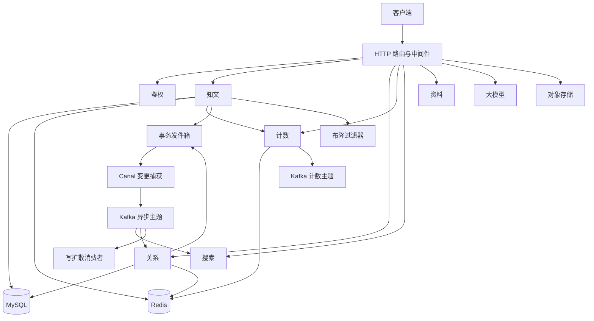

# 00. 文档目录与面试导读

## 1. 这套文档是什么

这是 ZhiGuang 后端的**中文模块工程说明 + 面试导读**。

目标：

1. **正确**：以当前 Go 源码为准，不写理想化设计。
2. **可讲**：能从「是什么 → 为什么 → 怎么做 → 风险 → 口述」完整讲出。
3. **可看图**：关键路径配**中文流程图**。
4. **可维护**：改主逻辑后知道改哪一篇。

## 2. 文档一览

| 编号 | 文档 | 代码位置 | 面试权重 |
|------|------|----------|----------|
| 00 | 本文 | 索引 | ★★★ |
| 01 | [启动装配与生命周期](01-启动装配与生命周期.md) | `internal/bootstrap` `internal/server` | ★★☆ |
| 02 | [鉴权与安全模块](02-鉴权与安全模块.md) | `internal/auth` | ★★★ |
| 03 | [资料模块](03-资料模块.md) | `internal/profile` | ★☆☆ |
| 04 | [知文内容缓存与Feed模块](04-知文内容缓存与Feed模块.md) | `internal/knowpost` `internal/cache/bloom.go` | ★★★★★ |
| 05 | [点赞收藏计数模块](05-点赞收藏计数模块.md) | `internal/counter` | ★★★★★ |
| 06 | [关注关系与Feed扩散模块](06-关注关系与Feed扩散模块.md) | `internal/relation` `internal/fanout` | ★★★★★ |
| 07 | [搜索投影模块](07-搜索投影模块.md) | `internal/search` | ★★★★ |
| 08 | [事务消息-Canal-Kafka异步链路](08-事务消息-Canal-Kafka异步链路.md) | `outbox` / Canal / Kafka | ★★★★★ |
| 09 | [热点缓存与多级缓存策略](09-热点缓存与多级缓存策略.md) | `internal/cache` | ★★★★ |
| 10 | [大模型与RAG模块](10-大模型与RAG模块.md) | `internal/llm` | ★★☆ |
| 11 | [对象存储模块](11-对象存储模块.md) | `internal/storage` | ★★☆ |
| 12 | [共享基础设施与公共组件](12-共享基础设施与公共组件.md) | `pkg/*` | ★★☆ |
| 13 | [项目面试作答手册](13-项目面试作答手册.md) | 答题框架 | ★★★★★ |

## 3. 系统总览

## 4. 面试前 1 小时路线

1. 先读 [13-项目面试作答手册](13-项目面试作答手册.md)（**怎么答**）。
2. 再读 **04 知文、05 计数、06 关系**（**工程含量最高**）。
3. 再读 **08 异步链路**（把模块串起来）。
4. 闭眼口述四句：**问题 → 方案 → 边界 → 下一步**。

优先能背：

| 模块 | 一句话骨架 |
|------|------------|
| 知文 | 布隆 + 空值叠加，三级缓存，版本失效，事务发件箱 |
| 计数 | 位图真值，哈希计数派生，水位幂等，脏数据重建 |
| 关系 | 双表同事务，有序集合投影，大 V 预热，写扩散边界 |
| 异步 | 发件箱同事务，Canal 读日志，Kafka 分发，消费幂等 |

## 5. 每篇统一结构

1. 是什么 / 解决什么问题  
2. 路由与数据模型  
3. 写路径（为什么 + 怎么做）  
4. 读路径（缓存 / 锁 / 幂等）  
5. 中文流程图  
6. 与其它模块协作  
7. 边界、风险、故障排查  
8. 配置与代码入口  
9. 面试问答与 60 秒口述  

## 6. 维护约定

改了主路径逻辑必须同步对应编号文档，尤其：

- 缓存键 / 布隆配置  
- 计数水位与修复  
- 双表与 fanout 接线状态  
- outbox 主题与消费者  
- 环境变量与 `config/config.yaml`  

---

文档以当前源码为准。最后同步：布隆过滤器与空值缓存叠加已接入知文详情读路径。
