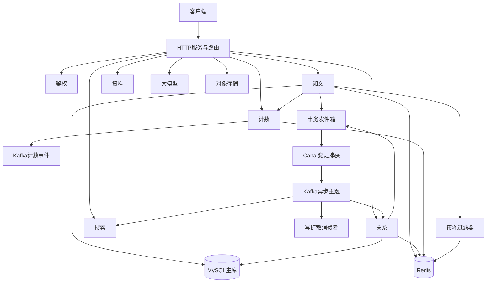
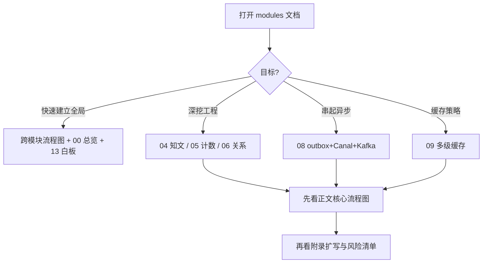
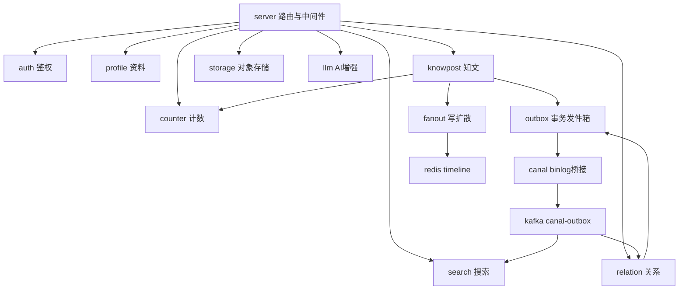
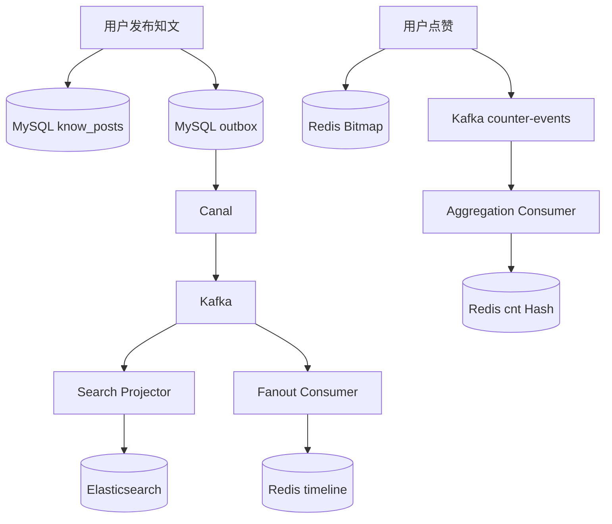
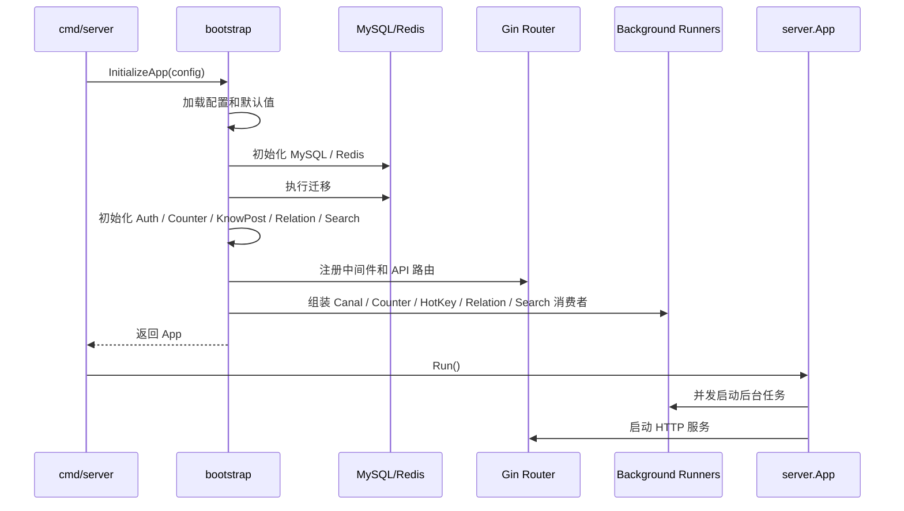

# 00. 文档目录与面试导读

这组文档是 ZhiGuang 后端的**中文模块面试/工程说明**，目标是：

1. 讲清楚每个模块**是什么、为什么、怎么做**（对照当前源码，不是理想设计）。
2. 把「会写代码」提升到「能解释设计取舍与风险」。
3. 用**中文流程图**把关键路径画清楚，方便复盘与口述。

## 0. 文件一览（中文命名）

| 编号 | 文档 | 对应代码域 | 面试权重 |
|------|------|------------|----------|
| — | [**跨模块流程图**](../跨模块流程图.md)（端到端协作总图） | 全链路 | ★★★★★ |
| 00 | 本文 | 索引 | ★★★ |
| 01 | [启动装配与生命周期](01-启动装配与生命周期.md) | `bootstrap` / `server` | ★★☆ |
| 02 | [鉴权与安全模块](02-鉴权与安全模块.md) | `auth` | ★★★ |
| 03 | [资料模块](03-资料模块.md) | `profile` | ★☆☆ |
| 04 | [知文内容缓存与Feed模块](04-知文内容缓存与Feed模块.md) | `knowpost` + RedisBloom CF | ★★★★★ |
| 05 | [点赞收藏计数模块](05-点赞收藏计数模块.md) | `counter` | ★★★★★ |
| 06 | [关注关系与Feed扩散模块](06-关注关系与Feed扩散模块.md) | `relation` / `fanout` | ★★★★★ |
| 07 | [搜索投影模块](07-搜索投影模块.md) | `search` | ★★★★ |
| 08 | [事务消息-Canal-Kafka异步链路](08-事务消息-Canal-Kafka异步链路.md) | `outbox` / Canal / Kafka | ★★★★★ |
| 09 | [热点缓存与多级缓存策略](09-热点缓存与多级缓存策略.md) | `cache` / HotKey / RedisBloom CF | ★★★★ |
| 10 | [大模型与RAG模块](10-大模型与RAG模块.md) | `llm` | ★★☆ |
| 11 | [对象存储模块](11-对象存储模块.md) | `storage` | ★★☆ |
| 12 | [共享基础设施与公共组件](12-共享基础设施与公共组件.md) | `pkg` / database | ★★☆ |
| 13 | [项目面试作答手册](13-项目面试作答手册.md) | 答题框架 | ★★★★★ |
| 14 | [信息流扩散：读扩散、写扩散与推拉结合](14-信息流扩散-读扩散写扩散与推拉结合.md) | `internal/fanout` | ★★★★★ |

## 1. 面试前 1 小时路线

1. 先看 [13-项目面试作答手册](13-项目面试作答手册.md)（怎么答）。
2. 再扫一眼 [跨模块流程图](../跨模块流程图.md)（端到端协作，建立全局）。
3. 再看 **04 知文 / 05 计数 / 06 关系**（工程含量最高）。
4. 再看 **08 异步链路**（把模块串起来）。
5. 最后闭眼口述四句：问题 → 方案 → 边界 → 下一步。

优先背：

1. 计数：Bitmap 真值 + Kafka 增量 + 水位幂等 + dirty repair。
2. 知文：RedisBloom CF.* + NULL 叠加 + 三级缓存 + 版本失效。
3. 关系：双表 + outbox + ZSet 投影 + 推拉结合扩散边界。
4. 异步：事务 outbox → Canal → Kafka → 各消费者。

## 2. 系统总览（中文流程图）

## 3. 统一阅读模板

每篇尽量按：

1. 是什么 / 解决什么问题  
2. 路由与数据模型  
3. 写路径（why + how）  
4. 读路径（缓存 / 锁 / 幂等）  
5. 与其它模块协作  
6. 边界、风险、故障排查  
7. 中文流程图  
8. 面试问答与可改进  

## 3.1 流程图阅读约定

正文 **§3/§4 核心流程** 旁已嵌入必要 mermaid（写路径、读路径、失败分支）；附录继续放「可背诵的完整扩写图」。  
原则：**有分支、有状态机、有跨组件协作** 才画图；纯罗列配置/字段表不画。

## 4. 与代码的关系

- 文档**以当前源码为准**；跨模块总图见 [跨模块流程图](../跨模块流程图.md) §0.1 接线核对表。
- 知文穿透防护：**布隆过滤器 + 空值缓存叠加**（见 04 / 09）。
- Fanout：**推拉结合已闭环**——按粉丝数分流（普通作者推、大 V 拉），事件复用 `canal-outbox`，独立 `fanout` topic 已移除（见 14 / 06 / 跨模块 §6）。
- 计数补偿：在线靠 **AggregationConsumer.repairLoop + dirty set**；无独立 FailureWorker Runner；失败表 `ReplayFailedMessages` 默认未周期挂载（见 05）。
- following/follower 展示数：relation 消费端 **HIncrBy SDS**，**不经** `counter-events`。
- `canal.enabled=false` 时不启 outbox 异步链路，**也不会**自动切 DirectPoll。

## 5. 维护约定

改了主路径逻辑（缓存键、RedisBloom CF、水位、双表、outbox 主题）必须同步对应编号文档。  
配置项变更必须同步 `config/config.yaml` 与文档中的配置表。

---

# 附录：文档维护检查清单

每次改主逻辑后检查：

1. 04 知文：CF.* / NULL / 版本失效 / Feed 碎片是否同步  
2. 05 计数：Lua / 水位 / repair 是否同步  
3. 06 关系 + 14 扩散：双表 / 限流 / 推拉分流阈值 / 关注回填 / 取关清理是否同步  
4. 08 异步：主题与消费者是否同步  
5. 配置项：`config/config.yaml` 与文档配置表是否一致  
6. 流程图节点是否仍为中文  
7. 若主路径分支/状态变化：正文核心流程图与附录图是否同步  

---

# 附录B：项目全景扩写

这一节是面试前的“全局地图”。如果面试官让你先介绍项目，不要从某个接口开始讲，而要先把系统分成：业务入口、真值存储、缓存投影、异步投影、可选增强能力。

## B1. 项目一句话

ZhiGuang 是一个知识内容社区后端，用户可以注册登录、发布知文、关注其他用户、点赞收藏内容、浏览 Feed、搜索内容，并使用摘要生成和 RAG 查询等 AI 增强能力。

更适合面试的说法是：

> 这是一个知识社区后端项目，我重点处理的是内容主链路、社交关系、互动计数、搜索投影和缓存一致性。系统里 MySQL 保存业务真值，Redis 保存缓存和高频状态，Elasticsearch 保存搜索投影，Kafka 承接异步事件。项目最大的特点是把真值、投影、缓存和补偿边界分清楚。

## B2. 模块依赖图

讲解重点：

1. `auth` 是入口身份能力，为其他模块提供 user_id。
2. `knowpost` 是业务主线，连接内容、计数、搜索和 Feed。
3. `counter` 是高频互动模块，承担点赞收藏状态和总数。
4. `relation` 是社交图真值，后续 Feed 扩散依赖它的粉丝列表。
5. `outbox + canal + kafka` 是异步骨架，把主数据变更投影到搜索、关系缓存和时间线。

## B3. 端到端核心数据流

这一张图可以回答“项目有没有完整链路”的问题：发布内容后不仅写主表，还会异步影响搜索和 Feed；点赞后先更新状态真值，再异步影响展示计数。

## B4. 真值与投影速记表

| 业务问题 | 真值 | 读优化 | 修复方式 |
|----------|------|--------|----------|
| 用户是否登录 | JWT + Redis refresh 白名单 | Gin context 中的 user_id | refresh 过期或撤销后重新登录 |
| 内容是否存在 | MySQL `know_posts` | RedisBloom CF + Redis NULL | DB 回源后 CF.ADD 或写 NULL；软删 CF.DEL |
| 内容详情 | MySQL `know_posts` + `users` | freecache + Redis detail | 版本号失效后回源 |
| 公共 Feed | MySQL 发布内容列表 | Redis ID 碎片 + item 碎片 + L1 页缓存 | 版本号失效后回源 |
| 是否点赞 | Redis Bitmap | 无，直接 GETBIT | Bitmap 本身是真值 |
| 点赞总数 | Redis Bitmap | Redis Hash `cnt:*` | dirty repair 重新 BITCOUNT |
| 关注关系 | MySQL 双表 | Redis ZSet | 重新按 MySQL 预热 |
| 搜索结果 | MySQL 回查生成 | Elasticsearch | 全量或增量重建索引 |

面试时不要把 Redis 或 ES 说成业务真值。Redis 可以在部分模块里保存状态真值，比如点赞 Bitmap；但 ES 永远只是搜索投影。

## B5. 启动和运行时全流程

这张图对应 `cmd/server/main.go`、`internal/bootstrap/app.go`、`internal/server/router.go` 和 `internal/server/app.go`。

## B6. 面试复习优先级

如果只剩一天，建议按这个顺序复习：

1. **先背全局图**：客户端、HTTP、MySQL、Redis、Kafka、ES、Canal 怎么连。
2. **再背知文链路**：发布、详情缓存、公共 Feed、缓存失效、outbox。
3. **再背计数链路**：Bitmap、Lua、Kafka、SDS、水位、dirty repair。
4. **再背关系链路**：双表、ZSet、outbox、限流、大 V 边界。
5. **最后背搜索链路**：事件投影、回查主库、ES 查询、search_after。

如果只能讲一个技术亮点，讲 **计数**；如果只能讲一个架构亮点，讲 **outbox + Canal + Kafka**；如果只能讲一个性能亮点，讲 **知文详情缓存**。
