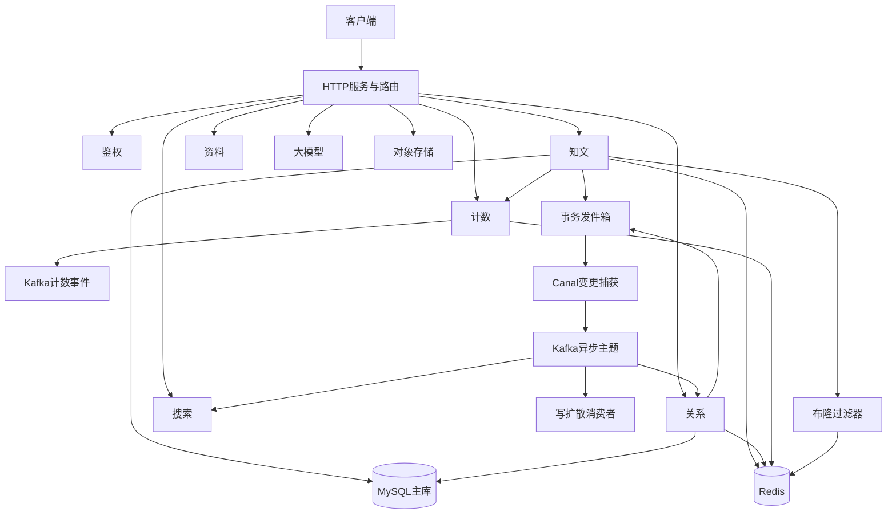

# 00. 文档目录与面试导读

这组文档是 ZhiGuang 后端的**中文模块面试/工程说明**，目标是：

1. 讲清楚每个模块**是什么、为什么、怎么做**（对照当前源码，不是理想设计）。
2. 把「会写代码」提升到「能解释设计取舍与风险」。
3. 用**中文流程图**把关键路径画清楚，方便复盘与口述。

## 0. 文件一览（中文命名）

| 编号 | 文档 | 对应代码域 | 面试权重 |
|------|------|------------|----------|
| 00 | 本文 | 索引 | ★★★ |
| 01 | [启动装配与生命周期](01-启动装配与生命周期.md) | `bootstrap` / `server` | ★★☆ |
| 02 | [鉴权与安全模块](02-鉴权与安全模块.md) | `auth` | ★★★ |
| 03 | [资料模块](03-资料模块.md) | `profile` | ★☆☆ |
| 04 | [知文内容缓存与Feed模块](04-知文内容缓存与Feed模块.md) | `knowpost` + Bloom | ★★★★★ |
| 05 | [点赞收藏计数模块](05-点赞收藏计数模块.md) | `counter` | ★★★★★ |
| 06 | [关注关系与Feed扩散模块](06-关注关系与Feed扩散模块.md) | `relation` / `fanout` | ★★★★★ |
| 07 | [搜索投影模块](07-搜索投影模块.md) | `search` | ★★★★ |
| 08 | [事务消息-Canal-Kafka异步链路](08-事务消息-Canal-Kafka异步链路.md) | `outbox` / Canal / Kafka | ★★★★★ |
| 09 | [热点缓存与多级缓存策略](09-热点缓存与多级缓存策略.md) | `cache` / HotKey / Bloom | ★★★★ |
| 10 | [大模型与RAG模块](10-大模型与RAG模块.md) | `llm` | ★★☆ |
| 11 | [对象存储模块](11-对象存储模块.md) | `storage` | ★★☆ |
| 12 | [共享基础设施与公共组件](12-共享基础设施与公共组件.md) | `pkg` / database | ★★☆ |
| 13 | [项目面试作答手册](13-项目面试作答手册.md) | 答题框架 | ★★★★★ |

## 1. 面试前 1 小时路线

1. 先看 [13-项目面试作答手册](13-项目面试作答手册.md)（怎么答）。
2. 再看 **04 知文 / 05 计数 / 06 关系**（工程含量最高）。
3. 再看 **08 异步链路**（把模块串起来）。
4. 最后闭眼口述四句：问题 → 方案 → 边界 → 下一步。

优先背：

1. 计数：Bitmap 真值 + Kafka 增量 + 水位幂等 + dirty repair。
2. 知文：Bloom + NULL 叠加 + 三级缓存 + 版本失效。
3. 关系：双表 + outbox + ZSet 投影 + 写扩散边界。
4. 异步：事务 outbox → Canal → Kafka → 各消费者。

## 2. 系统总览（中文流程图）

## 3. 统一阅读模板

每篇尽量按：

1. 是什么 / 解决什么问题  
2. 路由与数据模型  
3. 写路径（why + how）  
4. 读路径（缓存 / 锁 / 幂等）  
5. 与其它模块协作  
6. 边界、风险、故障排查  
7. 中文流程图  
8. 面试问答与可改进  

## 4. 与代码的关系

- 文档**以当前源码为准**。
- 知文穿透防护：**布隆过滤器 + 空值缓存叠加**（见 04 / 09）。
- Fanout 算法有实现，但生产端接线状态以 06 文档「当前状态」为准。

## 5. 维护约定

改了主路径逻辑（缓存键、Bloom、水位、双表、outbox 主题）必须同步对应编号文档。  
配置项变更必须同步 `config/config.yaml` 与文档中的配置表。

---

# 附录：文档维护检查清单

每次改主逻辑后检查：

1. 04 知文：Bloom / NULL / 版本失效 / Feed 碎片是否同步  
2. 05 计数：Lua / 水位 / repair 是否同步  
3. 06 关系：双表 / 限流 / fanout 接线状态是否同步  
4. 08 异步：主题与消费者是否同步  
5. 配置项：`config/config.yaml` 与文档配置表是否一致  
6. 流程图节点是否仍为中文  

