# 启动装配与生命周期模块

## 1. 模块定位

这部分不是直接承载业务规则的模块，它解决的是另外一个问题：

**当系统从一个小项目长成多个业务域、多条异步链路和多种可选依赖之后，如何把整个应用稳定地“装起来、跑起来、关下去”。**

在这个项目里，这部分主要由两层组成：

1. `internal/bootstrap`
2. `internal/server`

你可以把它理解成：

- `bootstrap` 负责“拼装”
- `server` 负责“运行”

---

### 🎓 教学导学板块

> **🎯 学习目标**
> 1. 理解复杂 Go Web 工程中**依赖注入 (DI, Dependency Injection)** 与应用装配层的优雅拆分模式。
> 2. 掌握 `InitializeApp` 顺序装配模式集中管理基础设施（MySQL、Redis、Kafka、FreeCache）连接句柄。
> 3. 掌握后台长跑协程 (Runners) 的集中式注册与托管，杜绝野协程 (Orphan Goroutines) 泄漏。
> 4. 掌握基于系统信号 (SIGINT/SIGTERM) 的四阶段优雅停机 (Graceful Shutdown) 与资源回收路径。
> 
> **📚 前置概念预习**
> - **显式装配 vs 隐式单例**：显式装配通过构造函数传递依赖，便于单元测试与 Mock 替换，杜绝全局包变量污染。
> - **优雅停机 (Graceful Shutdown)**：在收到退出信号时拒绝新 HTTP 请求、等待在途请求和后台 Task 处理完毕后再安全释放底层句柄。

---

## 2. 你在面试里可以怎么一句话介绍它

我把应用启动层和业务层显式拆开了。`bootstrap` 只做依赖装配、模块构建和后台 runner 注册，`server` 只做 HTTP 生命周期和优雅停机控制，这样模块不会偷偷自启 goroutine，也不会把装配逻辑散落到各个业务包里。

## 3. 核心流程

### 3.1 启动总流程

应用启动顺序大致是：

1. 读取配置并做默认值填充、启动期校验
2. 创建 MySQL、Redis、Kafka Writer、本地缓存、雪花 ID 生成器
3. 构建各业务模块：
   - auth
   - counter
   - knowpost
   - relation
   - search
   - llm
   - storage
   - profile
4. 组装 `HandlerSet`
5. 创建统一的 Gin Router
6. 组装后台 runner（以 `internal/bootstrap/app.go` 为准）：
   - counter aggregation consumer（内嵌 dirty repairLoop，**不是**独立 failure worker）
   - hotKeyRunner（热点探测 flush；`Start` 内调 `RunUntilDone` **阻塞**至停机并做收尾 flush）
   - fanout consumer（Kafka brokers 非空时；订阅 `canal-outbox`，消费者组从 **Latest** 位点起步）
   - **outbox cleaner**（分批删除保留期外的 outbox 行——标准部署下 Canal 只读 binlog 从不删行，没有它表只增不减）
   - 当 `canal.enabled=true`：canal bridge、relation outbox consumer、search outbox consumer（ES 可用时）
   - **不会**在 canal 关闭时自动启用 outbox DirectPoll
   - search / relation / fanout 三个 outbox 消费者统一注入 **DeadLetterRepository**（重试耗尽落死信表）
7. 创建 `server.App`
8. 启动 HTTP 服务并统一管理优雅停机

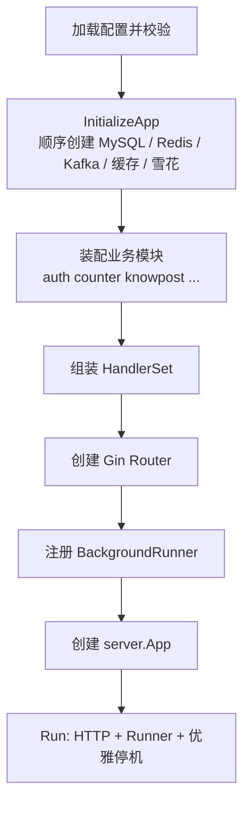

### 3.2 依赖装配流程

`bootstrap` 层有两个原则：

1. 共享资源统一在 `InitializeApp` 中顺序创建
2. 业务模块只从初始化函数入参里拿自己需要的依赖

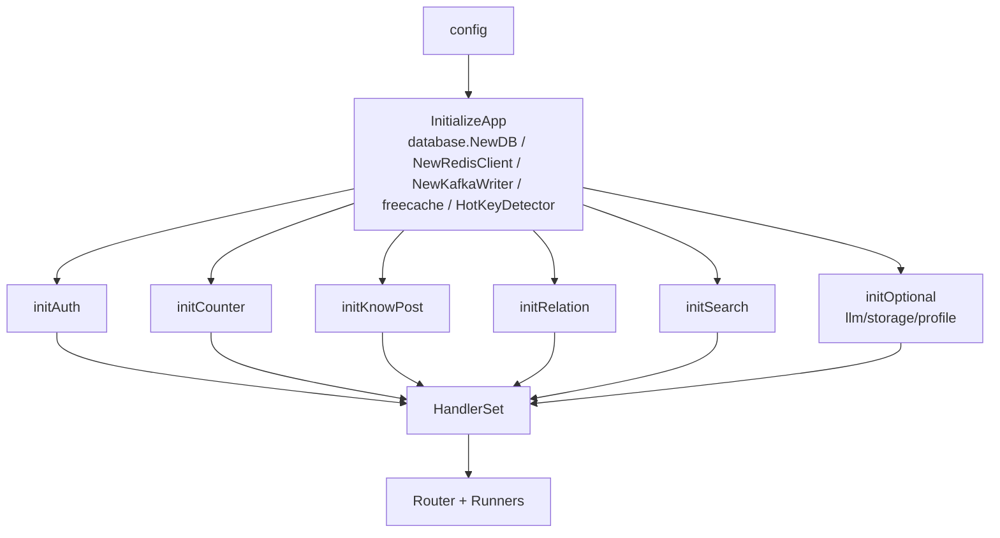

这样做的价值是：

- 资源创建和业务装配分开
- 依赖图可读
- 新模块接入时不会继续把 `main` 或 `InitializeApp` 堆成巨型函数

### 3.3 生命周期与优雅停机（教学拆解：四阶段安全退出）

> **💡 现实工程场景痛点：盲目 `go func()` 的灾难**
> 在很多初级 Go 项目里，开发者习惯在 `init()` 函数或业务逻辑内部直接 `go startConsumer()` 启动后台协程。
> 当发布新版本执行 k8s 缩容或容器重启发送 `SIGTERM` 信号时，主进程瞬间结束，而这些“野生”协程根本收不到通知。结果是正在消费的一半 Kafka 消息丢失、数据库连接被硬性拔断引发事务锁死、甚至大量协程泄漏！

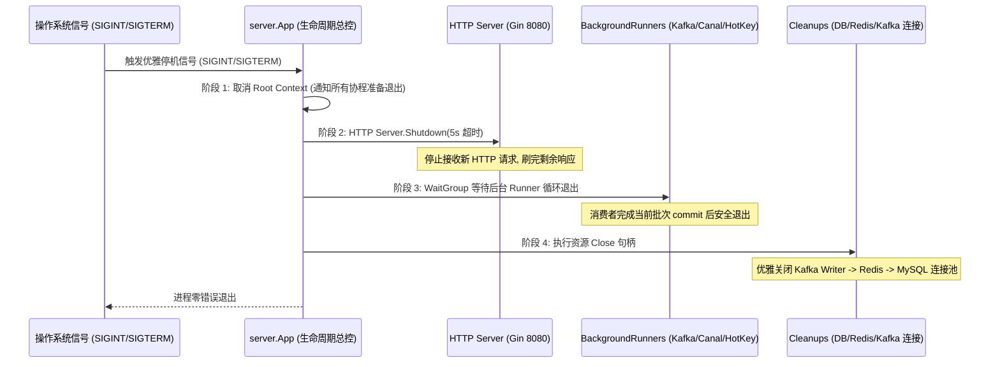

#### Step-by-Step 优雅停机 4 大精确阶段：

1. **阶段 1：捕获信号并广播 Context 取消**
   - 当收到 `SIGINT` (Ctrl+C) 或 `SIGTERM` (Docker/K8s 停止容器) 信号时，`App` 立即调用 `cancel()` 取消根上下文 `ctx`。全系统所有的后台循环（如 `for select { case <-ctx.Done(): return }`）都会第一时间收到退出通知。
2. **阶段 2：拒绝新 HTTP 请求并关闭端口**
   - 立即调用 Gin HTTP Server 的 `Shutdown(timeoutCtx)`，指定 5 秒超时窗口。此时服务器停止接收新连接，但会给已有活跃请求 5 秒时间完成处理与写响应。
3. **阶段 3：等待后台 Runner（Consumer/Loop）安全退出**
   - `server.App` 通过 `sync.WaitGroup` 阻塞等待所有注册在案的 `BackgroundRunner`（`AggregationConsumer`、`hotKeyRunner`、`Canal Bridge`、`outbox cleaner`、fanout/relation/search 消费者）。每个 Runner 在收到 `ctx.Done()` 后完成当前批次提交（Commit Offset / Flush 缓存），随后安全退出协程。
   - **契约要点**：`Start(ctx)` 必须**阻塞至生命周期结束**。若内部只是 `go` 一个协程就返回，WaitGroup 会立刻归零，"后台任务已排空"就成了假信号——hotKeyRunner 曾因此在停机时丢掉最后一个窗口的热点计数（现改为 `RunUntilDone` 阻塞版并在退出前用独立短超时 context 做收尾 flush）。
4. **阶段 4：依序清理底座连接句柄（Cleanup）**
   - 只有在所有的 HTTP 请求与后台协程都已经停止工作后，才开始关底层句柄：**先关 Kafka Producer/Writer -> 再关 Redis Client -> 最后关 MySQL 数据库连接池**。
5. **阶段 5：进程安全终止**
   - 所有资源干净释放完毕，`App.Run()` 正常返回 0，零遗留泄漏地结束进程。

## 3.5 后台任务监督器（supervisedRunner，教学深度拆解）

> **💡 现实工程场景：**
> Canal 桥接的 `rollbackOrPanic` 特意用 panic 表达「必须重启以重置位点」。
> 早期上层是「go 协程 + defer recover 打日志」——recover 之后协程直接结束：
> **panic 被吃掉、任务不重启、也没有任何对外信号**。桥接器静默死亡，binlog 投影停止，
> ES 与关系数据慢慢变陈旧，而 HTTP 探针全绿（只探 DB/Redis）。整条链路只留下一行 ERROR 日志。

`internal/server/supervisor.go` 把「崩溃」变成可恢复、可观测的事件：

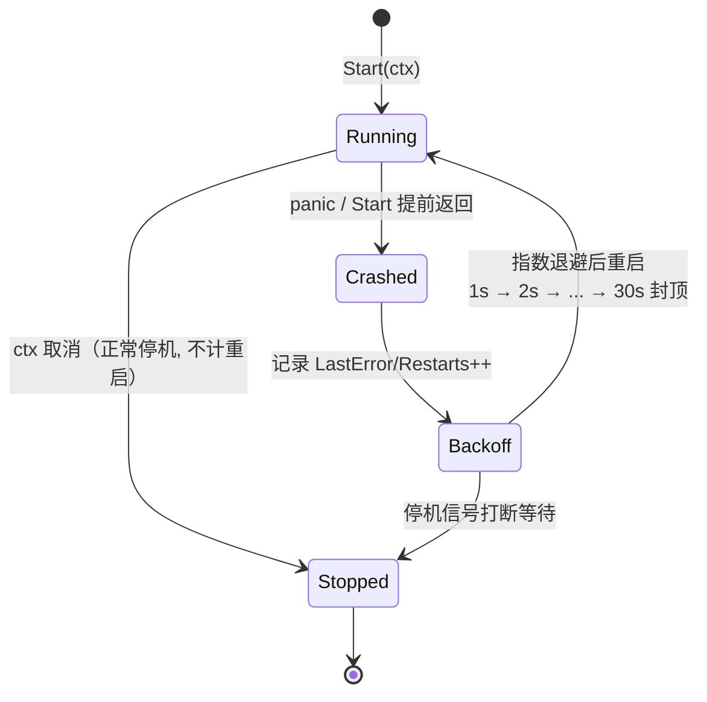

三个设计要点：

1. **「Start 提前返回」也算崩溃**。契约是阻塞至 ctx 结束；提前返回意味着任务已停止工作，
   与 panic 同样触发退避重启（`TestSupervisedRunner_RestartsOnEarlyReturn`）。
2. **状态对外可见**：每个任务的 `Running / Restarts / LastError / LastExitUnix`
   通过 `GET /health/runners` 上报——任一任务未在运行返回 503，供监控告警。
3. **但探针不指向它**：存活/就绪探针（`/health`、`/health/ready`）只探同步依赖。
   异步投影故障时 HTTP 其实完好，把后台状态接进就绪探针会让编排系统摘流量，反而放大故障。
   这条「三端点职责分离」是横切设计，代码见 `internal/server/health.go` 的注释。

## 4. 设计亮点

## 4.1 统一装配，而不是模块内自启动

这是一个非常重要的架构约束。

很多项目里 consumer、定时任务、后台同步线程会在模块内部自己 `go func()` 启动。短期看很方便，长期会出几个问题：

1. 你根本不知道系统里一共启动了多少后台任务
2. 测试环境和生产环境的行为不一致
3. 优雅停机时很难保证这些 goroutine 能退出
4. 新人接手时只能靠全文搜索排查后台任务

这个项目把后台任务全部显式挂到 `BackgroundRunner`，由 `server.App` 统一托管，这个边界是很干净的。

## 4.2 handler 依赖接口，而不是依赖具体 service

`HandlerSet` 里每个字段都是 `RouteRegistrar`，业务 handler 内部也尽量依赖 `ports.go` 里的窄接口，而不是直接依赖完整 service。

这带来三个好处：

1. handler 更容易测试
2. service 重构时，不会把 HTTP 层一起拖着改
3. 依赖方向更清晰，避免横向耦合

## 4.3 可选能力统一降级

搜索、LLM、OSS 这些都不是核心启动阻塞项。

这个项目没有把策略设计成：

- “配置不完整，整个应用启动失败”

而是：

1. bootstrap 检测配置是否完整
2. 创建失败时记录 warn 日志
3. handler 侧拿到 `nil use case`
4. 对外统一返回 `503`

这是一种很工程化的取舍，因为它能保证核心主站能力不被扩展能力拖垮。

## 4.4 资源创建与清理成对出现

`InitializeApp` 不只是创建依赖，还会在末尾统一注册 cleanup（`app.AddCleanup(kafkaWriter.Close, canalOutboxWriter.Close, redisClient.Close, db.Close)`）。

这比“资源在哪里创建、就靠人记得去哪里关”更稳，因为：

1. 资源生命周期被显式建模
2. 应用退出流程可统一收敛
3. 后续新增资源时，不容易漏掉关闭逻辑

## 5. 技术难点与面试价值

这部分最有面试价值的点不在语法，而在架构边界。

### 5.1 为什么要把启动装配单独做成一个层

因为业务模块一多，就会出现：

- service 依赖 repo
- service 依赖 cache
- service 依赖 MQ
- service 依赖别的领域
- 某些模块还要启动后台任务

如果没有装配层，依赖创建会散落在：

- `main.go`
- 每个 handler
- 每个 service 的构造函数
- 各种 setter

最后就会变成“项目能跑，但是没人能快速看懂依赖图”。

### 5.2 为什么要统一生命周期

中高级面试官会很关心：

- 服务怎么停
- 后台任务怎么停
- 异步消费者怎么停
- 资源怎么回收

如果你的回答里只有“我启动了一个 Gin 服务”，那说明系统视角不够完整。

## 6. 面试官高频问题

### Q1：你为什么要专门做一个 bootstrap 层？直接在 main 里 new 不行吗？

**回答思路：**

小项目可以，但这个项目已经有多个业务模块、多个后台 consumer、多个可选能力和跨领域依赖。继续在 `main` 里直接 new，最终会变成一个超大的初始化函数，资源创建、模块装配、降级逻辑和生命周期注册会混在一起，不利于维护。  
我把它拆成 bootstrap 之后，`main` 只保留入口职责，`internal/bootstrap` 负责共享资源创建与各领域装配（`init_*.go`），依赖图会清晰很多。

### Q2：为什么不让各个模块自己把 consumer 启起来？

**回答思路：**

因为那样会把生命周期控制藏起来。模块内部偷偷自启 goroutine，短期方便，长期会导致三个问题：

1. 很难统一停机
2. 很难测试
3. 很难知道系统里实际跑了哪些后台任务

所以我用 `BackgroundRunner` 统一抽象后台任务，让顶层应用决定什么时候启动、什么时候退出。

### Q3：你这个项目里什么是“核心依赖”，什么是“可选依赖”？

**回答思路：**

核心依赖是应用没有它就无法提供主流程能力的组件，比如 MySQL、Redis、Kafka 基础链路、JWT 密钥。  
可选依赖是缺失后主站仍可运行，但某些扩展能力会降级的组件，比如 Elasticsearch、LLM、OSS。  
我在启动层把这两类依赖区别对待：核心依赖失败直接启动失败；可选依赖失败则降级成 `503`。

### Q4：你为什么要让 handler 依赖接口，而不是直接依赖具体 service？

**回答思路：**

因为 handler 只需要“用例能力”，不应该知道 service 的全部实现细节。  
依赖窄接口可以降低耦合，让测试更简单，也方便以后拆 service 或替换实现，而不用大面积修改 HTTP 层。

### Q5：你怎么保证服务退出时不会留下后台 goroutine 泄漏？

**回答思路：**

我用统一根 `context` 管理生命周期。所有后台 runner 都接收同一个根上下文，服务收到退出信号后先 cancel 根上下文，再优雅关闭 HTTP Server，再等待 runner 退出，最后执行 cleanup 关闭资源。  
这样后台协程、consumer、DB/Redis/Kafka 资源的关闭顺序是可解释的，不是靠碰运气。

### Q6：如果某个 HTTP 模块没初始化成功，会不会导致路由注册 panic？

**回答思路：**

不会。路由装配层用的是 `RouteRegistrar` 接口，注册前会先做 nil 判断。  
这也是为什么我把模块边界抽象成统一接口，而不是直接持有具体 handler 指针。

## 7. 场景题

### 场景题 1：如果你现在要新增一个“通知模块”，你会怎么接进这个系统？

**推荐回答：**

我会保持现有装配约束不变：

1. 先在 `internal/notification` 内完成 handler/service/repository 设计
2. 在 `internal/bootstrap` 新增 `init_notification.go`
3. 如果它有 HTTP 路由，就返回 `RouteRegistrar`
4. 如果它有后台任务，就实现 `BackgroundRunner`
5. 在 `InitializeApp` 里显式注册，不让它自己启动 goroutine

这样新模块不会破坏现有生命周期模型。

### 场景题 2：如果以后要支持配置热更新，你会怎么改？

**推荐回答：**

我不会第一步就让所有模块直接感知热更新，那样侵入性太大。  
更合理的方式是分层处理：

1. 先把“必须重启才能生效”和“可以动态调整”的配置分开
2. 对可动态调整的配置做配置中心抽象
3. 对需要重建的资源，比如 Kafka writer、ES client，要设计安全替换流程
4. 生命周期层负责协调旧实例退出和新实例接管

也就是说，热更新本质是资源生命周期问题，不只是“重新读一次 yaml”。

### 场景题 3：如果某个 consumer 启动失败，但 HTTP 服务可以正常启动，你会怎么处理？

**推荐回答：**

取决于这个 consumer 是不是核心链路。

- 如果它是核心链路，比如计数聚合消费，通常应该让启动失败暴露出来
- 如果它是可选链路，比如某个低优先级同步任务，可以记录告警并降级

当前项目里对扩展能力做的是降级，但对核心基础设施仍然倾向于启动失败即失败。这个边界要由业务重要性来决定。

## 8. 最容易讲错的地方

### 8.1 不要把 bootstrap 讲成“只是目录整理”

面试官更关心的是：

- 依赖如何收敛
- 生命周期如何收敛
- 可选能力如何降级

如果只说“我把代码拆文件了”，价值太低。

### 8.2 不要忽略后台 runner

这个项目的启动层亮点之一，就是把：

- HTTP 服务
- Kafka consumer
- Canal bridge
- counter aggregation consumer（内嵌 dirty repairLoop，**不是**独立失败补偿 worker）

统一纳入一个应用生命周期里。

这是很多项目没有做干净的地方。

---

# 附录A：工程级扩写

## A1. 启动顺序（中文流程图）

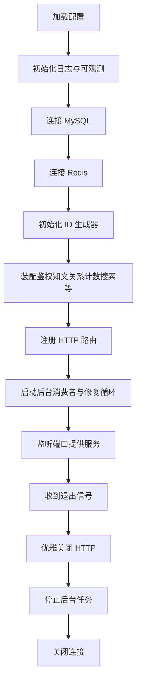

## A2. 为什么要集中 bootstrap

- 避免 main 变成「全世界依赖注入」。
- 可选依赖（LLM、部分 consumer）可按配置降级。
- 关闭顺序与启动顺序对称，降低泄漏与半关闭。

## A3. 60 秒口述

> bootstrap 负责把多模块装起来并优雅关掉。先基础设施后业务，后台任务单独 runner，配置开关控制可选能力。

---

# 附录B：流程图扩写

## B1. 启动入口到 App 的调用链

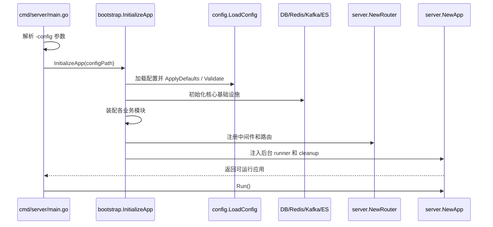

面试讲法：`main` 只做参数解析和启动，真正复杂的依赖图收敛在 `bootstrap`，这样入口保持干净，也方便测试和排障。

## B2. 依赖装配分层图

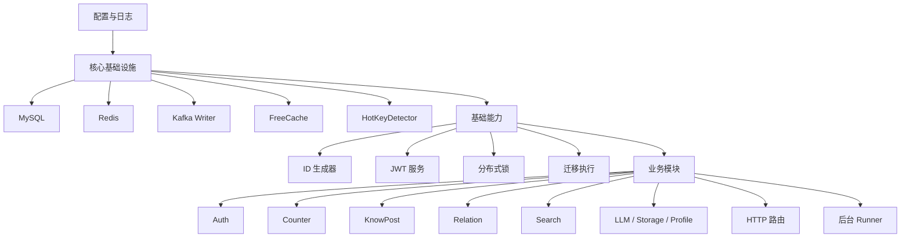

这张图说明启动顺序不是随意的：业务模块依赖基础设施，路由依赖 handler，后台任务依赖对应 service。

## B3. 可选依赖降级流程

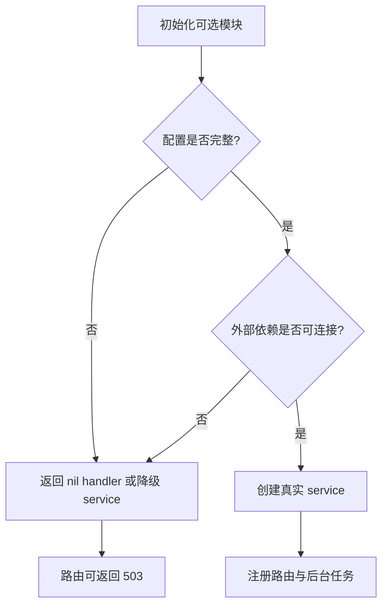

适用模块：搜索、LLM、OSS 等增强能力。主站核心能力不应该因为增强配置缺失而无法启动。

## B4. HTTP 请求中间件链路

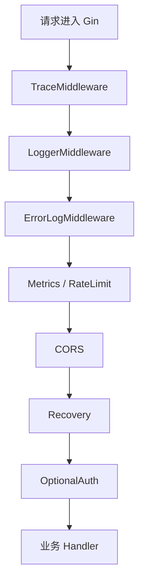

讲解重点：全局是 OptionalAuth，不强制拦截匿名请求；真正需要登录的接口在各模块 handler 内显式检查。

## B5. 后台 Runner 生命周期

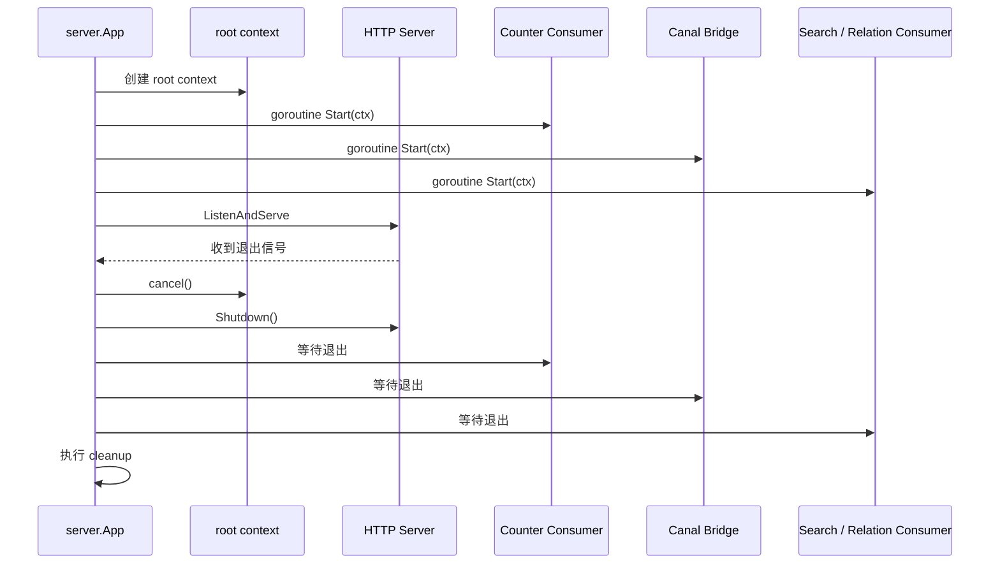

这个图可以回答 goroutine 泄漏问题：所有长生命周期任务都吃同一个 root context，退出时先 cancel，再限时等待。

## B6. 优雅关闭顺序图

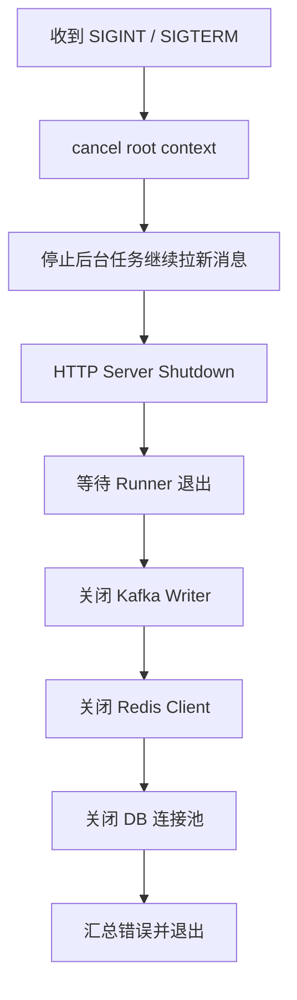

关闭顺序的原则：先停入口和后台拉取，再关闭底层连接，避免任务还在用资源时连接已经被释放。

## B7. 新增模块接入流程

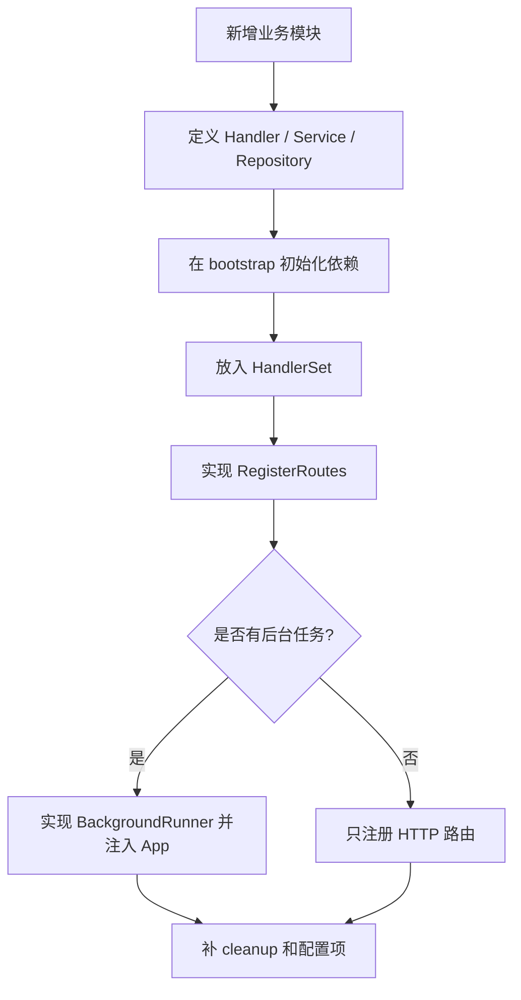

面试回答新增模块时，可以按这张图说，体现你理解项目扩展方式。

---

## 📌 避坑指南与自测思考题

### ⚠️ 生产避坑指南（新手最易踩的坑）

1. **切忌先关闭 DB/Redis 连接池，再去调用 HTTP `Shutdown`**：
   - 错误做法：收到退出信号后，先把 MySQL 和 Redis 句柄 Close，再去关闭 HTTP 服务器。
   - 后果：在 HTTP 服务器 Shutdown 的 5 秒超时窗口内，正在执行的最后一个用户请求访问数据库时会直接触发 `sql: database is closed` 报错异常崩溃！
   - 正确做法：必须严格遵循**先关上游 HTTP 入口 -> 再停中游消费者 Loop -> 最后关下游 DB/Redis 基础设施**的倒序关闭链。

2. **禁止在 Handler 或 Service 中直接依赖 `*sqlx.DB` 等具体持久化实例**：
   - 错误做法：Handler 内部直接持有数据库连接全局变量。
   - 后果：无法编写独立的单元测试（Unit Test），无法替换 Mock 实例，代码高度耦合硬化。
   - 正确做法：所有 Handler 均依赖 `ports.go` 窄接口，资源依赖由 `bootstrap` 集中工厂统一装配。

### 🧐 巩固自测思考题

- **思考题 1**：为什么应用启动时 `NewDB()` 建立了数据库连接句柄后，一定要显式调用 `db.PingContext()`？
  - *提示*：Go `sql.Open()` 仅仅是校验 DSN 格式合法性，不会发起真实网络握手；启动期调用 `Ping` 才能在第一时间暴露出密码错误、网络不可达等硬故障，避免带病上线。
- **思考题 2**：如果一个后台 Consumer 在收到 `ctx.Done()` 信号后，由于某些卡顿逻辑迟迟不退出，系统会永远死锁等待吗？
  - *提示*：优雅停机设置了兜底超时上下文（如 5s/8s/2s 分阶段），超时发生后主进程会强行汇总 `Timeout Error` 并打印日志强行结束，兼顾了优雅性与挂死保护。

---

# 附录C：函数级源码走读（internal/server）

## C1. `app.go` — App 生命周期

#### `NewApp(router, cfg, logger, background ...BackgroundRunner) *App`
- 变长 Runner 便于按配置增减；内建空 `runnerRegistry`（供 /health/runners）。

#### `Run() error` / `run(parent context.Context) error`
- `Run` 只做 `signal.NotifyContext(SIGINT/SIGTERM)` 后委托 `run`——拆出 `run` 让单测传可控 ctx 而不依赖真实信号。
- **`run` 逐步**：
  1. rootCtx = WithCancel(parent)；组 http.Server；
  2. 逐个 Runner 包 `newSupervisedRunner` 注册进 registry，goroutine 跑 `sr.Run(rootCtx)`（WaitGroup 计数）；
  3. ListenAndServe 结果经带缓冲 chan 回收（避免泄漏 goroutine）；
  4. select 等 rootCtx.Done 或 listen 错误（后者也 cancel 广播）；
  5. **四阶段停机**：Shutdown HTTP（5s）→ `waitBackgroundRunners`（8s，超时仅 Warn 不阻塞）→ `runCleanup`（2s，errors.Join 聚合）→ `aggregateErrors` 汇总返回。
- **顺序理由**：先 cancel 让消费者停止拉新，再关 HTTP 排空在途请求，最后才动底层连接句柄。

#### `RunnerStates() []RunnerState`
- 实现 RunnerReporter；registry 在 run 启动时填充，启动前为空列表。

## C2. `supervisor.go` — supervisedRunner

#### `Run(ctx)`
- **循环**：ctx 已取消 → markStopped 返回；`runOnce` 执行一轮；ctx 取消（正常停机）→ Stopped 不计崩溃；否则 markCrashed（Restarts++/LastError/时间戳）→ `contextutil.Sleep` 指数退避 1s→2s→…→30s 封顶 → 重启。

#### `runOnce(ctx) (reason string)`
- defer recover：panic → reason="panic: …" + 堆栈日志；`runner.Start(ctx)` 返回后若 ctx 仍存活 → reason="Start returned before …"——**提前返回也是崩溃**（契约：阻塞至生命周期结束）。

#### `runnerName(runner)`
- 优先 `fmt.Stringer`（如 "fanout-consumer"/"outbox-cleaner"），否则 `%T` 类型名。

#### `Snapshot()/mark*` 
- RWMutex 保护的状态快照，供 /health/runners 无锁争用地读。

## C3. `health.go` — HealthChecker

| 函数 | 要点 |
|---|---|
| `NewHealthChecker(db, redis)` | 仅同步依赖；nil 字段在 checkSyncDeps 内跳过（单测友好） |
| `SetRunnerReporter(r)` | atomic.Pointer 注入——Checker 在路由装配期创建、App 在 runner 齐备后构造，存在先后环；原子指针消除注入/读取竞争 |
| `RegisterRoutes` | `/health` `/health/ready` 只探 DB+Redis；`/health/runners` 任一 Running=false → 503 "degraded"。**探针不得指向 runners**：异步故障时摘流量反而放大故障 |
| `checkSyncDeps` | 返回 (status, errMsg)，msg 空即健康 |
