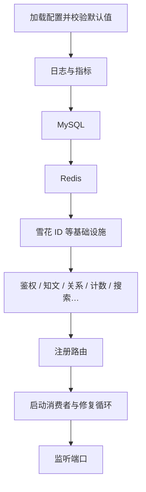
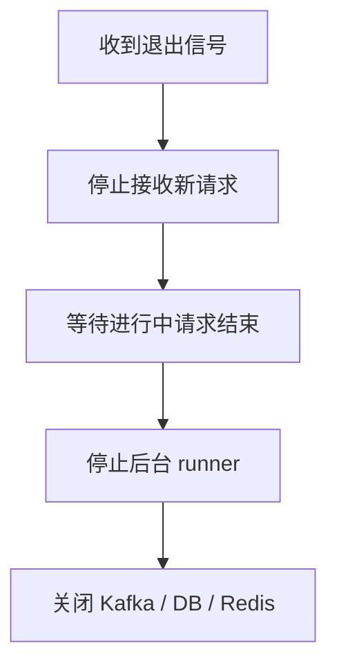

# 01. 启动装配与生命周期

## 1. 是什么

| 包 | 职责 |
|----|------|
| `internal/bootstrap` | 按模块创建依赖、handler、后台 runner |
| `internal/server` | HTTP 引擎、路由注册、优雅启停 |

解决：多业务域 + 多异步链路时，如何**稳定装起来、跑起来、关干净**。

## 2. 一句话

> 先基础设施后业务；后台任务独立 runner；可选能力可关；退出时先停 HTTP 再停后台再关连接。

## 3. 启动顺序

知文模块启动时会**异步预热详情布隆**（失败只打日志，读路径 fail-open）。

## 4. 关闭顺序

## 5. 为什么集中 bootstrap

- 避免 `main` 变成巨型依赖注入  
- 模块边界清晰：装配在 bootstrap，规则在 domain  
- 可选依赖（LLM、部分 consumer）按配置跳过  

## 6. 风险

1. 启动顺序错误导致半初始化  
2. 后台任务未纳入统一生命周期 → 泄漏  
3. 配置缺省未 `ApplyDefaults`  

## 7. 60 秒口述

> bootstrap 负责把多模块装起来并优雅关掉。先连库连缓存，再装业务和异步消费者，知文还会异步预热布隆。关闭时对称处理，避免连接与 goroutine 泄漏。

---

以 `internal/bootstrap` 与 `cmd` 入口为准。
