# 鉴权模块

## 1. 模块定位

鉴权模块负责四类事情：

1. 注册
2. 登录
3. 会话续期
4. 验证码与密码重置

它不是单纯的 JWT 工具包，而是一个完整的“身份入口模块”。

## 2. 一句话介绍

这个模块采用“验证码能力 + JWT 访问令牌 + Redis Refresh Token 存储”的组合，实现了注册、密码登录、验证码登录、刷新、登出和重置密码，并且用分布式锁保护 refresh / reset 这种容易出现并发竞态的会话操作。

## 3. 核心流程

### 3.1 发送验证码

流程是：

1. 规范化手机号或邮箱
2. 校验标识格式
3. 按场景校验前置条件：
   - 注册要求账号不存在
   - 登录和重置密码要求账号存在
4. 调用 `VerificationService` 发送并存储验证码

这里的关键点不是“发短信”，而是**同一套验证码能力服务于多个场景，但场景前置条件不同**。

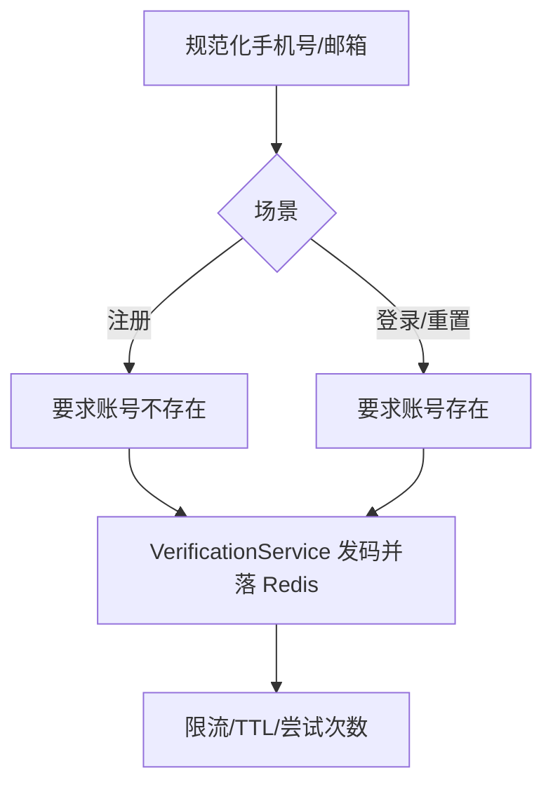

### 3.2 注册

注册流程是：

1. 校验是否同意协议
2. 规范化手机号/邮箱
3. 校验账号是否已存在
4. 校验验证码
5. 如果传了密码，则做强度校验并用 bcrypt 哈希
6. 创建用户
7. 签发 Access Token + Refresh Token
8. 把 Refresh Token ID 存进 Redis
9. 记录登录日志

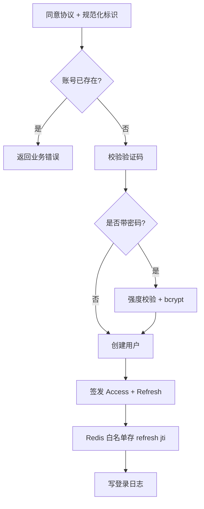

### 3.3 登录

登录支持两种模式：

1. 密码登录
2. 验证码登录

共同流程是：

1. 规范化标识
2. 查用户
3. 按登录方式做认证
4. 认证通过后签发 token pair
5. 持久化 refresh token
6. 记录登录日志

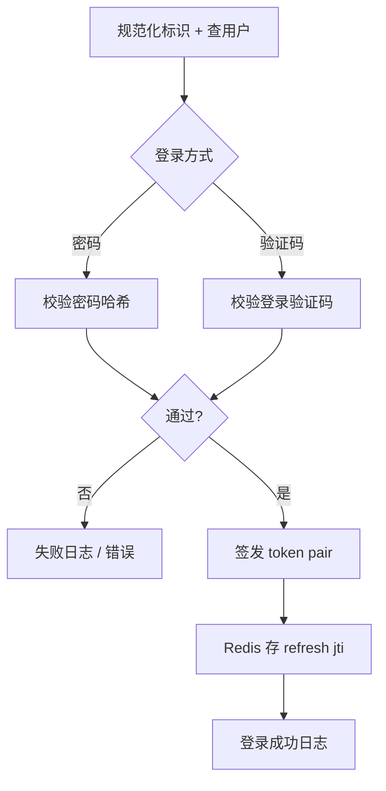

### 3.4 刷新令牌

刷新流程是：

1. 校验 refresh token 本身是否合法
2. 确认 token 类型必须是 refresh
3. 对当前用户加 refresh 分布式锁
4. 检查该 refresh token ID 是否仍在 Redis 白名单内
5. 先吊销旧 refresh token
6. 再签发新的 token pair
7. 把新的 refresh token ID 存入 Redis

这本质上是一个**滚动会话续期**模型。

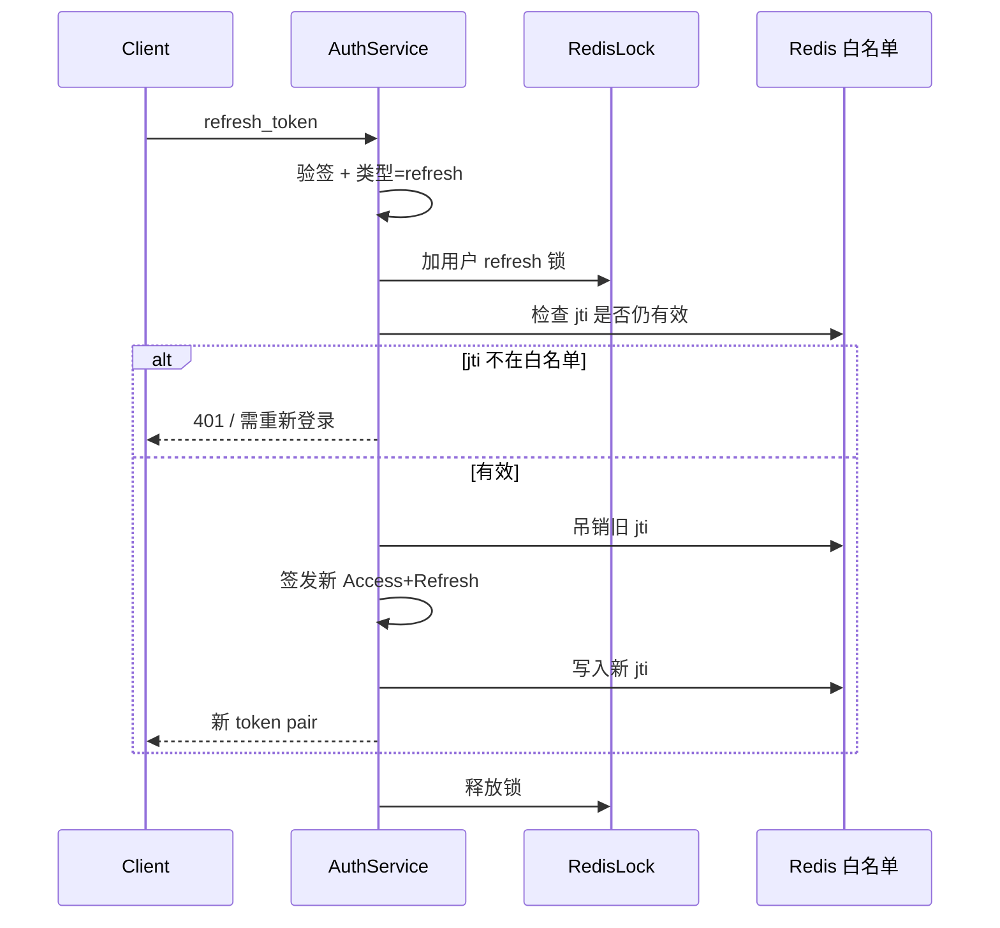

### 3.5 重置密码

流程是：

1. 校验账号存在
2. 校验重置验证码
3. 校验新密码强度
4. 对用户加 refresh 会话锁
5. 更新密码哈希
6. 吊销该用户所有 refresh token

这样可以保证用户一旦重置密码，旧设备上的长会话会全部失效。

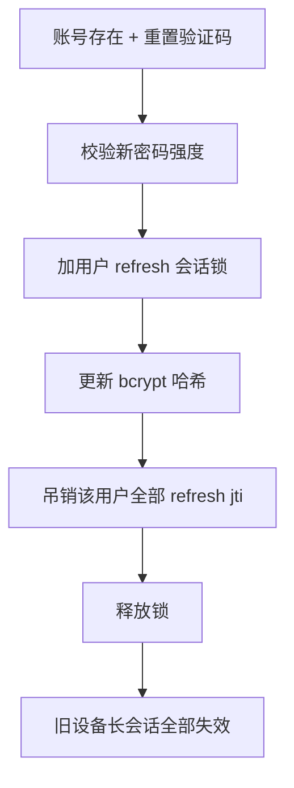

### 3.6 路由鉴权与令牌类型：当前接线方式

路由层不是把所有接口都挂在强制鉴权组下：服务全局使用 `OptionalAuthMiddleware`，它只会在请求携带**合法** JWT 时把 `user_id` 写入 Gin Context；没有令牌、令牌格式错误或过期时都会按匿名请求继续执行。需要登录的业务接口再由 Handler 读取 `middleware.GetUserID` 并拒绝匿名调用。

| 路径类别 | 当前实现 | 结果 |
|----------|----------|------|
| 公共读接口（如知文详情、公共 Feed） | 全局 OptionalAuth | 合法 token 可得到用户态增强；无效 token 不会返回 401，而是按匿名读 |
| 写接口（如创建草稿、点赞、关注） | Handler 内检查 `GetUserID` | 没有可解析 JWT 时返回 401 |
| `GET /api/v1/auth/me` | 单路由挂 `AuthMiddleware` | 必须携带可解析 JWT |

这里有一个需要如实说明的安全边界：`AuthMiddleware` 当前只验签、验过期并把 `token_type` 放进 Context，**没有强制 `token_type == "access"`**。因此只要 refresh token 尚未过期且签名有效，当前代码也可能通过 `/auth/me` 和那些只检查 `user_id` 的受保护接口。设计意图是 access/refresh 分离，但路由执行层尚未把令牌种类收紧；生产修复应为写一个 `RequireAccessToken` 中间件，并将所有需要会话访问权限的路由统一挂载。

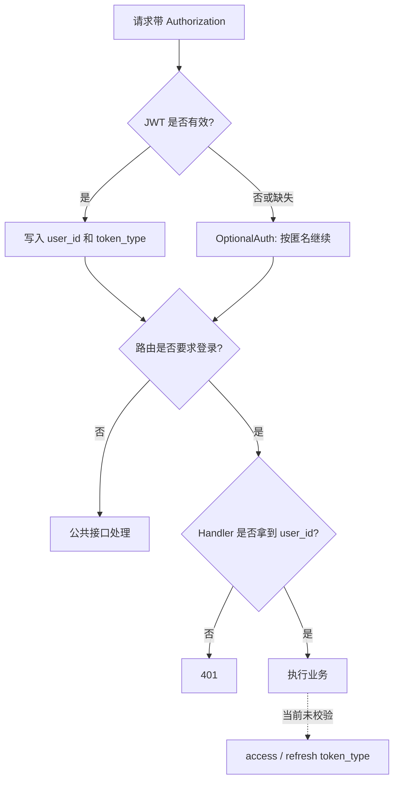

## 4. 设计亮点

## 4.1 Access Token 和 Refresh Token 分离

这是一套典型但非常实用的设计：

- Access Token 短期有效，主要解决接口鉴权
- Refresh Token 长期有效，主要解决会话续期

好处是：

1. Access Token 泄露的风险窗口更短
2. 可以在服务端控制 Refresh Token 的生命周期
3. 用户体验和安全性可以同时兼顾

## 4.2 Refresh Token 服务端可撤销

很多项目只签 JWT，不做服务端存储，问题是：

- 无法主动吊销
- 无法做单设备下线
- 无法在重置密码时强制退出全部设备

这个项目把 Refresh Token ID 放进 Redis，等于给“原本纯无状态的 JWT”补了一层可控状态。

## 4.3 对 refresh/reset 这种敏感操作加锁

并发刷新是常见竞态：

1. 同一个旧 refresh token 被两个请求同时提交
2. 两个请求都通过校验
3. 可能同时签发两组新 token

这个项目用分布式锁把这类操作串行化，保证同一用户在同一时刻只会有一个刷新流程成功完成。

## 4.4 认证日志显式记录

登录成败都会记录日志，这在工程上非常有价值：

1. 方便安全审计
2. 方便排查账号问题
3. 以后可以做风控策略

### 补充：验证码比较使用常数时间

`Verify` 中验证码对比使用 `subtle.ConstantTimeCompare` 而非 `!=`：
逐字节短路比较存在时序侧信道（错误位置越靠后、耗时越长）。
虽然 Lua 原子限次（MaxAttempts）已让爆破不可行，常数时间比较是零成本的防御纵深。

## 5. 难点与边界

### 5.1 Refresh Token 不是只验签就够

如果只做 JWT 验签，不做 Redis 有效性检查，那么：

- 用户登出后旧 token 还能刷新
- 重置密码后旧 token 还能刷新

所以 refresh token 的正确模型通常是：

- JWT 负责自描述
- Redis 负责撤销和白名单

### 5.2 并发刷新是实际问题，不是理论问题

只要前端重试、多个设备同时请求、网关重复投递出现，你就可能遇到同一个 refresh token 的并发刷新。

如果没有锁，最常见的问题就是“旧 token 被多次消费，生成多组新 token”。

### 5.3 验证码模块应该是能力层，不应该散落在业务里

注册、登录、密码重置都会用验证码。  
如果每个业务流程自己管理验证码，就会出现：

- TTL 不一致
- 错误码不一致
- 防刷逻辑不一致

这个项目把验证码能力单独抽出来，是一个正确方向。

### 5.4 Redis 与 MySQL 之间没有分布式事务

鉴权主路径会跨 MySQL 和 Redis，但当前代码没有 2PC / outbox，因此要把失败语义写清楚：

| 场景 | 已发生的动作 | 当前结果 |
|------|--------------|----------|
| 注册后保存 refresh token 失败 | 用户已写入 MySQL | 接口返回错误，用户实际已经存在；客户端重试注册会得到“账号已存在” |
| Refresh 先吊销旧 token、再保存新 token 失败 | 旧 refresh 已失效 | 接口返回错误，用户需要重新登录；这是偏安全的可用性损失 |
| ResetPassword 更新密码后 RevokeAll 失败 | 新密码已落库，旧 refresh 可能仍在 | 接口返回错误，但旧设备可能在 refresh token 自然过期前继续续期 |

这不是要否定现有实现，而是明确它的取舍：令牌撤销失败时优先不伪造成功。若要进一步收口，可把会话版本号放入用户表和 JWT claims；密码重置先递增会话版本，刷新时校验版本，即可避免逐个扫描 Redis key 的不完整窗口。

## 6. 面试官高频问题

### Q1：你为什么不用纯 JWT 无状态登录？

**参考回答：**

纯 JWT 的优点是简单，但它有一个很大的问题：服务端无法主动撤销。  
这个项目里我希望支持登出、重置密码后强制失效旧会话、以后也可能支持单设备下线，所以我保留了 Access Token 的无状态能力，但把 Refresh Token 做成“JWT + Redis 白名单”的组合。这样既有性能，也有可控性。

### Q2：为什么刷新令牌要加分布式锁？

**参考回答：**

因为刷新流程不是一个纯读操作，而是“验证旧 token -> 吊销旧 token -> 签发新 token -> 保存新 token”的状态迁移流程。  
同一个 refresh token 并发请求时，如果不加锁，可能会出现多个请求都认为旧 token 还有效，从而重复签发新的会话。  
我加锁的目的就是把同一用户的 refresh 状态迁移串行化。

### Q3：为什么密码重置后要撤销所有 refresh token？

**参考回答：**

因为密码重置通常意味着账号安全边界发生了变化。  
如果不吊销所有 refresh token，旧设备上的长期会话仍然可以继续刷新 access token，那重置密码就不彻底。  
所以我把“修改密码”和“会话清退”绑定在一起。

### Q4：为什么验证码登录和密码登录都保留？

**参考回答：**

因为它们适配不同场景：

- 密码登录更适合稳定账号体系
- 验证码登录更适合移动端快速登录和找回流程

从系统设计上，关键不是二选一，而是要把两种认证方式收敛到同一个登录编排里，保证最终的会话签发和日志记录逻辑一致。

### Q5：为什么要记录登录日志？

**参考回答：**

登录日志不是“锦上添花”，而是安全与运维基础能力。  
后续做风控、异常登录识别、申诉排查、审计分析，都离不开这张日志表。  
在项目里我把它当成认证链路的一部分，而不是单纯埋点。

## 7. 场景题

### 场景题 1：如果产品要求支持“单设备下线”，你怎么改？

**参考回答：**

当前实现已经把 refresh token 存在 Redis 里，所以它天然适合做单设备下线。  
演进方式可以是：

1. 给 refresh token 增加 device_id
2. Redis 存储从“用户 -> token_id 集合”升级成“用户 -> 设备 -> token_id”
3. 退出指定设备时只吊销对应 device 的 refresh token

这样不用推翻现有模型，只是把会话粒度从用户级细化到设备级。

### 场景题 2：如果要加风控，比如验证码一分钟只能发一次，你会放哪层？

**参考回答：**

我会优先放在验证码服务层，而不是散落在注册、登录、重置密码各个业务方法里。  
因为这本质是验证码能力的公共约束，不是某个具体业务流程的私有逻辑。  
统一收敛之后，所有验证码场景都能共享同一套限流、防刷和审计逻辑。

### 场景题 3：如果要支持 OAuth 第三方登录，这个模块怎么演进？

**参考回答：**

我不会重做整个 auth 模块，而是把“身份认证方式”和“会话签发”拆开看：

1. 第三方 OAuth 只负责拿到可信身份
2. 本系统仍然统一签发自己的 access/refresh token
3. 用户表需要补一个第三方身份绑定关系

也就是说，第三方登录只替换“认证入口”，不替换“会话体系”。

## 8. 最容易讲错的地方

### 8.1 不要把 JWT 讲成全部安全能力

JWT 只是令牌格式，不等于完整会话体系。  
真正完整的是：

- access token
- refresh token
- redis revoke/store
- 并发控制
- 重置密码清退

### 8.2 不要忽略 refresh 的并发问题

如果面试里只说“refresh 就是重新签发一个 token”，面试官大概率会继续问：

- 两个请求同时刷新怎么办？
- 旧 token 能不能重复用？

这部分你必须主动讲出来。

---

# 附录A：工程级扩写

## A1. 登录流程（中文流程图）

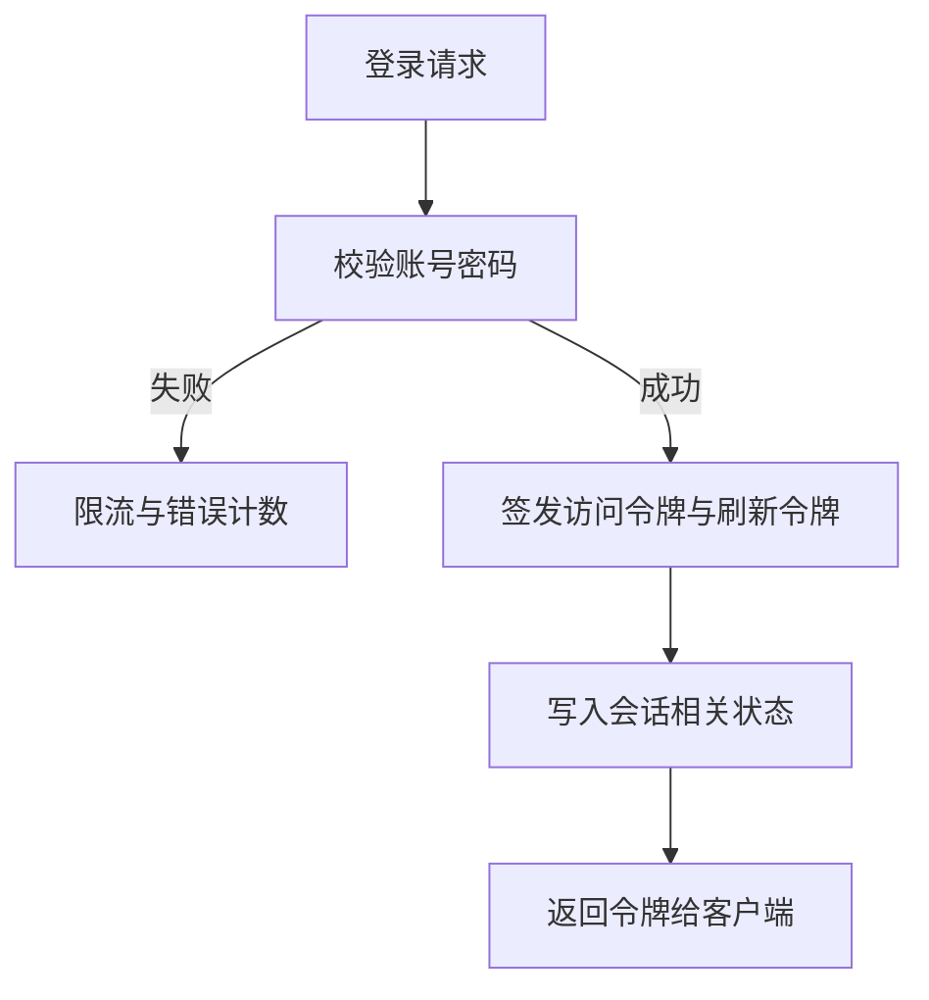

## A2. 鉴权中间件（中文流程图）

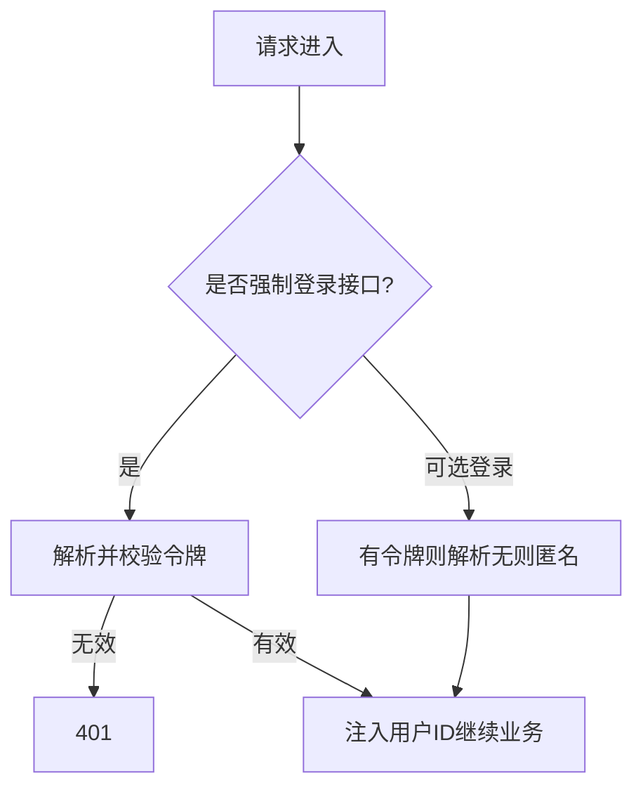

## A3. 安全要点

- 密码哈希成本可配，禁止明文。
- 验证码 / 登录失败限流防刷。
- 令牌过期与刷新分离。
- 日志不打印密码与完整令牌。

## A4. 60 秒口述

> 鉴权是身份入口：注册登录刷新与验证码。中间件注入用户，写接口强制登录，读接口可选。限流与哈希成本是安全底线。

---

# 附录B：面试细节扩写

## B1. 鉴权模块不是 JWT 工具类

面试里不要把这个模块讲成“我用了 JWT”。JWT 只是令牌格式，真正完整的身份体系包括：

1. **身份校验**：密码、验证码、注册前置条件。
2. **令牌签发**：Access Token + Refresh Token。
3. **令牌撤销**：Redis refresh token 白名单。
4. **并发控制**：刷新和重置密码共享 user 级分布式锁。
5. **安全审计**：登录成功 / 失败都写 login_logs。
6. **风控基础**：验证码发送间隔、每日上限、尝试次数限制。

更好的项目介绍方式：

> 鉴权模块是整个系统的身份入口，不只是签 JWT。它负责把不同认证方式收敛到统一会话体系里，并通过 Redis 白名单、令牌轮换、分布式锁和登录日志补齐 JWT 本身没有的撤销、并发和审计能力。

## B2. 鉴权数据模型和 Redis Key

| 数据 | 存储 | 作用 |
|------|------|------|
| 用户账号 | MySQL `users` | 保存手机号、邮箱、密码哈希、昵称等用户真值 |
| 登录日志 | MySQL `login_logs` | 保存登录渠道、状态、IP、User-Agent，用于审计 |
| Refresh Token 白名单 | Redis `rt:{userID}:{tokenID}` | 判断 refresh token 是否仍可用 |
| 验证码 | Redis `vc:code:{scene}:{identifier}` | 保存验证码，TTL 到期自动失效 |
| 发送间隔锁 | Redis `vc:interval:{scene}:{identifier}` | 防止短时间重复发送 |
| 每日发送计数 | Redis `vc:daily:{scene}:{identifier}:{date}` | 限制单个标识每日发送次数 |
| 验证尝试次数 | Redis `vc:attempts:{scene}:{identifier}` | 防暴力枚举 |
| 会话刷新锁 | Redis `lock:auth:refresh:{userID}` | 串行化 Refresh 和 ResetPassword |

面试重点：MySQL 存用户真值，Redis 负责“短生命周期状态”和“撤销能力”。

## B3. 注册完整时序图

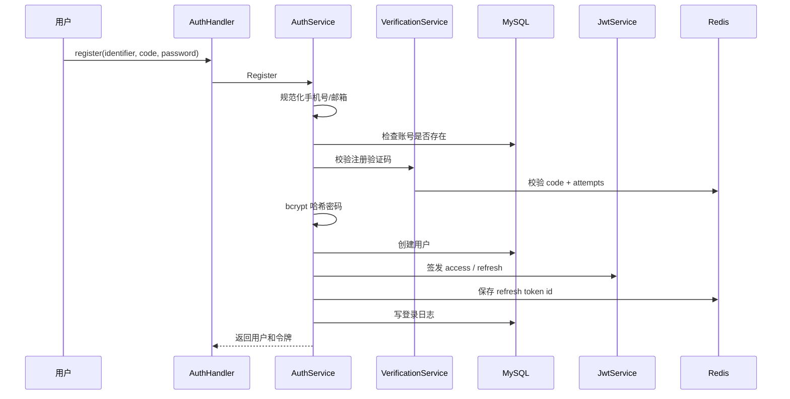

这张图可以回答“注册成功后为什么直接登录”：注册本质上完成了身份校验，所以可以直接进入统一的 token 签发流程。

## B4. 登录分支图

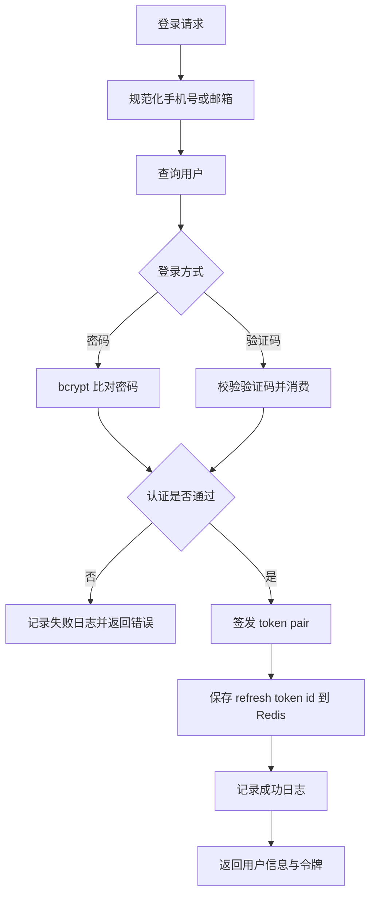

关键点：密码登录和验证码登录只是认证策略不同，后面的会话签发、refresh 存储和日志记录是统一的。

## B5. Refresh Token 轮换时序图

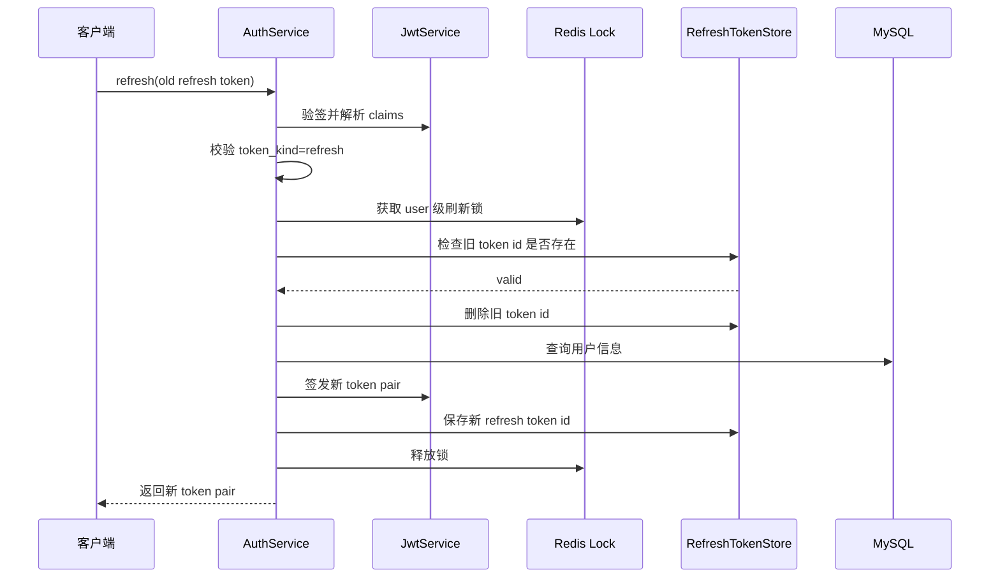

这体现的是 **Token Rotation（令牌轮换）**：refresh token 每用一次就被吊销，降低长期令牌泄露后的复用风险。

## B6. 并发刷新为什么危险

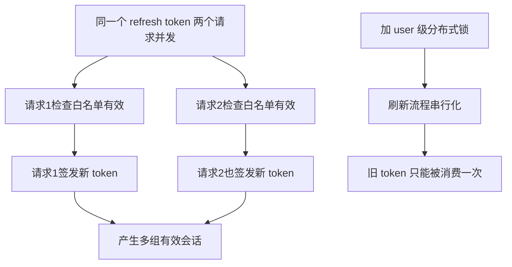

面试回答不要只说“加锁防并发”，要说清楚它保护的是一个状态迁移：旧 refresh token 从有效变为无效，同时产生新的 refresh token。

## B7. 重置密码为什么和 refresh 锁共用

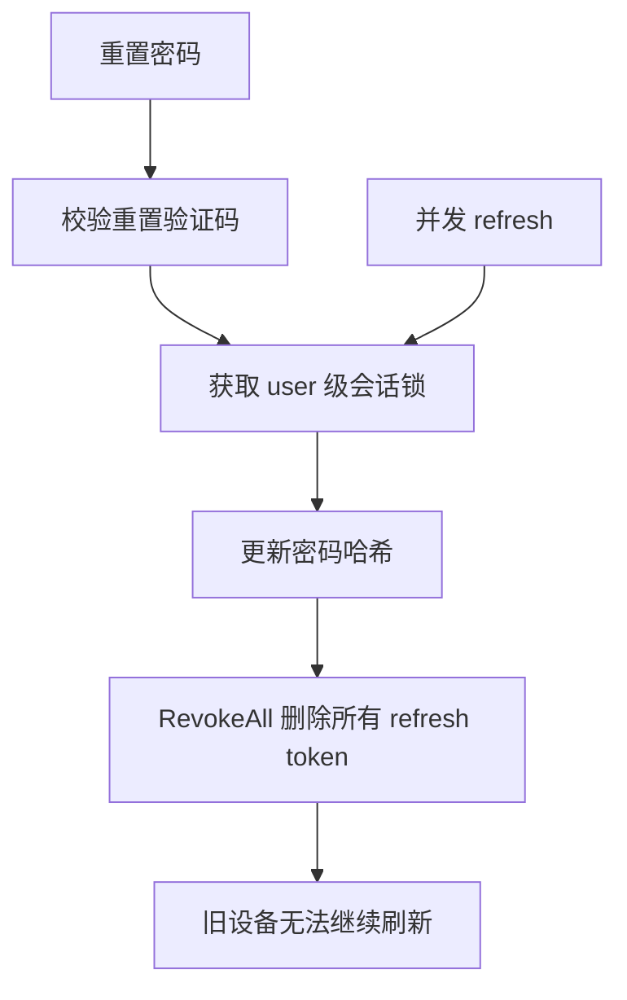

ResetPassword 和 Refresh 共用一把 user 级锁，是为了避免这种窗口：

1. 重置密码准备吊销所有 refresh token。
2. 另一个请求同时用旧 refresh token 刷新成功。
3. 旧设备重新获得新会话。

锁把两个流程串行化后，安全边界更清晰。

## B8. 验证码服务流程

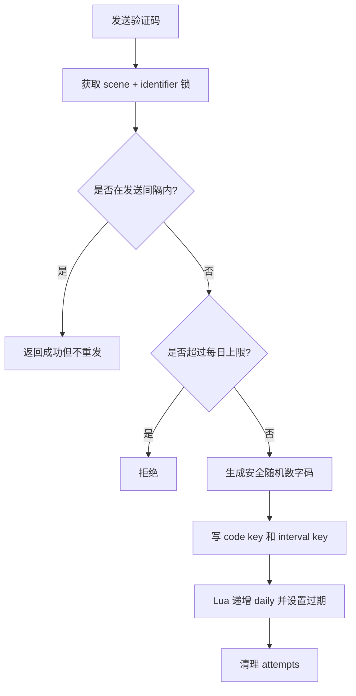

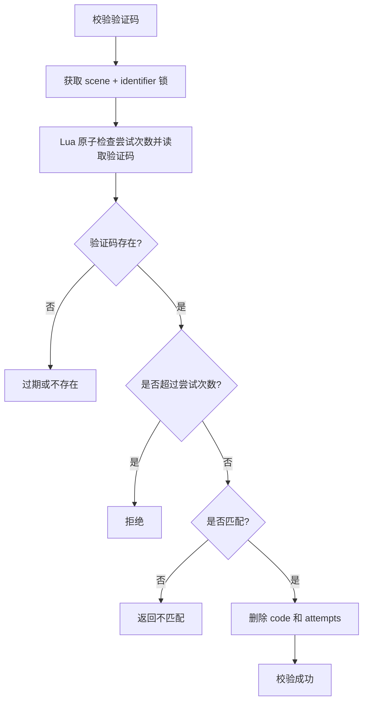

验证码模块的面试亮点：

1. 发送链路加锁，防多实例同时发送。
2. 间隔内返回成功但不重发，避免暴露限流细节。
3. 尝试次数使用 Lua 原子检查和递增，避免并发绕过。
4. 成功后删除验证码，一次性使用。

## B9. RS256 为什么比 HS256 更适合扩展

| 算法 | 密钥模型 | 优点 | 风险 |
|------|----------|------|------|
| HS256 | 一个共享密钥签名和验签 | 简单 | 任意验签方拿到密钥也能签 token |
| RS256 | 私钥签名，公钥验签 | 私钥只在签发服务，公钥可分发 | 密钥管理略复杂 |

本项目使用 RS256，并在 header 中放 `kid`，后续支持密钥轮换会更自然。面试中可以说：不是 HS256 不能用，而是 RS256 更适合多服务共享验签场景。

## B10. 安全边界和当前不足

| 点 | 当前实现 | 还能怎么演进 |
|----|----------|--------------|
| Access Token 撤销 | 不存服务端，等待自然过期 | 敏感场景可加 access blacklist |
| Refresh Token 撤销 | Redis 白名单支持单个或全部撤销 | 加 device_id 支持单设备下线 |
| 密码安全 | bcrypt + cost 配置 | 增加密码历史、防弱密码字典 |
| 验证码防刷 | 间隔、日限、尝试次数、锁 | 接短信网关限流和风控评分 |
| 登录审计 | 成败日志 | 异常登录检测、异地登录提醒 |
| Redis 故障 | refresh 校验 fail-closed | 高可用 Redis 或降级策略 |

主动讲不足的关键是：不要说“我这个鉴权完全安全”，而是说“当前把核心会话撤销和并发风险收住了，后续可以继续加设备维度和风控”。

## B11. 2 分钟展开回答

> 鉴权模块我分成认证和会话两层。认证层支持密码和验证码，验证码服务自己管理发送间隔、每日上限、尝试次数和一次性消费。会话层用 access token 和 refresh token 分离，access token 短期有效，refresh token 长期有效但会把 token id 存到 Redis 白名单里，所以可以登出、轮换和重置密码后全部吊销。刷新 token 时我用了 user 级分布式锁，因为刷新是“检查旧 token、吊销旧 token、签发新 token”的状态迁移，并发下必须串行化。密码用 bcrypt 哈希，JWT 用 RS256 非对称签名，登录成功失败都会写审计日志。这个模块的重点不是用了 JWT，而是补齐了 JWT 本身没有的撤销、轮换、并发和审计边界。

---

# 附录C：函数级源码走读（internal/auth 关键函数）

## C1. `service.go`

| 函数 | 逐步/要点 |
|---|---|
| `SendCode(ctx,req)` | 校验 identifier 格式 → VerificationService.SendCode（内部：流程锁防并发、发送间隔锁 `vc:interval:*` 防轰炸、`incrAndExpireScript` 日限原子计数、crypto/rand 生成、写码键）→ 脱敏返回 |
| `Register(ctx,req,client)` | Verify 验证码 → 唯一性检查 → `validatePassword`（长度/复杂度按配置）→ bcrypt → 建用户 → 签发对 → StoreToken 白名单 → 登录日志 |
| `Login` | 按 identifier 查用户（**不存在与密码错误返回同一错误**，防枚举）→ bcrypt 比对 → 签发+白名单+日志 |
| `Refresh(ctx,req)` | ValidateToken(refresh 类型) → `acquireRefreshSessionLock`（**用户级分布式锁串行化并发刷新**——同一 refresh 并发换新会产生多对有效令牌）→ IsTokenValid 白名单校验 → Revoke 旧 jti → 签发新对 → Store 新 jti（**轮换**：旧 refresh 一次性作废） |
| `Logout` | 尽力而为：解析成功则 Revoke 对应 jti；失败静默（幂等登出） |
| `ResetPassword` | Verify 场景码 → bcrypt 新密码 → 更新 → `RevokeAll`（改密后全端下线） |
| `acquireRefreshSessionLock` | redislock.AcquireWithRetry(auth:refresh:{uid})，返回 lock+cancel；拿不到 → 409 并发刷新 |

## C2. `verification.go`

| 函数 | 要点 |
|---|---|
| `SendCode` | 流程锁 → 间隔锁检查（`vc:interval:*`）→ `incrAndExpireScript` 日限（INCR+首个EXPIRE 原子，防"并发都看到 val>1 都不 EXPIRE"）→ 超限拒绝 → `generateCode`（crypto/rand 逐位）→ SET 码键 TTL |
| `Verify` | 流程锁 → `verifyAndCountScript` 单段 Lua：读次数→超限返 -1→INCR（首个带 EXPIRE）→ GET 码——**判限/计次/取码原子**，并发无法绕过上限 → `subtle.ConstantTimeCompare` 比码 → 成功 DEL 码+次数 |
| `generateCode(length,logger)` | crypto/rand 每位独立取 0-9；熵源失败该位记 0 并 Warn（实际 /dev/urandom 几乎不失败） |

## C3. `jwt.go` / `token_store.go`

| 函数 | 要点 |
|---|---|
| `NewJwtService(cfg)` | 加载 RS256 私/公钥 PEM；路径错启动即失败（配置前移） |
| `IssueTokenPair(user)` | access（短 TTL）+ refresh（长 TTL，独立 jti uuid）；两 token 均带 type 声明防混用 |
| `ValidateToken(str)` | 解析+验签+过期校验 → 返回 claims（含 type/jti）；alg 固定 RS256 防算法混淆 |
| `StoreToken/IsTokenValid/RevokeToken/RevokeAll` | 白名单模型：`auth:refresh:{uid}:{jti}` 存活即有效；RevokeAll 用 SCAN 前缀批删（改密/风控全端下线） |
