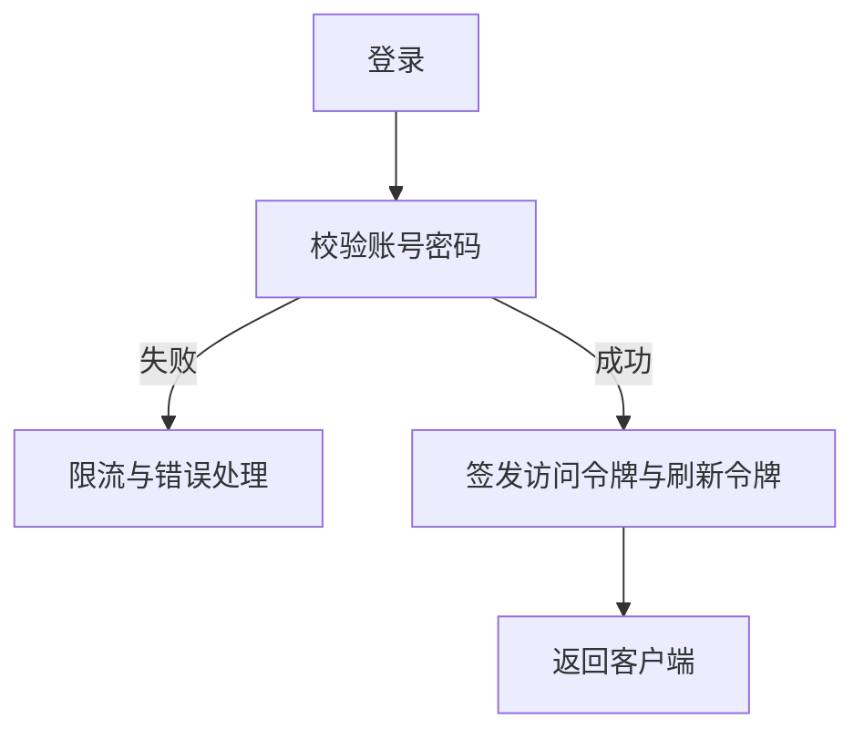
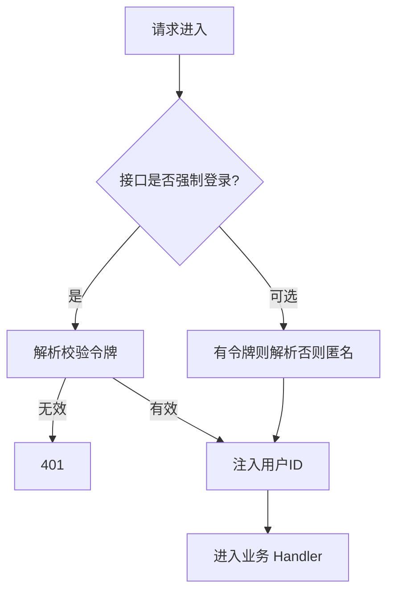

# 02. 鉴权与安全模块

## 1. 是什么

模块：`internal/auth`

能力：注册、登录、刷新会话、验证码、密码重置（以实际路由为准）。

不是「JWT 工具包」，而是**身份入口**。

## 2. 一句话

> 密码哈希存储；令牌访问与刷新分离；中间件注入用户；写接口强制登录；读接口可选；登录与验证码限流防刷。

## 3. 登录与鉴权流程

## 4. 安全要点

| 点 | 做法 |
|----|------|
| 密码 | bcrypt 等哈希，成本可配，禁止明文 |
| 令牌 | 过期时间短 + 刷新机制 |
| 防刷 | 登录 / 验证码限流 |
| 日志 | 不打印密码与完整 token |
| 错误 | 避免「用户存在/不存在」过度泄露（按产品权衡） |

## 5. 与业务关系

- 知文写、计数 toggle、关注：强制用户  
- 详情 / 公共 Feed：可选登录，用于 enrich liked  

## 6. 风险

1. 刷新令牌存储与吊销策略要清晰  
2. 时钟偏差导致 JWT 校验抖动  
3. 限流维度（IP / 用户）配置不当  

## 7. 60 秒口述

> 鉴权是身份入口：注册登录刷新与验证码。中间件把用户放进上下文，写接口必须登录。密码哈希加限流是底线，日志绝不打敏感信息。

---

以 `internal/auth` 与中间件实现为准。
