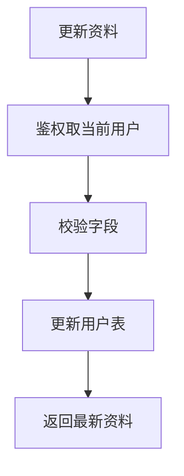

# 03. 资料模块

## 1. 是什么

模块：`internal/profile`（或等价包名，以仓库为准）

能力：查询用户资料、更新当前用户资料。

## 2. 一句话

> 边界小的模块保持简单：校验 + 写库 + 返回；不强上缓存和 MQ，避免过度设计。

## 3. 流程

## 4. 设计哲学

| 不做 | 原因 |
|------|------|
| 复杂多级缓存 | 读写比与一致性成本不划算 |
| 异步投影 | 无强下游依赖 |

若以后要缓存：必须补失效、穿透与多实例策略（见 09）。

## 5. 60 秒口述

> 资料模块故意简单，体现「复杂度与问题匹配」。面试里说明：不是所有域都要上事件驱动。

---

以源码路由与表结构为准。
