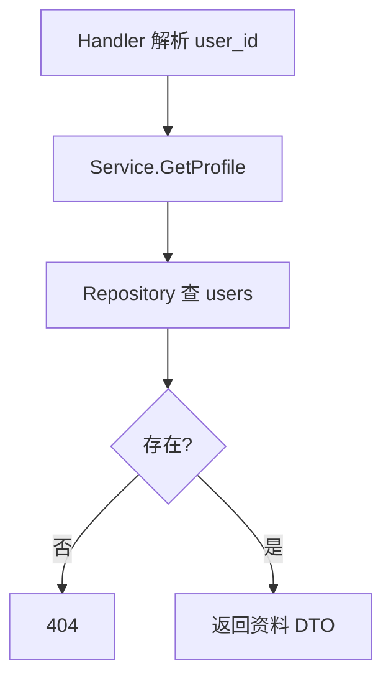
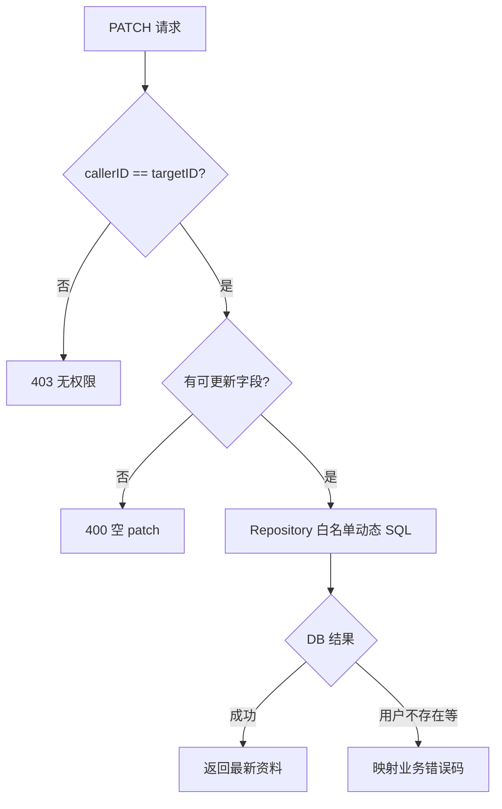
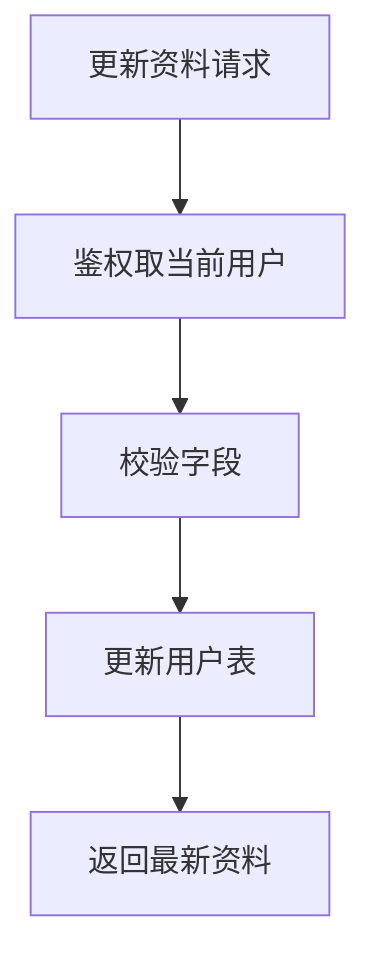
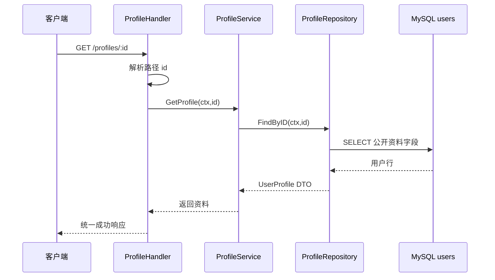
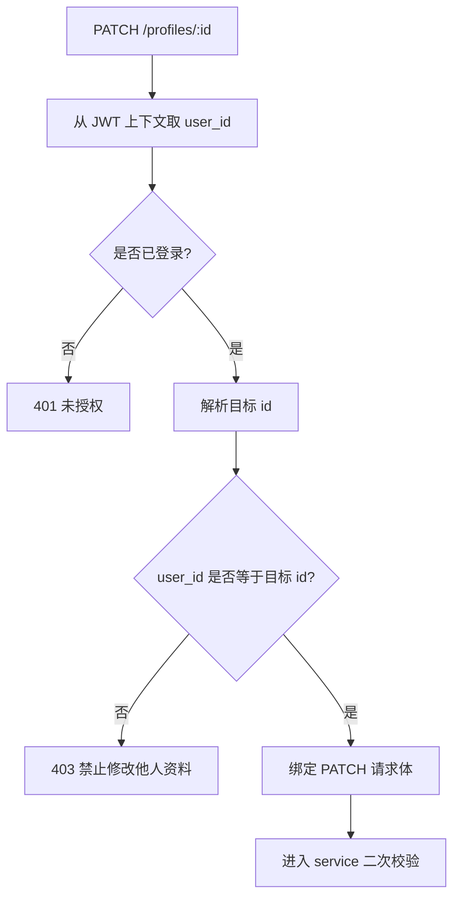
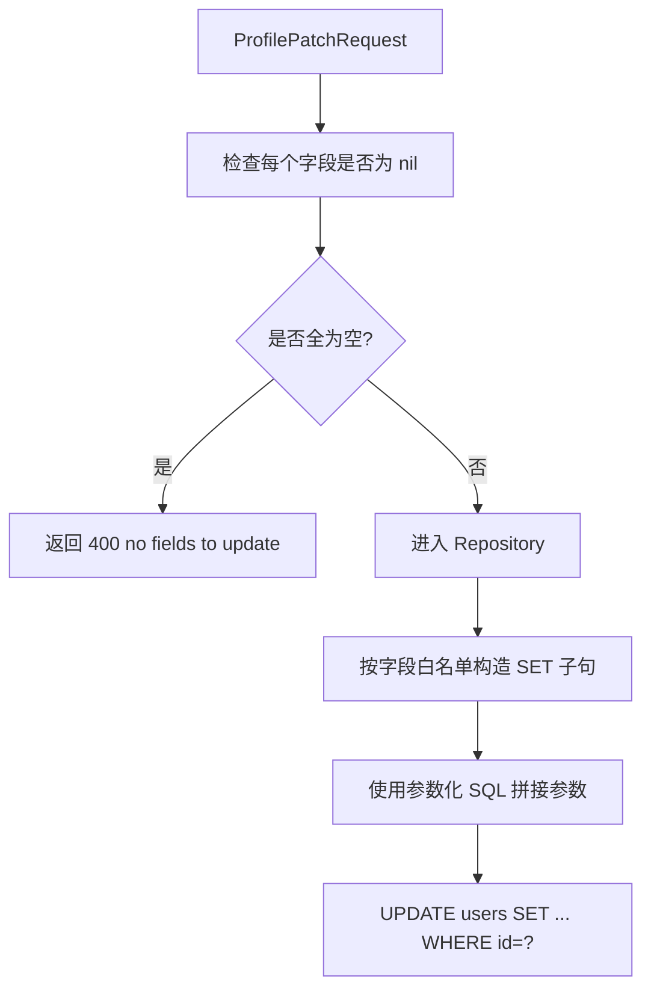
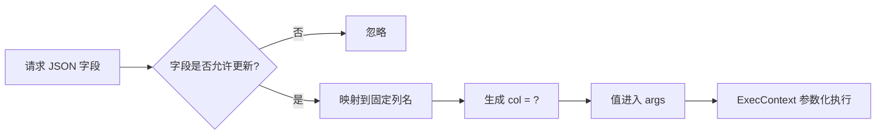
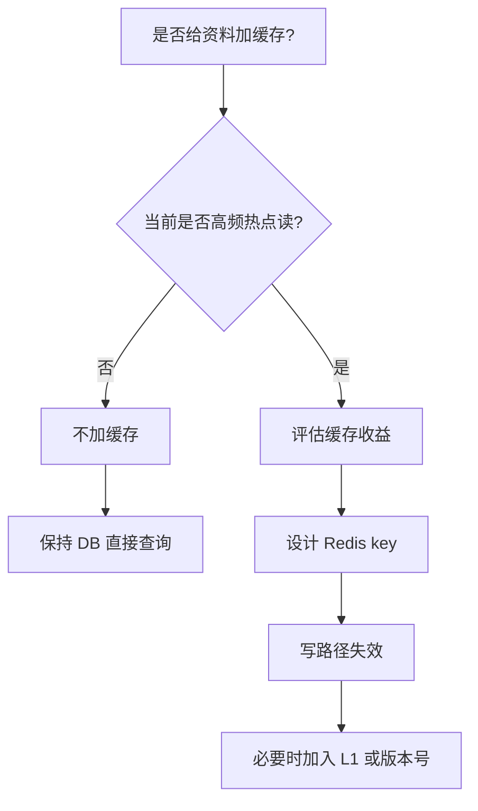
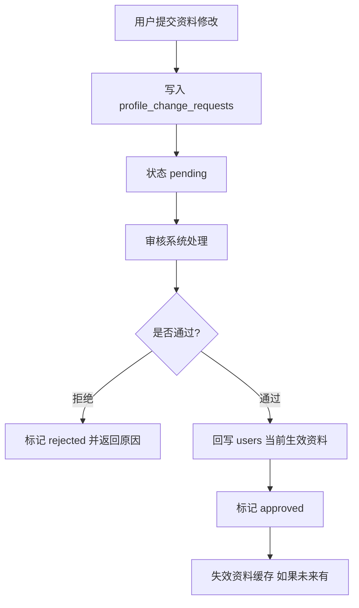

# 资料模块

## 1. 模块定位

资料模块是整个项目里最轻的一块业务模块，它负责：

1. 查询用户资料
2. 更新当前用户自己的资料

虽然它没有复杂缓存、没有异步链路、也没有 MQ，但它很适合在面试里体现一个观点：

**不是所有模块都应该被设计得很复杂，边界小的模块就应该保持简单。**

## 2. 一句话介绍

资料模块刻意保持轻量，service 只负责编排本人权限校验、空更新拦截和错误码转换，repository 直接操作用户表，不额外引入缓存和异步同步，从而让简单问题用简单方案解决。

## 3. 核心流程

### 3.1 查询资料

流程很直接：

1. handler 拿到用户 ID
2. service 调 repository 查用户
3. 如果不存在，返回 `404`
4. 返回用户资料

### 3.2 更新资料

更新流程有两个核心约束：

1. 只能本人修改自己的资料
2. 如果请求里没有任何可更新字段，直接返回 `400`

所以流程是：

1. 比较 `callerID` 和 `targetID`
2. 检查 patch 请求是否真的包含字段
3. 调 repository 做局部更新
4. 把底层错误转换成业务错误码

## 4. 设计亮点

## 4.1 简单模块不强行上缓存

资料模块没有引入 Redis 缓存，这是一个刻意选择。

因为它的主要特征是：

- 写多读少程度并不极端
- 单条资料查询成本不高
- 对一致性要求比性能更重要

如果现在为了“看起来高级”硬上缓存，反而会引入：

- 更新后失效问题
- 多实例一致性问题
- 额外维护成本

### 4.2 权限规则在 service 层收敛

更新资料不是简单的 SQL patch，而是一个业务动作。  
“只有本人能改本人资料”这个规则应该放在 service，而不是散落在 handler 或 repository 里。

### 4.3 patch 更新而不是全量覆盖

只更新非 nil 字段，有两个好处：

1. API 更贴近前端实际交互
2. 降低误覆盖风险

## 5. 难点与边界

### 5.1 资料模块最容易被过度设计

它很容易被做成：

- 缓存
- 搜索同步
- 审计流水
- 修改版本管理

这些不是不能做，而是要有明确业务驱动。  
当前这个模块保持轻量，其实是合理的。

### 5.2 “本人可改”是最基础但必须清晰的权限边界

很多项目容易把这个逻辑藏在 controller 或 middleware 里。  
这个项目把它收敛到 service，面试里可以强调：**权限边界应该在业务层可见。**

## 6. 面试官高频问题

### Q1：为什么资料模块不做缓存？

**参考回答：**

因为我先看的是收益和代价。  
资料查询是单行数据读取，数据库压力并不高，而资料更新后对一致性要求很高。  
如果引入缓存，我要额外处理失效、多实例一致性和缓存穿透等问题。  
在当前业务规模下，这些复杂度不值得，所以我选择先保持简单。

### Q2：为什么权限判断放在 service，而不是 handler？

**参考回答：**

因为“只有本人能修改资料”是业务规则，不是 HTTP 协议规则。  
handler 适合做参数解析和响应转换，真正的业务约束应该在 service 层集中表达，这样换协议层也不会丢失这条规则。

### Q3：为什么做 patch 而不是 put 全量更新？

**参考回答：**

因为资料编辑通常是局部变更，比如只改头像、只改昵称。  
用 patch 更符合前端交互模型，也能减少客户端传整对象带来的误覆盖风险。

## 7. 场景题

### 场景题 1：如果以后资料查询量暴涨，你怎么加缓存？

**参考回答：**

我会按最小侵入方式演进：

1. 先给用户资料加 Redis 单 key 缓存
2. 写路径用 cache-aside 失效
3. 如果进入多实例，再考虑本地 L1 或版本号方案

也就是说，不会在当前轻量模块里提前塞进复杂缓存体系，而是随着流量增长逐步演进。

### 场景题 2：如果要支持资料审核，比如昵称和简介要先审核后生效，你怎么改？

**参考回答：**

我会把“用户提交的内容”和“当前生效内容”分开建模：

1. 主表仍保留当前生效资料
2. 新增一张待审核变更表
3. 用户提交修改时先写待审核表
4. 审核通过后再回写主表

这样不会把审核中的脏数据直接暴露给读链路。

## 8. 最容易讲错的地方

不要为了显得系统高级，就把这个模块说成“也可以做一堆缓存、消息、异步同步”。  
更好的回答是：

**我知道怎么扩展，但我没有在没有业务驱动的时候提前复杂化。**

---

# 附录A：工程级扩写

## A1. 更新资料（中文流程图）

## A2. 设计哲学

边界小的模块保持简单：无强缓存、无 MQ，避免过度设计。  
若未来要缓存，必须补失效与穿透方案。

---

# 附录B：流程图扩写

## B1. 查询资料完整链路

这条链路没有缓存和异步，是刻意保持简单：资料查询成本低，先保证权限、字段和错误边界清晰。

## B2. 更新资料权限判断

面试重点：handler 可以提前拦截明显无权限请求，service 仍保留业务规则，避免未来换协议层时丢掉权限边界。

## B3. PATCH 字段处理流程

这里的安全点是：SQL 里的列名不是从用户输入直接拼接，而是来自代码内的白名单；字段值走参数化绑定。

## B4. 动态 SQL 白名单图

这张图可以回答“动态拼 SQL 会不会注入”：列名来自服务端白名单，值通过占位符传入，不拼用户原始字符串。

## B5. 为什么现在不加缓存

面试表达：不是不会做缓存，而是当前收益不覆盖复杂度；如果以后流量上来，可以按 cache-aside 平滑演进。

## B6. 资料审核演进流程

如果以后要做内容审核，不能直接让未审核昵称或简介进入 `users` 生效字段，应该拆出待审核变更表。

## B7. 资料模块 60 秒补充口述

> 资料模块我没有刻意复杂化。读路径直接查 users 并映射公开 DTO，写路径要求登录且只能本人修改本人资料；PATCH 请求只更新非 nil 字段，空更新直接 400。Repository 动态 SQL 使用字段白名单和参数化查询，避免列名和用户输入混在一起。如果以后资料读成为热点，可以加 Redis cache-aside；如果要做审核，则把待审核变更和当前生效资料拆成两张模型。
