# 知文模块

## 1. 模块定位

`knowpost` 是这个项目最核心的业务模块，它承载了内容平台的主流程：

1. 创建草稿
2. 上传正文与图片
3. 编辑元数据
4. 发布、删除、置顶、改可见性
5. 查看详情
6. 读取公共 Feed 和我的已发布列表

14. 如果说 `relation`、`counter`、`search` 体现的是工程深度，那么 `knowpost` 体现的是**业务主线 + 缓存设计 + 异步解耦能力**。

---

### 🎓 教学导学板块

> **🎯 学习目标**
> 1. 理解高并发内容平台中**“写路径强一致”**与**“读路径极致性能”**的工程解耦方案。
> 2. 掌握缓存“三山”（穿透、击穿、雪崩）的**四道防线递进式防御体系**与设计推导。
> 3. 掌握基于 `knowpost:ver:{id}` 版本号自然失效机制解决多 API 实例 L1 freecache 本地缓存脏数据的问题。
> 4. 掌握公共 Feed 中“页 ID 列表”与“单条 item 碎片缓存”拆分设计的哲学。
> 
> **📚 前置概念预习**
> - **Cuckoo Filter (布谷鸟过滤器)**：相比经典 Bloom Filter，支持 $O(1)$ 的元素删除操作 (`CF.DEL`)，空间利用率更高。
> - **NULL 哨兵缓存**：当数据库确认无此数据时，写入一个短 TTL 的 `"NULL"` 字符串，吸收二次穿透。
> - **看门狗锁 (Watchdog Lock)**：使用 Redis `SET NX PX` 争抢锁，后台协程每 `TTL/3` 时间自动续期，防止长查询导致锁提前释放。

---

## 2. 一句话介绍

知文模块把“写路径正确性”和“读路径性能”拆开设计：写路径通过事务 outbox 保证内容主数据和异步事件不丢，读路径通过 **Redis 布隆过滤器 + 空值缓存叠加**、L1 + Redis + DB 多级缓存、版本号失效、热点 TTL 延长和分布式锁回源，兼顾穿透防护、多实例一致性、热点保护和最终一致性。

## 3. 核心流程

## 3.1 写路径流程

### 3.1.1 创建草稿

基础流程是：

1. 生成雪花 ID
2. 初始化默认状态：
   - `draft`
   - `image_text`
   - `public`
3. 写入 MySQL

当客户端带 `X-Idempotency-Key` 时，实际流程还会多一层 Redis 幂等认领：

1. `SET NX idem:draft:{creatorID}:{key} pending:{token}`；
2. 只有认领成功的请求执行 `InsertDraft`；
3. 插入成功把 pending 值替换成正式 post ID，TTL 为 5 分钟；
4. 并发重试看到正式 ID 直接返回同一 ID；看到 pending 最多等待 3 秒；插入失败只用 compare-and-delete 清理**自己的** pending 标记。

这样避免了弱网重试或双击导致同一用户生成两篇草稿。草稿写入成功后还会尝试 `CF.ADD`，避免已预热的存在性过滤器把作者紧接着的详情读取误判为“确定不存在”。草稿创建不写 outbox，因为它不需要进入公共 Feed 或搜索投影。

### 3.1.2 确认正文上传

上传不是走“文件先经过业务服务再落盘”的模式，而是：

1. 先由 storage 模块给客户端发预签名 URL
2. 客户端直传 OSS
3. 上传成功后，前端调用 `ConfirmContent`
4. 业务服务把 object key、etag、sha256、size 写回知文记录
5. 前后各做一次详情缓存失效

这里本质是“元数据确认”，不是“文件代理上传”。

### 3.1.3 编辑元数据

元数据更新包括：

- 标题
- 标签
- 简介
- 图片列表
- 可见性

这条链路的关键点是：

1. 在同一个事务里更新知文主数据
2. 在同一个事务里写 outbox
3. 提交成功后再失效详情和 feed 缓存

当前实现是**提交后单次 best-effort 失效**，不是经典“双删”：`UpdateMetadata`、发布、置顶、可见性、删除均先通过 `runKnowPostTx()` 完成主表与 outbox 的原子提交，随后 `INCR` 详情/Feed 版本并删除 item 碎片。缓存失效失败只记录日志，不改变已提交的业务结果。

### 3.1.4 发布 / 删除 / 置顶 / 改可见性

这些动作都统一走 `runKnowPostTx()`：

1. 开事务
2. 执行业务变更
3. 写 outbox
4. commit
5. 提交成功后失效详情和 feed 缓存

所以你可以把这个模块的写路径概括为：

**主数据变更和异步事件投递通过事务 outbox 绑定在一起，缓存只做 best-effort 失效，不参与真值定义。**

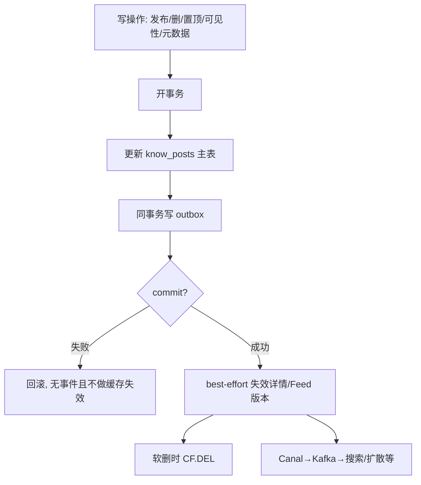

创建草稿 / 确认正文上传是更轻的写路径：草稿主要是雪花 ID + MySQL 插入 + `CF.ADD`；确认正文是 OSS 元数据回写 + 详情缓存失效，不必然写 outbox。

## 3.2 详情读路径流程（教学深度拆解）

知文详情页是整个系统中吞吐量最高、面对网络攻击与高并发压力最大的入口之一。为了同时解决“缓存穿透（查不存在的数据）”、“缓存击穿（热点 Key 突然过期）”和“多实例本地缓存脏数据”三大工程难题，本项目设计了**四道递进式防护体系**。

### 3.2.0 四道防线全景解析

> **💡 现实工程场景：**
> 如果某个恶意黑客使用自动化脚本，以每秒 5000 次的频率轮询随机生成的废 ID（如 `99999999`），如果没有前置过滤器和空值哨兵，这些请求会全部打穿缓存直奔 MySQL，瞬间导致数据库 CPU 满载、连接池枯竭，引发整站崩溃。

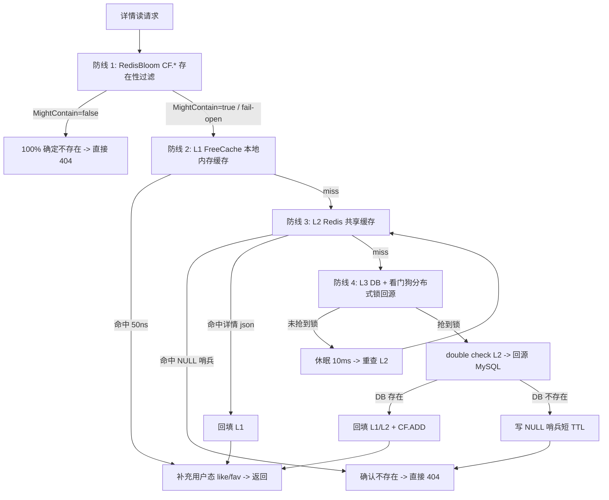

#### Step-by-Step 四道防线工作机制：

1. **防线 1：第三方 RedisBloom Cuckoo Filter (`CF.*`) 前置**
   - **原理**：在请求接触自由内存与 Redis 缓存之前，先通过 RedisBloom 的布隆/布谷鸟过滤器检查 ID 是否存在。
   - **教学结论**：如果 `CF.EXISTS` 返回 `false`（即 `MightContain=false`），在数学上可以 **100% 保证该知文从未存在过**，系统直接返回 `404`，连本地内存与 Redis L2 都不必读取。
   - **优点**：能够以几 KB 的极小内存消耗，把 99% 以上的盲目扫号攻击隔绝在最外层。

2. **防线 2：L1 FreeCache 进程内内存缓存**
   - **原理**：基于 Go 进程内内存（FreeCache）实现，响应时间仅需大约 50 纳秒（ns）。
   - **教学结论**：热点文章在被频繁访问时，99.9% 的流量在单个 API 节点的内存中就被直接消化，极大地减轻了 Redis 的网络与单线程命令处理压力。

3. **防线 3：L2 Redis 共享缓存 + NULL 空值哨兵**
   - **原理**：跨 API 实例共享的二级缓存。如果回源 MySQL 后发现资源真的不存在，绝不静默丢弃，而是在 Redis 中写入一个特殊的 `"NULL"` 哨兵字符串，并赋予 30s~60s 的随机短 TTL。
   - **教学结论**：NULL 哨兵专门吸收 Cuckoo Filter 的假阳性（False Positive）、删除残留或过滤器尚未完成预热时的真实 miss 请求，是防止穿透的第二道保险。

4. **防线 4：L3 DB 回源 + Redis看门狗（Watchdog）分布式锁**
   - **原理**：当 L1/L2 均未命中时，系统不会允许所有并发协程同时冲向 MySQL（即缓存击穿），而是通过 Redis `SET NX PX` 争抢独占回源锁。
   - **教学结论**：抢到锁的协程开启本地看门狗（每 `TTL/3` 时间自动续期），防止数据库长查询导致锁超时释放；未抢到锁的协程休眠等待后重新读取 Redis L2，直接复用前者的回填结果。

---

### 3.2.0.1 第三方 RedisBloom（Cuckoo CF.*）适配层

**定位与职责划分：**

| 层次 | 谁实现 | 职责说明 |
|------|--------|----------|
| 过滤算法 / 数据结构 | **第三方** Redis 模块 RedisBloom | Cuckoo Filter，命令 `CF.*`，随 `redis-stack-server` 镜像交付 |
| 业务适配层 | 本仓库 `internal/cache/bloom.go` | 薄客户端：负责参数映射、ADD/DEL/EXISTS 命令封装与 fail-open 降级；**不自研**哈希/踢出/扩容算法 |
| 读路径编排 | `knowpost.GetDetail` | 负责 CF 前置校验 + L1/L2/NULL/DB 串联 |

配置键仍叫 `bloom_*`、类型名仍叫 `RedisBloom`，仅为历史兼容；叙述应说「第三方 RedisBloom，业务只写适配层」。

| 能力 | 第三方命令 |
|------|------------|
| 预留容量 | `CF.RESERVE`（capacity / BUCKETSIZE / MAXITERATIONS / EXPANSION） |
| 插入 | `CF.ADD` |
| 删除 | `CF.DEL` |
| 查询 | `CF.EXISTS` |
| 运维 | `CF.INFO`（适配层 `Info`） |

**依赖**：Docker Redis 使用 `redis/redis-stack-server`（内置 RedisBloom）。标准 `redis:alpine` **无** `CF.*`，适配层 fail-open 到仅 NULL 路径。

配置（`knowpost.detail_cache`，键名保留 `bloom_*`）：

| 配置项 | 默认 | 含义 |
|--------|------|------|
| `bloom_enabled` | true | 是否开启 |
| `bloom_expected_items` | 1000000 | 映射 `CF.RESERVE` capacity |
| `bloom_false_positive_rate` | 0.01 | 影响默认 BUCKETSIZE（更严→更大） |
| `bloom_key` | `cf:knowpost:ids` | CF 键 |

行为：

1. **读路径最前**：`MightContain=false` → 一定不存在 → 直接 404，不打 L1/L2/DB。
2. **写路径维护**：`CreateDraft` 成功、详情回源成功 → `CF.ADD`。
3. **软删维护**：`Delete` 成功后 → `CF.DEL`。
4. **启动预热**：`initKnowPost` 异步 `WarmDetailBloom`，游标扫描 `ListIDsForBloom`。
5. **冷启动 fail-open**：CF 键不存在时一律视为可能存在，避免误拦全站。
6. **模块/Redis 故障 fail-open**：`unknown command` 或连接失败时退回仅空值缓存路径。

为什么要和 NULL **叠加**而不是二选一：

- CF 擅长拦「从未出现过的扫号 ID」，且**软删后可 `CF.DEL`**。
- NULL 擅长兜「查过确认不存在 / 过滤器误判 / 模块不可用 / 预热未完成」。
- 两者叠加后：穿透成本更低，又不牺牲正确性。

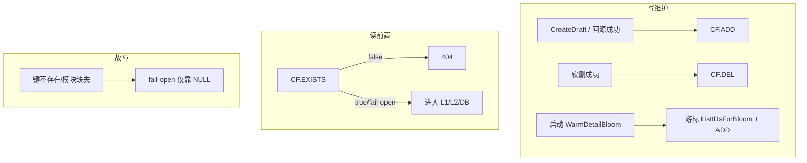

### 3.2.1 版本化缓存键

详情缓存键不是固定的 `knowpost:detail:{id}`，而是带版本号：

`knowpost:detail:{id}:v{layout}:{version}`

写路径失效时不仅删 key，还会把 Redis 里的 `detail version` 加一。

这解决的是多实例本地 L1 不一致问题：

- 某个实例的本地缓存没删掉没关系
- 因为新请求会切到新的 version key
- 旧 L1 即使还在，也不会再被命中

### 3.2.2 NULL 哨兵（空值缓存）

如果内容不存在或已删除，会在 Redis 写 `NULL`，并加 30 到 60 秒随机 TTL。

这是穿透防护的**第二道防线**，专门吸收：

- CF 误判后回源仍不存在
- 删除失败 / 模块缺失 / 指纹碰撞等边界
- 过滤器未预热 / fail-open 时的真实 miss

注意：403（无权限）**不写 NULL**，避免把私有资源语义和「不存在」混在一起。

### 3.2.3 分布式锁 + double check

L1/L2 都 miss 后，不是所有请求一起打 DB，而是：

1. 先抢 Redis 分布式锁
2. 抢不到的线程睡一小会再重查 Redis
3. 抢到锁的线程再次 double check Redis
4. 仍然 miss 才真正查 DB

这个流程用来抗缓存击穿。

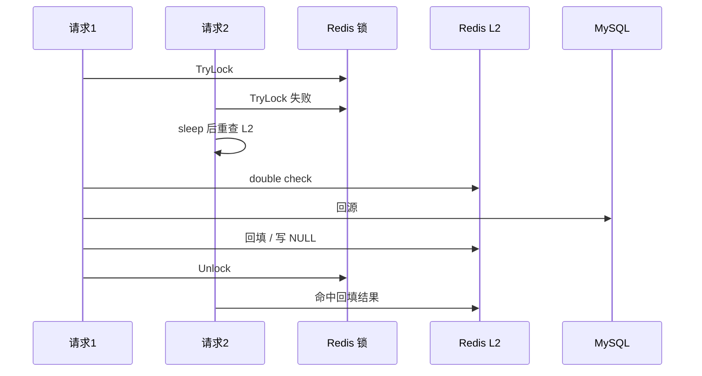

### 3.2.4 用户态数据不进共享缓存

详情里的这些数据不会直接进详情缓存：

- 当前用户是否 liked
- 当前用户是否 faved

因为这些是用户维度数据，不是公共数据。  
如果把它们塞进共享缓存，会导致不同用户互相污染。

## 3.3 Feed 读路径流程

### 3.3.1 公共 Feed

公共 Feed 走的是：

1. 先读 L1 整页缓存
2. 再尝试用 Redis 碎片缓存拼页
3. 再在分布式锁下回源 DB

这里的碎片缓存设计很有意思：

- 页缓存只缓存一页结果，复用性差
- 条目碎片缓存能跨页复用单条内容
- 所以公共 Feed 会把“页 ID 列表”和“单条 item 详情”拆开缓存

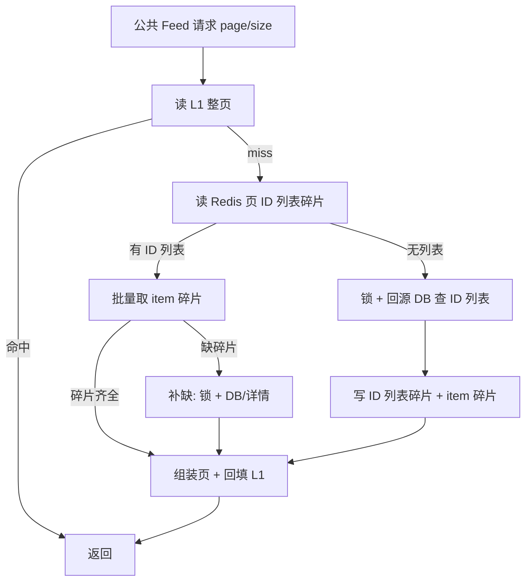

### 3.3.2 我的已发布列表

“我的 Feed”没有走碎片缓存，而是直接缓存整页。

原因是：

- 数据范围更小
- 更新频率更低
- 用户只会看自己的页

这是一个非常典型的“按访问模式选缓存模型”的例子。

不过接口命名和 SQL 语义有一处需要按源码说明：`GetMyPublished` 最终查询条件是 `creator_id = ? AND status != deleted`，因此当前会返回草稿和已发布内容，不是严格意义的“我的已发布列表”。由于该接口要求登录、且只允许读取当前用户自己的数据，这不会泄露草稿，但前端产品语义与方法名不一致；若产品确实只要已发布内容，应将 SQL 条件收紧为 `status = published`，或拆出明确的草稿列表接口。

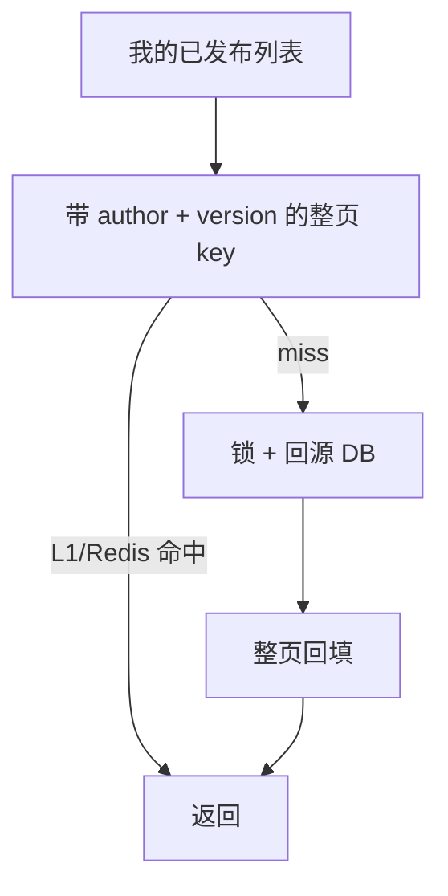

### 3.3.3 Feed 失效策略

知文写入后不会去枚举删除所有分页 key，而是：

1. 删除单条 item 碎片缓存
2. 递增公共 Feed version
3. 递增当前作者 mine feed version

这样新请求自然切换到新 key，不需要暴力清全量分页缓存。

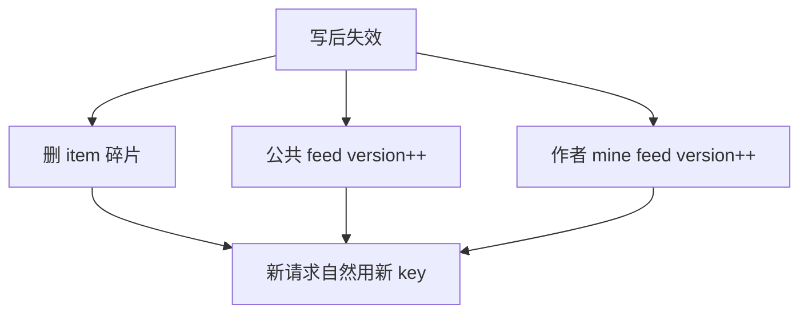

## 4. 设计亮点

## 4.1 事务 outbox 把写库和异步事件绑定起来

这是知文模块最硬的一个设计点。

如果不做事务 outbox，你会遇到经典双写问题：

1. DB 已提交，消息没发出去
2. 消息发出去了，DB 回滚了

这个项目的做法是：

- 业务变更和 outbox 行在同一个事务里提交
- 由 Canal 读 binlog，再桥接到 Kafka

所以异步链路和主写路径最终绑定到了同一条 MySQL 事务日志上。

## 4.2 多实例缓存一致性靠“版本号 + 新 key”而不是 Pub/Sub

这个选择很务实。

相比本地缓存失效广播，版本号方案的特点是：

1. 实现简单
2. 强一致读语义更清晰
3. 不依赖额外订阅连接
4. 不存在广播丢失导致的实例长期脏缓存

代价是每次读都要多查一个小 key，但这个代价通常可以接受。

## 4.3 热点保护不是只靠锁，还靠 TTL 延长

很多项目只做到“加锁防击穿”，但没有继续处理热点内容周期性回源的问题。

这个项目额外做了：

1. HotKeyDetector 记录访问热度
2. 热点内容提高缓存 TTL
3. 只延长 TTL，不缩短

也就是说，它不是只在 miss 时防击穿，还在 hit 阶段尽量延缓下一次 miss。

## 4.4 读路径和用户态增强解耦

详情和搜索结果都遵循一个思想：

- 公共数据进缓存
- 用户态数据实时补充

这能同时保证：

1. 公共缓存命中率
2. 用户态结果正确性

## 5. 技术难点与边界问题

### 5.1 为什么详情缓存用版本失效，而不是简单双删

当前代码在事务提交后执行一次版本失效，并没有在写前后都做删除。之所以仍需要版本号，是因为这是多实例服务，不是单机。

如果只是：

1. 删 Redis
2. 删当前实例 L1

那别的实例的 L1 还会继续命中旧值。  
所以这里引入版本号，是在解决“多实例本地缓存不一致”。

### 5.2 为什么用户点赞状态不能直接缓存进详情页

因为这会把本应共享的缓存变成“和用户相关的缓存”，导致：

- key 维度爆炸
- 命中率下降
- 不同用户结果可能串数据

所以更合理的方式是公共详情缓存和用户态增强分开。

### 5.3 Feed 页缓存为什么要做 version，而不是精确删页

因为分页缓存的本质问题是：

- 一个帖子会出现在很多页里
- 你很难准确知道它影响了哪些页

如果精确删页，复杂度非常高。  
所以更好的思路是：

- 递增版本号
- 让新请求自然读新页

这是一种典型的“用空间和时间换简单性”的方案。

### 5.4 共享详情缓存与可见性校验存在先后顺序风险

`GetDetail` 只会在 DB 回源函数 `queryDetailFromDB()` 中校验“已发布且公开，或当前用户是作者”。但 L1 / L2 命中发生在这次 DB 权限校验之前，且详情缓存 key 只包含 post ID 和版本，不包含访问者身份。

因此非公开内容若先被作者回源并写入共享缓存，后续匿名或其他用户请求可能直接命中缓存而绕过权限判断。这是当前实现的**安全缺口**，不能仅仅描述为“需注意权限边界”。

推荐修复顺序如下：

1. 对非 `published + public` 的内容不要写入共享详情缓存；或把可见性、作者 ID 放进一个可先读取的独立元数据缓存，并在 L1/L2 命中前完成授权；
2. 更稳妥的做法是把私有详情改为 owner-scoped key，或直接只读 DB；
3. 增加“匿名请求不读取私有内容缓存”的回归测试，防止后续缓存优化重新引入越权。

### 5.5 公共 Feed 的个性化字段在 L1 命中时不会补齐

公共 Feed 的 Redis 碎片路径会在组装后调用 `enrichItems()`，为登录用户批量补 `liked/faved`；但 `getPublicFeedL1()` 直接返回整页 JSON，没有再次做这一步。因此同一个登录用户在 L1 命中时可能得到空的 `liked/faved`，L2 或 DB 回源时却能得到正确用户态。

这不是共享缓存串用户数据（共享页本身不带用户态），而是不同命中层的响应不一致。修复方式是在 L1 命中后也调用 `enrichItems()`，或者只缓存不带用户态的基础页并统一在返回前增强。

### 5.6 当前实现的真实工程折中

这个模块整体设计是很强的，但也有一些明确的工程折中：

1. 详情缓存是提交后版本失效方案，不是主动广播，也不是双删
2. 热点识别是近似统计，不是精确全局计数
3. Feed 缓存不是无限预热，而是按需回源
4. 最终一致性问题由 outbox 投影链路兜底，不追求所有链路强同步

这些都不是缺点，而是有意识的成本控制。

## 6. 面试官高频问题

### Q1：为什么详情页要做 L1 + Redis + DB 三级链路？

**参考回答：**

因为不同层级解决的问题不同：

- L1 解决单实例热点请求的极致低延迟
- Redis 解决多实例共享缓存
- DB 作为最终真值源

如果只有 Redis，没有本地 L1，热点内容在高并发下仍然会把 Redis 顶得很重；如果只有 L1，没有共享缓存，多实例又很难一致。

### Q2：为什么你的 L1 失效不用广播，而是用版本号？

**参考回答：**

因为版本号方案更简单也更稳。  
我不需要维护 Pub/Sub 订阅连接，不需要处理消息丢失、重连和广播延迟问题。  
写路径只要把版本号递增，读路径就会自动切到新 key，旧 L1 自然变成不可达缓存。  
代价只是多查一个轻量版本号 key，这个成本远小于广播方案的复杂度。

### Q3：为什么用户点赞状态不直接缓存到详情页？

**参考回答：**

因为详情页缓存是公共缓存，而 liked/faved 是用户态字段。  
如果把它们直接缓存进去，缓存 key 就必须带 userID，会导致共享缓存退化成私有缓存，命中率和成本都会变差。  
所以我选择把公共详情和用户态增强分开。

### Q4：为什么知文写入要用事务 outbox？

**参考回答：**

因为知文修改之后还要驱动搜索索引等派生链路。  
如果只是在业务代码里“先改 DB 再发消息”，就会遇到典型双写一致性问题。  
事务 outbox 的价值就是把“主数据变更”和“异步事件存在性”绑定在一个数据库事务里，后续由 Canal 和 Kafka 负责分发。

### Q5：为什么公共 Feed 要做碎片缓存，而我的 Feed 不做？

**参考回答：**

因为这两条链路的访问模式不同。  
公共 Feed 的跨用户复用度高，适合把“页 ID 列表”和“单条 item”拆开缓存；  
我的 Feed 只对单个用户有意义，数据范围更小，直接整页缓存更简单。

## 7. 场景题

### 场景题 1：如果面试官让你设计“查看点赞列表”功能，你会怎么做？

**推荐回答：**

我不会直接复用当前 counter 的 bitmap 作为点赞列表查询模型。  
因为 bitmap 很适合回答：

- 某用户是否点赞
- 点赞总数是多少

但它不适合回答：

- 谁点了赞
- 按时间分页查看点赞用户列表

如果要做点赞列表，我会新增一套“按时间有序的点赞明细写模型”，例如：

1. MySQL 点赞明细表，适合强一致和审计
2. Redis ZSet 作为热点内容点赞列表缓存，score 用点赞时间

这样可以把“计数”和“列表”拆成两种读模型，各自优化。

### 场景题 2：如果以后要做“关注人 Feed”，你会选读扩散还是写扩散？

**推荐回答：**

我会先按用户规模分层。

- 普通用户可以偏写扩散，把内容预推送到收件箱
- 大 V 用户不能纯写扩散，否则一次发文会把系统写爆

对大 V 更适合读扩散或混合模式。  
这个项目里 relation 已经有 BigV 思路，说明系统本身已经接受“不同用户规模用不同策略”的设计哲学。  
所以关注 Feed 最合理的是分层混合方案，不是全局只选一种。

### 场景题 3：如果搜索要支持“草稿预览搜索”，你怎么改？

**推荐回答：**

我不会直接把草稿进正式搜索索引。  
更合理的是：

1. 正式索引只保留已发布内容
2. 草稿搜索只对作者本人开放
3. 可以在 DB 侧做轻量检索，或者单独建一个私有索引

否则会把公开搜索和私有预览混在一起，权限边界会非常麻烦。

## 8. 最容易讲错的地方

### 8.1 不要只讲“我做了缓存”

面试官更想听的是：

- 你为什么这么分层
- 你怎么处理多实例一致性
- 你怎么处理用户态数据
- 你怎么防击穿和穿透（Bloom + NULL 叠加、读穿锁）

### 8.2 不要把 outbox 讲成“只是发消息”

这里真正的价值是：

**让主数据更新和异步事件存在性一起提交。**

这个表述比“我用了 Kafka”更高级。

## 9. 继续深挖时你可以怎么答

这一节是给你“继续被追问 2 到 3 轮”时用的。

### 9.1 如果面试官继续问：为什么详情缓存不用 Pub/Sub 广播失效？

你可以这样答：

> Pub/Sub 广播当然可以做，但它主要解决的是“通知所有实例删本地缓存”。  
> 问题是它会引入订阅连接、重连、消息丢失窗口和运维复杂度。  
> 我这个项目里更看重的是多实例下一致性边界清晰，所以用了版本号 key。  
> 它的代价只是每次读多查一个很小的版本号值，但能换来更稳定的行为。

这个回答的重点不是“Pub/Sub 不好”，而是：

- 你知道它能做
- 但你知道为什么当前没选它

### 9.2 如果面试官继续问：为什么不用双删，而使用版本号？

你可以这样答：

> 当前实现并没有把双删作为正确性前提，而是在主库和 outbox 提交成功后递增版本号。
> 新请求按新版本构造 key，所以其他实例即使还保存旧 L1，也不会再访问到它；旧 key 等 TTL 自然淘汰。
> 这牺牲一次版本号 Redis 读取，换来无需依赖 Pub/Sub 广播送达的多实例失效边界。缓存失效本身仍是 best-effort，不能替代主库真值。

### 9.3 如果面试官继续问：为什么 Feed 不全部用整页缓存？

你可以这样答：

> 因为公共 Feed 的跨页复用度高。  
> 如果全是整页缓存，一条热门内容出现在很多页里，就会在 Redis 里重复存很多次。  
> 我把公共 Feed 拆成“页 ID 列表 + 单条 item 碎片”，是为了提高复用率；但“我的 Feed”只对单用户可见，复用度低，所以整页缓存反而更简单。

### 9.4 如果面试官继续问：如果 DB 被打爆，你第一步做什么？

你可以这样答：

> 我不会第一步就说分库分表。  
> 对这个模块，第一步通常是先看是不是热点 key 导致的回源放大。  
> 如果是，我会先看 L1 命中率、Redis 命中率、锁竞争和热点 TTL 延长是否生效。  
> 只有当这些缓存手段都吃满之后，才会继续考虑更重的架构动作。

### 9.5 如果面试官继续问：你这个模块现在最可能还会被追问什么？

你可以主动补一句：

> 这个模块最容易继续被追问的是三个点：  
> 第一，为什么缓存一致性不用广播而用版本号；  
> 第二，为什么用户态数据不直接缓存；  
> 第三，公共 Feed 和我的 Feed 为什么用不同缓存模型。  
> 这三个点我都不是为了“炫技”，而是因为它们分别解决了多实例一致性、共享缓存污染和访问模式差异问题。

---

# 附录A：工程级扩写（对照源码，面试可背）

## A1. 代码地图（读代码入口）

| 文件 | 职责 | 关键符号 |
|------|------|----------|
| `internal/knowpost/handler.go` | HTTP 路由 | `RegisterRoutes` |
| `internal/knowpost/write_service.go` | 写路径 | `CreateDraft` / `ConfirmContent` / `Publish` |
| `internal/knowpost/detail_service.go` | 详情读 | `GetDetail` / `getDetailUnderLock` |
| `internal/knowpost/feed_service.go` | Feed 读与失效 | `GetPublicFeed` / `InvalidateAfterPostMutation` |
| `internal/knowpost/cache.go` | 版本失效 Lua | `invalidateCache` |
| `internal/cache/bloom.go` | 第三方 RedisBloom CF 客户端薄封装 | `RedisBloom` / `WarmDetailBloom` / `Delete` / `Info` |
| `internal/bootstrap/init_knowpost.go` | 装配与异步预热 | `initKnowPost` |

## A2. 详情完整读路径（中文流程图）

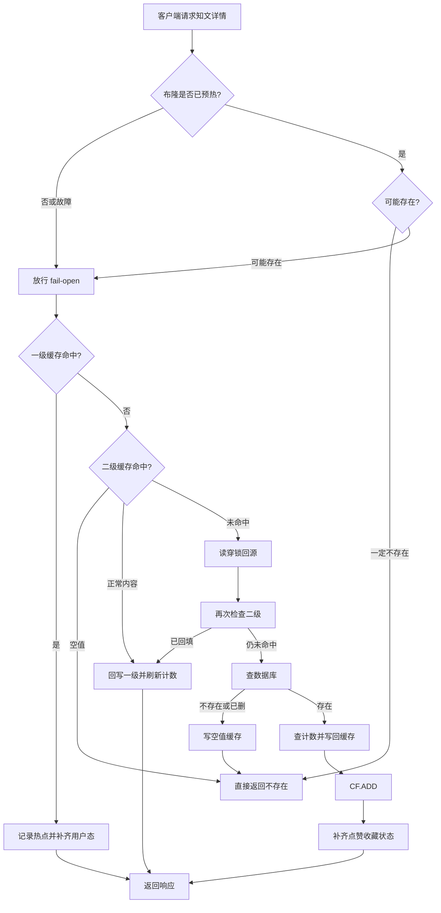

### 讲解要点

1. **CF.EXISTS 在最前**：专门拦扫号 ID，减少无效 L1/L2/DB；软删 `CF.DEL`。
2. **NULL 在 L2**：吸收误判、删除失败、模块缺失、预热未完成窗口。
3. **读穿锁**：防击穿，不是防穿透。
4. **用户态后置**：liked/faved 永不进共享缓存。
5. **冷启动 / Redis 故障 fail-open**：宁可多打一次缓存，也不误拦真实内容。

## A3. 写路径 + 失效 + 事件（中文流程图）

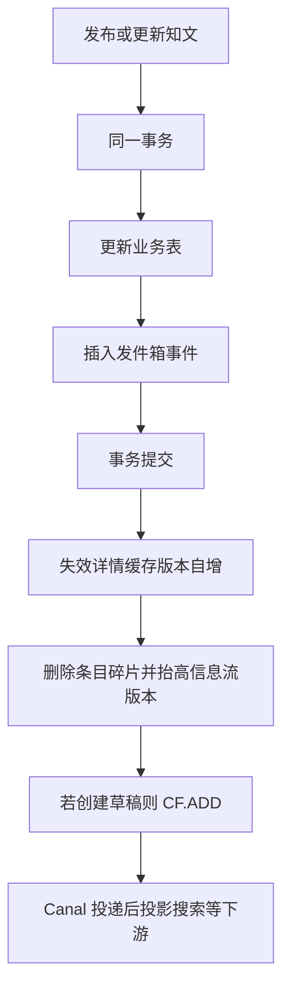

### 讲解要点

- 真值在 MySQL；缓存是 best-effort。
- outbox 与业务同事务，避免「库成功消息丢」。
- 失效靠 **版本号 INCR**，不是扫全部分页 key。
- 创建草稿就要 `CF.ADD`，否则作者马上读详情可能被拦（过滤器已预热时）。
- 软删成功后 `CF.DEL`，避免已删 ID 继续放行。

## A4. 公共 Feed 碎片组装（中文流程图）

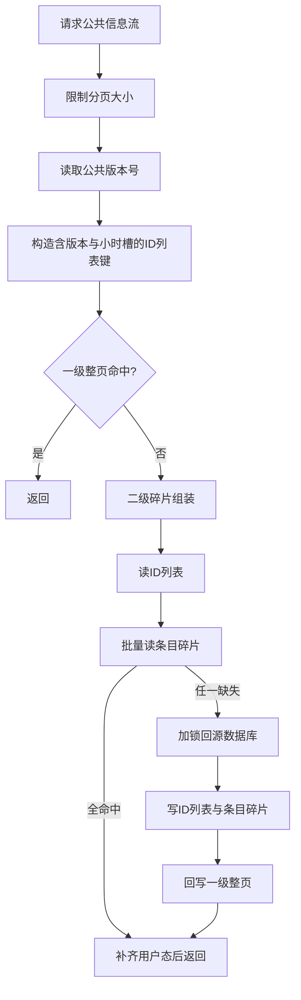

### 为什么碎片 + 版本

- 整页 JSON：一条内容更新要清很多页，易漏。
- 碎片：只删 `feed:item:{id}` + 版本自增，旧页键自然失联。
- 任一 item miss 就整页 miss：正确性优先于命中率。

## A5. 我的 Feed：写扩散优先与降级

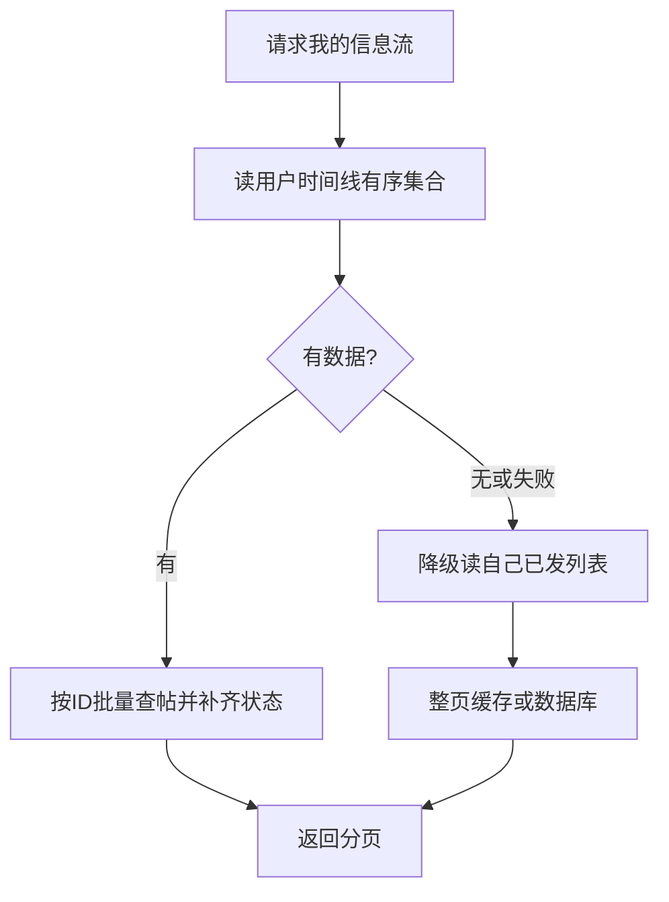

**当前工程状态（源码接线）**：

| 项 | 状态 |
|----|------|
| `FanoutService` / `FanoutConsumer` | 有实现；Kafka brokers 非空时 consumer 会启动 |
| `FanoutPublisher` | **knowpost / bootstrap 未调用**，发布不会往 `fanout` topic 灌消息 |
| Canal | 只写 `canal-outbox`，**不写** `fanout` |
| `GetMineFeed` 空 timeline | 降级 **本人已发布**，不是完整关注流读扩散 |

因此线上时间线通常为空，「我的 Feed」大量走 `GetMyPublished` 整页缓存/DB。面试必须区分「写扩散算法」与「生产闭环」。跨模块总图见 [`docs/跨模块流程图.md`](../跨模块流程图.md) §6。

## A6. 配置表（详情缓存 + Bloom）

| 配置 | 默认 | 含义 |
|------|------|------|
| `detail_cache.l1_ttl_seconds` | 60 | 一级缓存秒数 |
| `detail_cache.null_ttl_base/jitter` | 30/31 | 空值 TTL |
| `detail_cache.l2_ttl_base/jitter` | 60/31 | 二级基础 TTL |
| `detail_cache.ttl_low/medium/high` | 30/60/300 | 热点分级 |
| `detail_cache.bloom_enabled` | true | 是否开启布隆 |
| `detail_cache.bloom_expected_items` | 1000000 | 预估元素量 |
| `detail_cache.bloom_false_positive_rate` | 0.01 | 目标误判率 |
| `detail_cache.bloom_key` | cf:knowpost:ids | RedisBloom CF 键 |

## A7. 风险清单（主动讲）

1. L1 删 key 可能不带完整版本段（靠版本 miss 缓解）。
2. RedisBloom `CF.DEL` 支持删除；软删写路径调用，NULL 仍作兜底；无模块时 fail-open。
3. 私有内容若先被作者写入共享详情缓存，L1/L2 命中会绕过回源授权；这是待修复的越权缺口。
4. `GetMyPublished` SQL 实际使用 `status != deleted`，会包含草稿；接口名与查询语义不一致。
5. 写扩散未闭环时「我的 Feed」偏读库。

## A8. 60 秒口述稿

> 知文写路径事务内绑 outbox，保证搜索等异步不丢。读路径是 Bloom 前置加空值缓存叠加，再加 L1/L2 和读穿锁回源；更新用版本号让旧缓存自然失联。公共 Feed 用 ID 列表加条目碎片；我的 Feed 代码上先读 timeline，但写扩散生产端未闭环时会降级本人已发布列表。用户点赞状态绝不进共享缓存。

---

# 附录B：面试细节扩写

## B1. 知文模块到底负责什么

知文模块不是单纯的“文章 CRUD”，它同时承担四类职责：

1. **内容生命周期**：草稿、确认正文、编辑元数据、发布、置顶、可见性、软删除。
2. **内容读取**：详情页、公共 Feed、我的发布列表。
3. **缓存治理**：RedisBloom CF、NULL、L1/L2、版本化 key、读穿锁、热点 TTL。
4. **下游投影触发**：通过 outbox 触发搜索索引、Feed 扩散等派生数据更新。

面试时先说这四类职责，会比直接讲接口更完整。

## B2. API 与服务方法对照

| API | Handler 方法 | Service 方法 | 核心动作 |
|-----|--------------|---------------|----------|
| `POST /knowposts/draft` | `CreateDraft` | `CreateDraft` | 生成雪花 ID，写草稿，处理幂等键，CF.ADD |
| `PUT /knowposts/:id/content` | `ConfirmContent` | `ConfirmContent` | 保存 OSS 对象元数据，失效详情和 Feed |
| `PUT /knowposts/:id/metadata` | `UpdateMetadata` | `UpdateMetadata` | 更新标题、标签、描述，事务内写 outbox |
| `POST /knowposts/:id/publish` | `Publish` | `Publish` | 草稿转发布，事务内写 outbox |
| `PUT /knowposts/:id/top` | `UpdateTop` | `UpdateTop` | 更新置顶状态，事务内写 outbox |
| `PUT /knowposts/:id/visibility` | `UpdateVisibility` | `UpdateVisibility` | 更新可见性，事务内写 outbox |
| `DELETE /knowposts/:id` | `Delete` | `Delete` | 软删除，事务内写 outbox，CF.DEL |
| `GET /knowposts/:id` | `GetDetail` | `GetDetail` | CF.EXISTS + 多级缓存 + DB 回源 + 用户态增强 |
| `GET /knowposts/feed/public` | `GetPublicFeed` | `GetPublicFeed` | 公共 Feed 碎片缓存 |
| `GET /knowposts/feed/mine` | `GetMyPublished` | `GetMineFeed` | 时间线优先，读库降级 |

## B3. 内容状态流转图

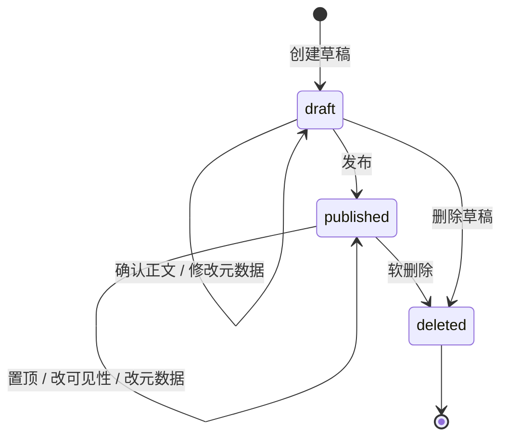

关键点：

1. `draft` 不应该进入公共 Feed 和搜索结果。
2. `published + public` 才能被匿名详情和公共 Feed 读取。
3. `deleted` 是软删除，缓存要写 NULL 或版本失效，搜索侧标记 deleted。

## B4. 写路径时序图

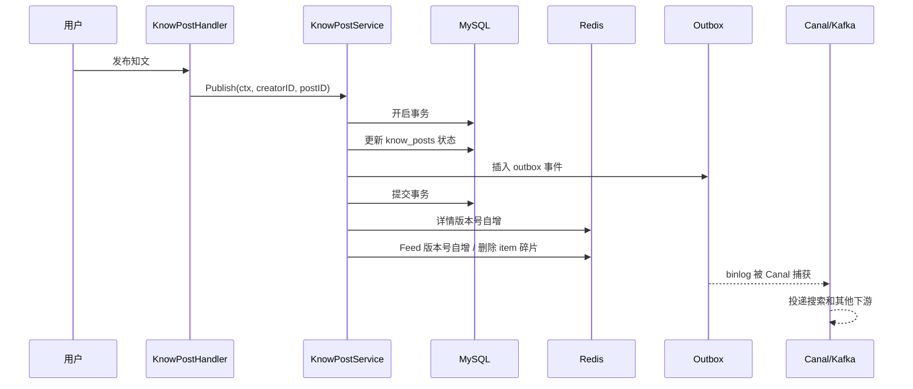

这张图可以回答“为什么你不是直接发 Kafka”的问题：写库和 outbox 在同一个事务里，避免消息和主数据不一致。

## B5. 缓存失效矩阵

| 操作 | 详情缓存 | 公共 Feed | 我的 Feed | Bloom | Outbox |
|------|----------|-----------|-----------|-------|--------|
| 创建草稿 | 无旧缓存 | 不影响 | 可能影响作者草稿读取，但不进公共流 | Add ID | 通常不需要搜索投影 |
| 确认正文 | 版本失效 / 删除旧 key | item 可能失效 | 作者列表失效 | 不变 | 可不投影或按业务投影 |
| 修改元数据 | 版本失效 | item 失效 + feed version 变化 | 作者列表失效 | 不变 | metadata updated |
| 发布 | 版本失效 | feed version 变化 | 作者列表失效 | 保持存在 | published |
| 改可见性 | 版本失效 | feed version 变化 | 作者列表失效 | 不变 | visibility updated |
| 置顶 | 版本失效 | feed version 变化 | 作者列表失效 | 不变 | top updated |
| 删除 | 版本失效 / NULL | feed version 变化 | 作者列表失效 | `CF.DEL` | deleted |

面试重点：缓存失效不是“删一个 key”这么简单，因为详情、公共 Feed、我的 Feed、搜索索引是不同读模型。

## B6. 详情缓存 key 为什么带版本

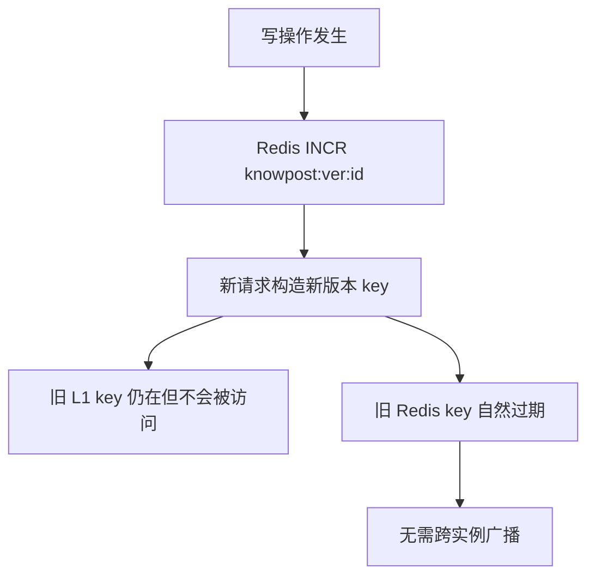

这个方案牺牲了一点 Redis 版本号查询开销，换来多实例缓存失效的确定性。面试时可以明确说：它不是最省一次网络请求的方案，但比 Pub/Sub 广播更容易保证边界。

## B7. 公共 Feed 为什么拆成 ID 列表和 item 碎片

如果用整页缓存：

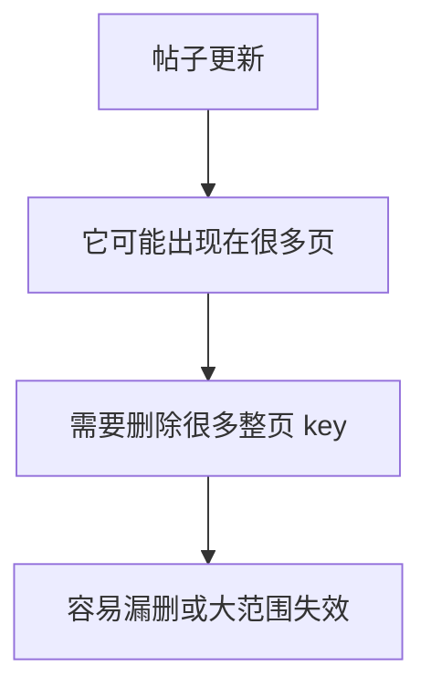

如果用碎片缓存：

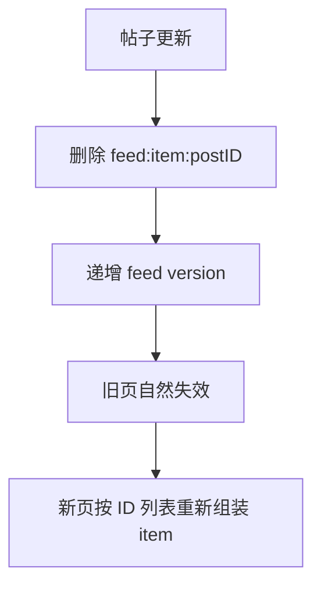

这套设计的本质是把“列表排序”和“条目内容”拆开。列表排序由 ID 列表控制，条目内容由 item 碎片控制，更新一条内容不需要知道它出现在哪些页。

## B8. 这个模块最值得主动承认的边界

1. **CF 可删除**：软删后 `CF.DEL`；模块缺失/删除失败时仍依赖 NULL / DB 状态兜底。
2. **版本号会增加一次 Redis 读**：读详情前要拿版本，但换来多实例一致性。
3. **Feed 精确失效难**：版本号是粗粒度失效，牺牲部分命中率换正确性。
4. **用户态不能进共享缓存**：liked/faved 必须后置查询，否则不同用户会互相污染。
5. **写扩散要区分设计和接线状态**：算法存在不代表生产链路完全闭环，面试要诚实。

## B9. 2 分钟展开回答

> 知文模块我会按写路径和读路径分开讲。写路径里，草稿创建支持幂等键，正文上传走 OSS 直传，业务侧只保存 object key、etag、sha256 和 size；发布、删除、置顶、可见性这些会影响下游读模型的操作，都在事务内写 outbox；软删后 CF.DEL。读路径里，详情先过 CF.EXISTS，再查 freecache 和 Redis，未命中后用 Redis 分布式锁回源 MySQL，避免击穿；不存在数据写 NULL，避免穿透。公共 Feed 用 ID 列表和 item 碎片组合，避免整页缓存大范围失效。整个模块的核心不是 CRUD，而是内容真值、缓存、搜索投影和用户态数据之间的边界。

---

## 📌 避坑指南与自测思考题

### ⚠️ 生产避坑指南（新手最易踩的坑）

1. **切忌将“用户态数据（like/fav 状态）”直接揉进共享详情缓存**：
   - 错误做法：在 `knowpost:detail:{id}` 缓存 JSON 中直接带上 `is_liked: true`。
   - 后果：用户 A 访问后生成缓存，用户 B 访问时直接命中用户 A 的点赞状态，造成严重数据串扰与安全事故！
   - 正确做法：共享缓存只保存公共内容，用户态数据在 Handler 渲染前通过 `counter` 模块实时补充。

2. **看门狗锁续约协程必须保证能自动退出**：
   - 错误做法：启动 `go watchdog()` 续约后，主协程发生 `panic` 或未执行 `defer unlock()` 导致看门狗死循环续约。
   - 后果：Redis 锁被永久占用，其它实例永远无法抢锁回源。
   - 正确做法：必须传入带有 `cancelContext` 的通道或句柄，在回源结束时 `defer cancel()` 强制释放看门狗。

### 🧐 巩固自测思考题

- **思考题 1**：如果线上的 RedisBloom 模块（`redis-stack-server`）突然宕机或者客户端报 `unknown command CF.EXISTS`，系统会瘫痪吗？
  - *提示*：不会，适配层实现了 `fail-open` 机制，错误时视作“可能存在”，自动退回 L1 -> L2 (NULL) -> L3 DB 防线。
- **思考题 2**：公共 Feed 中如果某帖子被作者删除，为什么要递增 `feed version` 而不是直接清空全站的分页缓存 key？
  - *提示*：帖子可能分布在成百上千个分页 key 中，精确清理复杂度是 $O(N)$ 且容易死锁；递增版本号让新请求自然切换新 key，旧页在 TTL 后自动被 Redis 淘汰。
