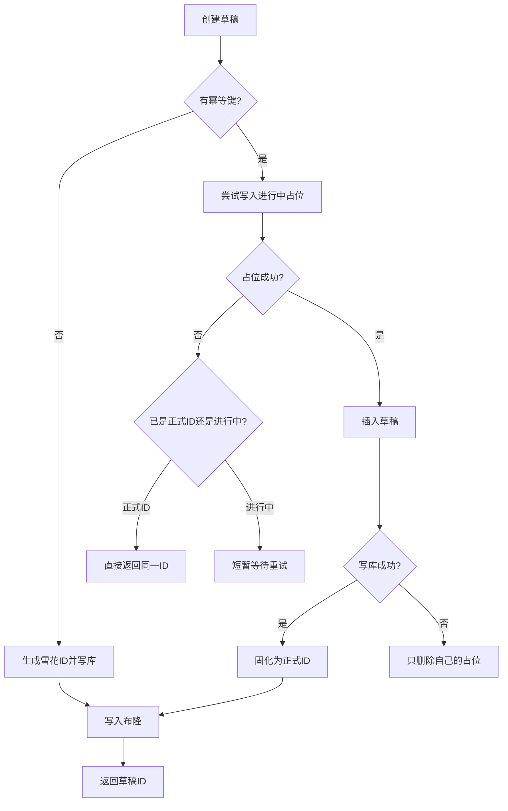
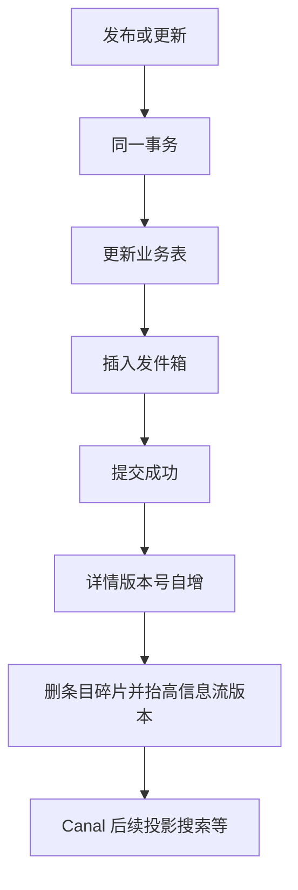
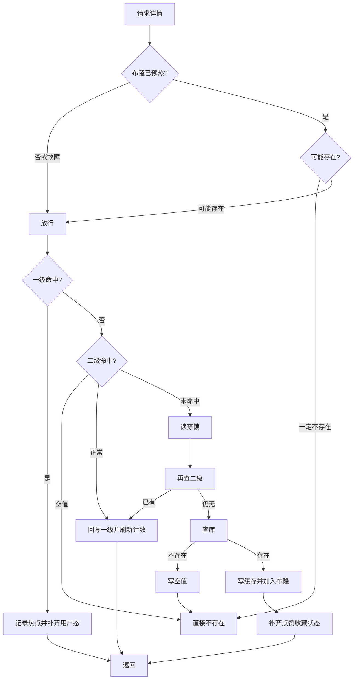
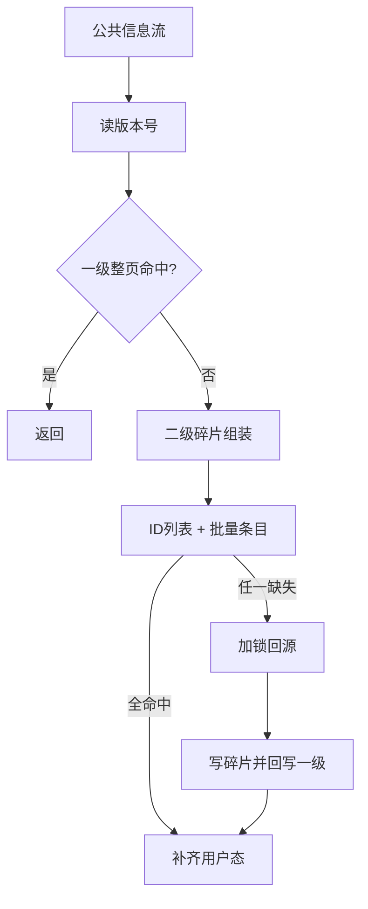

# 04. 知文内容缓存与 Feed 模块

## 1. 是什么

模块：`internal/knowpost`  
相关：`internal/cache/bloom.go`（布隆）、`internal/bootstrap/init_knowpost.go`（装配与预热）

职责：

| 能力 | 说明 |
|------|------|
| 渐进写路径 | 草稿 → 确认 OSS 内容 → 元数据 → 发布 / 置顶 / 可见性 / 软删 |
| 详情读 | 布隆 + 三级缓存 + 读穿锁 + 空值缓存 + 热点延长 |
| Feed | 公共 Feed（碎片）+ 我的 Feed（时间线优先，可降级） |
| 一致性 | 版本号失效 + 事务发件箱事件 |
| 用户态 | liked / faved / 实时计数不进共享缓存，读时 enrich |

## 2. 一句话

> 写路径：MySQL 真值 + 同事务发件箱；读路径：**布隆过滤器与空值缓存叠加** + L1/L2 + 读穿锁回源；更新用**版本号**让旧缓存自然失联。

## 3. 路由

| 方法 | 路径 | 登录 | 作用 |
|------|------|------|------|
| POST | `/api/v1/knowposts/draft` | 是 | 创建草稿（支持幂等键） |
| PUT | `/api/v1/knowposts/:id/content` | 是 | 确认内容已上传 |
| PUT | `/api/v1/knowposts/:id/metadata` | 是 | 更新元数据 |
| POST | `/api/v1/knowposts/:id/publish` | 是 | 发布 |
| PUT | `/api/v1/knowposts/:id/top` | 是 | 置顶 |
| PUT | `/api/v1/knowposts/:id/visibility` | 是 | 可见性 |
| DELETE | `/api/v1/knowposts/:id` | 是 | 软删除 |
| GET | `/api/v1/knowposts/:id` | 可选 | 详情 |
| GET | `/api/v1/knowposts/feed/public` | 可选 | 公共 Feed |
| GET | `/api/v1/knowposts/feed/mine` | 是 | 我的 Feed |

## 4. 写路径

### 4.1 创建草稿（幂等）

`write_service.go` → `CreateDraft`

1. 若带幂等键：Redis `SET NX` 占位 `pending:...`  
2. 仅占位成功者插入草稿  
3. 成功后把键固化为正式草稿 ID（TTL 5 分钟）  
4. 失败 CAS 只删自己的 pending  
5. 成功后 **Add 进布隆**（作者立刻读详情不会被误拦）



### 4.2 确认内容 / 发布 / 更新

统一思路：

1. 校验作者与状态  
2. **先写数据库**（发布等走 `runKnowPostTx`：业务 + 发件箱同事务）  
3. 事务成功后再 **失效详情版本 + Feed 版本**  



**为什么先写库再失效缓存**

- 先删缓存再写库：空窗期回源可能读到旧数据。  
- 先写库：读穿锁回源时能读到新数据，再失效让旧键失联。  
- 以代码为准：当前是**成功后的后置失效 + 版本号**，不是经典「写前后双删」。

### 4.3 权限

- 写：SQL 带 `creator_id`，affected=0 → 不存在或无权限（不泄露是否存在）。  
- 读：公开已发布全员可见；否则仅作者；已删除 → 404。

## 5. 详情读路径（核心）

### 5.1 总链路

```text
布隆（一定不存在？）→ 404
        ↓ 可能存在
L1 freecache → L2 Redis(NULL?) → 读穿锁 → MySQL
        ↓ 不存在
写 NULL + 随机 TTL（兜底）
```



### 5.2 布隆 + 空值（叠加，默认开启）

| 层 | 作用 | 实现 |
|----|------|------|
| 布隆 | 拦「从未出现过的扫号 ID」 | `RedisBloom`，键 `bloom:knowpost:ids` |
| 空值 | 兜「查过确认不存在 / 误判 / 软删位残留」 | L2 写 `"NULL"` + 随机 TTL |

维护：

- 启动：`WarmDetailBloom` 游标扫未删除 ID  
- 创建草稿 / 回源成功：`Add`  
- **空过滤器或 Redis 故障：fail-open**（不误拦真内容）  
- 经典布隆**不能可靠删除** → 软删靠 NULL  

配置（`knowpost.detail_cache`）：

| 项 | 默认 |
|----|------|
| `bloom_enabled` | true |
| `bloom_expected_items` | 1000000 |
| `bloom_false_positive_rate` | 0.01 |
| `bloom_key` | bloom:knowpost:ids |

### 5.3 三级缓存与读穿锁

| 层 | 技术 | 说明 |
|----|------|------|
| L1 | freecache + 前缀 `d:` | 进程内，约纳秒级 |
| L2 | Redis | 跨实例；含 NULL |
| L3 | MySQL | 真值；JOIN 作者 |

读穿锁：

- 键：`lock:{pageKey}`  
- TTL 约 5 秒 + 看门狗续约  
- 抢不到则 sleep 重试并重查缓存  
- 抢到后 double-check 再回源  

### 5.4 版本化缓存键

```text
knowpost:ver:{id}                          // 版本源 INCR
knowpost:detail:{id}:v1:ver{version}       // 详情 L2
```

写后 INCR 版本 → 旧键自然 miss（解决多实例 L1 残留）。

### 5.5 用户态 enrich

| 字段 | 是否进共享缓存 |
|------|----------------|
| 标题/正文/封面等 | 是 |
| like/fav 计数快照 | 可进（回源写入） |
| liked / faved | **否**，登录后实时查 counter |

## 6. Feed

### 6.1 公共 Feed（碎片 + 版本）

```text
feed:public:version
feed:public:ids:{ver}:{size}:{hour}:{page}
feed:item:{id}
```



为什么碎片：一条内容出现在很多页，整页缓存复用差、失效难；只删 item + 抬版本即可。

### 6.2 我的 Feed

1. 优先 `timeline:{userID}` 有序集合（写扩散）  
2. 空或失败 → 降级「我的已发布」整页缓存 / DB  

**落地注意**：写扩散生产端若未完整接线，会大量降级——面试要诚实说清。

### 6.3 Feed 失效

```text
DEL feed:item:{postID}
INCR feed:public:version
INCR feed:mine:version:{creatorID}
```

## 7. 代码入口

| 文件 | 关键点 |
|------|--------|
| `detail_service.go` | `GetDetail`、读穿锁、NULL、Bloom 检查 |
| `write_service.go` | 草稿幂等、发布事务 |
| `feed_service.go` | 公共/我的 Feed、失效 |
| `cache.go` | 详情版本 Lua |
| `bloom.go` | `RedisBloom` |
| `init_knowpost.go` | 装配 + 异步预热 |

## 8. 风险（主动讲）

1. 布隆不能删 → 软删依赖 NULL  
2. L1 主动 Del 可能键不完整 → 主要靠版本 miss  
3. 权限主要在回源检查；共享缓存命中路径需注意边界  
4. 我的 Feed 写扩散可能未闭环  
5. 草稿幂等依赖 Redis 5 分钟窗口  

## 9. 60 秒口述

> 知文写路径是库加同事务发件箱，保证搜索异步不丢。读路径是布隆和空值叠加防穿透，再加一级二级缓存和读穿锁防击穿；更新用版本号解决多实例旧缓存。公共 Feed 用 ID 列表加条目碎片，我的 Feed 优先时间线可降级。点赞状态绝不进共享缓存。

## 10. 面试快问

**Q：为什么布隆还要空值？**  
A：布隆拦扫号；空值兜误判、软删、冷启动 fail-open 窗口。

**Q：为什么 fail-open？**  
A：误拦真内容比多打一次缓存代价大。

**Q：Feed 为什么要版本号？**  
A：O(1) 失效所有旧页键，不用扫分页 key。

---

以源码为准。布隆配置见 `config/config.yaml` 的 `knowpost.detail_cache.bloom_*`。
