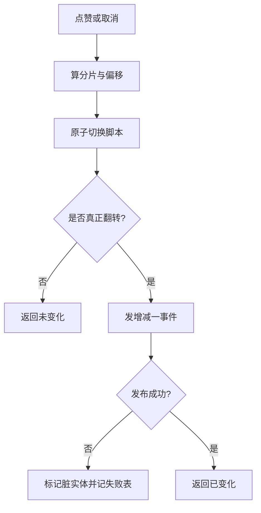
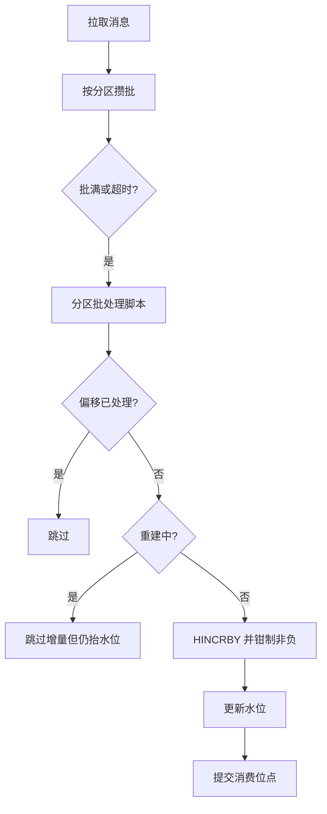
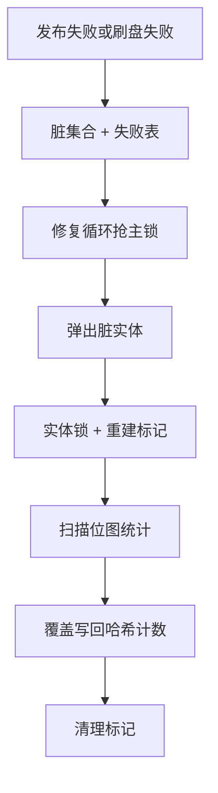
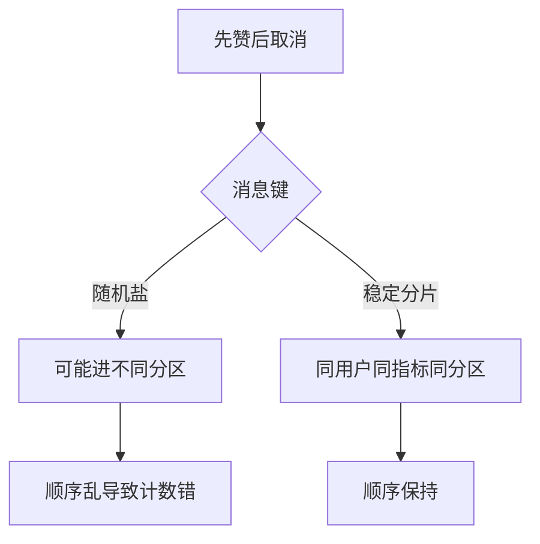

# 05. 点赞收藏计数模块

## 1. 是什么

模块：`internal/counter`

职责：点赞/取消、收藏/取消、计数查询、当前用户状态、点赞列表（部分能力）、失败补偿重建。

核心问题：互动写远高于内容发布，若每次同步改 MySQL 计数字段 → 热点行与写放大。

## 2. 一句话

> **位图记录「是否点过」（权威状态）**；只有真正翻转才发 Kafka 增量；消费者用**分区水位**幂等批量 **HINCRBY 写 Redis 哈希计数**；失败进脏集合，后台用位图 **BITCOUNT 重建绝对值**。

> 注意：键名仍叫 `SdsKey`，**当前主路径是 Redis Hash**（`HINCRBY`/`HMGET`），不是线上主写二进制 SDS。面试请讲 Hash。

## 3. 路由

| 方法 | 路径 | 登录 | 作用 |
|------|------|------|------|
| POST | `/api/v1/counter/like` | 是 | 点赞 |
| POST | `/api/v1/counter/unlike` | 是 | 取消点赞 |
| POST | `/api/v1/counter/fav` | 是 | 收藏 |
| POST | `/api/v1/counter/unfav` | 是 | 取消收藏 |
| GET | `/api/v1/counter/counts` | 否 | 查计数 |
| GET | `/api/v1/counter/status` | 是 | 查 liked/faved |
| GET | `/api/v1/counter/likers` | 是 | 点赞用户列表 |

## 4. 数据与键

### 4.1 位图（权威状态）

```text
bm:{metric}:{entityType}:{entityID}:{chunk}
chunk = userID / 65536
offset = userID % 65536
```

### 4.2 计数哈希（派生）

```text
cnt:{entityType}:{entityID}   // Hash 字段 like / fav / ...
```

### 4.3 水位与脏数据

```text
counter:applied-offset:{group}:{topic}:{partition}
repair:counter:dirty
rebuilding:{entityType}:{entityID}
```

## 5. 写路径



### 为什么用 Lua

不用 Lua：两个并发请求都读到「未赞」→ 都 SET → 都发 +1 → 计数错。  
Lua 在 Redis 单线程内完成「读 + 条件写 + 返回是否变化」。

### 发布语义

- 当前 `toggle` 内**同步** `Publish`（有超时），不是注释里的纯异步。  
- Kafka key 通常为 `entityType:entityID`，保证同实体进同分区、like/unlike 有序。

## 6. 聚合消费者



### 关键语义

| 点 | 说明 |
|----|------|
| 先 apply 再 commit | commit 失败重放时水位已过，不重复加 |
| 水位在 Redis | 跨实例共享幂等 |
| 重建中抬水位 | 防止分区卡死，代价是窗口内可能丢 delta，靠绝对值修复 |
| 坏消息 | 只推水位，不改计数 |

## 7. 失败与修复



**为什么能重建**：位图是「谁点过」；计数是派生。丢了派生，从源头重算。

## 8. 读路径

- `GetCounts`：`HMGET`，全空可触发重建（带退避/限流/锁）。  
- `GetCountsBatch`：管道读，**不一定**触发重建（语义可能不一致，面试可提）。  
- `IsLikedAndFaved`：管道 `GETBIT`，实时。

## 9. 加盐与热点

不能对 Kafka key **随机盐**：同一实体 like/unlike 乱序 + 负数钳制会算错。  
若拆热点：用**稳定分片盐**（如按 userID hash），计数按分片存、读时求和，且水位仍按分区维护。



## 10. 代码入口

| 文件 | 要点 |
|------|------|
| `bitmap_toggle.go` / `bitmap_lua.go` | 状态切换 |
| `event_publisher.go` | 发事件 |
| `consumer.go` / `consumer_watermark.go` | 批处理 + 水位 Lua |
| `sds_read.go` / `sds_rebuild.go` | 读与重建（命名历史遗留） |
| `failure.go` | 脏标记与失败表 |

## 11. 风险

1. 计数最终一致，非强一致  
2. 重建中抬水位可能丢增量  
3. repair 依赖开关与单 leader 时恢复慢  
4. 历史 SDS 注释易误导  
5. 部分辅助键（如点赞时间）可能未写全  

## 12. 60 秒口述

> 点赞用位图原子翻转状态，只有变化才发增量。消费者按分区水位幂等，批量写哈希计数。失败标记脏数据，后台用位图重算绝对值。计数是最终一致的派生数据，位图是权威源。

## 13. 面试快问

**Q：为什么不直接 MySQL +1？**  
A：热点行锁与写放大；Redis + Kafka 可水平扩展互动写。

**Q：重复消费怎么办？**  
A：分区 applied-offset 水位，offset≤水位跳过。

**Q：消息丢了怎么办？**  
A：脏集合 + 位图重建，不靠「永不丢消息」幻想。

---

以源码为准。主路径计数存储：**Hash + HINCRBY**。
