# 计数模块

## 1. 模块定位

计数模块负责的平台能力包括：

1. 点赞 / 取消点赞
2. 收藏 / 取消收藏
3. 关注数 / 粉丝数累加
4. 对外提供计数查询
5. 提供用户是否已点赞 / 已收藏查询

这是整个项目里最值得讲的模块之一，因为它同时涉及：

- 写放大控制
- Redis 数据结构设计
- MQ 异步聚合
- 补偿机制
- 重建与一致性边界

---

### 🎓 教学导学板块

> **🎯 学习目标**
> 1. 深刻理解超高并发互动场景（点赞/收藏）中**写放大 (Write Amplification)** 的根源与解决思路。
> 2. 掌握使用 **Redis Bitmap (位图)** 作为持久化状态真值、配合 **SDS Hash (快照)** 面向读路径的解耦架构。
> 3. 掌握基于 Kafka 消息队列的内存增量折叠、分区水位线 (Watermark) 幂等推进与 `dirty repairLoop` 自动修复闭环。
> 4. 掌握分区水位线与 `rebuilding:*` 标记如何配合降低重复消费和重建覆盖风险，并能区分它与尚未落地的 Epoch Fence。
> 
> **📚 前置概念预习**
> - **Bitmap (位图)**：Redis 利用字符串实现的位数组，支持 `GETBIT` / `SETBIT` / `BITCOUNT`，占用极低内存。
> - **Partition Watermark (分区水位线)**：消费端在 Redis 中记录处理过的各 Kafka 分区的最大 offset，丢弃重复重试的消息。
> - **Rebuild Marker（重建标记）**：修复协程在覆写快照前写入 `rebuilding:{entityType}:{entityID}`；消费者遇到标记时跳过该实体的增量写入，但仍推进分区水位。

---

## 2. 一句话介绍

这个计数模块把“用户状态真值”和“读优化快照”分开建模：用户是否点赞/收藏由 Redis Bitmap 维护，读路径展示用的 `cnt:*` Hash 快照通过 Kafka 增量聚合异步更新；当快照缺失或损坏时可以从 Bitmap 重建，失败时会写 MySQL 失败表并标记 dirty set。当前已实现的是分区水位幂等和 rebuild marker，**没有实现 event epoch / generation fence**，因此重建并发窗口仍是需要正视的边界。

## 3. 核心数据模型（教学拆解：真值 vs 派生快照）

> **💡 现实工程场景痛点：**
> 在千万级日活的社交社区中，如果每次点赞都去执行 `INSERT INTO likes_log` 并同步执行 `UPDATE posts SET like_count = like_count + 1`，数据库会因为高频热点行锁（Row Lock）冲突而瞬间卡死。
> 
> 反之，如果把所有点赞数据只存 Redis 计数器（如 `INCR`），一旦 Redis 发生宕机恢复或主从同步延迟，计数就会彻底错乱且**无法追溯与恢复**。
> 
> 本模块通过将**用户状态真值**与**读优化快照**物理隔离，完美解决了高吞吐、低内存与可恢复性三大指标。

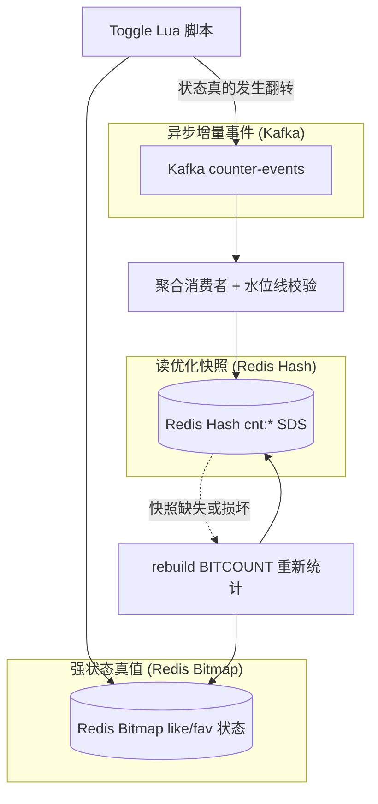

### 3.1 真值层：Bitmap（空间与性能的极致取舍）

对于 `like`（点赞）/ `fav`（收藏）这类“某用户对某内容是否进行了该操作”的状态，系统真正可靠的**用户状态真值**是 Redis 位图（Bitmap）：

- **极致省内存**：1 个用户仅占用 1 个 bit，100 万用户的点赞状态仅占 **128 KB** 内存；1 亿用户仅占 12.8 MB！
- **精准点查**：通过 `GETBIT key offset` 可以在微秒（μs）级别精准判断当前用户是否已点赞。
- **天然支持绝对值统计**：当展示用的计数快照丢失或损坏时，随时可以使用 `BITCOUNT key` 重新计算出 100% 准确的点赞总数。

### 3.2 读优化层：SDS 快照（面向读路径）

对外展示的 `cnt:*` 不是唯一真值，而是一个**面向读路径的聚合快照**。源码文件和函数名沿用 `SDS`（例如 `sds_read.go`），但当前实际存储结构是 Redis Hash，不应把它误讲成二进制字符串。

快照里使用 Redis Hash 结构打包保存了该实体的多维计数：
- `like`：点赞总数
- `fav`：收藏总数
- `follower`：粉丝总数
- `following`：关注总数
- `posts`：发文总数

**教学结论**：读路径在获取详情时，只需一次 `HGETALL` 或 `HMGET` 便可打包拿到所有计数指标，而不需要逐个计数器发起网络调用；即使该快照意外丢失，由于真值 Bitmap 完好，系统可以**随时异步重建**，不会丢数据。

### 3.3 事件层：CounterEvent（防写放大的控制枢纽）

当用户点击“点赞”按钮时，后端并不是无脑发 Kafka，而是通过一段**原子 Lua 脚本**在 Redis 内部先执行检查：
1. 检查该 bit 当前是 `0` 还是 `1`；
2. 如果本来就是 `1`（重复点击点赞），Lua 脚本直接返回 `false`，彻底拦截；
3. 只有当状态发生**真翻转**（从 `0` 变成 `1`，或从 `1` 变成 `0`）时，Lua 脚本才会返回 `true` 并写入新 bit，后端随即构造一条 `CounterEvent` 发送给 Kafka。

**教学结论**：这种“真翻转才发事件”的设计消除了重复点击导致的无意义事件；具体降幅取决于实际重复请求比例，不能脱离监控数据承诺固定百分比。

## 4. 核心流程

## 4.1 写路径：toggle

点赞 / 收藏写路径核心步骤是：

1. 根据 `userID` 算出 bitmap 分片和 bit offset
2. 调 Lua 脚本原子执行：
   - 判断 bit 是否真的变化
   - 写入 bit
3. 如果状态真的变化，构造 `CounterEvent`
4. 在请求的 `publish_timeout` 内同步等待 Kafka producer 写入；发布失败不回滚 Bitmap，而是标 dirty 并记录失败表

如果操作前后状态没有变化，比如重复点赞，直接返回 false，不产生重复事件。

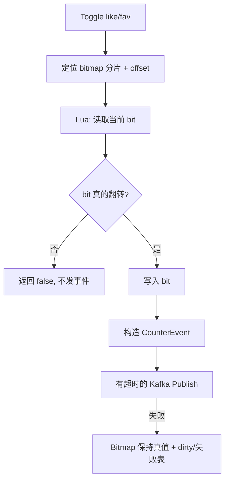

## 4.2 读路径：GetCounts

查询流程是：

1. 先读 `cnt:*` SDS 快照
2. 如果快照缺失或格式异常，则触发 rebuild
3. rebuild 从 Bitmap 做 `BITCOUNT`
4. 重新写回 SDS 快照
5. 用 `HMGET` 取请求字段并解析为整数返回

这里体现出的思想是：

**宁可让读路径偶尔触发重建，也不把每次写都做成强同步大事务。**

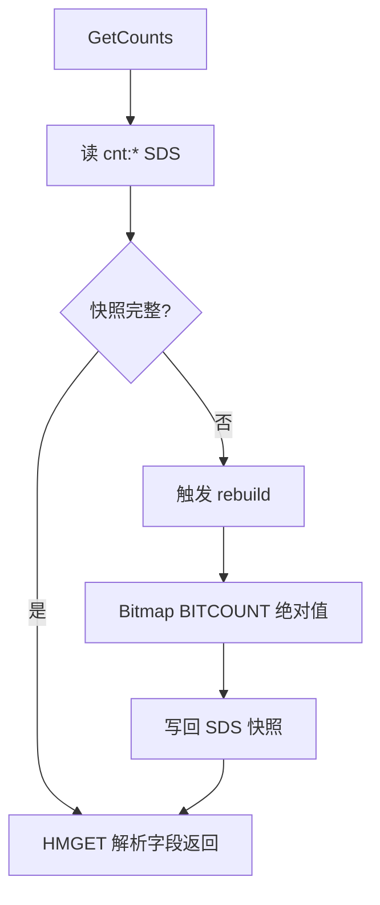

## 4.3 MQ 聚合流程

Kafka aggregation consumer 做的是：

1. 按 partition 拉消息
2. 在内存批次里折叠同实体同指标的 delta
3. 达到批量或时间窗口后 flush
4. 用 Lua 原子应用一批 delta 到 `cnt:*`
5. 在**同一段 Lua**中应用增量并推进 Redis `applied offset`
6. 脚本成功后再 commit Kafka offset

所以这个 consumer 的关键不是“消费消息”，而是：

**把 at-least-once 的 MQ 投递，压缩成对 Redis 快照的稳定批量更新。**

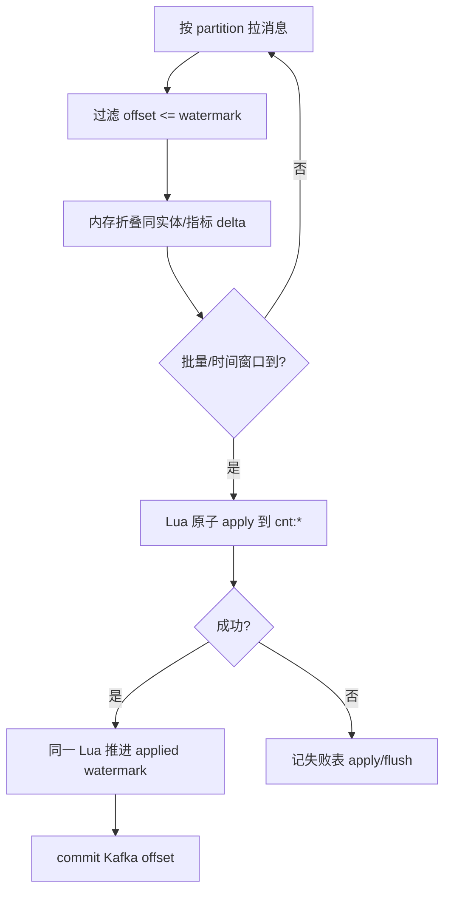

## 4.4 失败补偿流程

如果 publish、flush 出错，系统会尽量：

1. **记 MySQL 失败表**（`CounterFailedMessage`，stage 如 `publish` / `flush`）——便于排查与人工/脚本补偿  
2. **标 Redis dirty set**（`repair:counter:dirty`）——交给在线修复环  

**当前在线兜底（已挂到进程）：**  
`AggregationConsumer` 在 `repair.Enabled` 时跑 **`repairLoop`**（与消费同进程，**不是**独立 `CounterFailureWorker` Runner）：

1. 抢全局 leader 锁 `lock:counter:repair`  
2. 从 dirty set 弹出实体  
3. 从 Bitmap `BITCOUNT` 建绝对值快照  
4. 覆写 `cnt:*` SDS 并清 dirty  

**失败表重放（有代码、默认未周期挂载）：**  
`CounterService.ReplayFailedMessages` 可对 pending 失败记录做 Bitmap 重建并更新状态；`bootstrap` **未**注册周期 BackgroundRunner 去扫失败表。面试请区分：

- 已落地：dirty set + repairLoop  
- 有能力未自动跑：失败表 `ReplayFailedMessages`  

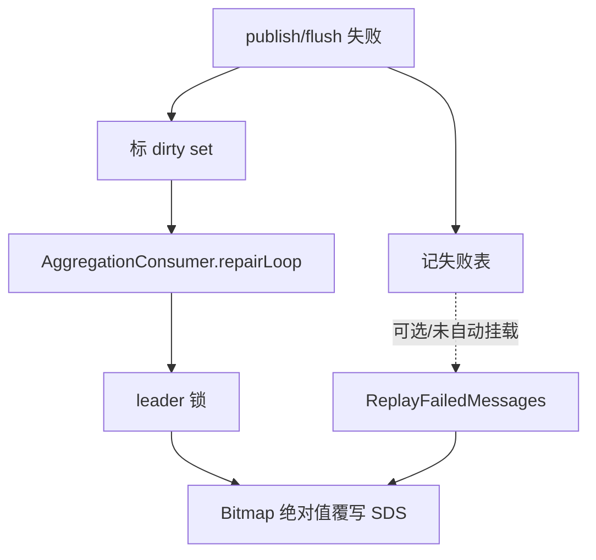

## 4.5 重建标记与水位线：已实现的保护，以及尚未收住的窗口

源码里没有 `active_epoch`、`event.epoch` 或 generation 字段；实际使用的是两层机制：

1. repairLoop 从 dirty set 取出实体，抢到单实体锁后先写 `rebuilding:{entityType}:{entityID}`；
2. Kafka 批处理 Lua 发现 marker 存在时，**不对 `cnt:*` 执行 `HINCRBY`，但照样推进该 partition 的 applied offset**；
3. repairLoop 对 Bitmap 做 `BITCOUNT`，以绝对值 `HSET` 覆写 Hash 快照，最后删除 marker。

它解决的是“修复时增量直接和绝对值并发写同一个 Hash”的大部分冲突，但不是完整的代际栅栏：若一次 toggle 发生在 `BITCOUNT` 已经统计完、marker 尚未删除的极短窗口，对应 delta 会因 marker 被跳过且 offset 已推进，重建快照又不包含这次新状态，计数可能暂时偏小。

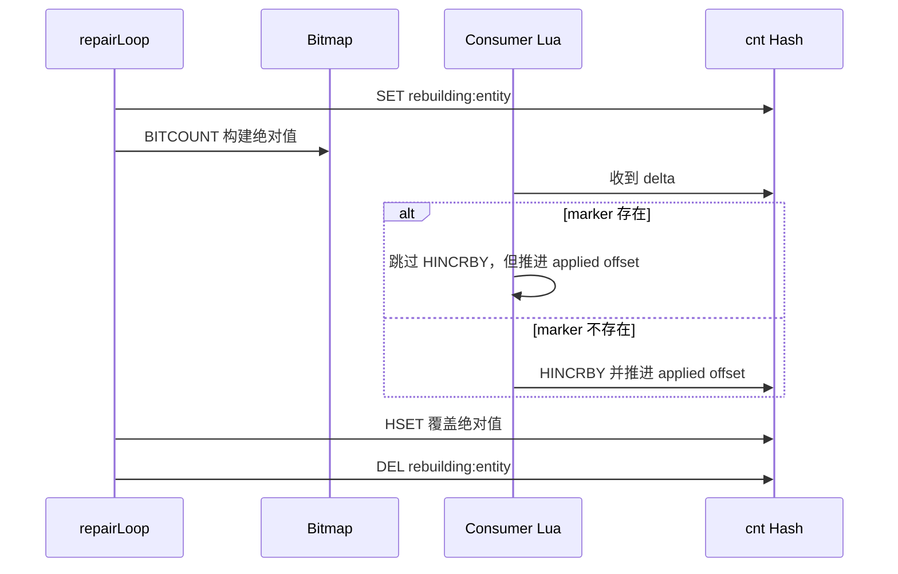

因此文档和面试表述应当是：**当前实现降低了重建覆盖风险，但还没有靠 epoch fence 完整关闭并发窗口。** 如果要彻底收口，需要为事件携带单调 generation，或在重建期间把增量写入单独的 pending log，重建完成后按顺序合并。

## 5. 设计亮点

## 5.1 真值和快照分离

这是这个模块最核心的架构思想。

如果直接把 Redis counter 当唯一真值，会有两个问题：

1. 快照一旦损坏，很难修
2. 增量重复应用会直接把状态打坏

现在的设计是：

- Bitmap 负责真值状态
- SDS 负责快读

这让系统具备了重建能力。

## 5.2 写路径只做最小原子修改

用户请求线程不去做：

- 批量计数更新
- 大量 Redis 操作
- DB 补偿

它只做：

1. 原子判定状态是否变化
2. 写 Bitmap
3. 发一条 delta

这样主链路延迟更可控。

## 5.3 批量消费折叠降低 Redis 写压力

如果每个点赞都直接写一次 `cnt:*`，在高并发下 Redis 压力会很大。  
aggregation consumer 先在内存里折叠，再批量写入，能显著减少写放大。

## 5.4 失败任务按语义分类

这里不是“一张失败表 + 全靠人工分析”，而是把失败类型结构化了：

- publish 失败：重发 delta
- apply/flush 失败：按 Bitmap 绝对修复快照

这说明补偿策略不是统一模板，而是按链路语义设计。

## 5.5 rebuild marker 把并发写隔离了一部分，但不是完整 Epoch Fence

很多系统只做到“我能重建”，但没有处理“重建和增量并发”问题。当前代码用 rebuild marker 暂停目标实体的 `HINCRBY`，这比无保护覆写快照更安全；不过它没有事件代际，也没有记录被跳过的 delta，因此不能把它表述成完整 epoch fence。

## 6. 难点与边界问题

### 6.1 Bitmap 适合 count 和 membership，不适合列表

Bitmap 很适合回答：

- 是否点赞
- 总数多少

但它不适合回答：

- 点赞用户列表
- 点赞时间排序
- 分页浏览点赞人

所以如果业务要做“查看点赞列表”，通常要单独补一套写模型。

### 6.2 MQ 异步聚合天然不是强一致

点赞后页面立即刷新，理论上可能出现：

- 状态位已经改了
- `cnt:*` 还没聚合完成

这就是典型的最终一致性窗口。  
当前设计通过读取时重建和补偿链路来降低风险，但不会伪装成强一致。

### 6.3 当前没有 epoch fence；rebuild marker 也不能当成万能模板

`like/fav` 有 Bitmap 真值，所以可以用 `BITCOUNT` 重建；`follower/following` 则由关系 outbox 消费端直接 `HINCRBY`，没有同样的 Bitmap 重建源。即使未来补 generation，也必须先确定每一类计数的真值来源和事件顺序，不能把同一套栅栏模板生搬硬套。

### 6.4 补偿链路是成本，不是免费午餐

失败表和补偿 worker 解决了可靠性问题，但也带来了：

- 额外存储成本
- 额外扫描成本
- 额外清理成本

所以它更适合高价值链路，而不是所有异步逻辑都一律套一层。

### 6.5 失败表并不重发 delta，而是按实体重建

当前 `ReplayFailedMessages` 读取 pending 失败记录后，并没有根据 `payload` 重投 Kafka；它会抢单实体锁、从 Bitmap 重建并覆写 `cnt:*`，再把失败记录更新为 `recovered` 或 `failed`。这意味着失败表是“修复索引”，不是可靠消息队列。

这个取舍适合 `like/fav`：只要 Bitmap 状态仍正确，绝对重建比重复补 delta 更稳；但它也意味着应监控 pending 记录积压，且需要后续把 `ReplayFailedMessages` 挂入受控 Runner，当前 bootstrap 并没有自动周期执行它。

### 6.6 `publish` 和 `apply/flush` 的补偿边界不能混

这个模块一个常见误区是：

**既然 Bitmap 能重建，那是不是所有失败都绝对修复就好了？**

答案是否定的，因为失败发生的位置不一样：

1. `publish` 失败
   - 问题是原始 delta 还没进入消费链路
   - 这时最自然的修复就是补发原始 delta
2. `apply/flush` 失败
   - 问题发生在快照写入阶段
   - 这时继续盲补 delta，风险反而更高

所以这个模块不是“统一修复模板”，而是：

- 链路前段失败，补原始语义
- 链路后段失败，回真值绝对修复

## 7. 面试官高频问题

### Q1：为什么不用一张 MySQL 表直接存 like_count / fav_count？

**参考回答：**

因为这个模块的核心压力在高频小写。  
如果每次点赞都同步更新 MySQL 计数列，写放大和锁竞争会很明显。  
我这里用了 Bitmap 保存用户状态真值，用 Kafka 异步聚合快照，是在用更适合高频状态更新的数据结构和异步链路来做计数。

### Q2：为什么要把 Bitmap 和快照分开？

**参考回答：**

因为它们解决的是两个不同问题。  
Bitmap 适合做 membership 和重建真值，SDS 快照适合做高性能读取。  
如果把一个结构同时拿来做真值和读优化，通常会让系统既难修又难扩展。

### Q3：为什么写路径不直接同步更新 `cnt:*`？

**参考回答：**

因为那样会把主请求链路变成“改状态 + 改多个计数 + 处理并发 + 承担失败补偿”，主路径太重。  
当前设计把主路径压缩到“Bitmap 原子变更 + 发 delta”，再让消费端批量聚合，这样延迟和吞吐都更好。

### Q4：当前如何避免 Kafka 重放把计数重复加？

**参考回答：**

消费者按 `consumer group + topic + partition` 在 Redis 保存 `applied offset`。批处理 Lua 只有在 offset 大于当前水位时才执行 `HINCRBY`，并在同一个原子脚本里更新水位；随后才提交 Kafka offset。这样即使“Redis 已 apply、Kafka commit 失败”导致消息重放，也会因为 offset 已处理而被跳过。

但这只解决重复消费，不等于完整解决 rebuild 并发。当前 rebuild marker 只能降低覆写冲突；若要彻底关闭窗口，需要补 epoch/generation 或 pending-delta 方案。

### Q5：发布失败和 apply/flush 失败，当前分别怎么收敛？

**参考回答：**

两者都会先把实体加入 dirty set；publish 失败还会记录一条 `stage=publish` 的失败表记录，flush 重试耗尽则记录 `stage=flush`。当前已接线的 repairLoop 不区分这两个 stage，而是统一按 Bitmap 真值覆写 `cnt:*`；`ReplayFailedMessages` 也是重建快照，**不会自动重发原始 Kafka delta**。

这是以“恢复展示快照正确性”为优先的实现。若未来必须保证事件也被下游保留，再为 publish 阶段设计独立的可重投 outbox / retry topic，而不能把失败表误认为已经具备可靠重投能力。

### Q6：失败表里的记录会怎样被处理？

**参考回答：**

当前代码把它当“需要重建的实体索引”：读取 pending 后从 Bitmap 覆写 `cnt:*`，成功将记录改为 `recovered`，失败改为 `failed` 并增加 retry_count。它不会自动重投原始 delta，而且这个方法尚未注册成周期 Runner，所以生产上要补调度、积压监控和失败告警。

## 8. 场景题

### 场景题 1：如果要做“查看点赞列表”，你怎么设计？

**推荐回答：**

我不会只用现有 Bitmap。  
因为 Bitmap 只能回答某人是否点赞和总数，不支持按时间列出点赞用户。  
如果要做点赞列表，我会新增一套明细模型：

1. MySQL 点赞明细表做审计和分页基线
2. Redis ZSet 做热点内容点赞用户列表缓存
3. score 用点赞时间
4. 计数仍可复用当前 counter 模块

这样“状态 / 计数 / 列表”三种需求由三套最合适的读模型解决。

### 场景题 2：如果要增加“浏览量”计数，你会直接复用这套设计吗？

**推荐回答：**

不会完全照搬。  
浏览量和点赞不一样，浏览通常是高频、允许一定重复、也未必需要用户级强状态真值。  
所以浏览量更适合：

1. 本地缓冲
2. 批量上报
3. 近实时聚合

而不是强行给每个 view 做 Bitmap membership。

### 场景题 3：如果 Redis 快照经常损坏，下一步你会优化哪里？

**推荐回答：**

我会先区分问题在哪一层：

1. 是事件重复 / 乱序导致污染
2. 是 flush/apply 失败过多
3. 是 rebuild 太频繁
4. 是某些计数根本缺少稳定真值

如果是 `like/fav`，说明 rebuild marker 的并发窗口、失败补偿或消费积压还要继续加强；
如果是 `follower/following`，可能是这套设计本身就缺少像 Bitmap 那样的强真值支撑。

## 9. 最容易讲错的地方

### 9.1 不要把它讲成“简单的 Redis 计数器”

它不是单纯的 `INCR`。  
它背后有：

- Bitmap 真值
- SDS 快照
- MQ 聚合
- 失败补偿
- rebuild
- 分区水位与 rebuild marker

### 9.2 不要回避最终一致性

这个模块不是强一致事务系统。  
更成熟的说法应该是：

**我知道它存在最终一致性窗口，也设计了重建、补偿和水位幂等来收口；rebuild 并发窗口仍需继续演进。**

## 10. 继续深挖时你可以怎么答

### 10.1 如果面试官继续问：为什么不用简单的 `INCR` / `DECR`？

你可以这样答：

> 如果只是做一个非常轻量的总数缓存，`INCR` 当然可以。  
> 但这个模块不只要总数，还要回答“某用户是否点赞/收藏”，以及在快照损坏时还能重建。  
> `INCR` 只能给我快照，给不了我真值状态；Bitmap 才能回答 membership，而且还能通过 `BITCOUNT` 反向重建总数。  
> 所以我不是为了复杂而复杂，而是因为需求本身已经超过了简单计数器的能力边界。

### 10.2 如果面试官继续问：为什么 `like/fav` 能重建，`follower/following` 不能直接套同一套？

你可以这样答：

> 因为 `like/fav` 有清晰的 Bitmap 真值，能用 `BITCOUNT` 构建绝对快照。
> `follower/following` 的真值在关系双表，当前只是 outbox consumer 直接更新 `cnt:user:*`，没有等价的 Bitmap 分片。
> 所以不能看到一个重建模板就全套上去；要先明确真值来源、事件顺序和恢复成本，再决定是否引入 generation 或补偿日志。

### 10.3 如果面试官继续问：失败表会不会自动把 delta 重发到 Kafka？

你可以这样答：

> 当前不会。失败表记录的是需要修复的实体和失败上下文，已接线的 dirty repairLoop 会回到 Bitmap 重新计算绝对值并覆盖快照。
> 这对 like/fav 的展示计数足够稳，因为 Bitmap 是真值；但它不等价于可靠事件投递。
> 如果业务将来需要让发布失败的事件被其它下游再次消费，需要单独补可重投的 outbox 或 retry topic，并设计好幂等键。

### 10.4 如果面试官继续问：这个模块最脆弱的地方在哪里？

你可以这样答：

> 我认为最脆弱的不是 Lua 脚本，而是“真值和快照之间的桥”。  
> 也就是 MQ 聚合、失败补偿、rebuild、分区水位和 rebuild marker 这些连接层。
> 因为这部分一旦设计不清楚，就会出现：状态是对的，但快照脏了；或者重建窗口内的 delta 被跳过。
> 所以我在这个模块里最重视的不是单次写成功，而是链路整体可恢复。

### 10.5 如果面试官继续问：如果要支持“谁赞了我”通知，这套计数还能不能复用？

你可以这样答：

> 计数链路本身可以继续复用总数和状态判断，但通知是另一类读模型。  
> 通知更关心的是事件明细和时间顺序，而不是最终累计值。  
> 所以我会把“计数”和“通知”拆开：  
> 计数继续走当前链路，通知另外维护明细事件或收件箱模型。

### 10.6 如果面试官继续追：失败表是不是能替代 dirty repairLoop？

你可以这样答：

> 不能替代。dirty repairLoop 是当前已接线的在线修复主路径：它抢 leader、从 dirty set 取实体、按 Bitmap 覆写快照。失败表是辅助审计与补偿入口，`ReplayFailedMessages` 有代码但没有自动调度。两者都只是在修派生快照；要把 rebuild 并发窗口完全收住，还需要 generation 或 pending-delta 设计。

---

# 附录A：工程级扩写（对照源码）

## A1. 代码地图

| 文件 | 职责 |
|------|------|
| `bitmap_toggle.go` / `bitmap_lua.go` | 状态原子切换 |
| `event_publisher.go` | 发 Kafka 增量 |
| `consumer.go` / `consumer_watermark.go` | 批处理 + 水位幂等 |
| `sds_rebuild.go` / `failure.go` | 脏数据修复 |
| `sds_read.go` | 读计数 |

## A2. 点赞写路径（中文流程图）

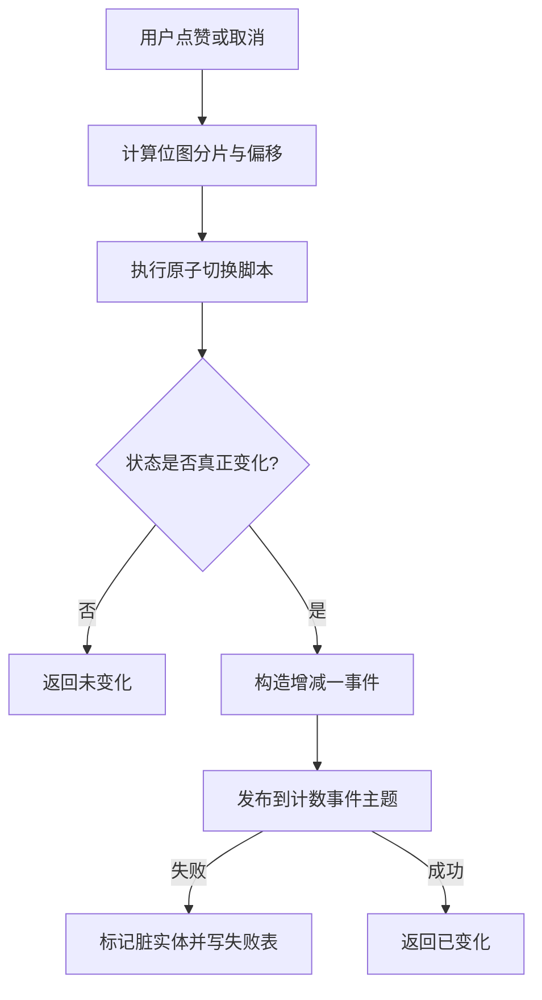

### 为什么必须用 Lua

并发两次「读未赞 → 写已赞 → 发 +1」会把计数打成 2。  
Lua 在 Redis 单线程内完成读改判，只有真正翻转才发事件。

## A3. 消费者水位幂等（中文流程图）

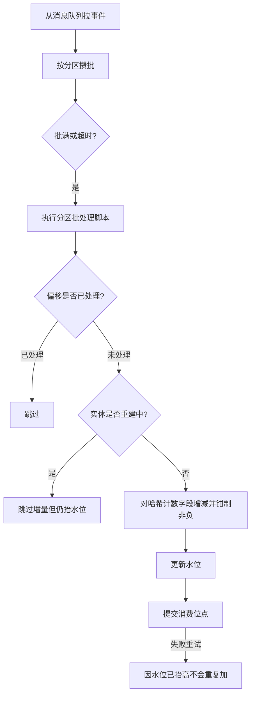

### 讲解要点

- 水位在 Redis：跨实例共享，解决重复消费。
- 先 apply 再 commit：commit 失败重放也不会重复加。
- 重建中跳过增量但仍抬水位：依赖绝对值修复，窗口内可能丢 delta（要讲清代价）。

## A4. 失败修复（中文流程图）

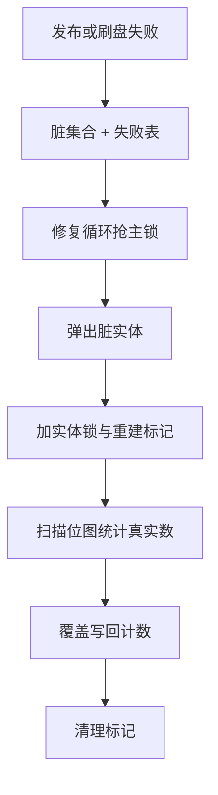

### 为什么 Bitmap 可重建

Bitmap 是「是否点过」的权威源；计数是派生快照。丢了派生，从源重算即可。

## A5. 随机盐为什么危险

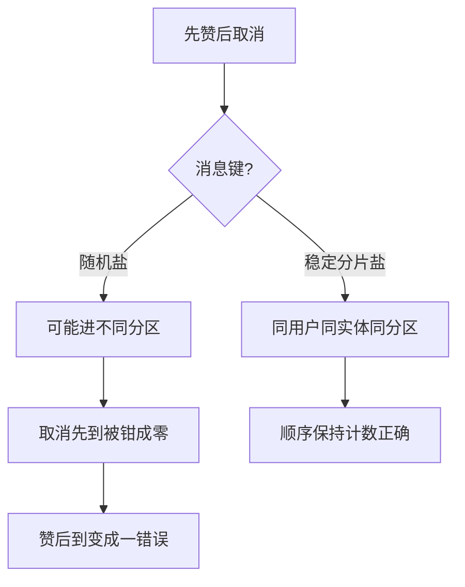

## A6. 60 秒口述

> 点赞用位图原子翻转状态，只有变化才发增量。消费者按分区水位幂等批量写哈希计数。失败进脏集合，后台用位图绝对值重建。计数最终一致，位图是权威源。

---

# 附录B：面试细节扩写

## B1. 计数模块解决的不是一个数字问题

点赞收藏看起来只是 `+1/-1`，但真实问题至少有五个：

1. **状态问题**：某个用户到底有没有点赞。
2. **总数问题**：某个实体当前有多少点赞。
3. **并发问题**：同一个用户重复点击、快速取消、多个请求并发。
4. **消息问题**：Kafka 重复投递、提交失败、乱序风险。
5. **修复问题**：如果快照脏了，如何从真值恢复。

因此本模块拆成两层：Bitmap 保存用户状态真值，SDS/Hash 保存展示用计数快照。

## B2. Redis 数据结构地图

| Redis Key | 类型 | 含义 | 是否真值 |
|-----------|------|------|----------|
| `bm:{metric}:{entityType}:{entityID}:{chunk}` | Bitmap/String | 用户点赞或收藏状态 | 是 |
| `cnt:{entityType}:{entityID}` | Hash | like/fav 等聚合计数快照 | 否 |
| `counter:applied-offset:{group}:{topic}:{partition}` | String | 消费者已应用 offset 水位 | 幂等控制 |
| `repair:counter:dirty` | Set | 需要修复的实体集合 | 修复任务 |
| `lock:counter:repair` | String | repair leader 锁 | 并发控制 |
| `lock:sds-rebuild:{entityType}:{entityID}` | String | 单实体重建锁 | 并发控制 |
| `rebuilding:{entityType}:{entityID}` | String | 重建标记 | 避免与绝对值覆写直接并发写；不是完整 epoch fence |
| `likers_cache:{entityType}:{entityID}:{metric}` | ZSet | 点赞人列表扫描缓存 | 读优化 |

面试关键：不要把 `cnt:*` 说成真值。它是为了读快的快照，错了可以从 Bitmap 重建。

## B3. 为什么不用简单 Redis INCR

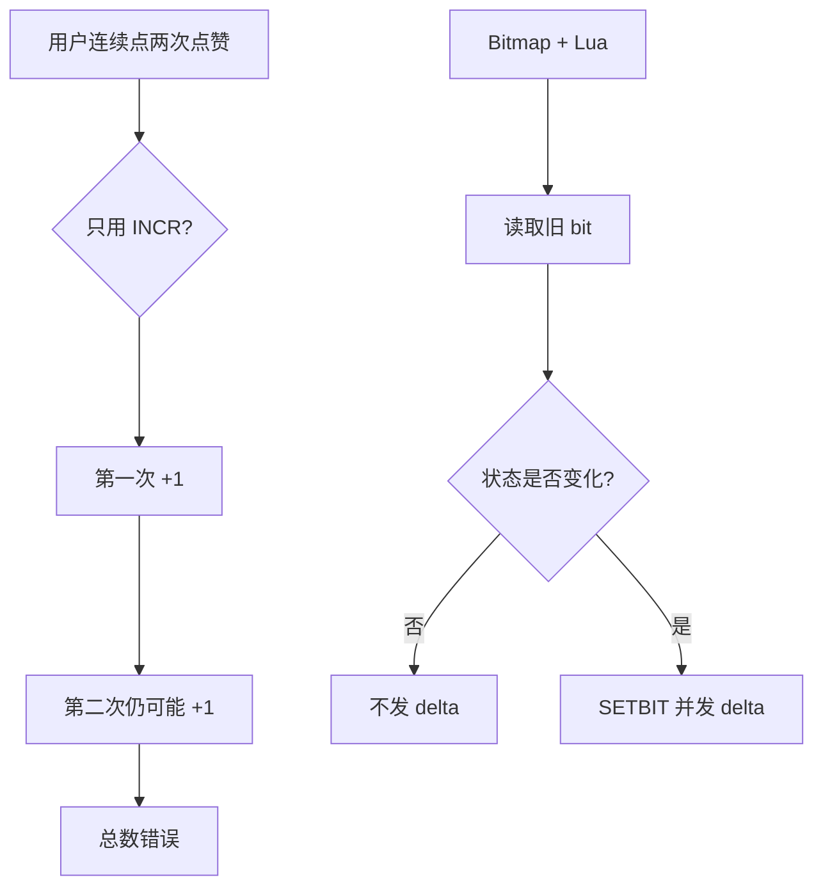

`INCR` 只能表达“数字变化”，不能表达“状态是否真的变化”。点赞的本质是状态开关，不是单纯计数器。

## B4. 正常链路时序图

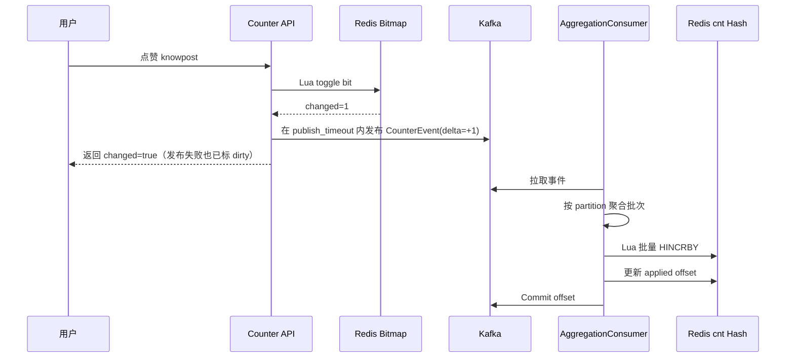

这里是“先 apply 再 commit”。如果 commit 失败导致 Kafka 重放，Redis 水位会让同一 offset 不再重复加。

## B5. 异常和修复链路

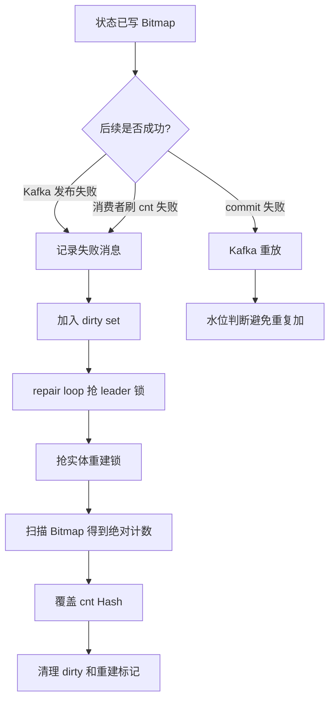

这条链路回答“消息丢了怎么办”：状态已经在 Bitmap 里，丢的是派生增量，最终可以从 Bitmap 重算。

## B6. 水位幂等为什么要按 partition

Kafka 的顺序保证是 partition 级别的，不是 topic 全局级别。因此水位也必须按 partition 记录：

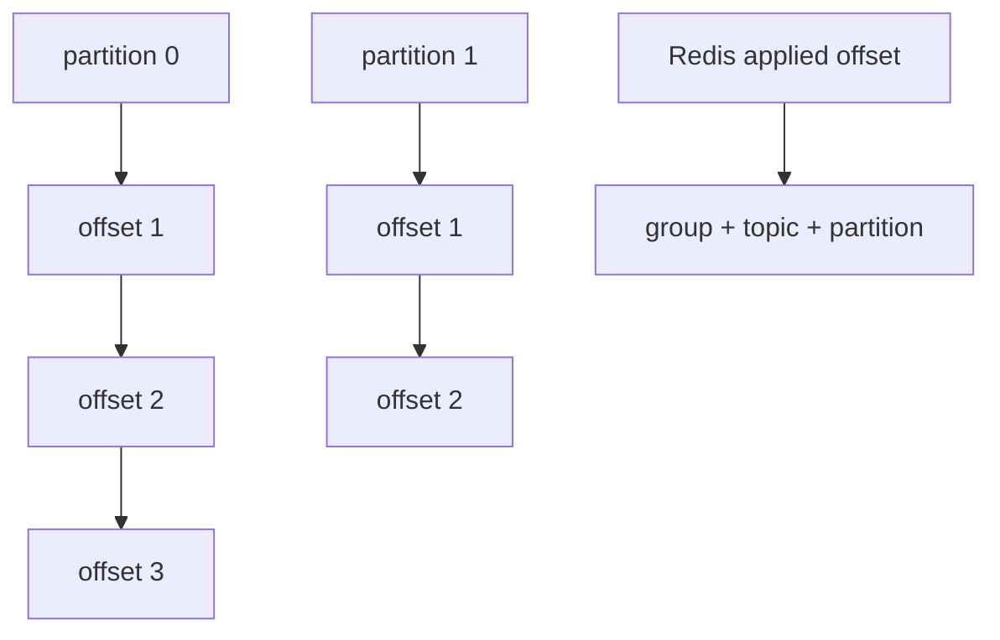

如果只保存一个全局 offset，不同 partition 的 offset 会互相覆盖，既不能判断重复，也不能判断空洞。

## B7. Rebuild 为什么需要标记

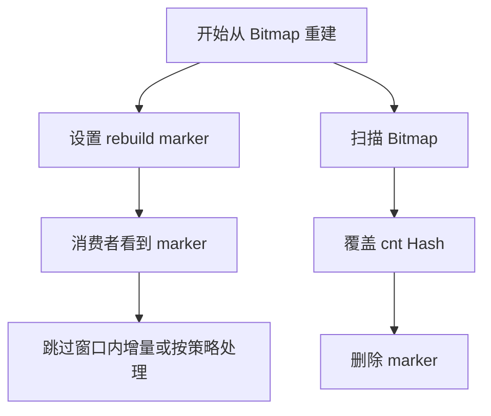

核心问题是：重建时你正在写一个“绝对值”，同时消费者可能正在写“增量”。当前 marker 使消费者跳过窗口内的 HINCRBY，但也会推进水位；因此它降低并发覆写风险，却仍可能漏掉 BITCOUNT 之后发生的增量，不能夸大为完整 fence。

## B8. 点赞人列表怎么讲

本项目的点赞人列表不是单独建 MySQL 明细表，而是从 Bitmap 扫描，并用 ZSet 做短期缓存：

1. 先查 `likers_cache:*`。
2. 命中则按 user_id 游标返回。
3. 未命中则扫描 Bitmap 分片。
4. 扫到的用户 ID 写回 ZSet 缓存。

这个方案适合面试里主动说明边界：如果要做强产品化的点赞明细、通知、时间排序和删除审计，应该额外维护事件明细表或收件箱模型，而不是只靠 Bitmap。

## B9. 失败场景对照表

| 失败点 | 现象 | 当前处理 | 面试怎么讲 |
|--------|------|----------|------------|
| Lua toggle 失败 | 状态没变化 | 返回错误 | 主状态都没写，不能假成功 |
| Kafka 发布失败 | Bitmap 已变，cnt 不会自动更新 | 记录失败并 dirty | 从 Bitmap 修复快照 |
| 消费者 apply 失败 | cnt 未更新 | 重试，耗尽后 dirty | repair 兜底 |
| apply 成功 commit 失败 | Kafka 可能重放 | Redis 水位跳过重复 | 至少一次 + 幂等 |
| 坏消息解析失败 | partition 可能卡住 | 推进水位并 commit | 坏消息不能阻塞后续 |
| rebuild 期间消息到达 | 可能与绝对值覆写冲突，或因跳过增量产生暂时偏小 | rebuild marker + applied offset | 已降低风险，未完整关闭窗口 |

## B10. 2 分钟展开回答

> 计数模块我没有用简单 INCR，因为点赞收藏首先是用户状态，不是数字。我的设计是 Bitmap 保存用户是否点赞或收藏，Lua 在 Redis 内原子判断和翻转，只有状态真的变化才发 Kafka delta。读总数不直接 BITCOUNT，因为每次扫 Bitmap 成本高，所以维护 `cnt:*` SDS/Hash 快照。消费者按 Kafka partition 攒批，用 Redis 水位保证重复消费不重复加。如果 publish/flush 失败，会记失败表并标 dirty set；**在线修复挂在 AggregationConsumer 的 repairLoop 里**（不是独立 FailureWorker 进程），抢 leader 锁后按 Bitmap 绝对值覆盖快照。另外 following/follower 是 relation 消费端直接 HIncrBy，不走 counter-events。核心是：状态真值和展示快照分离，快照可以最终一致，但必须能恢复。

---

## 📌 避坑指南与自测思考题

### ⚠️ 生产避坑指南（新手最易踩的坑）

1. **切忌使用 `INCRBY` 直接对展示快照做无防护更新**：
   - 错误做法：每次用户点赞直接执行 `INCRBY cnt:post:101:like 1`。
   - 后果：网络重试或重复消费时会导致点赞数变成 2，且用户取消点赞后出现负数（如 `-5`）；一旦 Redis 数据丢失或损坏，无法从任何地方恢复绝对值！
   - 正确做法：只将 Bitmap 作为真值，增量事件只包含 `delta: +1/-1`，并且带上 `partition watermark` 防止重复消费。

2. **不要把 rebuild marker 误说成已完成的 Epoch Fence**：
   - 当前做法：repair 期间写 `rebuilding:*`，消费者跳过该实体的 `HINCRBY` 但仍推进 partition 水位。
   - 收益：避免增量直接和 `HSET` 绝对值覆写并发写同一个快照。
   - 剩余风险：若 toggle 晚于 BITCOUNT、早于 marker 删除，其 delta 已被跳过而重建快照又未包含它，计数会偏小。
   - 后续正确做法：为事件加入 generation 并在重建时切代，或持久化重建窗口内的 pending delta，重建结束后按序合并。

### 🧐 巩固自测思考题

- **思考题 1**：如果某个热门知文的点赞 Bitmap 占用了 128KB 内存，在后台修复协程中执行 `BITCOUNT` 会把 Redis 单线程卡住吗？
  - *提示*：不会。Redis 对 128KB 位图执行 `BITCOUNT` 仅需几微秒（μs），CPU 指令集支持 POPCNT。
- **思考题 2**：为什么关注数和粉丝数（following/follower）的更新不走 `counter-events` 队列？
  - *提示*：关系模块在 `relation.OutboxConsumer` 处理关系变更时，直接在同一个消费点同步执行了 `HIncrBy` SDS。因为关系事务本身走 Outbox 保证，无需经过二重 MQ 聚合。
