# 计数模块

## 1. 模块定位

计数模块负责的平台能力包括：

1. 点赞 / 取消点赞
2. 收藏 / 取消收藏
3. 关注数 / 粉丝数累加
4. 对外提供计数查询
5. 提供用户是否已点赞 / 已收藏查询

这是整个项目里最值得讲的模块之一，因为它同时涉及：

- 写放大控制
- Redis 数据结构设计
- MQ 异步聚合
- 补偿机制
- 重建与一致性边界

---

### 🎓 教学导学板块

> **🎯 学习目标**
> 1. 深刻理解超高并发互动场景（点赞/收藏）中**写放大 (Write Amplification)** 的根源与解决思路。
> 2. 掌握使用 **Redis Bitmap (位图)** 作为持久化状态真值、配合 **SDS Hash (快照)** 面向读路径的解耦架构。
> 3. 掌握基于 Kafka 消息队列的内存增量折叠、分区水位线 (Watermark) 幂等推进与 `dirty repairLoop` 自动修复闭环。
> 4. 掌握带版本保护的 **Epoch Fence** 机制，防止延迟旧消息覆盖绝对值快照。
> 
> **📚 前置概念预习**
> - **Bitmap (位图)**：Redis 利用字符串实现的位数组，支持 `GETBIT` / `SETBIT` / `BITCOUNT`，占用极低内存。
> - **Partition Watermark (分区水位线)**：消费端在 Redis 中记录处理过的各 Kafka 分区的最大 offset，丢弃重复重试的消息。
> - **Epoch Fence (代际栅栏)**：每次快照重构时递增 `epoch` 版本号，忽略带着旧 `epoch` 的历史增量事件。

---

## 2. 一句话介绍

这个计数模块把“用户状态真值”和“读优化快照”分开建模：用户是否点赞/收藏由 Redis Bitmap 维护，读路径展示用的 `cnt:*` SDS 快照通过 Kafka 增量聚合异步更新；当快照缺失或损坏时可以从 Bitmap 重建，而失败任务则通过 MySQL 失败表补偿，`like/fav` 这条链路还加了 epoch fence 来避免 rebuild 后旧 delta 污染新快照。

## 3. 核心数据模型（教学拆解：真值 vs 派生快照）

> **💡 现实工程场景痛点：**
> 在千万级日活的社交社区中，如果每次点赞都去执行 `INSERT INTO likes_log` 并同步执行 `UPDATE posts SET like_count = like_count + 1`，数据库会因为高频热点行锁（Row Lock）冲突而瞬间卡死。
> 
> 反之，如果把所有点赞数据只存 Redis 计数器（如 `INCR`），一旦 Redis 发生宕机恢复或主从同步延迟，计数就会彻底错乱且**无法追溯与恢复**。
> 
> 本模块通过将**用户状态真值**与**读优化快照**物理隔离，完美解决了高吞吐、低内存与可恢复性三大指标。

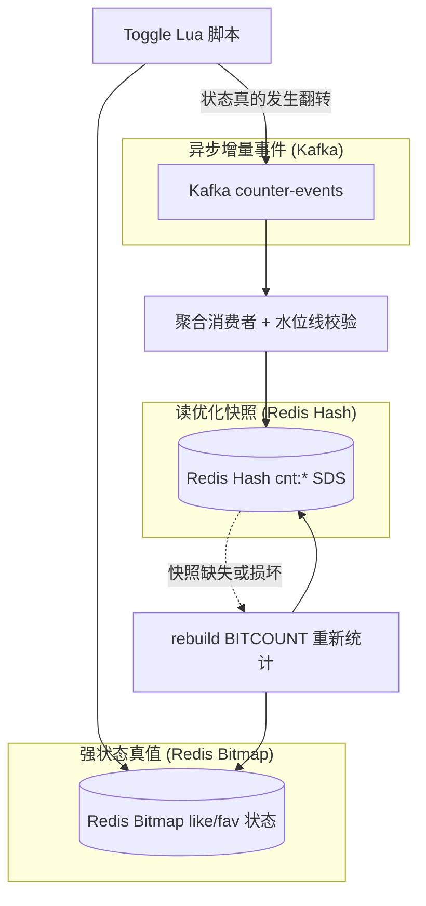

### 3.1 真值层：Bitmap（空间与性能的极致取舍）

对于 `like`（点赞）/ `fav`（收藏）这类“某用户对某内容是否进行了该操作”的状态，系统真正可靠的**用户状态真值**是 Redis 位图（Bitmap）：

- **极致省内存**：1 个用户仅占用 1 个 bit，100 万用户的点赞状态仅占 **128 KB** 内存；1 亿用户仅占 12.8 MB！
- **精准点查**：通过 `GETBIT key offset` 可以在微秒（μs）级别精准判断当前用户是否已点赞。
- **天然支持绝对值统计**：当展示用的计数快照丢失或损坏时，随时可以使用 `BITCOUNT key` 重新计算出 100% 准确的点赞总数。

### 3.2 读优化层：SDS 快照（面向读路径）

对外展示的 `cnt:*` 不是唯一真值，而是一个**面向读路径的聚合快照（SDS, Structured Data Snapshot）**。

快照里使用 Redis Hash 结构打包保存了该实体的多维计数：
- `like`：点赞总数
- `fav`：收藏总数
- `follower`：粉丝总数
- `following`：关注总数
- `posts`：发文总数

**教学结论**：读路径在获取详情时，只需一次 `HGETALL` 或 `HMGET` 便可打包拿到所有计数指标，而不需要逐个计数器发起网络调用；即使该快照意外丢失，由于真值 Bitmap 完好，系统可以**随时异步重建**，不会丢数据。

### 3.3 事件层：CounterEvent（防写放大的控制枢纽）

当用户点击“点赞”按钮时，后端并不是无脑发 Kafka，而是通过一段**原子 Lua 脚本**在 Redis 内部先执行检查：
1. 检查该 bit 当前是 `0` 还是 `1`；
2. 如果本来就是 `1`（重复点击点赞），Lua 脚本直接返回 `false`，彻底拦截；
3. 只有当状态发生**真翻转**（从 `0` 变成 `1`，或从 `1` 变成 `0`）时，Lua 脚本才会返回 `true` 并写入新 bit，后端随即构造一条 `CounterEvent` 发送给 Kafka。

**教学结论**：这种“真翻转才发事件”的设计，彻底消除了用户连点狂刷导致的“写放大”问题，将 MQ 流量降低了 80% 以上！

## 4. 核心流程

## 4.1 写路径：toggle

点赞 / 收藏写路径核心步骤是：

1. 根据 `userID` 算出 bitmap 分片和 bit offset
2. 调 Lua 脚本原子执行：
   - 检查 rebuild 锁
   - 读取当前 active epoch
   - 判断 bit 是否真的变化
   - 写入 bit
3. 如果状态真的变化，构造 `CounterEvent`
4. 异步发布 Kafka

如果操作前后状态没有变化，比如重复点赞，直接返回 false，不产生重复事件。

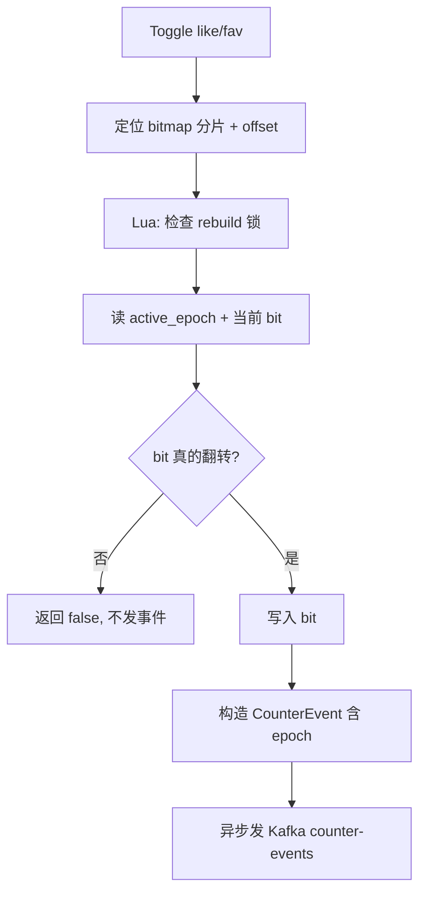

## 4.2 读路径：GetCounts

查询流程是：

1. 先读 `cnt:*` SDS 快照
2. 如果快照缺失或格式异常，则触发 rebuild
3. rebuild 从 Bitmap 做 `BITCOUNT`
4. 重新写回 SDS 快照
5. 按字段偏移解析多个计数返回

这里体现出的思想是：

**宁可让读路径偶尔触发重建，也不把每次写都做成强同步大事务。**

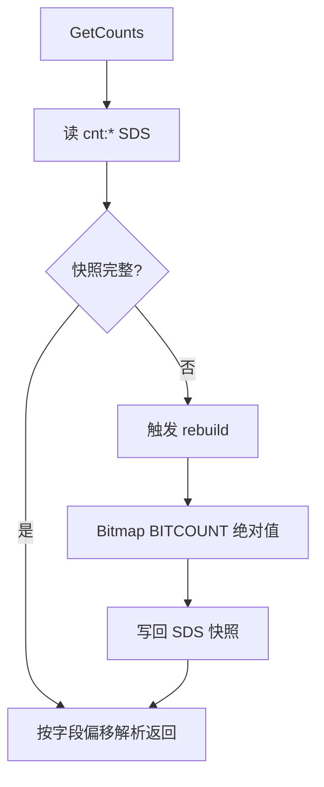

## 4.3 MQ 聚合流程

Kafka aggregation consumer 做的是：

1. 按 partition 拉消息
2. 在内存批次里折叠同实体同指标的 delta
3. 达到批量或时间窗口后 flush
4. 用 Lua 原子应用一批 delta 到 `cnt:*`
5. 成功后推进 applied watermark
6. 再 commit Kafka offset

所以这个 consumer 的关键不是“消费消息”，而是：

**把 at-least-once 的 MQ 投递，压缩成对 Redis 快照的稳定批量更新。**

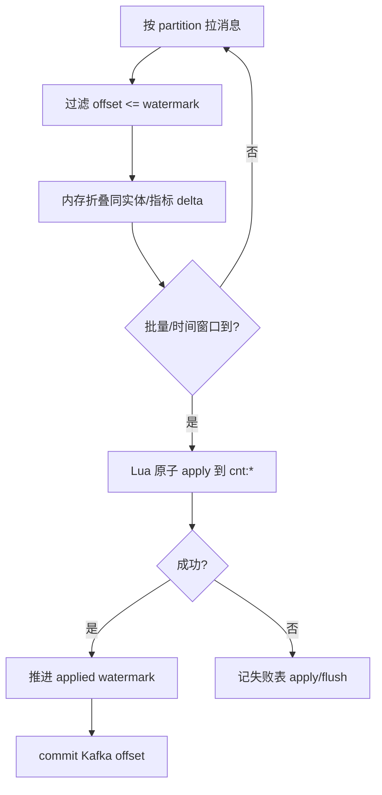

## 4.4 失败补偿流程

如果 publish、flush 出错，系统会尽量：

1. **记 MySQL 失败表**（`CounterFailedMessage`，stage 如 `publish` / `flush`）——便于排查与人工/脚本补偿  
2. **标 Redis dirty set**（`repair:counter:dirty`）——交给在线修复环  

**当前在线兜底（已挂到进程）：**  
`AggregationConsumer` 在 `repair.Enabled` 时跑 **`repairLoop`**（与消费同进程，**不是**独立 `CounterFailureWorker` Runner）：

1. 抢全局 leader 锁 `lock:counter:repair`  
2. 从 dirty set 弹出实体  
3. 从 Bitmap `BITCOUNT` 建绝对值快照  
4. 覆写 `cnt:*` SDS 并清 dirty  

**失败表重放（有代码、默认未周期挂载）：**  
`CounterService.ReplayFailedMessages` 可对 pending 失败记录做 Bitmap 重建并更新状态；`bootstrap` **未**注册周期 BackgroundRunner 去扫失败表。面试请区分：

- 已落地：dirty set + repairLoop  
- 有能力未自动跑：失败表 `ReplayFailedMessages`  

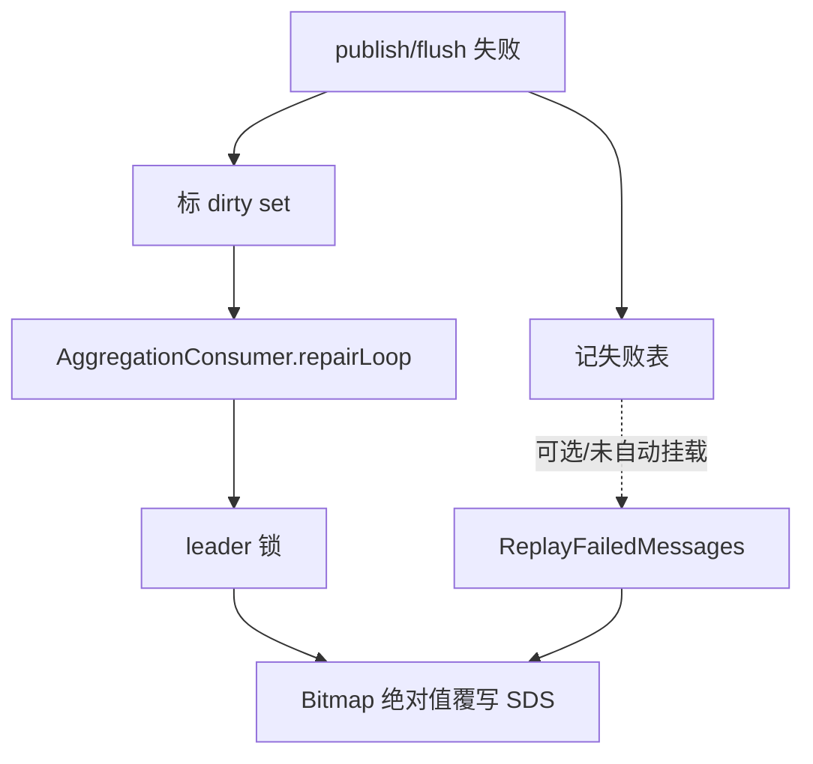

## 4.5 epoch fence 流程

`like/fav` 当前增加了实体级 epoch fence，目的是解决这个问题：

1. `cnt:*` 快照坏了，触发 rebuild
2. rebuild 基于当前 Bitmap 重建出正确快照
3. 但一批旧的 delta 事件晚到
4. 如果直接应用旧 delta，会把新快照再次污染

解决方案是：

1. rebuild 获取实体锁
2. bump `active_epoch`
3. rebuild 期间 toggle 检测到锁存在会短暂等待
4. rebuild 完成后 consumer / repair 路径只接受当前 epoch 的 `like/fav` 事件
5. 旧 epoch 事件直接跳过或终结

这套方案非常适合拿来讲“最终一致性里的边界收口”。

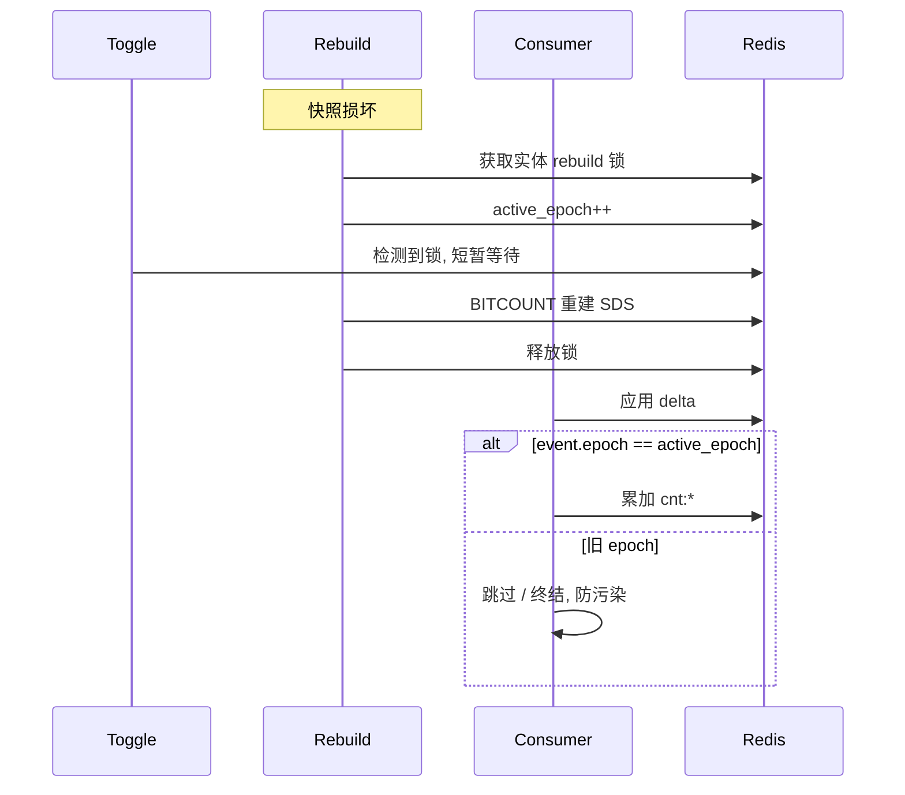

## 5. 设计亮点

## 5.1 真值和快照分离

这是这个模块最核心的架构思想。

如果直接把 Redis counter 当唯一真值，会有两个问题：

1. 快照一旦损坏，很难修
2. 增量重复应用会直接把状态打坏

现在的设计是：

- Bitmap 负责真值状态
- SDS 负责快读

这让系统具备了重建能力。

## 5.2 写路径只做最小原子修改

用户请求线程不去做：

- 批量计数更新
- 大量 Redis 操作
- DB 补偿

它只做：

1. 原子判定状态是否变化
2. 写 Bitmap
3. 发一条 delta

这样主链路延迟更可控。

## 5.3 批量消费折叠降低 Redis 写压力

如果每个点赞都直接写一次 `cnt:*`，在高并发下 Redis 压力会很大。  
aggregation consumer 先在内存里折叠，再批量写入，能显著减少写放大。

## 5.4 失败任务按语义分类

这里不是“一张失败表 + 全靠人工分析”，而是把失败类型结构化了：

- publish 失败：重发 delta
- apply/flush 失败：按 Bitmap 绝对修复快照

这说明补偿策略不是统一模板，而是按链路语义设计。

## 5.5 epoch fence 是对 rebuild 污染窗口的精准修复

很多系统只做到“我能重建”，但没有解决“重建后旧增量继续打过来”的问题。  
epoch fence 正是在修这个边界。

## 6. 难点与边界问题

### 6.1 Bitmap 适合 count 和 membership，不适合列表

Bitmap 很适合回答：

- 是否点赞
- 总数多少

但它不适合回答：

- 点赞用户列表
- 点赞时间排序
- 分页浏览点赞人

所以如果业务要做“查看点赞列表”，通常要单独补一套写模型。

### 6.2 MQ 异步聚合天然不是强一致

点赞后页面立即刷新，理论上可能出现：

- 状态位已经改了
- `cnt:*` 还没聚合完成

这就是典型的最终一致性窗口。  
当前设计通过读取时重建和补偿链路来降低风险，但不会伪装成强一致。

### 6.3 epoch fence 不是万能模板

当前它只用于 `like/fav`，不是所有计数都直接套用。

原因是：

- `like/fav` 有 Bitmap 真值
- `follower/following` 当前并没有完全同样的真值模型

面试里如果你能主动讲“为什么不全模块强行套模板”，反而会显得更成熟。

### 6.4 补偿链路是成本，不是免费午餐

失败表和补偿 worker 解决了可靠性问题，但也带来了：

- 额外存储成本
- 额外扫描成本
- 额外清理成本

所以它更适合高价值链路，而不是所有异步逻辑都一律套一层。

### 6.5 rebuild 之后，旧 epoch 的失败任务必须收尾

这是一个很容易被忽略，但其实非常关键的边界。

因为 rebuild 的含义不是“再算一遍”那么简单，而是：

1. 当前实体的 SDS 快照已经被 Bitmap 真值重新拉正
2. `active_epoch` 已经 bump 到新代际
3. rebuild 之前遗留的旧任务，语义上已经过期

如果这时还让旧 epoch 的失败任务继续重试，就会出现两个问题：

- worker 反复扫描无效任务，徒增成本
- 更糟时会把旧 delta 重新补进来，重新污染刚修好的快照

所以更合理的做法是：

- rebuild 成功后，批量终结该实体旧 epoch 的失败任务
- worker 再按 epoch 做一次兜底校验

这也是 generation / epoch fence 真正完整的一半，不只是“消费时检查一下”。

### 6.6 `publish` 和 `apply/flush` 的补偿边界不能混

这个模块一个常见误区是：

**既然 Bitmap 能重建，那是不是所有失败都绝对修复就好了？**

答案是否定的，因为失败发生的位置不一样：

1. `publish` 失败
   - 问题是原始 delta 还没进入消费链路
   - 这时最自然的修复就是补发原始 delta
2. `apply/flush` 失败
   - 问题发生在快照写入阶段
   - 这时继续盲补 delta，风险反而更高

所以这个模块不是“统一修复模板”，而是：

- 链路前段失败，补原始语义
- 链路后段失败，回真值绝对修复

## 7. 面试官高频问题

### Q1：为什么不用一张 MySQL 表直接存 like_count / fav_count？

**参考回答：**

因为这个模块的核心压力在高频小写。  
如果每次点赞都同步更新 MySQL 计数列，写放大和锁竞争会很明显。  
我这里用了 Bitmap 保存用户状态真值，用 Kafka 异步聚合快照，是在用更适合高频状态更新的数据结构和异步链路来做计数。

### Q2：为什么要把 Bitmap 和快照分开？

**参考回答：**

因为它们解决的是两个不同问题。  
Bitmap 适合做 membership 和重建真值，SDS 快照适合做高性能读取。  
如果把一个结构同时拿来做真值和读优化，通常会让系统既难修又难扩展。

### Q3：为什么写路径不直接同步更新 `cnt:*`？

**参考回答：**

因为那样会把主请求链路变成“改状态 + 改多个计数 + 处理并发 + 承担失败补偿”，主路径太重。  
当前设计把主路径压缩到“Bitmap 原子变更 + 发 delta”，再让消费端批量聚合，这样延迟和吞吐都更好。

### Q4：epoch fence 是解决什么问题的？

**参考回答：**

它解决的是 rebuild 和旧 delta 并发时的污染问题。  
如果我刚根据 Bitmap 重建出一个正确快照，旧时代的 delta 事件又晚到并继续应用，就会把新快照打坏。  
epoch fence 的本质就是给“快照的代际”打标，只让当前代际的事件继续生效。

### Q5：为什么 publish 失败补发 delta，而 apply/flush 失败改成绝对修复？

**参考回答：**

因为这两类失败所处的位置不同。

- publish 失败说明增量事件还没进消费链路，最自然的修复方式就是补发原始 delta
- apply/flush 失败说明快照写入环节出问题，这时继续盲目补 delta 容易越补越乱，更稳妥的是回到 Bitmap 真值做绝对修复

这体现的是“补偿策略跟着链路语义走”。

### Q6：如果 rebuild 发生了，失败表里的旧任务怎么办？

**参考回答：**

如果 rebuild 已经成功，并且对应实体的 `active_epoch` 已经 bump 了，那旧 epoch 的失败任务在语义上就过期了。  
因为新快照已经按 Bitmap 真值重建完成，旧任务再继续跑只会重复扫描，严重时还会把旧 delta 重新打回来。  
所以更合理的做法是 rebuild 后批量终结旧 epoch 任务，同时 worker 在执行前再按 epoch 做一次兜底校验。

## 8. 场景题

### 场景题 1：如果要做“查看点赞列表”，你怎么设计？

**推荐回答：**

我不会只用现有 Bitmap。  
因为 Bitmap 只能回答某人是否点赞和总数，不支持按时间列出点赞用户。  
如果要做点赞列表，我会新增一套明细模型：

1. MySQL 点赞明细表做审计和分页基线
2. Redis ZSet 做热点内容点赞用户列表缓存
3. score 用点赞时间
4. 计数仍可复用当前 counter 模块

这样“状态 / 计数 / 列表”三种需求由三套最合适的读模型解决。

### 场景题 2：如果要增加“浏览量”计数，你会直接复用这套设计吗？

**推荐回答：**

不会完全照搬。  
浏览量和点赞不一样，浏览通常是高频、允许一定重复、也未必需要用户级强状态真值。  
所以浏览量更适合：

1. 本地缓冲
2. 批量上报
3. 近实时聚合

而不是强行给每个 view 做 Bitmap membership。

### 场景题 3：如果 Redis 快照经常损坏，下一步你会优化哪里？

**推荐回答：**

我会先区分问题在哪一层：

1. 是事件重复 / 乱序导致污染
2. 是 flush/apply 失败过多
3. 是 rebuild 太频繁
4. 是某些计数根本缺少稳定真值

如果是 `like/fav`，说明 epoch fence 或 failure repair 还要继续加强；  
如果是 `follower/following`，可能是这套设计本身就缺少像 Bitmap 那样的强真值支撑。

## 9. 最容易讲错的地方

### 9.1 不要把它讲成“简单的 Redis 计数器”

它不是单纯的 `INCR`。  
它背后有：

- Bitmap 真值
- SDS 快照
- MQ 聚合
- 失败补偿
- rebuild
- epoch fence

### 9.2 不要回避最终一致性

这个模块不是强一致事务系统。  
更成熟的说法应该是：

**我知道它存在最终一致性窗口，也设计了重建、补偿和 fence 来收口。**

## 10. 继续深挖时你可以怎么答

### 10.1 如果面试官继续问：为什么不用简单的 `INCR` / `DECR`？

你可以这样答：

> 如果只是做一个非常轻量的总数缓存，`INCR` 当然可以。  
> 但这个模块不只要总数，还要回答“某用户是否点赞/收藏”，以及在快照损坏时还能重建。  
> `INCR` 只能给我快照，给不了我真值状态；Bitmap 才能回答 membership，而且还能通过 `BITCOUNT` 反向重建总数。  
> 所以我不是为了复杂而复杂，而是因为需求本身已经超过了简单计数器的能力边界。

### 10.2 如果面试官继续问：为什么 `like/fav` 能做 epoch fence，`follower/following` 不一定能直接套？

你可以这样答：

> 因为 `like/fav` 现在有比较清晰的真值支撑，也就是 Bitmap。  
> rebuild 时我能确定“基于当前真值重建出来的快照”到底是什么。  
> 但 `follower/following` 这条链路当前并不是完全同一套建模，所以不能看到一个模板就全套上去。  
> 我更倾向先分清楚数据真值在哪里，再决定要不要加 epoch fence。

### 10.3 如果面试官继续问：为什么 publish 失败补 delta，而 apply/flush 失败不继续补 delta？

你可以这样答：

> 因为 publish 失败意味着增量还没进入消费链路，这时候最自然的修复就是把原始 delta 补发出去。  
> 但 apply/flush 失败已经发生在快照落盘阶段了，这时继续补 delta 可能会把脏快照越补越偏。  
> 所以这类失败更稳妥的方式是回到 Bitmap 真值做绝对修复。  
> 这本质上是按失败发生的位置决定补偿策略。

### 10.4 如果面试官继续问：这个模块最脆弱的地方在哪里？

你可以这样答：

> 我认为最脆弱的不是 Lua 脚本，而是“真值和快照之间的桥”。  
> 也就是 MQ 聚合、失败补偿、rebuild、epoch fence 这些连接层。  
> 因为这部分一旦设计不清楚，就会出现：状态是对的，但快照脏了；或者快照重建了，但旧事件又把它打坏。  
> 所以我在这个模块里最重视的不是单次写成功，而是链路整体可恢复。

### 10.5 如果面试官继续问：如果要支持“谁赞了我”通知，这套计数还能不能复用？

你可以这样答：

> 计数链路本身可以继续复用总数和状态判断，但通知是另一类读模型。  
> 通知更关心的是事件明细和时间顺序，而不是最终累计值。  
> 所以我会把“计数”和“通知”拆开：  
> 计数继续走当前链路，通知另外维护明细事件或收件箱模型。

### 10.6 如果面试官继续追：你是不是漏了一点，rebuild 之后旧失败任务要不要删？

你可以这样答：

> 对，这个点不能漏。  
> 因为 rebuild 一旦成功，就意味着当前实体的快照已经按 Bitmap 真值重新拉正，而且 epoch 已经进入新代际。  
> 这时候旧 epoch 的失败任务如果还保留并继续重试，要么白扫，要么重新把旧增量打回来。  
> 所以完整方案应该包含两层：rebuild 成功后批量终结旧任务，worker 执行前再按 epoch 做一次兜底判断。

---

# 附录A：工程级扩写（对照源码）

## A1. 代码地图

| 文件 | 职责 |
|------|------|
| `bitmap_toggle.go` / `bitmap_lua.go` | 状态原子切换 |
| `event_publisher.go` | 发 Kafka 增量 |
| `consumer.go` / `consumer_watermark.go` | 批处理 + 水位幂等 |
| `sds_rebuild.go` / `failure.go` | 脏数据修复 |
| `sds_read.go` | 读计数 |

## A2. 点赞写路径（中文流程图）

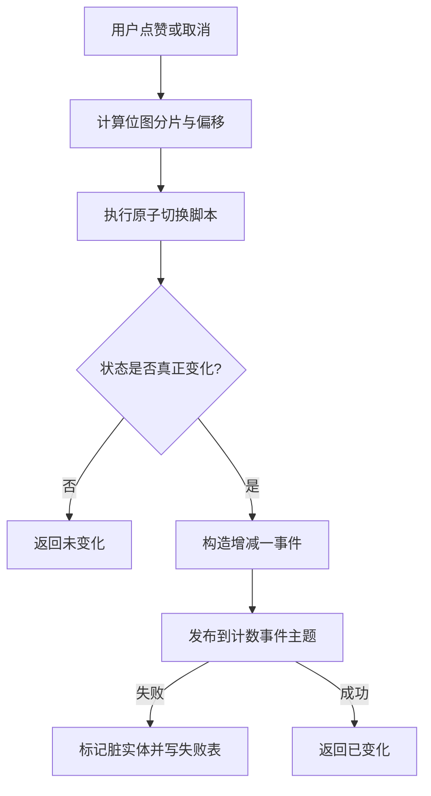

### 为什么必须用 Lua

并发两次「读未赞 → 写已赞 → 发 +1」会把计数打成 2。  
Lua 在 Redis 单线程内完成读改判，只有真正翻转才发事件。

## A3. 消费者水位幂等（中文流程图）

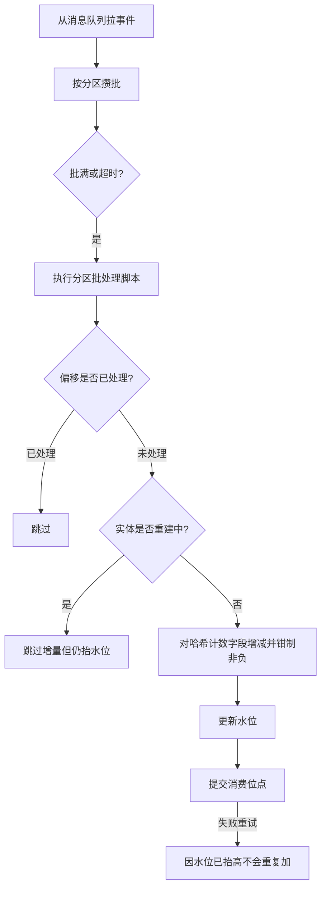

### 讲解要点

- 水位在 Redis：跨实例共享，解决重复消费。
- 先 apply 再 commit：commit 失败重放也不会重复加。
- 重建中跳过增量但仍抬水位：依赖绝对值修复，窗口内可能丢 delta（要讲清代价）。

## A4. 失败修复（中文流程图）

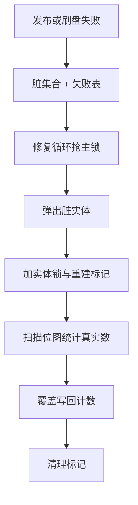

### 为什么 Bitmap 可重建

Bitmap 是「是否点过」的权威源；计数是派生快照。丢了派生，从源重算即可。

## A5. 随机盐为什么危险

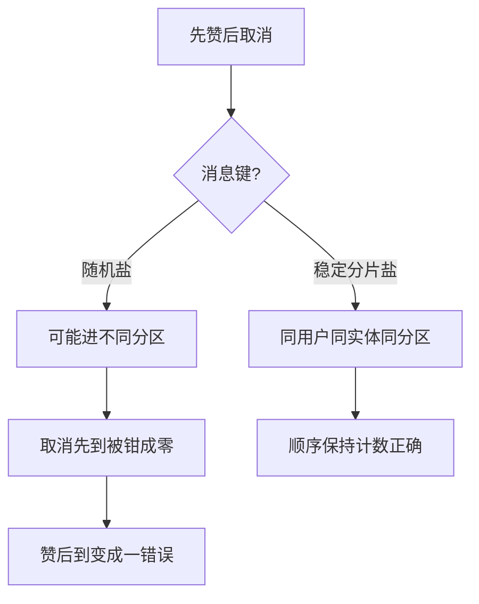

## A6. 60 秒口述

> 点赞用位图原子翻转状态，只有变化才发增量。消费者按分区水位幂等批量写哈希计数。失败进脏集合，后台用位图绝对值重建。计数最终一致，位图是权威源。

---

# 附录B：面试细节扩写

## B1. 计数模块解决的不是一个数字问题

点赞收藏看起来只是 `+1/-1`，但真实问题至少有五个：

1. **状态问题**：某个用户到底有没有点赞。
2. **总数问题**：某个实体当前有多少点赞。
3. **并发问题**：同一个用户重复点击、快速取消、多个请求并发。
4. **消息问题**：Kafka 重复投递、提交失败、乱序风险。
5. **修复问题**：如果快照脏了，如何从真值恢复。

因此本模块拆成两层：Bitmap 保存用户状态真值，SDS/Hash 保存展示用计数快照。

## B2. Redis 数据结构地图

| Redis Key | 类型 | 含义 | 是否真值 |
|-----------|------|------|----------|
| `bm:{metric}:{entityType}:{entityID}:{chunk}` | Bitmap/String | 用户点赞或收藏状态 | 是 |
| `cnt:{entityType}:{entityID}` | Hash | like/fav 等聚合计数快照 | 否 |
| `counter:applied-offset:{group}:{topic}:{partition}` | String | 消费者已应用 offset 水位 | 幂等控制 |
| `dirty:counter` | Set | 需要修复的实体集合 | 修复任务 |
| `lock:counter:repair` | String | repair leader 锁 | 并发控制 |
| `lock:sds-rebuild:{entityType}:{entityID}` | String | 单实体重建锁 | 并发控制 |
| `rebuild:{entityType}:{entityID}` | String | 重建标记 | 防旧增量污染 |
| `likers_cache:{entityType}:{entityID}:{metric}` | ZSet | 点赞人列表扫描缓存 | 读优化 |

面试关键：不要把 `cnt:*` 说成真值。它是为了读快的快照，错了可以从 Bitmap 重建。

## B3. 为什么不用简单 Redis INCR

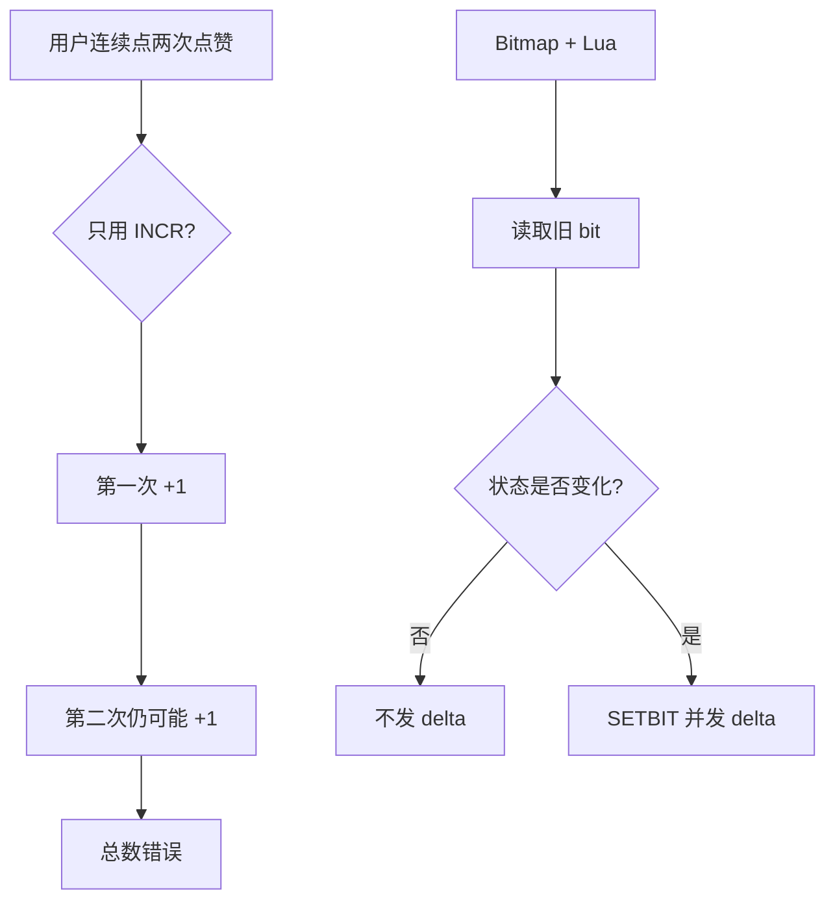

`INCR` 只能表达“数字变化”，不能表达“状态是否真的变化”。点赞的本质是状态开关，不是单纯计数器。

## B4. 正常链路时序图

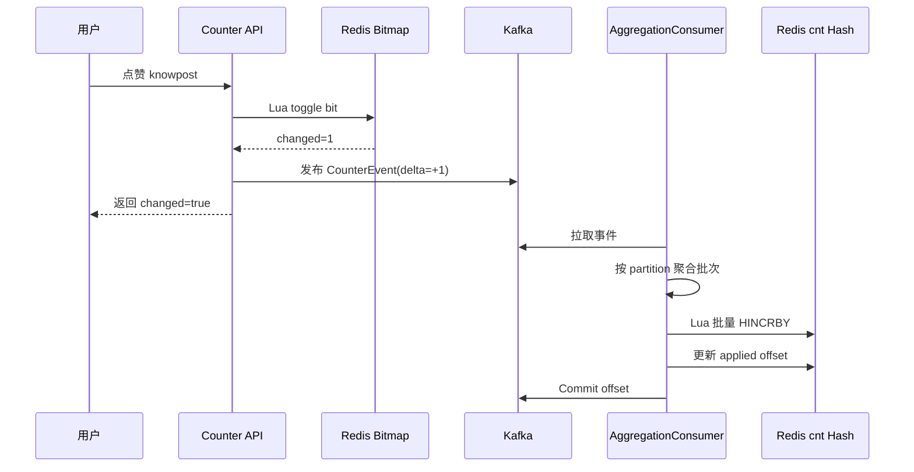

这里是“先 apply 再 commit”。如果 commit 失败导致 Kafka 重放，Redis 水位会让同一 offset 不再重复加。

## B5. 异常和修复链路

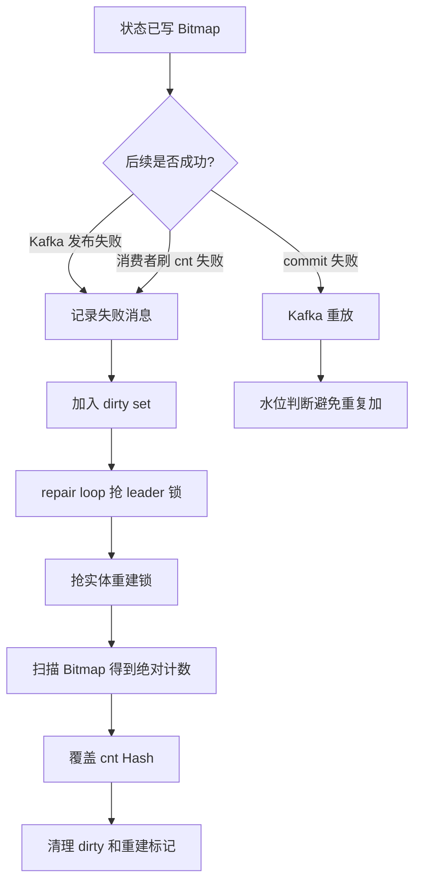

这条链路回答“消息丢了怎么办”：状态已经在 Bitmap 里，丢的是派生增量，最终可以从 Bitmap 重算。

## B6. 水位幂等为什么要按 partition

Kafka 的顺序保证是 partition 级别的，不是 topic 全局级别。因此水位也必须按 partition 记录：

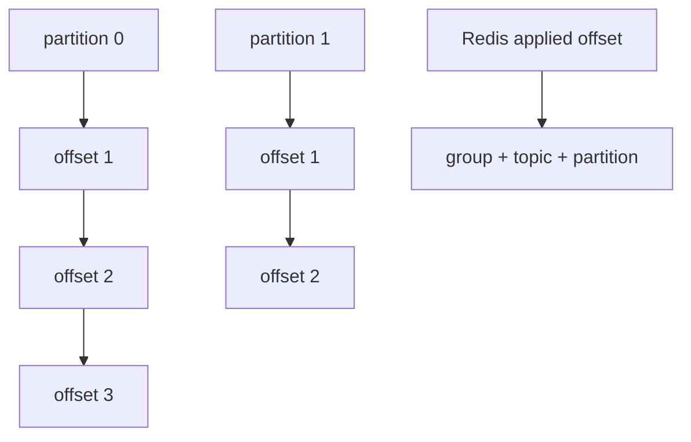

如果只保存一个全局 offset，不同 partition 的 offset 会互相覆盖，既不能判断重复，也不能判断空洞。

## B7. Rebuild 为什么需要标记

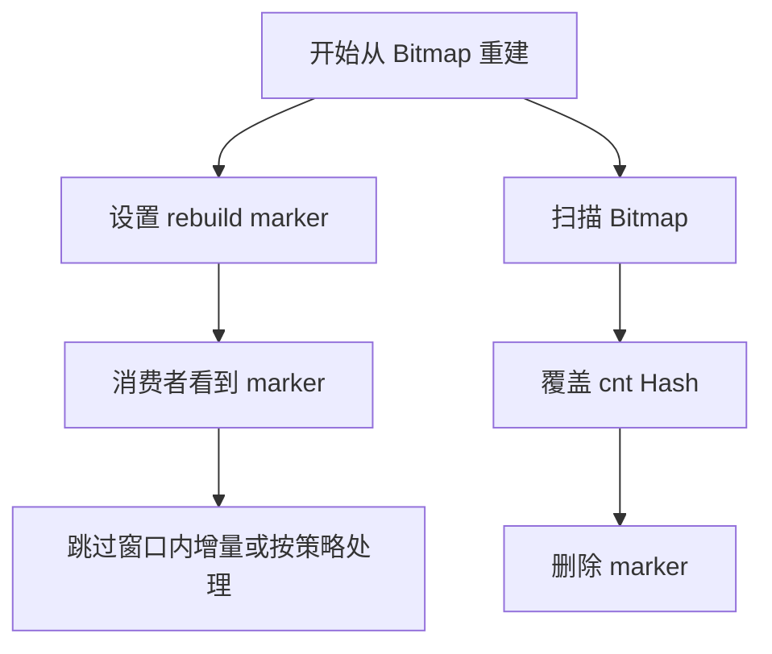

核心问题是：重建时你正在写一个“绝对值”，同时消费者可能正在写“增量”。如果不设边界，旧 delta 可能污染刚重建好的快照。

## B8. 点赞人列表怎么讲

本项目的点赞人列表不是单独建 MySQL 明细表，而是从 Bitmap 扫描，并用 ZSet 做短期缓存：

1. 先查 `likers_cache:*`。
2. 命中则按 user_id 游标返回。
3. 未命中则扫描 Bitmap 分片。
4. 扫到的用户 ID 写回 ZSet 缓存。

这个方案适合面试里主动说明边界：如果要做强产品化的点赞明细、通知、时间排序和删除审计，应该额外维护事件明细表或收件箱模型，而不是只靠 Bitmap。

## B9. 失败场景对照表

| 失败点 | 现象 | 当前处理 | 面试怎么讲 |
|--------|------|----------|------------|
| Lua toggle 失败 | 状态没变化 | 返回错误 | 主状态都没写，不能假成功 |
| Kafka 发布失败 | Bitmap 已变，cnt 不会自动更新 | 记录失败并 dirty | 从 Bitmap 修复快照 |
| 消费者 apply 失败 | cnt 未更新 | 重试，耗尽后 dirty | repair 兜底 |
| apply 成功 commit 失败 | Kafka 可能重放 | Redis 水位跳过重复 | 至少一次 + 幂等 |
| 坏消息解析失败 | partition 可能卡住 | 推进水位并 commit | 坏消息不能阻塞后续 |
| rebuild 期间旧消息到达 | 快照可能被污染 | rebuild marker / 水位策略 | 这是最重要边界 |

## B10. 2 分钟展开回答

> 计数模块我没有用简单 INCR，因为点赞收藏首先是用户状态，不是数字。我的设计是 Bitmap 保存用户是否点赞或收藏，Lua 在 Redis 内原子判断和翻转，只有状态真的变化才发 Kafka delta。读总数不直接 BITCOUNT，因为每次扫 Bitmap 成本高，所以维护 `cnt:*` SDS/Hash 快照。消费者按 Kafka partition 攒批，用 Redis 水位保证重复消费不重复加。如果 publish/flush 失败，会记失败表并标 dirty set；**在线修复挂在 AggregationConsumer 的 repairLoop 里**（不是独立 FailureWorker 进程），抢 leader 锁后按 Bitmap 绝对值覆盖快照。另外 following/follower 是 relation 消费端直接 HIncrBy，不走 counter-events。核心是：状态真值和展示快照分离，快照可以最终一致，但必须能恢复。

---

## 📌 避坑指南与自测思考题

### ⚠️ 生产避坑指南（新手最易踩的坑）

1. **切忌使用 `INCRBY` 直接对展示快照做无防护更新**：
   - 错误做法：每次用户点赞直接执行 `INCRBY cnt:post:101:like 1`。
   - 后果：网络重试或重复消费时会导致点赞数变成 2，且用户取消点赞后出现负数（如 `-5`）；一旦 Redis 数据丢失或损坏，无法从任何地方恢复绝对值！
   - 正确做法：只将 Bitmap 作为真值，增量事件只包含 `delta: +1/-1`，并且带上 `partition watermark` 防止重复消费。

2. **绝对不能漏掉 Epoch 栅栏（Epoch Fence）保护**：
   - 错误做法：在 `BITCOUNT` 绝对值重写 `cnt:*` 快照的同时，未拦截仍在管道中传输的历史 `CounterEvent` 增量事件。
   - 后果：绝对值重写完成后的下一毫秒，旧的 `delta: +1` 到达，把本已准确的绝对值快照又重复加了一次！
   - 正确做法：在 Rebuild 时递增 `active_epoch`，消费端遇到 `event.epoch < active_epoch` 的历史增量事件直接丢弃。

### 🧐 巩固自测思考题

- **思考题 1**：如果某个热门知文的点赞 Bitmap 占用了 128KB 内存，在后台修复协程中执行 `BITCOUNT` 会把 Redis 单线程卡住吗？
  - *提示*：不会。Redis 对 128KB 位图执行 `BITCOUNT` 仅需几微秒（μs），CPU 指令集支持 POPCNT。
- **思考题 2**：为什么关注数和粉丝数（following/follower）的更新不走 `counter-events` 队列？
  - *提示*：关系模块在 `relation.OutboxConsumer` 处理关系变更时，直接在同一个消费点同步执行了 `HIncrBy` SDS。因为关系事务本身走 Outbox 保证，无需经过二重 MQ 聚合。
