# 关系模块

## 1. 模块定位

关系模块解决的是社交图里的两个核心问题：

1. 关注 / 取关
2. 关注列表 / 粉丝列表读取

它表面上像一个 CRUD 模块，实际上很有工程含量，因为它同时要处理：

- 关系真值存储
- 列表缓存
- 大 V 优化
- 异步投影
- 与计数模块联动

---

### 🎓 教学导学板块

> **🎯 学习目标**
> 1. 理解高并发社交网络中**正向查询 (关注列表)** 与 **反向查询 (粉丝列表)** 的访问模式差异与 MySQL 双表物理拆分设计。
> 2. 掌握使用 **Redis ZSet (有序集合)** 进行按时间戳倒序排列的分页列表缓存机制。
> 3. 理解 **单条关系判断 (`IsFollowing`) 坚持直查数据库** 的高一致性与低成本取舍。
> 4. 深刻理解 Feed 读扩散与写扩散的混合策略。**完整原理、键设计与取舍见 [14-信息流扩散](14-信息流扩散-读扩散写扩散与推拉结合.md)**，本篇只讲关系模块与扩散的衔接。
> 
> **📚 前置概念预习**
> - **ZSet (Sorted Set)**：Redis 有序集合，以毫秒时间戳作为 `score`，实现高性能的时间线游标 (cursor) 分页。
> - **读扩散 vs 写扩散**：读扩散（Pull）在读 Feed 时遍历关注对象的**发件箱**归并；写扩散（Push）在发帖时推入所有粉丝的**收件箱**。注意 Push 对应写扩散、Pull 对应读扩散，勿混。

---

## 2. 一句话介绍

关系模块以 MySQL 的 `following` / `follower` 双表作为真值源，写路径通过事务 outbox 保证关系变更和异步事件不丢，读路径则对列表查询做了 L1 + Redis ZSet + DB 的分层缓存；同时针对大 V 用户增加 L1 头部缓存，但单条关系判断仍然坚持直接查库，避免把一致性问题引入最细粒度路径。

## 3. 核心数据模型（教学拆解：双表设计与访问模式匹配）

> **💡 现实工程场景痛点：**
> 在大型社交社区中，存在两类天然对立的高频查询：
> 1. **正向查询**：“我关注了哪些人？”（查询条件：`WHERE from_user_id = ?`）
> 2. **反向查询**：“谁关注了我（粉丝列表）？”（查询条件：`WHERE to_user_id = ?`）
> 
> 如果只设计一张 `user_relations(from_user_id, to_user_id)` 单表：
> - 无论怎么建联合索引，在海量数据（如亿级关系链）下，索引页碎裂严重，粉丝列表查询会导致严重的慢 SQL；
> - 无法针对粉丝列表做独立的分库分表分片策略（Hash Key 不同）。

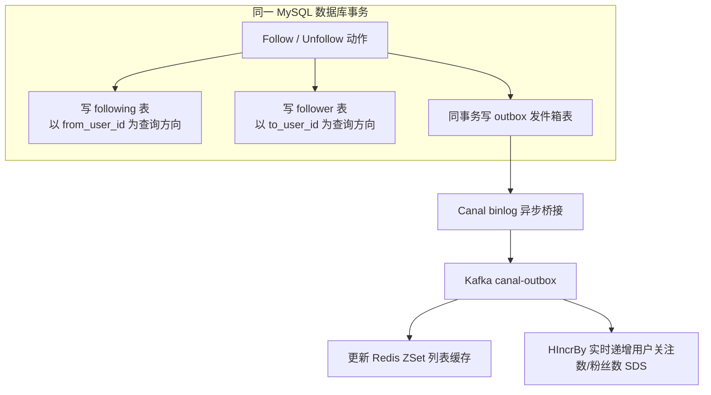

### 3.1 双表真值模型

关系真值不是只存一张 `following` 表，而是同时维护：

1. **正向表 `following`**：
   - 查询方向：`from_user_id -> to_user_id`
   - 专门服务于“获取用户的关注列表”、“判断我是否关注了某人”。
2. **反向表 `follower`**：
   - 查询方向：`to_user_id -> from_user_id`
   - 专门服务于“获取用户的粉丝列表”。

**教学结论**：通过在写路径上牺牲少量存储空间（多写一张表），换取了正向和反向两条读路径都能够在主键索引/覆盖索引上以 $O(\log N)$ 极速定位，彻底消除了慢 SQL 的隐患。

### 3.2 Redis 列表投影模型

Redis 不承担关系真值，仅仅是面向读路径的列表快照：

- `z:following:{userID}`：按时间倒序排列的关注 ZSet；
- `z:followers:{userID}`：按时间倒序排列的粉丝 ZSet；
- Score 采用 `created_at` 毫秒级时间戳，Member 为对端用户 ID。

另外针对关注数超大的大 V 用户，设置了额外的进程内 L1 头部缓存：
- `l1:following:{userID}` / `l1:followers:{userID}`；当前默认由 `relation.l1_cache.fill_limit` 控制，默认 500 条，而不是固定 50 条。

## 4. 核心流程

## 4.1 Follow 写路径

关注流程是：

1. 先用 Redis Lua 令牌桶做用户级限流
2. 开 MySQL 事务
3. 写 `following`
4. 写 `follower`
5. 写 `outbox`
6. commit
7. 删除受影响的列表缓存

这里最重要的点是：  
**关系真值写入和 outbox 事件写入在同一个事务里完成。**

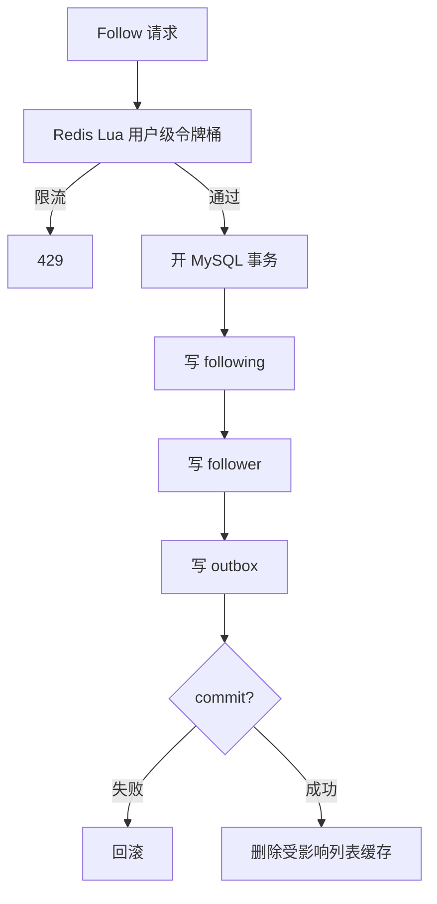

注意，当前 `Follow` 使用 `INSERT ... ON DUPLICATE KEY UPDATE rel_status = 1`，不会先检查“是否已经关注”。因此它的 `false` 返回主要代表令牌桶拒绝或 Redis 限流异常，**不是**“已经关注”；重复 Follow 仍会写出新的 `FollowCreated` outbox 事件。这个语义会在异步计数处产生风险，见 6.8。

## 4.2 Unfollow 写路径

取关流程和关注类似，只是变成：

1. 更新 `following.rel_status = 0`
2. 更新 `follower.rel_status = 0`
3. 写 `FollowCanceled` outbox
4. commit
5. 失效缓存

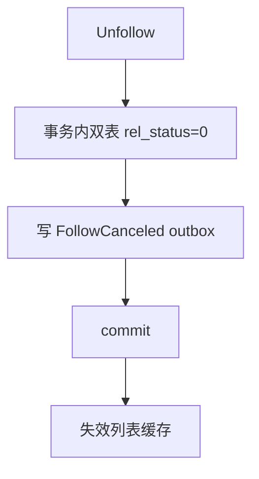

## 4.3 单条关系判断

`IsFollowing` 没有走缓存，直接查库。

这是一个很值得强调的设计点，因为它体现了：

**不是所有读请求都要缓存。**

单条关系判断的特点是：

- 查询代价低
- 一致性要求高
- 引入缓存收益不大

所以直接查库是合理的。

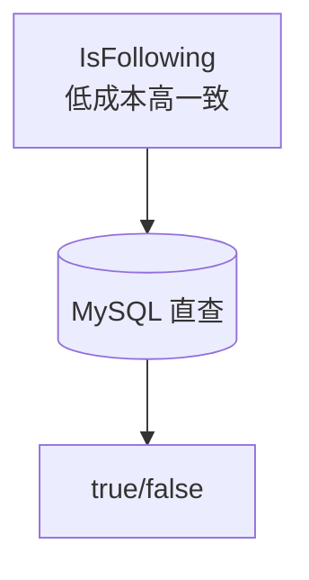

## 4.4 列表读取路径

### 4.4.1 offset 分页

读取顺序是：

1. 如果是大 V，先读 L1
2. 再读 Redis ZSet
3. 如果缓存不存在，按需预热
4. 如果预热窗口不够，回退 MySQL

### 4.4.2 cursor 分页

cursor 分页依赖 ZSet score 顺序：

1. 先确保 ZSet 已预热
2. 使用 `ZRevRangeByScore`
3. 取最后一个元素的 score 作为下一个 cursor

这条链路的目标是避免 offset 翻页在数据变化时产生跳页和重复。但当前 cursor 只有毫秒时间戳、没有 `(score, member)` 复合游标；同一毫秒多个关注的场景下，下一页使用排他的 score 可能跳过同分数成员，不能把它描述成完全稳定的 cursor。

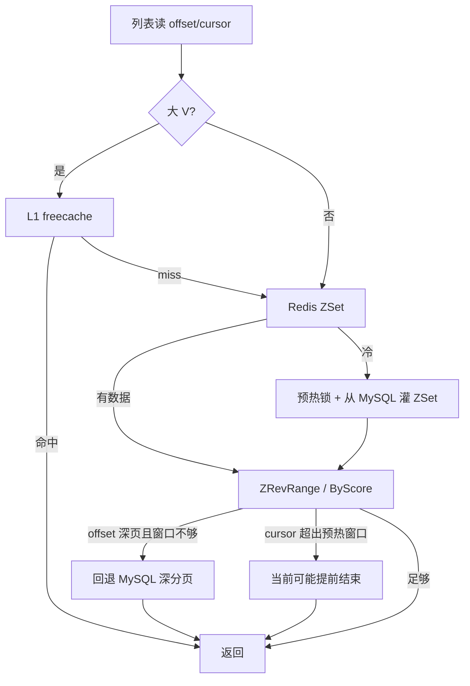

## 4.5 异步投影流程

关系变更事件会进入：

`MySQL outbox -> Canal -> Kafka -> relation.OutboxConsumer -> EventProcessor`

`EventProcessor` 会做三件事：

1. 二次去重（`SETNX dedup:rel:*`，约 10 分钟窗口）
2. 更新 Redis ZSet
3. 直接对 `cnt:user:{id}` 做 `HIncrBy`，增减 following/follower

注意：第 3 步 **不经过** `counter-events` Kafka，也没有 partition 水位；与 like/fav 的异步聚合是两条语义。虽然 `EventProcessor` 构造时接收了 `UserCounterUpdater`，当前实现仅把它作为是否启用计数更新的开关，实际调用的是自身的 `pipelineIncrementUserMetrics()`，直接操作 Redis。

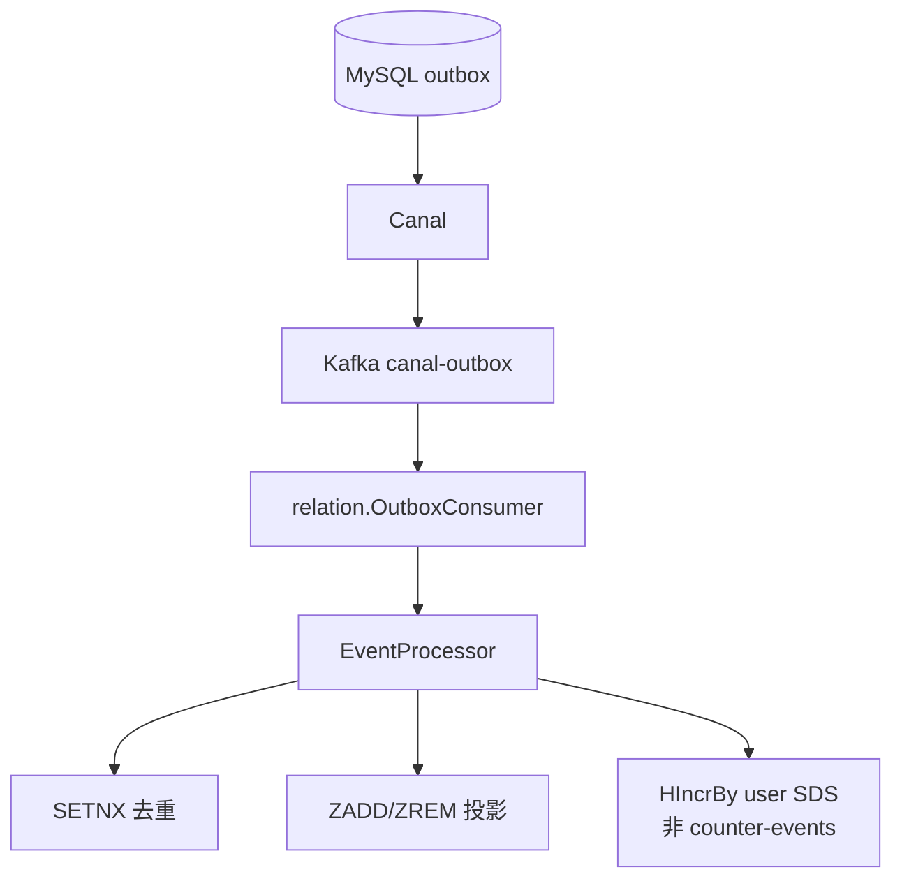

## 4.6 列表游标：复合双键（重构后）

`/relations/following/cursor` 与 `/relations/followers/cursor` 的游标改为**不透明复合串**
`s:{关注毫秒时间戳}:{对方用户ID}`（空为第一页，响应 `cursor` 字段原样回传）。

早期游标只有 score 且查询用排除式区间 `("——毫秒级并列（批量导入、同毫秒双关注）
恰在页边界时，与末条并列的成员被整页跳过，翻页**静默丢条目**。
复合游标用包含式上界 + 应用侧按 (score, member) 精确跳过（与 likers、首页信息流同一约定，
见 [15-设计约定与模式](15-设计约定与模式.md) 第 6 条）；历史纯数字游标仍被接受（按旧排除式语义处理）。

## 5. 设计亮点

## 5.1 关系真值和缓存投影分离

这个模块最大的优点是没有把 Redis 当真值。

真值在 MySQL，Redis 可以：

- 失效
- 重建
- 预热

这让系统在一致性边界上清晰很多。

## 5.2 单条关系查询坚持直查库

这是一个很成熟的取舍。  
很多项目会本能地把所有东西都塞进缓存，但这个项目没有这么做。

因为缓存不只是性能工具，它还会引入：

- 失效
- 竞争
- 多实例一致性

对于单条关系判断，这些复杂度通常不值。

## 5.3 列表缓存按访问模式分层

这个模块不是单一缓存，而是：

1. 普通用户前几页靠 ZSet
2. 大 V 头部窗口靠 L1
3. 深分页直接回 DB

这说明缓存设计不是统一模板，而是跟着访问模式走。

## 5.4 写后主动失效 + 异步投影并存

写线程在 commit 后会主动删缓存，consumer 则负责尽量把列表投影同步到 Redis。

这让系统具备两个特性：

1. 写后下一次读可以回源 DB 获得正确结果
2. 异步链路能逐步把热点列表维持在缓存里

## 6. 技术难点与当前边界问题

关系模块很适合面试里讲“哪里设计得好，哪里还有边界问题”。

## 6.1 它不适合直接套 counter 那种 epoch fence

原因是：

1. 关系模块的真值在 DB，不在 Redis
2. Redis ZSet 是集合投影，不是累计快照
3. 旧事件重放通常不会像 delta 那样反复把值累坏

所以它当前更像“缓存投影竞争问题”，不是“快照被旧 delta 污染问题”。

## 6.2 当前实现存在的真实问题：dedupe 先落标，可能吞掉重试

`EventProcessor` 现在是一开始先 `SETNX dedupe`，再做：

1. ZAdd / ZRem
2. counter 增减

如果中途部分副作用成功、后续失败，那么消息重试时可能因为 dedupe 已存在而被直接跳过，导致状态残缺无法自动修完。

这是当前实现里很值得在面试里主动讲出的一个边界点。

## 6.3 当前实现存在的真实问题：排序语义可能不稳定

DB 中 re-follow 更像“恢复旧关系”，但 consumer 在 `FollowCreated` 时用 `time.Now()` 作为 ZSet score。  
这会导致：

- DB 的排序和 Redis 的排序可能不一致
- 缓存命中时一种顺序
- 回源后又变成另一种顺序

这也是很真实的架构追问点。

## 6.4 当前实现存在的真实问题：cursor 深分页可能被预热窗口截断

当前 ZSet 预热窗口有限，offset 分页有 DB fallback，但 cursor 分页没有同样完善的回退。  
这意味着大号用户在很深的 cursor 翻页场景下，可能提前拿到“没有更多了”的假象。

## 6.5 BigV 判定依赖缓存自身，有冷启动误判

`isBigV` 目前依赖 Redis ZCard，而不是更权威的统计来源。  
如果缓存还没预热，大号用户可能暂时不被识别成 BigV。

这不一定是错误，但它是一个明确的工程折中。

## 6.6 如果继续演进，我会先补 recoverability，而不是先上 epoch fence

如果面试官继续深挖“那你下一步到底怎么改”，我会把优先级排成这样：

1. 先收 `EventProcessor` 的副作用恢复语义
2. 再收排序语义一致性
3. 最后再收深分页和 BigV 判定

第一步最重要，因为它是 correctness 问题。

更具体地说，我不会继续让 dedupe 在最前面直接充当“完成标记”，而会把它拆成更清晰的处理阶段，例如：

1. 事件已接收
2. ZSet 投影已完成
3. counter 联动已完成
4. 整体处理完成

这样即使中途某一步失败，也不会出现“副作用只做了一半，但重试又因为 dedupe 已存在而被跳过”的问题。

## 6.7 失败表适合 relation，但不能照搬 counter 模板

relation 这条链路确实适合补失败任务，但要注意它和 counter 的语义不同。

counter 的失败任务更像：

- 原始 delta 没发出去
- 或快照写坏了，需要按真值绝对修复

relation 更像是：

- 某个关系事件的某个副作用阶段没做完
- 例如 ZSet 已经更新，但 counter 还没更新
- 或 followers/following 其中一边成功，另一边失败

所以如果 relation 要加失败表，我更推荐记录：

1. 事件主键或关系主键
2. 当前失败阶段
3. 是否已经更新过 ZSet
4. 是否已经更新过 counter
5. 重试或重建策略

也就是说，relation 的失败表更像“阶段补做 / 局部重建”，而不是把 counter 的 `delta vs 绝对修复` 模板生搬硬套过来。

## 6.8 重复 Follow 会生成新事件，可能使用户计数漂移

`Follow` 对关系表执行的是 upsert：已有有效关系再次 Follow 时，关系集合仍然只有一条，ZSet 的 `ZADD` 也天然去重；但服务层没有根据“是否新建/是否从取消状态恢复”决定要不要写 outbox。每次请求都会生成新 RelationID 和 `FollowCreated` 事件。

去重键包含 RelationID，所以重复 Follow 不会命中前一次事件的 10 分钟 dedupe；最终会再次执行 `HINCRBY cnt:user:{id} following/follower +1`。于是“列表关系正确，但关注数/粉丝数偏大”成为可能。

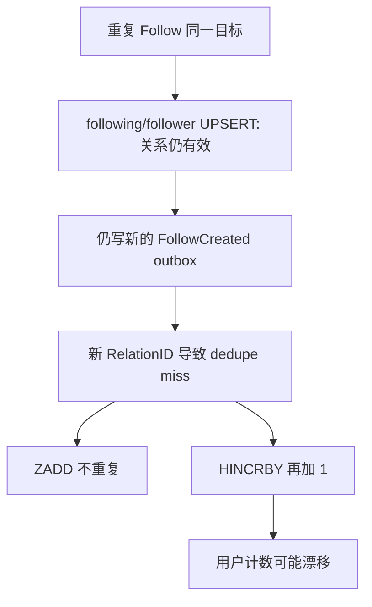

修复应让仓储返回“是否发生 rel_status 迁移”，只有 `0 -> 1` 或首次插入才产生 FollowCreated；或者让事件处理器按关系真值/状态机幂等更新计数，不能只依赖带新 RelationID 的短 TTL 去重。

## 7. 面试官高频问题

### Q1：为什么要用 `following` 和 `follower` 两张表，不能只用一张吗？

**参考回答：**

一张表能做，但会把两种访问模式挤在一起。  
“我关注了谁”和“谁关注了我”虽然描述的是同一张社交图，但索引方向和查询热点不一样。  
双表的价值在于让两种查询各自有稳定的索引和演进空间，而且写路径可以在一个事务里保持双边一致。

### Q2：为什么单条关系判断不走缓存？

**参考回答：**

因为这条路径对一致性要求高、查询成本低，而且缓存收益有限。  
如果给它上缓存，系统会多出失效和多实例一致性问题，但性能提升很有限。  
所以我选择把缓存集中用在列表场景，而不是用在最细粒度的单条关系判断上。

### Q3：为什么你觉得关系模块不适合套 counter 的 epoch fence？

**参考回答：**

因为它们的问题类型不一样。  
counter 的核心问题是“rebuild 之后旧 delta 会继续污染累计快照”，而关系模块的 Redis 只是集合投影缓存，真值在 MySQL。  
关系这里真正危险的不是“旧事件把真值累坏”，而是缓存投影竞争、排序语义和部分失败恢复问题。

### Q4：为什么要做 BigV 特化？

**参考回答：**

因为大 V 的访问模式和普通用户完全不一样。  
普通用户的列表读流量相对分散，而大 V 的粉丝列表或关注列表前几页会被反复访问。  
如果所有用户都走同一套 Redis ZSet 逻辑，热点用户会成为缓存和 Redis 的集中压力点，所以需要额外的本地头部缓存来吸收流量。

### Q5：关系模块里 Redis 的角色到底是什么？

**参考回答：**

Redis 在关系模块里是投影缓存，不是真值。  
这点非常关键，因为它决定了：

- 出问题时可以直接丢缓存重建
- 读不到缓存时可以回源 DB
- 不需要把所有一致性压力压到 Redis 上

### Q6：relation 能不能像 counter 一样补一张失败表？

**参考回答：**

可以，而且我认为这是比硬套 epoch fence 更合适的方向。  
但 relation 的失败表不能照搬 counter，因为它修的不是累计快照，而是事件副作用的完成度。  
我会让任务记录“哪条关系事件、失败在什么阶段、哪些副作用已经做过”，然后由 worker 按阶段补做，必要时直接按 DB 真值重建受影响用户的列表缓存。

### Q7：如果你现在就改 relation consumer，你第一刀会怎么下？

**参考回答：**

我会先改 `EventProcessor` 的幂等边界，而不是先换大架构。  
也就是不要让最前置的 dedupe 直接等价于“整条事件处理完成”，而要把处理状态拆开。  
这样重试时才能知道是应该跳过，还是继续把没做完的副作用补完；这一刀对正确性的收益最大。

## 8. 场景题

### 场景题 1：如果面试官问你“如何设计超大 V 的粉丝列表”，你怎么回答？

**推荐回答：**

我会先按规模分层，不会所有用户一刀切：

1. 普通用户：
   - Redis ZSet 承接前几页
   - 深分页回 DB
2. 大 V：
   - 前几百条做 L1 本地缓存
   - ZSet 继续承接热页
   - 深分页走 DB
3. 如果规模再大：
   - 可能需要分库分表
   - 甚至把粉丝列表按时间或 user range 分段

也就是说，大 V 问题不是单纯“换个缓存”，而是要按访问模式重新分层。

### 场景题 2：如果要做“共同关注”功能，你会怎么设计？

**推荐回答：**

如果是低频后台管理或小规模场景，可以先走 DB JOIN / IN 查询。  
如果是高频前台能力，我会考虑：

1. 保留 MySQL 真值
2. Redis 里维护热点用户的关注集合或压缩结构
3. 对热点用户做交集计算优化

前提是先看业务频率，不会一开始就为所有用户维护高成本交集索引。

### 场景题 3：如果要做“关注人 Feed”，你会选读扩散还是写扩散？

**推荐回答：**

我会做混合策略：

- 普通用户更偏写扩散
- 大 V 更偏读扩散

因为大 V 一次发文带来的扇出量非常大，纯写扩散成本不可控。  
这个项目里已经有 BigV 分层思路，所以继续沿这个方向演进是自然的。

### 场景题 4：如果面试官追问“relation 下一步最值得改哪三件事”，你怎么答？

**推荐回答：**

我会按优先级答，而不是平铺：

1. 第一优先级：收 `EventProcessor` 的 recoverability
   - 这是 correctness 问题
2. 第二优先级：统一 Redis 和 DB 的排序语义
   - 避免缓存命中和回源顺序不一致
3. 第三优先级：补 cursor 深分页 fallback 和更稳定的 BigV 判定
   - 这是体验和性能边界

这样回答的关键不是“列很多改进点”，而是让面试官看到你知道先改什么、后改什么。

## 9. 最容易讲错的地方

### 9.1 不要把关系缓存讲成真值

如果你把 Redis ZSet 讲成真值，后面很多设计都会解释不通，比如：

- 为什么可以直接删
- 为什么可以回源
- 为什么不需要 epoch fence

### 9.2 不要把当前实现讲成“完全没边界问题”

更成熟的说法是：

1. 当前主设计方向是对的
2. 真值和缓存角色划分是清楚的
3. 但异步投影和排序语义上还有值得继续收口的边界

这种表达比“完全完美”更可信。

## 10. 继续深挖时你可以怎么答

### 10.1 如果面试官继续问：为什么不用图数据库做关系？

你可以这样答：

> 图数据库更适合复杂图查询，比如多跳关系、推荐、社群发现。  
> 但我当前这个模块的主要诉求还是单跳关系操作、关注列表和粉丝列表读取。  
> 对这种场景，MySQL 双表加合适索引更简单、成本更低，也更容易和现有业务事务放在一起。  
> 所以不是图数据库不好，而是当前问题还没走到需要它的那一步。

### 10.2 如果面试官继续问：为什么列表缓存不直接全量预热？

你可以这样答：

> 因为关系列表天生可能很大，尤其是大 V。  
> 全量预热会把很多根本不会被访问的数据也塞进 Redis，性价比很低。  
> 当前方案只预热头部窗口，本质上是在承认一个事实：大多数访问只集中在前几页，深分页直接回 DB 更划算。

### 10.3 如果面试官继续问：你刚才说 relation 有边界问题，那你最优先改什么？

你可以这样答：

> 如果只选一个，我会优先处理 `EventProcessor` 的部分失败恢复语义。  
> 因为这个问题会导致“副作用只做了一半，但后续重试又被 dedupe 吃掉”，这是 correctness 风险。  
> 排序语义和大 V 识别也重要，但优先级会在它后面。

### 10.4 如果面试官继续问：你为什么说它不值得上一整套 epoch fence？

你可以这样答：

> 因为我要先看问题类型。  
> relation 这里的 Redis 主要是列表投影缓存，不是像 counter 那样的累计快照真值。  
> 当前更值得优先处理的是缓存投影竞争、排序一致性和失败重试，而不是把重型代际机制硬套进去。  
> 否则会很容易出现复杂度上去了，但核心问题并没有被真正解决。

### 10.5 如果面试官继续问：这模块和大 V 的读扩散 / 写扩散有什么关系？

你可以这样答：

> 关系模块本身还没直接实现 feed fan-out，但它已经暴露出一个核心事实：  
> 用户规模不同，访问模式完全不同。  
> 这也是为什么大 V 不能用和普通用户一模一样的缓存方案。  
> 这个思路往后延伸，就自然会落到读扩散、写扩散和混合分层设计上。

### 10.6 如果面试官继续问：那 relation 为什么不直接抄 counter 的 generation / epoch fence？

你可以这样答：

> 因为我不想为了“看起来统一”去套错模板。  
> counter 要解决的是累计快照被旧 delta 污染，所以 epoch fence 非常对症。  
> relation 当前更危险的是副作用做了一半、排序语义不一致，以及深分页边界。  
> 这些问题就算加了 generation，也不会自动消失。  
> 所以我会先用更对症的手段收 recoverability，再决定需不需要更重的代际机制。

### 10.7 如果面试官继续问：那 relation 的失败表你具体会怎么做？

你可以这样答：

> 我不会把它做成一个抽象的“万能失败表”，而会让任务直接贴着 relation 语义。  
> 比如任务里要能看出是哪条 FollowCreated / FollowCanceled 事件失败了，失败在 ZSet 还是 counter，哪些副作用已经成功。  
> worker 再按阶段补做，必要时直接按 MySQL 真值重建受影响用户的 followers/following 缓存。  
> 这样它修的是 relation 自己真正的边界，而不是照搬别的模块的补偿模板。

---

# 附录A：工程级扩写（对照源码）

## A1. 代码地图

| 文件 | 职责 |
|------|------|
| `relation/follow.go` | 关注 / 取关 |
| `relation/list.go` / `cache.go` | 列表与缓存 |
| `relation/event_processor.go` | 异步投影 |
| `fanout/fanout_service.go` | 扩散写路径（推拉分流） |
| `fanout/timeline_reader.go` | 扩散读路径（推拉归并） |
| `fanout/relation_hooks.go` | 关注回填 / 取关清理 |

## A2. 关注写路径（中文流程图）

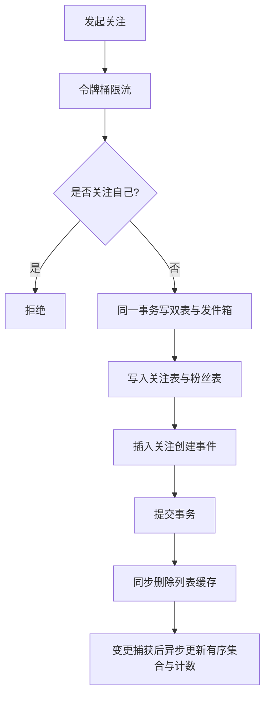

### 为什么双表

- 关注表：适合「我关注了谁」。
- 粉丝表：适合「谁关注了我」。
- 单表反向扫大表索引差。

### 为什么同事务

避免一边成功一边失败的半成功关系。

## A3. 列表三级缓存（中文流程图）

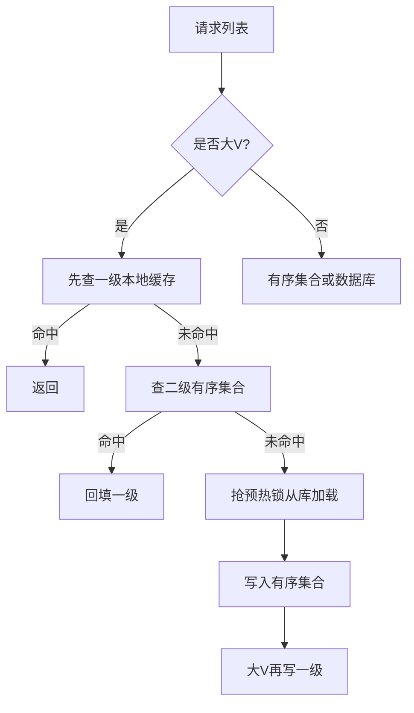

## A4. 写扩散 vs 读扩散（中文流程图）

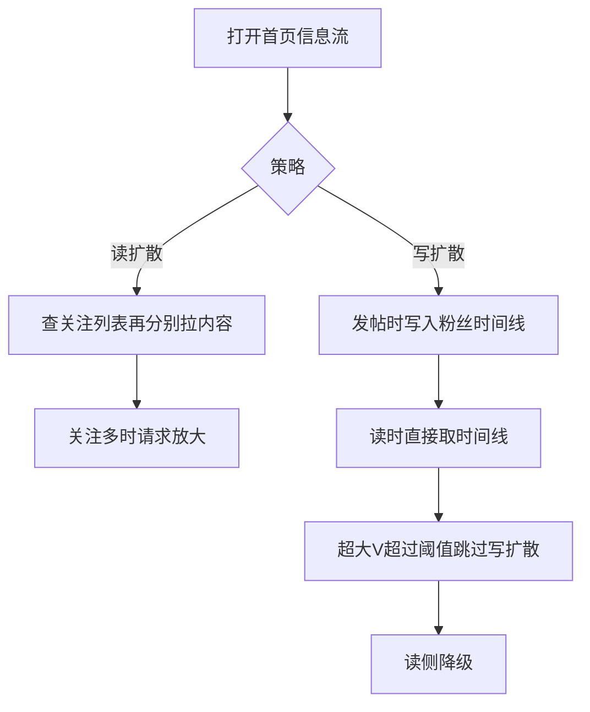

### 当前状态（源码接线，务必照实说）

| 组件 | 状态 |
|------|------|
| `fanout.Service` 写路径 | 已实现：按粉丝数分流，普通作者推、大 V 只写发件箱 |
| `fanout.TimelineReader` 读路径 | 已实现：收件箱 ⊕ 大 V 发件箱归并去重分页 |
| 事件来源 | 复用 `canal-outbox`，过滤 `KnowPostPublished`（独立 `fanout` topic 已移除） |
| 关注 / 取关 | 已接线：关注回填近期帖子，取关清理收件箱副本 |
| 读侧接口 | `GET /knowposts/feed/home`（关注流）；`/feed/mine` 恢复为「我的已发布」 |

结论：**扩散已完整闭环**。原「半接线」状态（`FanoutPublisher` 无调用方、`fanout` topic 无生产者、
大 V 直接跳过扩散且无读路径兜底）已全部修复，详见
[14-信息流扩散](14-信息流扩散-读扩散写扩散与推拉结合.md)。

## A5. 60 秒口述

> 关注双表同事务加 outbox。列表用有序集合加一级缓存，大 V 预热锁防击穿。信息流走推拉结合：普通作者写扩散加速读，大 V 改由读者拉取，读时归并；关注要回填、取关要清理收件箱副本。异步投影保证最终一致。

---

# 附录B：面试细节扩写

## B1. 关系模块的核心问题

关注关系不是简单的“插一行记录”。它同时要回答三类问题：

1. **单点关系**：A 有没有关注 B。
2. **正向列表**：A 关注了哪些人。
3. **反向列表**：谁关注了 B。

这三类查询的访问模式不同，所以不能只拿一个缓存方案硬套。

## B2. 为什么是 following / follower 双表

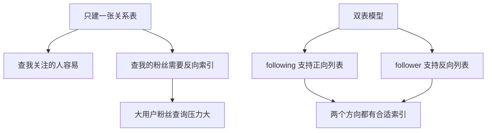

| 表 | 主要查询 | 核心索引思路 |
|----|----------|--------------|
| `following` | 我关注了谁 | `from_user_id + created_at` |
| `follower` | 谁关注了我 | `to_user_id + created_at` |

双表的代价是写入复杂，需要同事务维护两张表；收益是两个方向的列表查询都可以稳定走索引。

## B3. 关注状态语义

| 场景 | from -> to | to -> from | 返回 |
|------|------------|------------|------|
| A 关注 B，B 未关注 A | true | false | following |
| A 未关注 B，B 关注 A | false | true | followed |
| 双方互关 | true | true | mutual |
| 双方无关系 | false | false | none |

单条关系判断建议直查 MySQL，因为它是强语义判断，频率通常低于列表读取，而且缓存单点关系会带来大量小 key 和失效复杂度。

## B4. Follow 写路径时序图

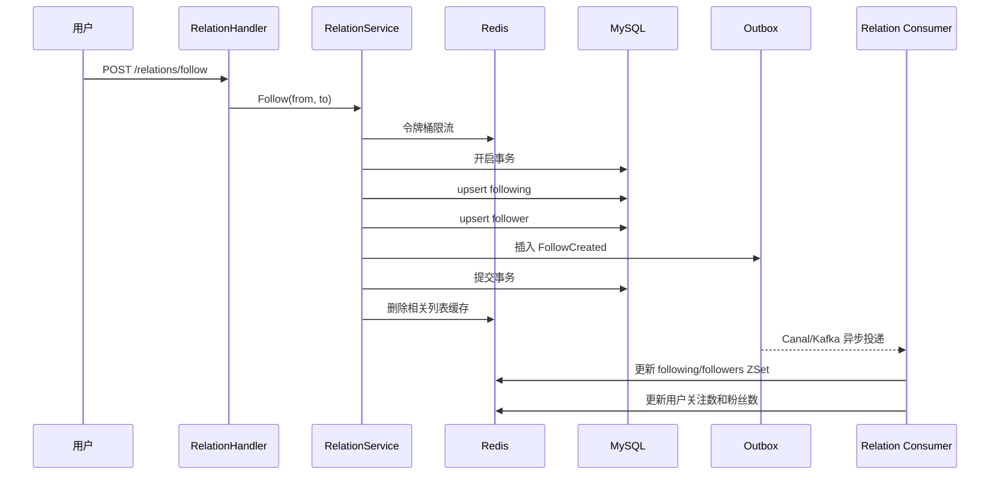

这里同步做的是“真值写入 + 缓存失效”，异步做的是“投影补齐”。这样即使消费者延迟，MySQL 真值仍然正确。

## B5. 关注列表读取路径

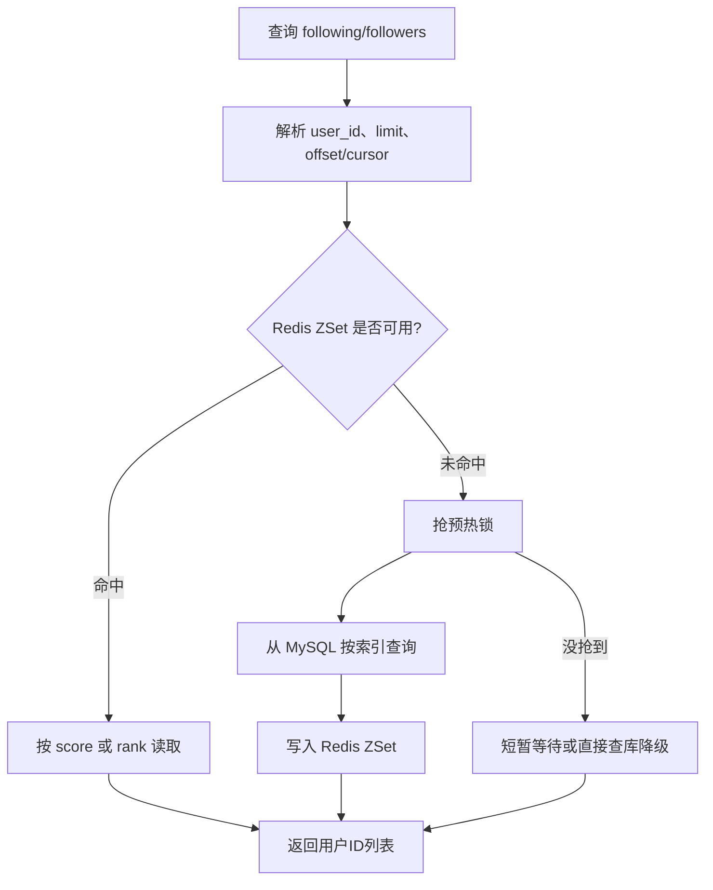

列表缓存的目标是减少重复列表查询的 DB 压力，但它不改变真值来源。缓存不一致时，以 MySQL 为准。

## B6. 大 V 为什么要特殊处理

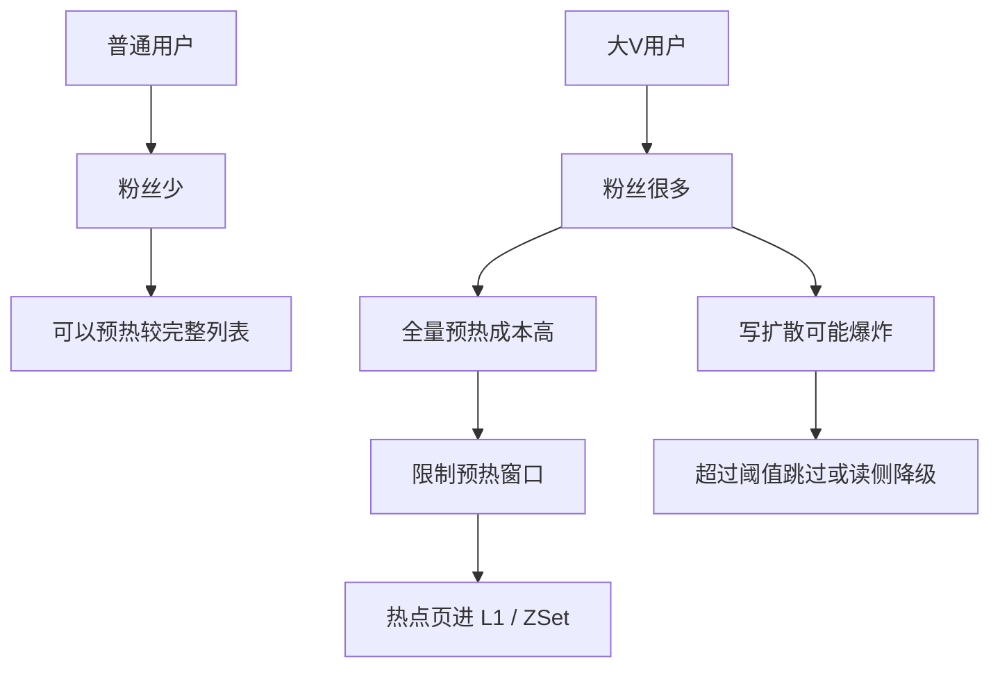

大 V 的难点不是“能不能查出来”，而是不能让一个大用户的关系变更或发帖扩散拖垮整个系统。面试时要讲分层策略，而不是一句“加缓存”。

## B7. Feed 扩散和关系模块的边界

关系模块提供粉丝列表，Fanout 模块负责把内容写入粉丝时间线：

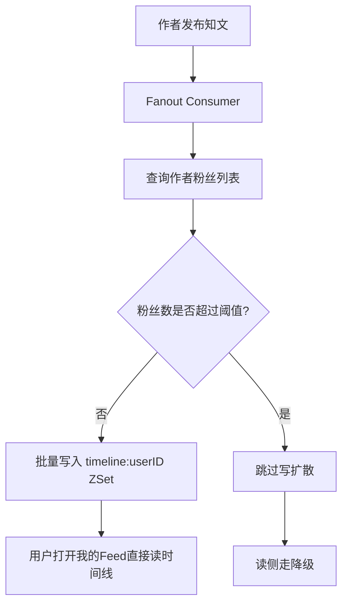

这能回答“关注关系和 Feed 有什么关系”：关系是真值边，Feed 是由关系边派生出的读模型。

## B8. 这个模块最应该主动讲的边界

| 边界 | 为什么重要 | 下一步改法 |
|------|------------|------------|
| dedupe 先落标 | 副作用失败后重试可能被去重吞掉 | 去重和副作用完成绑定，或失败任务阶段化 |
| ZSet score 使用处理时间 | 可能和真实关注时间不完全一致 | 使用事件中的 created_at 或 DB 时间 |
| 大 V 冷启动 | 依赖缓存判断可能误判 | 用 DB 计数或专门 profile 标识 |
| cursor 超出预热窗口 | 深分页可能截断 | 深页回源 DB 或后台分段预热 |
| 写扩散接线状态 | 设计和生产链路要区分 | 补端到端测试和消费监控 |

主动讲边界不会扣分，反而说明你知道系统还可以怎样演进。

## B9. 2 分钟展开回答

> 关系模块我用双表保存真值，`following` 支持我关注了谁，`follower` 支持谁关注了我，两个方向都能按索引分页。Follow 和 Unfollow 会同事务更新双表并写 outbox，提交后同步失效缓存；Canal/Kafka 异步消费事件，把关系投影到 Redis ZSet，并更新用户关注数和粉丝数。单条关系判断我选择直查库，因为它是强语义查询，缓存单点关系收益不高但失效复杂。列表查询才走 Redis ZSet 和本地缓存。大 V 场景下不能全量预热和无限写扩散，需要限制窗口、设置阈值，并允许读侧降级。

---

## 📌 避坑指南与自测思考题

### ⚠️ 生产避坑指南（新手最易踩的坑）

1. **切忌将 `IsFollowing` 单条关系缓存进 Redis**：
   - 错误做法：每次用户判断 `IsFollowing(A, B)` 时，往 Redis 写 `key: rel:A:B = true`。
   - 后果：若 A 拥有 5000 个关注，Redis 中会散落 5000 个细碎 Key，内存碎片化严重，且当 A 取消关注时，难以保证这些散落 Key 100% 被实时同步清理。
   - 正确做法：单条关系直接查 MySQL 主键覆盖索引（耗时 < 1ms），列表查询走 ZSet 统一聚合。

2. **注意区分写扩散 Fanout 的算法存在与生产接线状态**：
   - 错误做法：在面试或答辩时，将 Fanout 描述为“用户发布文章后已全自动推送到几百万粉丝的时间线 ZSet 中”。
   - 后果：只说「用了写扩散」而讲不清大 V 怎么办，是这道题最常见的失分点。
   - 正确做法：说明「我们不是二选一，而是按粉丝数分流——普通作者走写扩散，大 V 走读扩散，读首页时归并两路。这样写侧扇出被配置阈值封死，读侧成本被读者关注的大 V 数封死」。

### 🧐 巩固自测思考题

- **思考题 1**：为什么关注/粉丝关系列表在 Redis 中选择 **ZSet** 而不是 List 结构？
  - *提示*：ZSet 支持按 `score` (毫秒时间戳) 进行天然去重与高性能游标 (Cursor) 分页 (`ZREVRANGEBYSCORE`)，避免了 List 在有新关注插入时导致的跳页与重复页。
- **思考题 2**：如果粉丝数超过 100 万的大 V 用户发布文章，采用完全写扩散 (Push) 会发生什么？
  - *提示*：需要往 100 万个粉丝的 timeline ZSet 中逐个 `ZADD`，产生数百万次 Redis 写操作，造成严重的网络与 CPU 写爆破（写放大），因此大 V 必须强制截断写扩散，转为粉丝端在线拉取。
