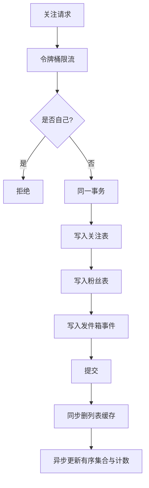
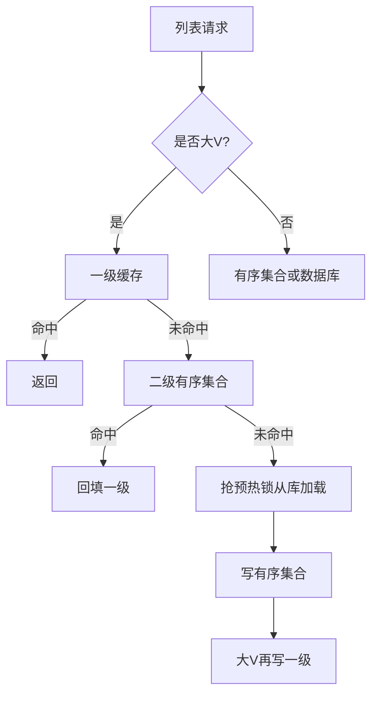
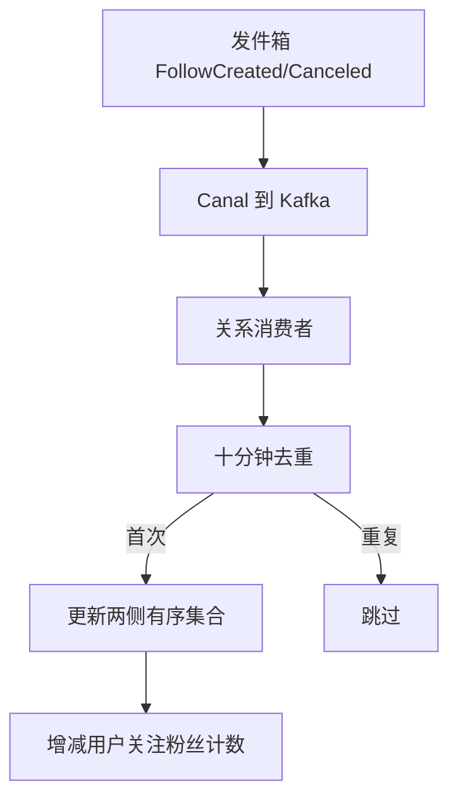
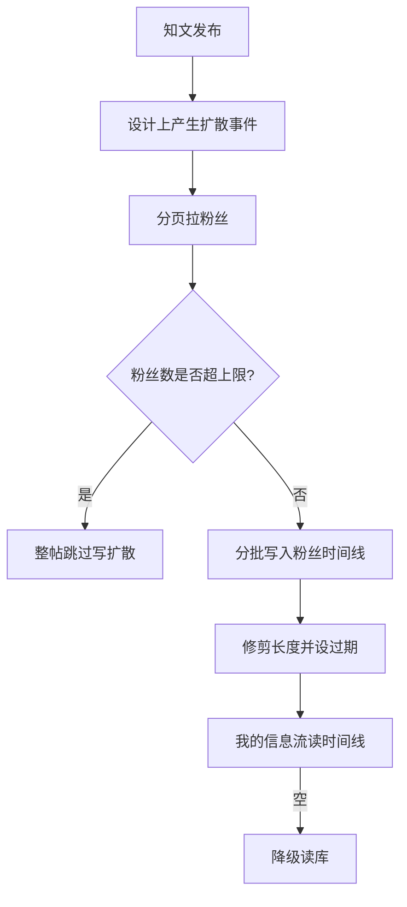

# 06. 关注关系与 Feed 扩散模块

## 1. 是什么

| 模块 | 路径 | 职责 |
|------|------|------|
| 关系 | `internal/relation` | 关注/取关、状态、关注列表、粉丝列表、关系计数投影 |
| 扩散 | `internal/fanout` | 将作者新帖写入粉丝时间线（写扩散） |

挑战：关系读多写少，但大 V 粉丝列表巨大；列表、计数、Feed 分发都要缓存与异步化。

## 2. 一句话

> 关注**双表同事务 + 发件箱**；列表用 **Redis 有序集合 + 一级缓存 + 大 V 预热锁**；Feed 设计为写扩散加速读，超大 V 熔断，读侧可降级。

## 3. 路由

| 方法 | 路径 | 登录 | 作用 |
|------|------|------|------|
| POST | `/api/v1/relations/follow` | 是 | 关注 |
| POST | `/api/v1/relations/unfollow` | 是 | 取消关注 |
| GET | `/api/v1/relations/status` | 是 | 双方关系 |
| GET | `/api/v1/relations/following` | 可选 | 关注列表 offset |
| GET | `/api/v1/relations/followers` | 可选 | 粉丝列表 offset |
| GET | `/api/v1/relations/following/cursor` | 可选 | 关注列表游标 |
| GET | `/api/v1/relations/followers/cursor` | 可选 | 粉丝列表游标 |

## 4. 数据模型（双表）

### following（我关注了谁）

唯一键：`(from_user_id, to_user_id)`  
索引方向：发起方 → 列表「我的关注」

### follower（谁关注了我）

唯一键：`(to_user_id, from_user_id)`  
索引方向：被关注方 → 列表「我的粉丝」

`rel_status`：1 有效 / 0 取消（软删，便于审计与恢复）

**为什么双表**：双向查询各走最合适索引，避免单表反向扫大表。

## 5. 关注写路径



### 限流

- 键：`rl:follow:{userID}`  
- Lua 令牌桶，默认容量/速率可配  
- 超限返回未变化（业务静默或 429，以 handler 为准）

### 取消关注

- 事务内把双表 `rel_status` 置 0 + 发件箱  
- affected=0 → 幂等返回未变化  
- 注意：一侧 0 行时可能仅告警，存在历史不一致容忍

## 6. 列表缓存

```text
z:following:{uid}   score=时间毫秒  member=对方ID
z:followers:{uid}
l1:following:{uid}  一级缓存 ID 串
bigv:{uid}
lock:relation:list:...
dedup:rel:...
cnt:user:{uid}      following/follower 字段
```



### 分页

| 方式 | 特点 |
|------|------|
| offset | 简单，深分页慢，有上限保护 |
| cursor | 用 score 游标，适合无限滚动 |

## 7. 异步投影



说明：

- API 内不同步写全量 Redis 列表，靠最终一致投影。  
- 实现上计数可能直接 `HINCRBY`，失败重试能力有限——面试可提改进。

## 8. Feed 写扩散



| 项 | 典型默认 |
|----|----------|
| FanoutMaxFans | 10000（超过跳过） |
| 时间线 TTL | 约 7 天 |
| 时间线长度 | 约 1000 |

**当前状态（必须诚实）**：

- `FanoutPost` 算法与 consumer 有实现  
- Publisher / 发布事务是否完整接线以代码为准  
- 未闭环时 GetMineFeed 大量降级  

## 9. 写扩散 vs 读扩散

| | 读扩散 | 写扩散 |
|--|--------|--------|
| 做法 | 读时查关注再拉内容 | 发帖时推到粉丝时间线 |
| 优点 | 写简单 | 读快 |
| 缺点 | 关注多时读放大 | 粉丝多时写放大 |
| 本项目 | 降级兜底 | 小 V 友好 + 大 V 熔断 |

## 10. 代码入口

| 文件 | 要点 |
|------|------|
| `follow.go` | 关注/取关、限流、事务 |
| `list.go` / `cache.go` | 列表与预热 |
| `event_processor.go` | 异步投影 |
| `fanout_service.go` | 写扩散算法 |
| `fanout/publisher.go` `consumer.go` | 生产/消费 |

## 11. 风险

1. Fanout 生产路径可能未闭环  
2. 双表取消一侧失败的容忍  
3. 去重窗口有限，长重放可能重复计数  
4. 一级缓存跨实例靠 TTL  
5. 计数主在 Redis，丢数据需重建策略  

## 12. 60 秒口述

> 关注双表同事务加发件箱，保证双向列表索引与事件。列表用有序集合加大 V 预热锁。写扩散给普通作者加速读，超大 V 熔断。异步投影保证缓存与计数最终一致。

## 13. 面试快问

**Q：为什么双表？**  
A：双向查询索引友好，单表反向慢。

**Q：为什么列表用有序集合？**  
A：时间序 + 游标分页，插入删除高效。

**Q：大 V 怎么办？**  
A：列表侧阈值预热缓存；扩散侧粉丝上限熔断。

---

以源码为准。Fanout 接线状态以 `internal/fanout` 与发布路径实际调用为准。
