# 搜索模块

## 0. 重构后两点对齐说明

1. **`FeedItem` 归还本模块**：它曾以 `model.FeedItem` 的名义放在 internal/model「供 knowpost 与 search 共享」，
   但 knowpost 从未用过它（自维护逐字段重复的 FeedItemResponse）——共享抽象名存实亡，
   现回归唯一真实使用方 search（`internal/search/feed_item.go`）。
2. **计数依赖收窄为 3 方法消费侧接口**（`SearchCounterClient`）：此前是 counter 完整接口的别名，
   搜索只用 3 个方法却依赖 13 个，counter 的签名演进曾触发本模块连锁编译失败。

## 1. 模块定位

搜索模块承担两类能力：

1. 面向用户的查询能力
2. 面向索引的异步投影能力

它不是一个“调一下 ES SDK”的薄封装，而是一个同时包含：

- 查询模型
- 排序模型
- 分页模型
- 自动补全
- 异步索引同步

的完整模块。

## 2. 一句话介绍

搜索模块把“在线查询”和“异步建索引”拆成两条职责：查询侧用 Elasticsearch 的 BM25 + function_score + search_after 提供全文检索和 suggest，写侧通过 outbox 消费链路把知文主数据和实时计数最终一致地投影到 ES，从而兼顾检索体验和主链路解耦。

## 3. 核心流程

## 3.1 搜索查询流程

搜索请求流程是：

1. 组装 ES 查询 DSL
2. `multi_match` 搜标题和正文
3. 用 `function_score` 融合相关性和热度指标
4. 只过滤：
   - `status = published`
   - `visible = public`
5. 使用 `search_after` 游标分页
6. 把 ES 命中的文档转成业务响应
7. 对登录用户补 liked/faved 用户态信息

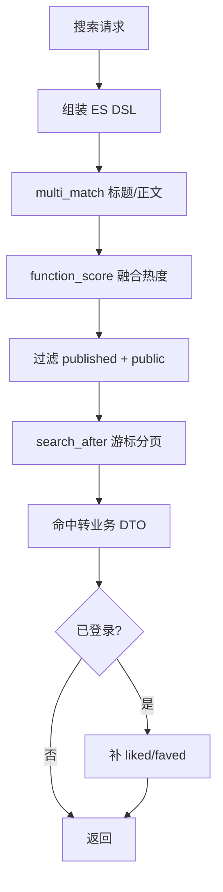

## 3.2 自动补全流程

补全查询依赖 ES completion suggester：

1. 根据前缀构造 suggest 请求
2. 从 `suggest` 字段拿候选
3. 去重
4. 截断到指定数量

补全来源既可以是标题，也可以是标签。

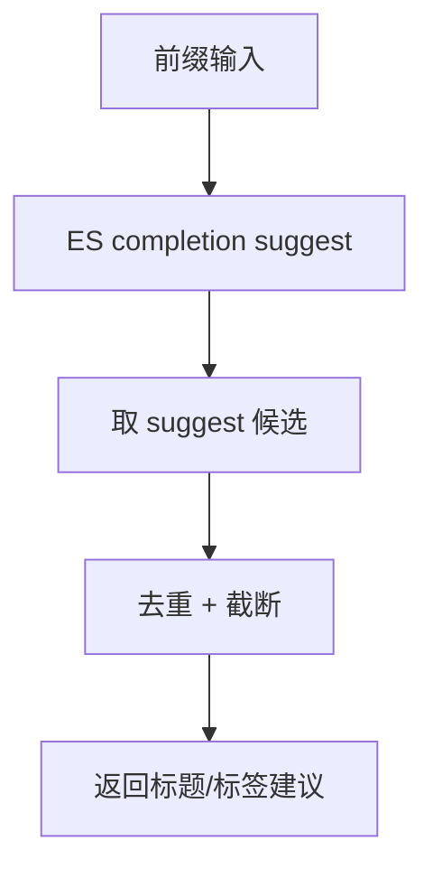

## 3.3 写入索引流程

知文变更不会同步直接写 ES，而是：

1. 知文事务内写 outbox
2. Canal 订阅 binlog
3. 桥接到 Kafka
4. `search.OutboxConsumer` 消费 `canal-outbox`
5. `KnowPostProjector` 解析 payload
6. 根据 `op` 做 upsert 或 delete
7. 从 MySQL 重查最新主数据
8. 查询计数模块补 like/fav count
9. 重新索引到 ES

这里的关键是：

**ES 不是主数据源，而是最终一致的搜索投影。**

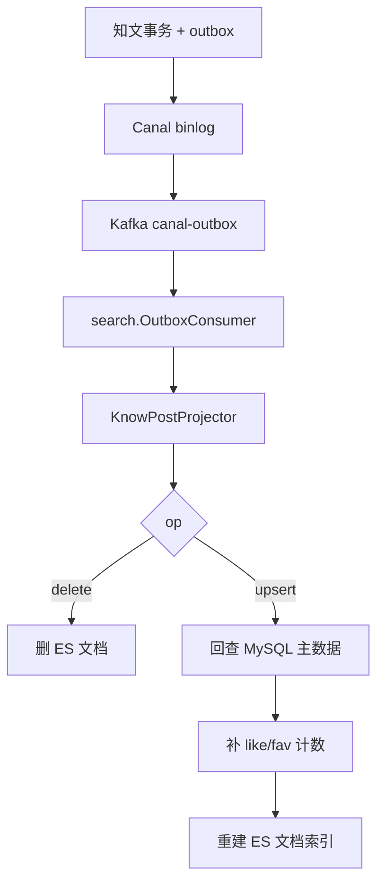

## 4. 设计亮点

## 4.1 查询和投影职责分离

搜索模块不是一个大 service 既查又写，而是拆成：

1. `SearchService`
2. `KnowPostProjector`
3. `OutboxConsumer`

这个边界很干净，因为：

- 在线查询面向用户延迟
- 投影面向最终一致性
- consumer 面向幂等与容错

三者关注点完全不同。

## 4.2 relevance 和 popularity 混排

当前搜索不是只按 BM25 排，而是用 `function_score` 融合：

- `_score`
- `like_count`
- `view_count`

这在面试里很好讲，因为它体现了一个成熟搜索系统的思路：

**搜索结果不仅要“文本相关”，还要“结果好看”。**

## 4.3 深分页用 search_after

这不是细节，而是一个关键设计点。

`from + size` 深分页的痛点是：

- 越往后翻，ES 排序成本越高
- 对大数据量很不友好

`search_after` 的价值是：

- 更适合连续翻页
- 不需要 ES 重新跳过大量前置结果

## 4.4 用户态信息和索引主数据解耦

搜索索引文档保存的是公共数据。  
当前用户是否已点赞 / 已收藏，不直接预写进索引，而是在返回结果时调用 counter 补充。

这和知文详情页的思想是一致的：

- 公共数据做投影
- 用户态数据实时增强

## 4.5 索引构建不是相信事件载荷，而是回查主库

Projector 收到事件后不会直接相信 payload 就把文档写到 ES，而是：

1. 把 payload 只当成“通知”
2. 根据 ID 回主库查完整最新数据
3. 再构建索引文档

这让索引构建更稳，因为：

- 事件载荷可以保持轻量
- 即使消息延迟，最终投影仍基于最新数据库状态

## 5. 难点与边界

### 5.1 搜索是最终一致，不是强一致

知文刚发布时，可能存在短时间窗口：

- 主库已经可见
- ES 还没完成投影

这是 Outbox + MQ 异步链路的天然特征。  
关键不是否认这个窗口，而是把它控制在可接受范围，并让链路可恢复。

### 5.2 热度排序不是越多字段越好

如果在 function_score 里一味塞很多特征，容易带来：

- 可解释性变差
- 调参困难
- 排序漂移

当前只用 `like_count` 和 `view_count`，其实是相对克制的。

### 5.3 搜索索引不是权限系统

当前搜索只索引公开已发布内容，这意味着：

- 搜索层不需要承担复杂权限判断
- 私有内容不会被误暴露进公开检索结果

如果以后做“我的草稿搜索”之类能力，建议单独设计，而不是直接放进公开索引。

### 5.4 consumer 的 watermark 和坏消息跳过，是工程折中不是魔法

搜索这条链路当前也不是“消费了就天然安全”，它依赖两层工程手段：

1. 正常消息处理成功后推进 watermark
2. 明确无法解析的坏消息直接跳过，避免卡死整个 partition

这样做的好处是：

- commit 失败导致的重复投递，可以先被 watermark 挡住
- 单条坏消息不会拖垮整个搜索投影链路

但它的代价也很明确：

- 坏消息一旦跳过，就必须配合日志、报警和后续补数
- 如果坏消息影响了重要索引数据，最终还是要靠重放或全量重建收口

所以这个模块的正确说法不是“我们能跳坏消息，所以没事”，而是“我们优先保住链路可用，再靠修复链路追平”。

### 5.5 `search_after` 依赖稳定排序键，不是一个万能按钮

当前查询排序并不是单一 `_score`，而是结合了：

- `_score`
- `publish_time`
- `like_count`
- `view_count`
- `id`

这让连续翻页更稳定，但也意味着：

- 如果热度字段变化很快，前后页边界仍可能轻微漂移
- `search_after` 解决的是深分页成本问题，不是绝对静态快照问题

面试时如果你主动承认这一点，会比把 `search_after` 讲成“完美分页方案”更成熟。

## 6. 面试官高频问题

### Q1：为什么知文发布后不直接同步写 ES？

**参考回答：**

因为搜索索引不是主业务真值，没必要把 ES 可用性绑到主写路径上。  
如果同步写 ES，那么 ES 抖动就会直接拖慢甚至拖挂知文发布。  
我选择事务 outbox + 异步投影，是为了让主写路径只对主库负责，搜索索引走最终一致。

### Q2：为什么搜索结果要混合相关性和热度，而不是只按相关性排？

**参考回答：**

因为纯相关性排序在很多内容场景下不够好用。  
同样相关的两篇内容里，用户往往更倾向点开互动更高、可信度更强的结果。  
所以我用 `function_score` 给 `like_count` 和 `view_count` 加权，让结果既相关，又有业务上的“质量感”。

### Q3：为什么用 search_after，不用 from/size？

**参考回答：**

因为 `from/size` 深分页会让 ES 为了拿第 N 页，不断跳过前面大量结果，排序成本很高。  
`search_after` 更像基于上一个结果继续往后翻，适合连续翻页场景，性能更稳定。

### Q4：为什么 projector 收到事件后还要回查 MySQL？

**参考回答：**

因为事件的职责是通知，不是完整快照。  
回查 MySQL 可以确保索引基于最新主数据构建，而不是完全依赖事件里那一份载荷。  
这样事件可以更轻，也更稳。

### Q5：为什么搜索结果里的 liked/faved 不直接存到 ES？

**参考回答：**

因为那是用户态数据，不是公共文档数据。  
如果写进 ES，就要么按用户维度建索引，要么每次状态变化都要回写索引，这两个都不划算。  
所以更合理的方式是查询结果返回前做用户态增强。

### Q6：为什么搜索 consumer 可以跳过坏消息，不怕丢数据吗？

**参考回答：**

跳坏消息的目标不是“数据无所谓”，而是避免一条脏消息把整个 partition 卡死。  
因为搜索索引本身是投影，不是主数据真值，所以我优先保住消费链路继续往前走。  
但这不代表问题结束了，后面仍然要靠日志告警、消息排查，以及必要时的重放或全量重建来把索引追平。

## 7. 场景题

### 场景题 1：如果面试官让你设计“按标签 + 时间范围 + 热度排序”的搜索，你会怎么扩展？

**推荐回答：**

我会分两层看：

1. 过滤条件：
   - tags
   - publish_time range
   - status / visible
2. 排序层：
   - 基础相关性 `_score`
   - 热度因子
   - 时间衰减因子

也就是说，不是简单把更多字段塞进一个大 query，而是区分“过滤”和“重排”。

### 场景题 2：如果 ES 宕机了，主站还能不能工作？

**推荐回答：**

能工作，但搜索功能会降级。  
这是这个项目启动层的一个明确策略：搜索属于可选能力，配置不完整或初始化失败时，主站不挂，只是搜索相关接口返回 `503`。

### 场景题 3：如果以后要做“搜索结果个性化”，你会怎么演进？

**推荐回答：**

我不会一开始就把个性化逻辑硬塞进 ES query。  
更合理的是：

1. 先保证召回质量
2. 再在应用层做轻量 re-rank
3. 用用户兴趣、关系权重或行为特征做二次排序

这样系统会更可控，也更容易逐步实验。

## 8. 最容易讲错的地方

### 8.1 不要把搜索模块讲成“就是接了个 ES”

真正有价值的是这几件事：

1. 索引不是主库，而是投影
2. 查询和投影职责拆开
3. 排序不是纯 BM25
4. 深分页不是 from/size

### 8.2 不要把最终一致性讲成强一致

更好的说法是：

**主链路保证 DB 正确，搜索链路通过 outbox 异步追平。**

## 9. 继续深挖时你可以怎么答

### 9.1 如果面试官继续问：为什么 projector 要回查主库，而不是直接用消息里的 payload？

你可以这样答：

> 因为我把 payload 当成“通知”，而不是“完整可信快照”。  
> 这样做的好处是事件可以保持轻量，业务写路径不需要携带一大份搜索文档数据。  
> 更重要的是，即使事件消费晚了一点，projector 回查主库时拿到的仍然是当前最新状态，最终索引更稳。

### 9.2 如果面试官继续问：为什么搜索里要混热度，而不是纯相关性？

你可以这样答：

> 因为内容搜索不是学术检索。  
> 用户通常希望结果既相关，又别太“冷”。  
> 所以我用 `function_score` 给点赞数和浏览量加了一层业务权重，但又没有完全盖掉 `_score`，本质是在做 relevance 和 popularity 的折中。

### 9.3 如果面试官继续问：如果索引全坏了，怎么恢复？

你可以这样答：

> 这是搜索投影和主库分离的另一个好处。  
> 因为 ES 不是主数据源，所以最坏情况下我可以重新跑一轮全量投影。  
> 做法可以是重新扫描主库知文，或者从 outbox/Kafka 重放，具体看数据规模和保留周期。  
> 也就是说，索引坏了很麻烦，但不是不可恢复。

### 9.4 如果面试官继续问：你现在这个搜索还有什么明显边界？

你可以这样答：

> 一个很真实的边界是当前索引更偏向标题、简介、标签这类结构化和摘要化内容，正文全文能力还没有完全走到一个重内容搜索系统的程度。  
> 所以如果以后要强化搜索质量，我会继续补内容抽取、分词策略和召回重排，而不是只在现有 DSL 上堆参数。

### 9.5 如果面试官继续问：如果未来要做推荐，搜索模块能不能直接顶上？

你可以这样答：

> 搜索和推荐可以共享一部分索引和特征，但我不会把它们混成一个系统。  
> 搜索是 query-driven，推荐更偏 user-driven。  
> 搜索强调相关性，推荐更强调兴趣匹配和探索。  
> 所以我会复用部分召回基础设施，但不会直接把搜索排序当推荐排序。

### 9.6 如果面试官继续问：坏消息跳过了，那不是等于丢数据吗？

你可以这样答：

> 如果从单条消息视角看，确实是把这条坏消息从实时链路里跳过去了。  
> 但这是一个有意的工程折中，因为我不希望一条脏消息把整个搜索投影消费卡死。  
> 更重要的是搜索索引不是主库真值，所以我可以接受“实时链路先保活”，再通过告警、重放或者全量重建把索引追平。  
> 也就是说，我不是忽略数据，而是在主数据正确的前提下选择更稳的恢复方式。

---

# 附录A：工程级扩写

## A1. 索引投影（中文流程图）

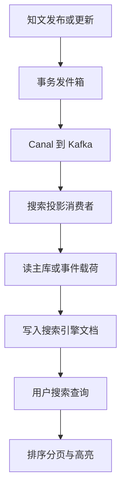

## A2. 查询路径

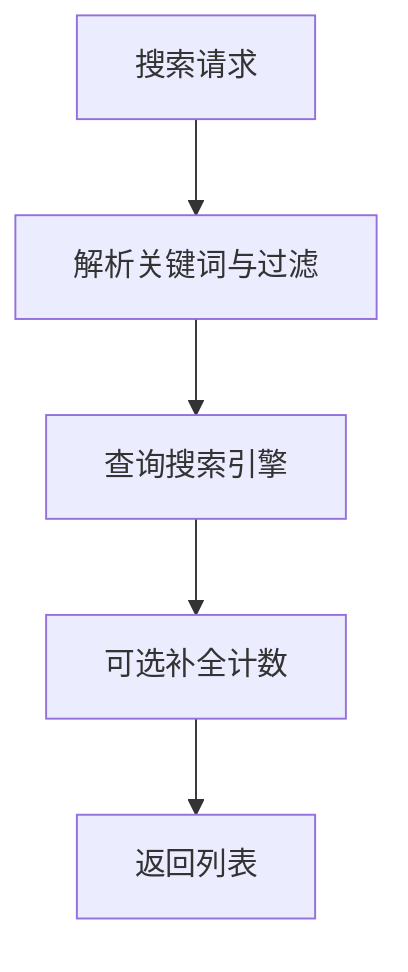

## A3. 讲解要点

- 搜索是派生视图，最终一致。
- 删除/可见性变更必须投影，避免搜到不该见的内容。
- 排序模型与计数/时间字段相关，计数滞后可接受。

## A4. 60 秒口述

> 搜索靠 outbox 异步投影，不跟写接口双写 ES。查询侧负责召回排序分页，一致性靠事件与幂等投影。

---

# 附录B：流程图扩写

## B1. 搜索索引生命周期

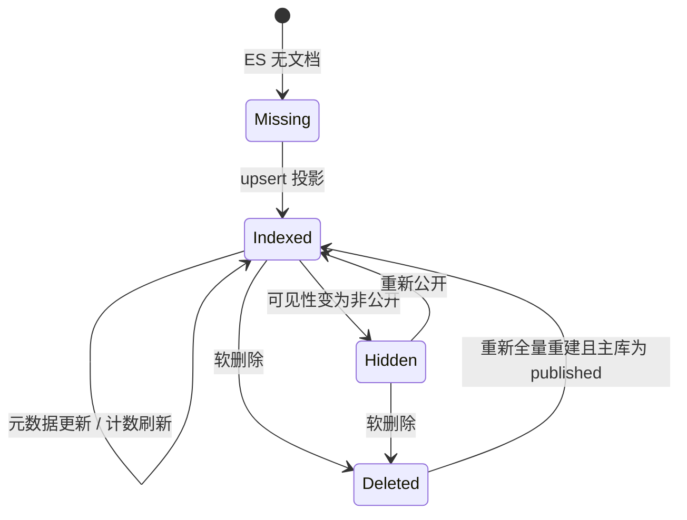

面试重点：ES 文档状态跟随 MySQL 真值变化，ES 不是内容真值，只是查询投影。

## B2. Outbox 到 ES 的详细投影流程

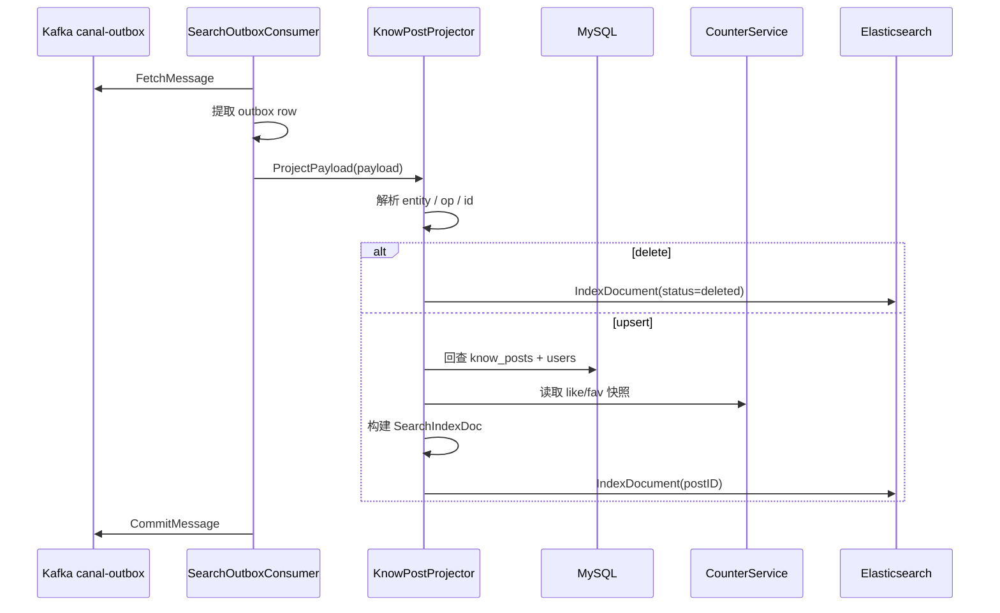

这里强调“回查主库”：事件只告诉你发生了变化，最终写入 ES 的完整文档以当前 MySQL 真值为准。

## B3. 搜索查询 DSL 组装流程

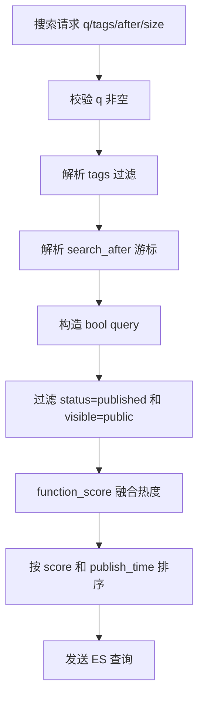

面试说法：搜索不是直接 `LIKE`，而是把业务过滤、相关性和热度排序组合成查询 DSL。

## B4. 查询结果增强流程

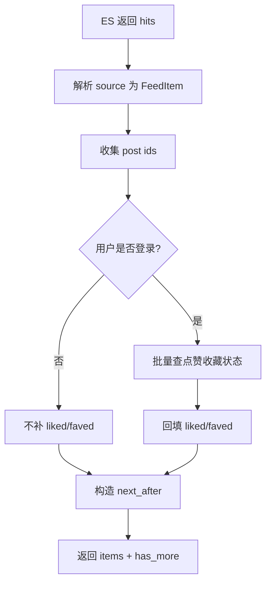

用户态数据不能直接存在 ES 文档里，因为不同用户看到的 liked/faved 不同。

## B5. search_after 分页流程

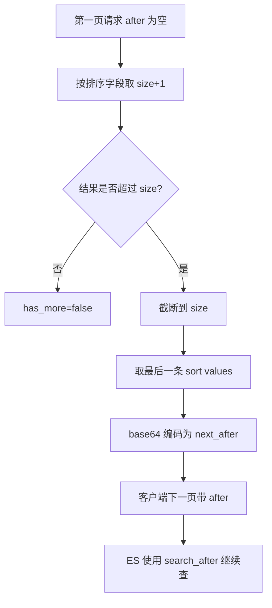

相比 `from + size`，`search_after` 更适合深分页，因为 ES 不需要跳过大量前置结果。

## B6. 删除和可见性变更投影

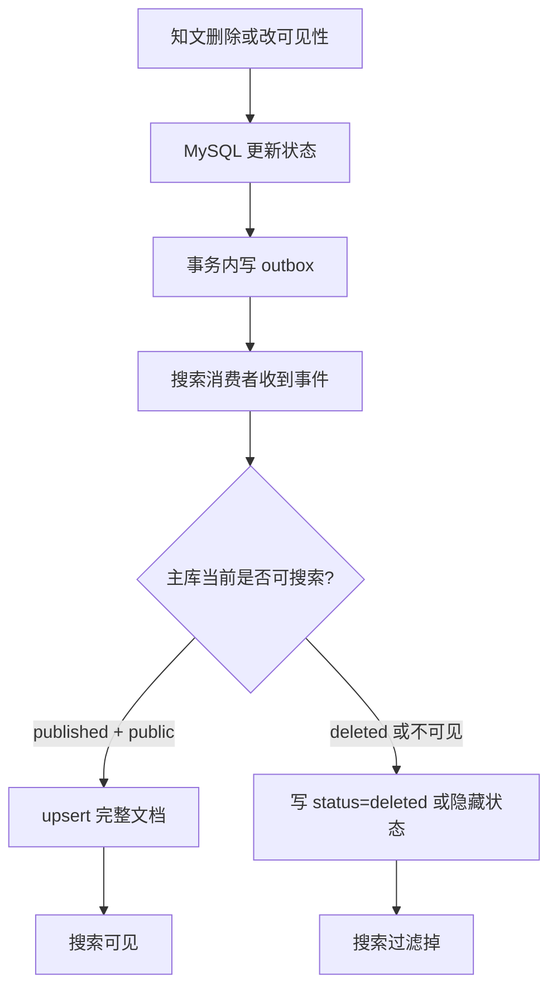

这张图可以回答“为什么删除必须投影”：否则 ES 里会残留已经不可见的内容。

## B7. ES 不可用时的影响面

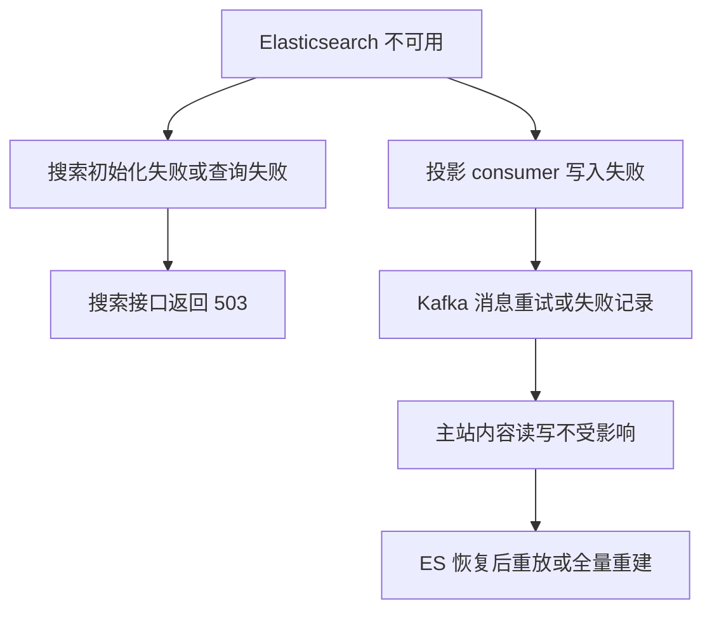

面试重点：搜索是增强查询能力，不应该拖垮内容发布和详情读取主链路。

## B8. 全量重建索引流程

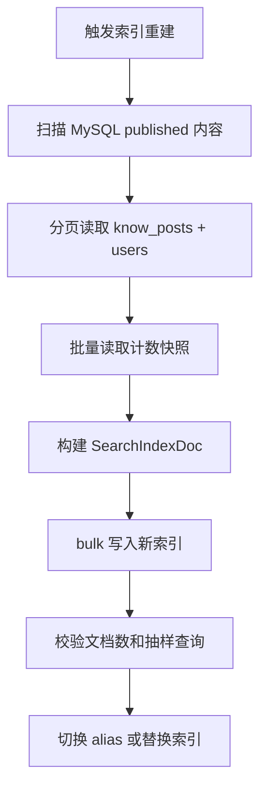

如果面试官追问“索引全坏了怎么办”，这张图就是答案：ES 可重建，因为 MySQL 是真值。

## B9. 搜索模块 2 分钟口述

> 搜索模块是典型的派生投影。知文发布、更新、删除会写 outbox，Canal/Kafka 把事件送到 Search Consumer，Projector 不完全相信事件 payload，而是回查 MySQL 和用户表，再补计数快照构建 ES 文档。查询侧解析关键词、标签、分页游标，构造 bool query 和 function_score，把 BM25 相关性和热度字段结合起来；分页用 search_after 避免深分页问题。用户态 liked/faved 不写入 ES，而是在查询结果返回前批量补齐。ES 宕机不会影响主站写入，恢复后可以通过重放或全量重建追平。
