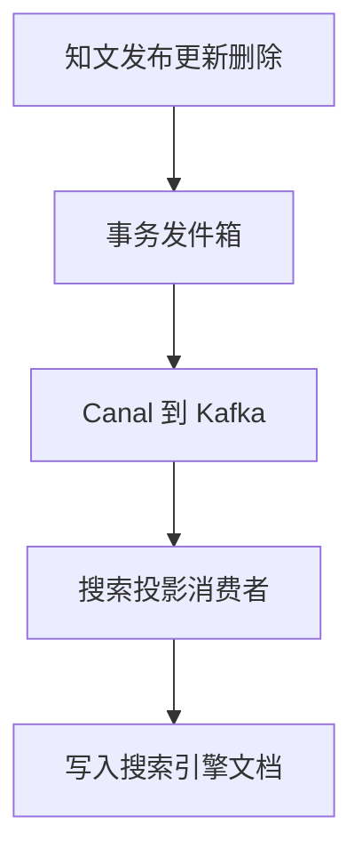
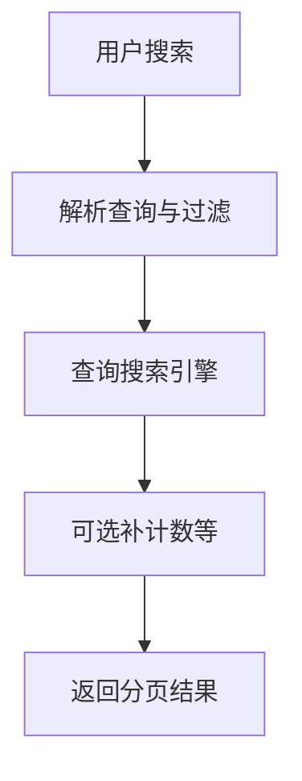

# 07. 搜索投影模块

## 1. 是什么

模块：`internal/search`（及 projector）

能力：

1. 面向用户的搜索查询（关键词、过滤、排序、分页、补全等）  
2. 面向索引的**异步投影**（消费知文等事件写搜索引擎）

## 2. 一句话

> 搜索是**派生视图**：写接口不双写 ES；靠事务发件箱 + Canal + Kafka 投影；查询侧负责召回与排序，接受最终一致。

## 3. 投影与查询

## 4. 讲解要点

- **可见性 / 删除**必须投影，否则搜到不该见的内容  
- 计数类字段可能滞后（来自 counter 最终一致）  
- 中文分词与 analyzer 影响效果，可单独优化  
- 幂等：重复事件 upsert / delete 应可重入  

## 5. 风险

1. 投影延迟 → 「刚发搜不到」  
2. 消费失败堆积 → 索引落后  
3. 映射字段变更需 reindex 策略  

## 6. 60 秒口述

> 我们不在发布接口里写 ES。发件箱保证事件与主数据同事务，投影消费者异步建索引。用户搜索走引擎，一致性是最终一致。

---

以 search projector 与 ES 配置为准。
