# Outbox + Canal + Kafka 异步链路

## 0. 两个必须知道的生命周期组件（重构后新增）

1. **outbox.Cleaner**：标准部署（canal.enabled=true）下 outbox 表的消费者是 binlog——
   Canal 不读表本身，行插入后永远不会被读取或删除，表只增不减。
   Cleaner 作为后台任务分批删除保留期（默认 7 天）外的行；删行对链路完全安全
   （Canal 消费的是 INSERT 事件，DELETE 变更会被消费端过滤）。
2. **outbox.DeadLetterRepository**：消费者「重试 3 次 → 记死信 → commit 跳过」，
   死信落 `counter_failed_messages`（stage=outbox，表名为历史遗留、列本就通用），
   search / relation / fanout 三个消费者统一注入。此前该挂点从无调用方，
   重试耗尽的消息只剩一行 Warn、随 commit 永久消失。

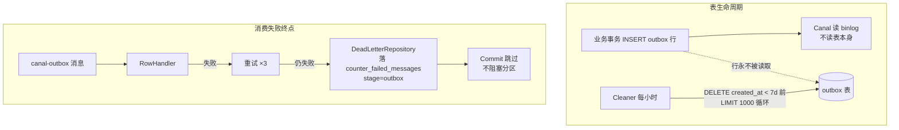

另：relation 消费端的幂等协议为「幂等的 ZSet 投影先行 + 去重落标与计数同段 Lua 原子」，
时序图见 [05 篇 6.6 节](05-点赞收藏计数模块.md)，约定归纳见 [15-设计约定与模式](15-设计约定与模式.md) 第 5 条。

## 1. 模块定位

这条链路是整个项目最核心的异步骨架之一。  
它把这些模块串了起来：

- knowpost → search（ES 投影）
- relation → Redis ZSet 投影 + 用户 following/follower 计数（消费端 `HIncrBy`，**不经** `counter-events`）

**不在本链路内、容易混讲的点：**

| 链路 | Topic / 机制 | 与 outbox 关系 |
|------|--------------|----------------|
| like/fav 计数 | `counter-events` | **独立**；Bitmap 真翻转后应用发 Kafka |
| 写扩散 fanout | topic `fanout` | **独立**；当前 **Publisher 未注入**，Canal **不会**把 outbox 转到 fanout |
| outbox 直连轮询 | `DirectPoll` / `PollConsumer` | 有代码；`canal.enabled=false` 时 **不会**自动启用 |

如果没有 outbox 链路，系统会退化成大量手工双写。跨模块总图见 [`docs/跨模块流程图.md`](../跨模块流程图.md)。

---

### 🎓 教学导学板块

> **🎯 学习目标**
> 1. 理解分布式环境下**“双写一致性”**（DB 成功但 MQ 失败 / MQ 成功但 DB 回滚）的工程痛点与终极解法。
> 2. 掌握 **Transactional Outbox (事务发件箱模式)** 的设计原理：利用数据库本地事务绑定业务数据与事件行。
> 3. 掌握 **CDC (Change Data Capture)** 技术与 Canal 伪装成 MySQL Slave 节点解析 binlog 的底层流转机制。
> 4. 理解消费端的**幂等控制 (Idempotency)**（ES 同 ID 覆盖写、Redis `SETNX` 窗口去重）与**坏消息隔离跳过 (Poison Message Handling)**。
> 
> **📚 前置概念预习**
> - **CDC (变更数据捕获)**：通过读取数据库底层的 Redo/Binlog 日志直接捕获数据变更，对业务应用代码零侵入。
> - **Envelope (消息信封)**：将不同业务实体的变更统一下发格式，包含 `aggregate_type`、`aggregate_id`、`type` 与 `payload`。

---

## 2. 一句话介绍

这个项目采用“事务 outbox + Canal 订阅 binlog + Kafka 分发 + 消费端重试 / 死信 / 业务幂等”的组合，把业务主库写入和异步派生链路解耦开来：业务事务只保证主数据和 outbox 同时提交，后续由 Canal 把 outbox 变更桥到 `canal-outbox`；search / relation 两个 consumer group 各自投影。搜索用同 ID 覆盖写保持幂等；关系用 Redis 去重键 + ZSet 幂等写，并在消费端直接改用户 following/follower SDS。like/fav 的 `counter-events` 与写扩散 `fanout` 都是**旁路**，不要讲成同一条 canal-outbox 流水线。

## 3. 核心流程（教学深挖：双写一致性与 Outbox + Canal 机制）

> **💡 现实工程场景痛点：双写一致性灾难**
> 在绝大多数初学者项目中，常见代码如下：
> ```go
> err := db.CreatePost(post) // Step 1: 写数据库
> err = kafka.SendEvent(event) // Step 2: 发消息驱动搜索与关系
> ```
> 这种简单写法在生产环境下存在两个致命盲区：
> 1. **盲区 1（DB 成功，MQ 失败）**：数据库记录已创建，但此时 Kafka 网络发生瞬间抖动抛出 Error。结果是主库有文章，但 ES 索引未创建，用户搜不到刚发布的内容。
> 2. **盲区 2（MQ 成功，DB 回滚）**：消息已经成功打入 Kafka，但在随后的 `tx.Commit()` 阶段因为数据库锁超时导致事务被强制回滚。结果是搜索引擎搜出了文章，点击却报 `404 Not Found`。
> 
> **Outbox 模式的核心解法**：不直接在应用层向 MQ 发消息，而是把消息作为一条记录写进 MySQL 内部的 `outbox`（发件箱）表，**利用数据库自身的本地事务 ACID 特性**，保证业务数据与 Outbox 事件绝对原子的同进退！

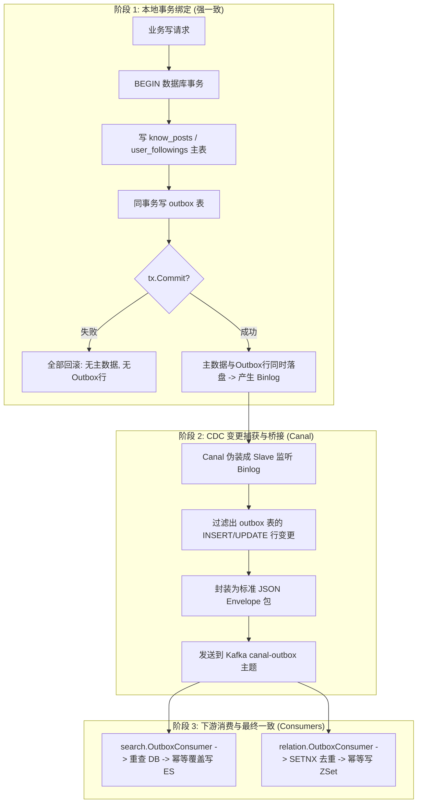

### 3.1 事务 outbox 写入 Step-by-Step

业务模块在 `runKnowPostTx()` 或 `runRelationTx()` 内做两件事：

1. **写业务主表**（如 `know_posts` 或 `user_followings` / `user_followers`）；
2. **同事务写 `outbox` 表**（写入 JSON 格式的 `payload`、`aggregate_type` 与 `type`）。

只有当两者在同一事务中成功 Commit 时，事务才算完成；若发生任何错误，整个事务完全回滚，`outbox` 绝不会留存垃圾记录。

### 3.2 Canal 监听 Binlog 原理

本架构引入了 **Canal（Change Data Capture, 变更数据捕获）** 桥接组件：

1. **Slave 协议模拟**：Canal 伪装成 MySQL 数据库的一个 Read-Only Slave 节点，挂载到 MySQL Master 上实时接收 binlog 二进制日志。
2. **行变更解析**：Canal 只关心 `outbox` 表的 `INSERT` 或 `UPDATE` 事件，将二进制日志还原为带有旧值与新值的 Row Event。
3. **Envelope 统一封装**：提取 `aggregate_type`（如 post、relation）、`aggregate_id` 与 `payload`，包装成统一格式的 JSON Envelope。

**教学结论**：通过 Canal，应用层彻底免去了“读出 outbox 记录 -> 发送到 Kafka -> 更新 outbox 状态为已发送”的繁重轮询任务，所有的消息捕获都是基于 MySQL 底层成熟的日志流，高效且对应用层零侵入！

## 3.3 Kafka 分发

Canal Bridge 会把消息写到 `canal-outbox` topic。  
分区 key 会尽量按聚合根构造，保证：

- 同一 knowpost 的事件进同一 partition
- 同一 follow 关系的事件进同一 partition

这样 consumer 侧才有“同分区有序”这个前提。

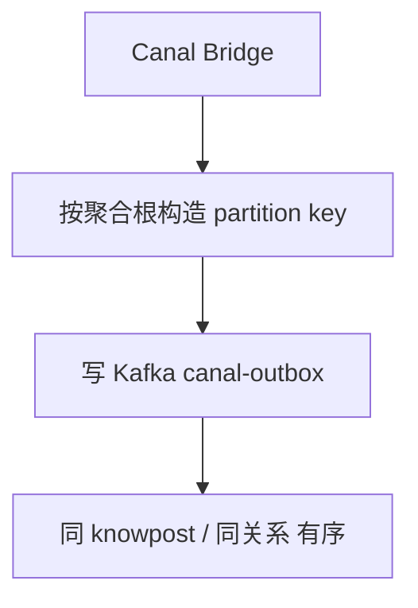

## 3.4 Consumer 处理与幂等边界

通用 outbox consumer 的职责是：

1. 从 Kafka 拉取 CanalEnvelope
2. 提取 outbox 行
3. 调用业务 RowHandler
4. 失败时最多重试 3 次
5. 重试耗尽后记录失败消息并 commit 跳过

具体幂等由业务 consumer 自己兜底：

1. search consumer：按知文 ID 写 ES 文档，同一 ID 重复 upsert 会覆盖旧投影。
2. relation consumer：用 Redis `SETNX dedup:rel:*` 做短窗口去重，并用 ZADD/ZREM 这类幂等操作更新投影。
3. counter consumer：不走 outbox 通用 consumer，而是在 `counter-events` 链路里使用 partition 级 applied offset 水位。

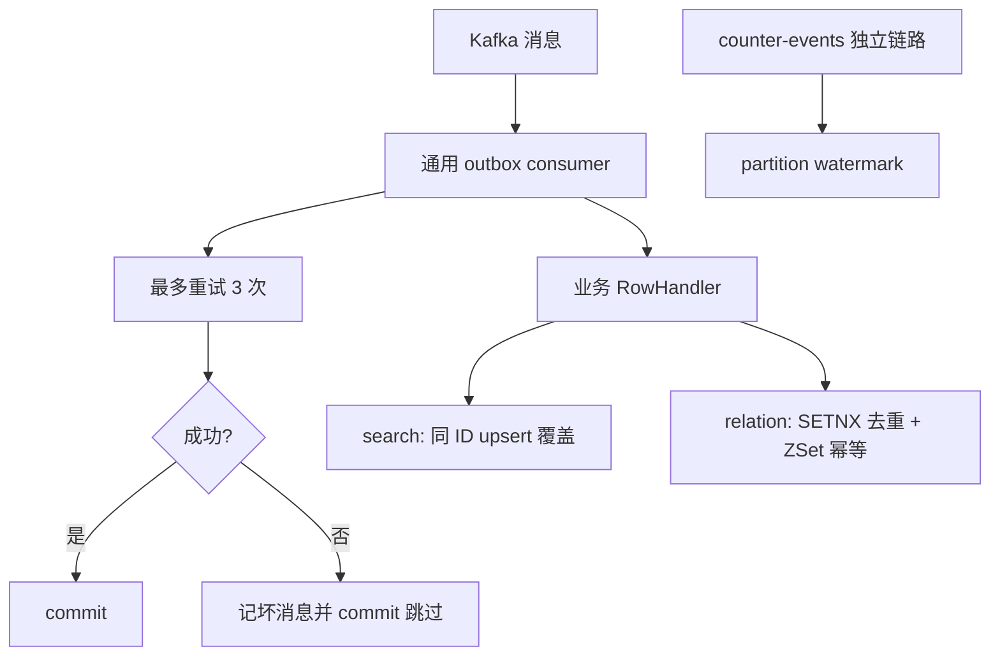

## 3.5 坏消息处理

对于明确无法解析或重试耗尽的消息，consumer 不会一直卡住，而是：

1. 记录告警
2. 尽量写入失败消息记录
3. commit 掉这条消息

这能防止单条坏数据卡死整条 partition。

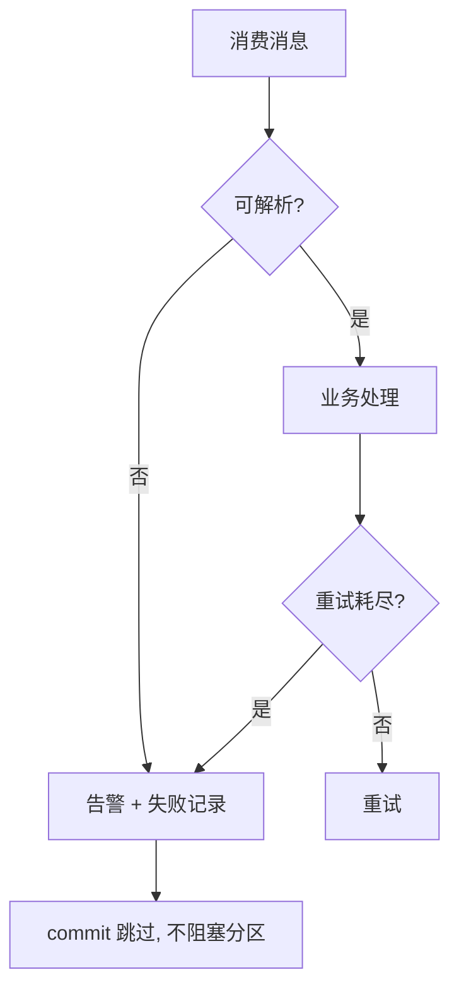

## 4. 设计亮点

## 4.1 解决的是双写一致性，不是单纯“用了 MQ”

这条链路真正要解决的问题是：

1. 主库写成功但消息没发出去
2. 消息发出去了但主库回滚

事务 outbox 的价值就在于把“消息存在性”绑定到数据库事务里。

## 4.2 Canal 把应用层和消息投递进一步解耦

如果让应用代码直接往 Kafka 发 outbox topic，也能做，但 Canal 方案还有一个好处：

**异步消息的来源变成 binlog，而不是应用代码中的一次网络调用。**

这意味着：

- 业务写线程更聚焦
- 可靠性更多依托数据库事务日志

## 4.3 消费端幂等要贴着业务语义设计

Kafka 重复投递最常见的原因是：

- 副作用做了
- 但 commit offset 失败

outbox 通用 consumer 当前没有统一水位表，因此业务 handler 必须自己保证重复处理可接受。搜索适合用“同 ID 文档覆盖”，关系适合用“事件去重键 + ZSet 幂等写”。计数链路因为是 delta 累加，重复加会直接造成错误，所以单独实现了 `consumer-group + topic + partition` 级 applied offset。

## 4.4 坏消息不阻塞整条分区

很多系统的 consumer 对坏消息处理不清晰，结果是一条坏消息让整个 partition 永远过不去。  
这个项目显式把 malformed message 识别成“可跳过的终局错误”，这是很工程化的。

## 5. 难点与边界

### 5.1 这条链路保证的是最终一致，不是强一致

业务事务一提交，主库是真值；  
Kafka consumer 投影什么时候追平，是异步的。

所以你不能把它讲成：

- “主库和搜索/缓存绝对同步”

更准确的是：

- “主库先正确，派生链路最终追平”

### 5.2 分区键设计非常重要

如果同一聚合根的事件被打散到不同 partition，很多基于“分区内有序”的假设都会失效。  
所以 `MessageKey` 这层虽然小，但很关键。

### 5.3 幂等机制不是万能

当前链路里的幂等机制解决的是：

- 搜索重复 upsert
- 关系事件短窗口重复消费
- 计数链路 partition 内重复 delta

它不自动解决：

- 业务语义乱序
- 跨 partition 重排
- 事件本身载荷设计错误
- 业务副作用做了一半后的精细恢复

## 6. 面试官高频问题

### Q1：为什么不用应用代码直接“写库成功后发 Kafka”？

**参考回答：**

因为那样会有双写一致性问题。  
只要 DB commit 和发 Kafka 之间不是同一原子动作，就可能出现一边成功一边失败。  
事务 outbox 的意义就是先把“事件存在性”落在主库事务里，再由异步链路分发。

### Q2：为什么要有 Canal，这不是多了一层吗？

**参考回答：**

是多了一层，但它把异步分发建立在 binlog 上，而不是应用层临时的一次网络调用上。  
对于这种希望尽量贴近数据库事务边界的系统，这是有价值的。  
代价是链路更长，但收益是主链路解耦和投递来源更稳定。

### Q3：为什么不同 consumer 的幂等策略不一样？

**参考回答：**

因为不同副作用的错误后果不同。搜索是文档覆盖写，重复 upsert 一般可接受；关系投影是 ZSet 增删，可以用业务去重键和幂等命令；计数是 delta 累加，重复一次就会错，所以必须用更严格的 partition 水位和修复机制。幂等策略要贴着数据语义，而不是所有 consumer 套同一个模板。

### Q4：为什么坏消息要跳过，不一直重试？

**参考回答：**

因为 malformed message 通常不是暂时性错误，而是数据本身就解析不了。  
如果一直重试，只会把整个 partition 卡死。  
更合理的做法是记录日志或失败消息、commit 跳过，让后续正常消息继续走。计数链路如果需要推进水位，也必须在自己的 applied offset 语义里做。

## 7. 场景题

### 场景题 1：如果现在要新增一个“通知 consumer”，怎么接这条链路？

**推荐回答：**

我会保持现有链路不变：

1. 业务事务继续只写主表和 outbox
2. Canal 继续桥接到 `canal-outbox`
3. 新增 notification consumer group
4. 让它自己按 aggregate type / event type 过滤感兴趣事件
5. 根据通知副作用设计自己的幂等键或通知去重表

这说明这条链路的扩展方式是“加新消费者”，而不是修改主写路径。

### 场景题 2：如果要支持历史重放，你会怎么做？

**推荐回答：**

可以从两层考虑：

1. Kafka 层重放
   - 新 consumer group 从头消费
2. 主库层重放
   - 重新扫描 outbox 表或重跑投影

选择哪种方式，取决于 Kafka 保留期、索引重建范围和数据规模。

## 8. 最容易讲错的地方

### 8.1 不要把它讲成“用了 Kafka 所以很高级”

真正关键的是：

1. 为什么需要 outbox
2. 为什么 consumer 要做幂等
3. 为什么坏消息要跳过
4. 为什么这是最终一致链路

### 8.2 不要忽视消费端幂等

很多人只会讲“消息发出去了”，但异步架构真正难的地方在消费端，而不是生产端。

## 9. 继续深挖时你可以怎么答

### 9.1 如果面试官继续问：为什么不用 Debezium，而用 Canal？

你可以这样答：

> 本质上它们都在解决 binlog 订阅问题。  
> 我当前项目里选 Canal，主要是因为它更贴近现有技术背景和部署环境，也方便和 Java 版历史链路保持一致。  
> 这不是在说 Debezium 不行，而是在当前上下文里，我更看重接入成本和现有体系兼容。

### 9.2 如果面试官继续问：为什么不让业务服务自己直接往 Kafka 发 outbox topic？

你可以这样答：

> 这样当然也能做，但会把应用层和消息投递耦得更紧。  
> 当前链路选择 Canal，是希望让“主库事务提交成功”成为唯一关键动作，后续消息分发更多依托 binlog。  
> 这样业务服务更专注主数据，异步桥接职责也更集中。

### 9.3 如果面试官继续问：outbox 消费副作用成功但 commit 失败怎么办？

你可以这样答：

> 通用 outbox consumer 没有统一水位表，所以 commit 失败后消息可能被重新投递。  
> 这要求业务副作用本身可幂等：搜索按文档 ID 覆盖写，关系用 dedupe key 和 ZSet 幂等操作。  
> 如果某个新 consumer 的副作用不是天然幂等，就必须补自己的去重表或状态机，不能只依赖 Kafka commit。

### 9.4 如果面试官继续问：一条坏消息为什么值得整个系统专门设计跳过逻辑？

你可以这样答：

> 因为 Kafka consumer 是顺序推进的。  
> 如果一条明确无法解析的坏消息永远卡在那，整个 partition 后面的正常消息都没法继续处理。  
> 所以坏消息跳过机制不是锦上添花，而是保证异步系统持续流动的必要设计。

### 9.5 如果面试官继续问：这条异步链路最应该监控什么？

你可以这样答：

> 我会重点看四类指标：  
> 第一，Kafka backlog 和消费延迟；  
> 第二，坏消息数量；  
> 第三，重试和死信数量；  
> 第四，投影目标侧的失败率，比如 ES 写入失败、关系投影失败。  
> 因为异步系统真正怕的不是单次报错，而是“慢慢积压但没人发现”。


---

# 附录A：工程级扩写

## A1. 端到端链路（中文流程图）

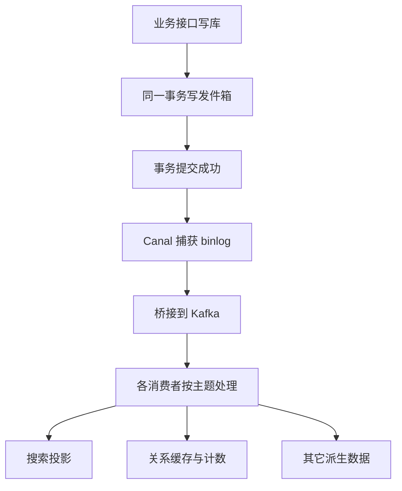

## A2. 为什么不用直接双写

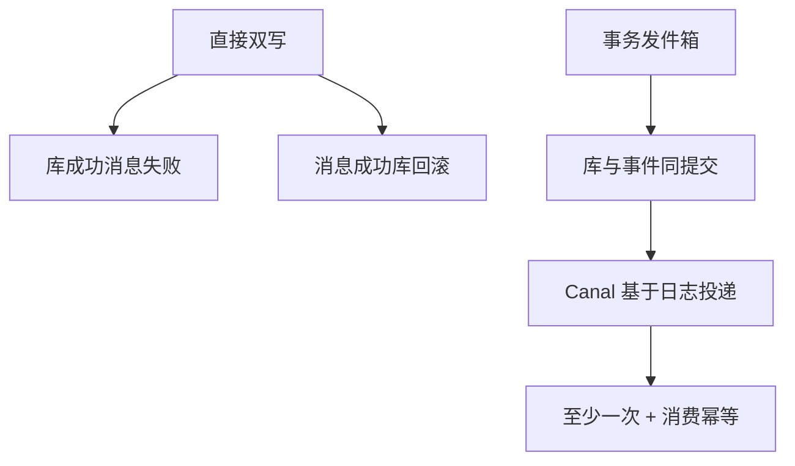

## A3. 消费幂等层次

1. Kafka 至少一次投递。
2. outbox 侧：重试、失败记录、commit 跳过。
3. 业务侧：搜索同 ID 覆盖、关系去重键、ZSet 幂等写。
4. counter 侧：单独使用 partition 水位，因为 delta 重复会污染计数。

## A4. 60 秒口述

> 主库与发件箱同事务，Canal 读日志进 Kafka，下游幂等消费。业务不直接双写 Redis/ES，换最终一致与可恢复。

---

# 附录B：面试细节扩写

## B1. 为什么 outbox 是这条链路的核心

如果不用 outbox，而是在业务代码里这样写：

1. 更新 MySQL
2. 调 Kafka producer 发消息

就会出现两个无法靠重试简单解决的问题：

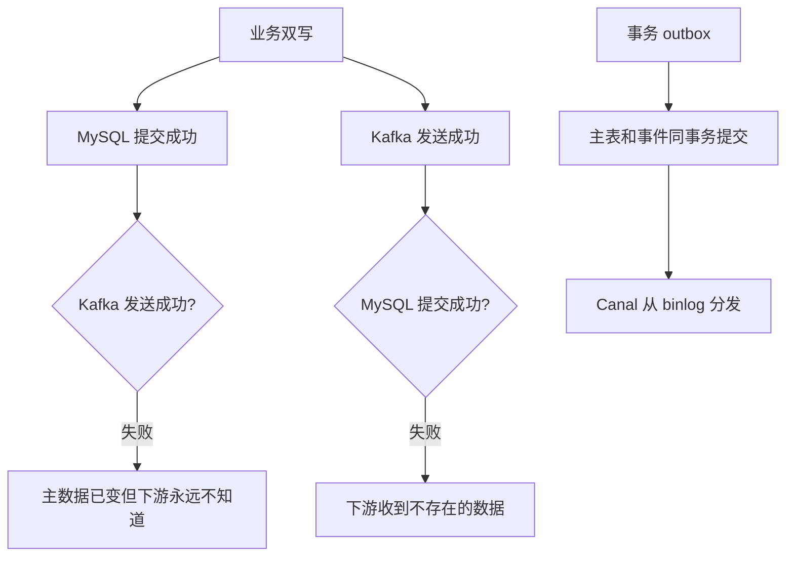

outbox 的价值是把“业务变化”和“事件存在”放进同一个数据库事务。

## B2. 当前 outbox 消费模型

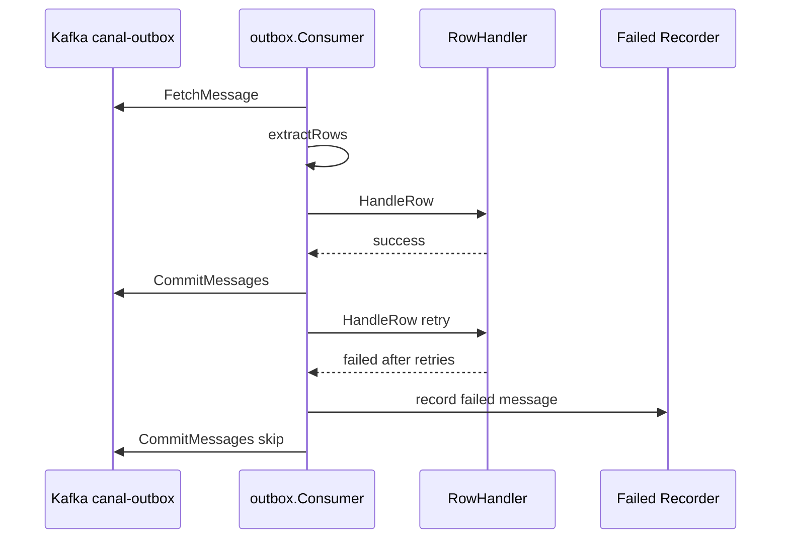

它解决的是“不要让单条失败消息永久阻塞分区”。但它不替代业务幂等，业务幂等仍要在 SearchRowHandler、RelationRowHandler 或新增 consumer 内实现。

## B3. Search 和 Relation 的幂等方式不同

| Consumer | 副作用 | 当前幂等方式 | 边界 |
|----------|--------|--------------|------|
| Search | 写 ES 文档 | 同一个 post id 重复 index 覆盖 | 如果旧事件晚于新事件，仍需版本或回查主库缓解 |
| Relation | 更新 Redis ZSet 和用户计数 | dedupe key + ZADD/ZREM | dedupe 先落标后失败可能吞重试 |
| Counter（旁路） | 累加实体 cnt SDS | partition applied offset + AggregationConsumer 内 dirty repairLoop | 只适用于 `counter-events`，不是 outbox 通用能力；**无独立 FailureWorker Runner** |
| Relation 用户计数 | following/follower SDS | 消费端 `HIncrBy`（跟 ZSet 同一次 EventProcessor） | **不经** counter-events；半成功 + dedupe 先落标是已知边界 |
| Fanout | timeline / authorbox ZSet | ZADD 天然幂等 + 长度截断 | 与搜索共享 `canal-outbox`，过滤 `KnowPostPublished` |

面试时可以说：我不会把所有 consumer 说成一套幂等模型，而是按副作用语义分别处理；更不会把 fanout、counter-events 和 canal-outbox 讲成一条 topic。

## B4. Canal Bridge 的 ACK / ROLLBACK 边界

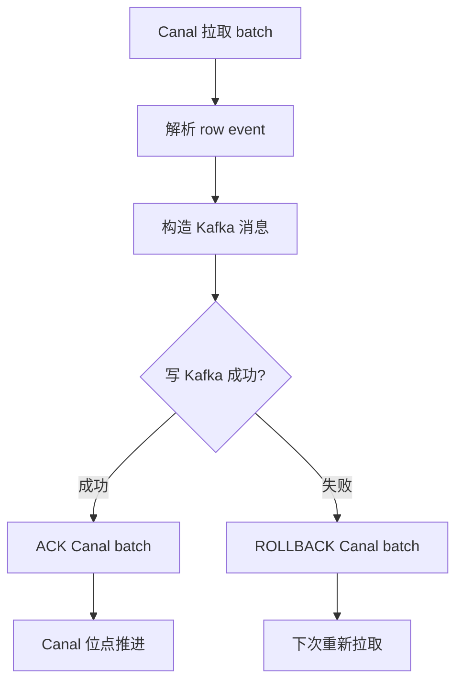

关键点：Canal 到 Kafka 这段失败时不应该 ACK，否则会丢 outbox 事件。当前实现里写 Kafka 失败会 RollBack，RollBack 失败会 panic 触发重启，这是为了避免位点错误推进。

## B5. 端到端保证和不保证

| 结论 | 是否保证 | 说明 |
|------|----------|------|
| 主表和 outbox 同时提交 | 保证 | 同一个 MySQL 事务 |
| outbox 一定被 Canal 捕获 | 依赖 Canal 和 binlog 配置 | 需要 `canal.enabled=true` 且 filter 正确；关闭时投影停，**不会**自动 DirectPoll |
| Kafka 不重复投递 | 不保证 | Kafka 是至少一次语义 |
| Consumer 副作用只执行一次 | 不统一保证 | 需要业务幂等 |
| ES 与 MySQL 强一致 | 不保证 | ES 是最终一致投影 |
| 失败消息不阻塞永久消费 | 尽力保证 | 重试耗尽后记录并 commit 跳过 |

这张表很适合面试，因为它能体现你知道系统边界。

## B6. 失败场景矩阵

| 失败点 | 结果 | 当前处理 | 应该怎么排查 |
|--------|------|----------|--------------|
| 业务事务失败 | 主表和 outbox 都不提交 | 返回业务错误 | 看 DB 错误和事务日志 |
| Canal 连接失败 | outbox 事件暂不分发 | Bridge 重试 | 看 Canal 容器和应用日志 |
| Kafka 写入失败 | Canal batch 不 ACK | RollBack 后重试 | 看 Kafka broker、topic、ISR |
| Consumer handler 失败 | 投影暂不更新 | 最多重试 3 次 | 看 handler 错误 |
| 重试耗尽 | 单条消息跳过 | 记录失败消息并 commit | 查失败表和告警 |
| ES 不可用 | 搜索投影落后 | Search consumer 报错 | 恢复后重放或重建索引 |
| Redis 不可用 | 关系投影失败 | handler 返回错误后重试 | 恢复后补偿或重建缓存 |

## B7. 新增 consumer 的标准接入方式

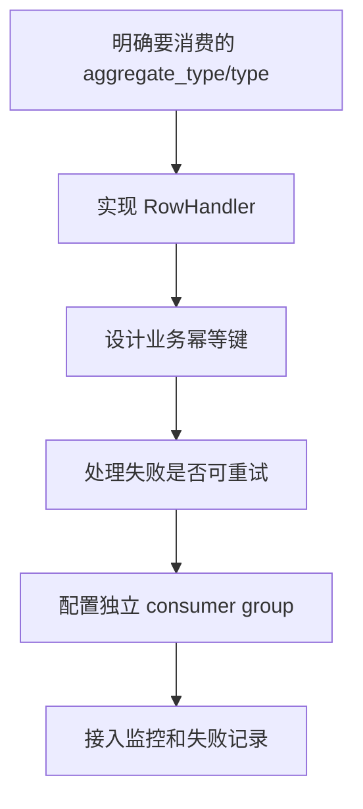

新增通知、推荐、审计投影时，不应该改知文或关系的主写路径，而应该订阅现有 outbox 事件。

## B8. 2 分钟展开回答

> 这条异步链路解决的是双写一致性。业务服务不直接同时写 MySQL 和 ES/Redis/Kafka，而是在同一个 MySQL 事务里写主表和 outbox。事务提交后，Canal 订阅 outbox 的 binlog，把事件桥接到 Kafka 的 `canal-outbox` topic。下游 search 与 relation 两个 consumer group 各自投影：搜索回查 MySQL 后写 ES；关系更新 ZSet，并对 following/follower 做 HIncrBy。通用 outbox consumer 负责拉消息、解析、重试、失败记录和 commit 跳过，但不替业务保证副作用只执行一次。like/fav 计数是另一条 `counter-events`（Bitmap + 水位 + AggregationConsumer 内 dirty repair）；信息流扩散与 search、relation 共享 `canal-outbox`，只是消费者组不同，各自独立推进位点。

---

## 📌 避坑指南与自测思考题

### ⚠️ 生产避坑指南（新手最易踩的坑）

1. **切忌直接使用 Outbox 消息中的 Payload 数据构建 ES 复杂索引**：
   - 错误做法：收到 outbox 消息后，直接使用 payload 里反序列化出的 JSON 字段推送到 ES。
   - 后果：若由于网络延迟导致 Kafka 消息乱序（如先收到更新标题消息，后收到发布消息），直接使用 Payload 数据覆盖会导致 ES 索引出现脏数据。
   - 正确做法：将 Outbox 消息仅看作一个“增量通知”，`Search.OutboxConsumer` 在收到通知后，根据 `post_id` 重新查 MySQL 数据库最新的真值主数据，再覆盖构建 ES 索引。

2. **不能让单条坏消息（Poison Message）死锁整条 Kafka Partition**：
   - 错误做法：发生 Payload 畸形解析失败时，Consumer 永远卡住重试不 Commit Offset。
   - 后果：导致该 Partition 的所有后续正常消息全部积压受阻！
   - 正确做法：重试 3 次耗尽后，记录失败告警表，主动 `Commit` 掉该 Offset，跳过坏消息。

### 🧐 巩固自测思考题

- **思考题 1**：如果线上的 Canal 桥接组件宕机维护了 2 个小时，期间 Outbox 表积累了 5 万条新记录，系统会丢消息吗？
  - *提示*：不会。Outbox 表保存在 MySQL 磁盘上，Canal 恢复后会自动从上次中断的 Binlog Position 点位继续顺序读取，数据具备百分之百的可追溯性。
- **思考题 2**：`canal.enabled=false` 时，为什么系统不会自动切换为定时轮询 Outbox 表（DirectPoll）？
  - *提示*：架构遵循“显式开关”原则，避免在未配置扫描频率与分区竞争锁时隐式自启 Worker，降低运维非预期行锁隐患。
