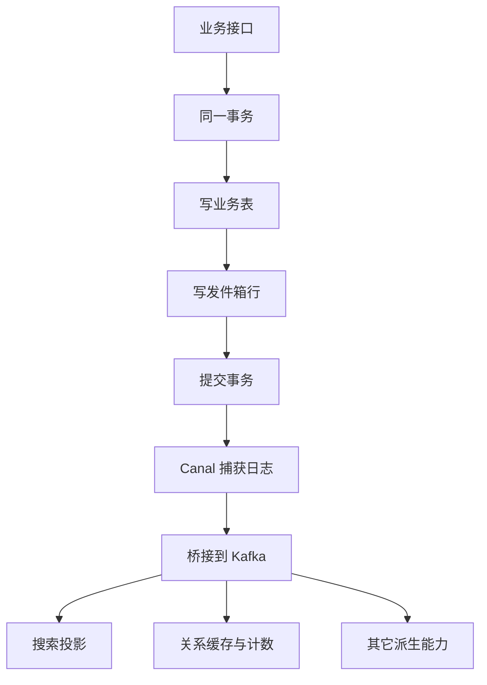
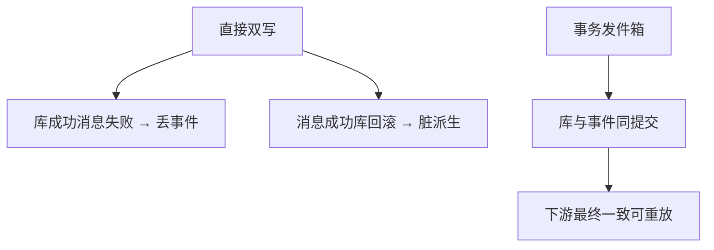

# 08. 事务消息 · Canal · Kafka 异步链路

## 1. 是什么

整站异步骨架：

```text
业务事务（主数据 + outbox 表）
  → Canal 订阅 binlog
  → Kafka 分发
  → 各消费者（搜索 / 关系投影 / 其它）
```

没有这条链路，模块会退化成大量「直接双写 Redis/ES」。

## 2. 一句话

> **事务发件箱**保证「库成功则事件一定落库」；Canal 把变更变成消息；Kafka 解耦下游；消费端用**幂等**消化至少一次投递。

## 3. 端到端流程



## 4. 为什么不用直接双写



## 5. 角色拆分

| 组件 | 职责 |
|------|------|
| 业务 Service | 只保证 MySQL 事务正确 |
| outbox 表 | 事件落库，与业务同事务 |
| Canal | 读 binlog，不侵入业务代码 |
| Kafka | 缓冲、解耦、重放 |
| Consumer | 投影 / 缓存 / 索引；必须幂等 |

## 6. 消费幂等层次

1. **Kafka 至少一次**：可能重复投递  
2. **业务幂等**：去重键 / 水位 / 幂等写（如 ZADD）  
3. **坏消息**：推水位跳过，避免卡死分区  

计数模块的分区水位是典型例子（见 05）。

## 7. 与各模块关系

| 上游写 | 下游 |
|--------|------|
| 知文发布/更新/删除 | 搜索投影、（设计上）写扩散 |
| 关注/取关 | 关系 ZSet、用户关注计数 |
| 点赞 | **不走 Canal**，独立 `counter-events` 主题 |

## 8. 故障怎么查

| 现象 | 排查 |
|------|------|
| 发布了搜索没有 | outbox 行是否写入；Canal 是否跑；Kafka lag |
| 重复投影 | 消费是否幂等；去重键 TTL |
| 分区卡住 | 是否有坏消息未跳过 |

## 9. 风险

1. 最终一致，不是跨存储分布式事务  
2. Canal / Kafka 运维复杂度  
3. 消费逻辑写错会导致长期脏派生  
4. 主题与 consumer group 配置错误会静默丢处理  

## 10. 60 秒口述

> 我们不在接口里同时写库和 ES。业务和发件箱同事务，Canal 读日志进 Kafka，下游幂等消费。换的是可恢复的最终一致，不是强一致双写。

## 11. 面试快问

**Q：和本地消息表有什么区别？**  
A：本质同类；这里用 Canal 扫 binlog，业务更干净。

**Q：消息会丢吗？**  
A：事务提交后 outbox 在库里；下游要能重放与幂等，并监控 lag。

---

以源码与部署配置为准（Canal 镜像、topic、group）。
