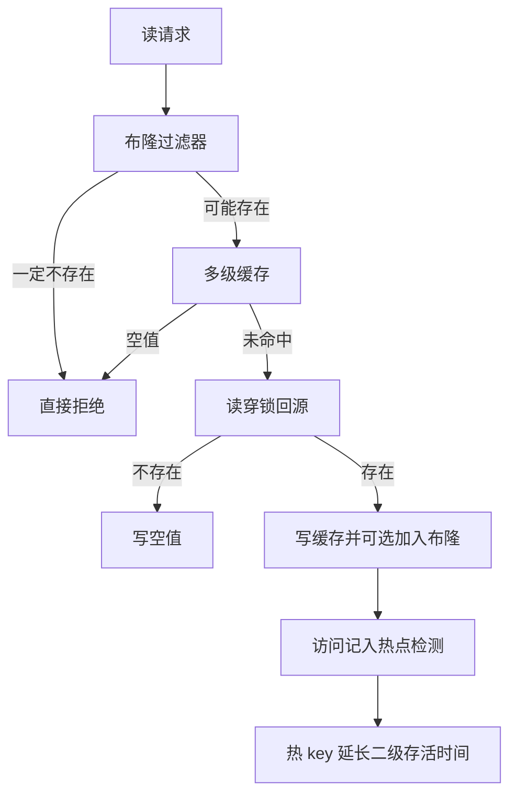
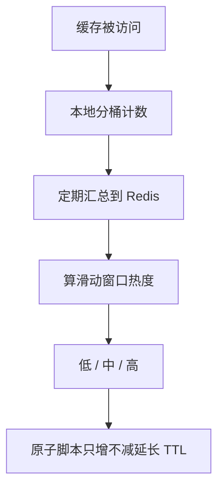

# 09. 热点缓存与多级缓存策略

## 1. 是什么

跨模块性能策略合集，不是单一业务包：

| 场景 | 策略 |
|------|------|
| 知文详情 | 布隆 + 空值 + L1/L2 + 读穿锁 + 版本失效 |
| 知文 Feed | 碎片 + 版本 + 短 L1 整页 |
| 关系列表 | L1 + ZSet + 大 V 预热锁 |
| 热点 | `HotKeyDetector` 滑动窗口延长 TTL |

## 2. 一句话

> 缓存按**访问模式**选型；穿透用 **布隆+空值**；击穿用 **读穿锁**；热点用 **只增不减延长 TTL**；多实例 L1 靠 **版本号** 而非广播。

## 3. 穿透 / 击穿 / 雪崩 / 热点

| 问题 | 现象 | 手段 |
|------|------|------|
| 穿透 | 大量不存在 ID 打库 | 布隆前置 + NULL 兜底 |
| 击穿 | 热点 key 过期瞬间打爆库 | 分布式读穿锁 + 看门狗 |
| 雪崩 | 大量 key 同时过期 | TTL 随机抖动 |
| 热点 | 单 key 极高 QPS | 热度分级延长存活时间 |

## 4. 多级缓存分工

| 层 | 解决什么 |
|----|----------|
| 布隆 | 一定不存在的前置拦截 |
| L1 freecache | 单实例极低延迟 |
| L2 Redis | 跨实例共享 |
| NULL | 已确认不存在的短防穿透 |
| L3 DB | 真值 |
| 版本号 | 多实例旧 L1 不再可达 |

## 5. 热点检测（HotKey）

要点：

- 本地聚合再 flush，避免每次访问都打 Redis。  
- 延长详情键的同时，可联动 `feed:item` 等。  
- 「只增不减」避免并发把 TTL 缩短。

## 6. 为什么不用统一缓存模板

| 数据 | 模型 | 原因 |
|------|------|------|
| 详情 | 整对象 + 版本 | 单 key 读多，要权限与用户态分离 |
| 公共 Feed | ID 列表 + item 碎片 | 跨页复用单条 |
| 我的 Feed | 整页或时间线 | 单用户、范围小 |
| 关系列表 | ZSet + 大 V L1 | 时间序 + 大体量 |

## 7. 代码入口

| 文件 | 内容 |
|------|------|
| `internal/cache/bloom.go` | Redis 布隆 |
| `internal/cache/hotkey.go` | 热点检测 |
| `internal/knowpost/detail_service.go` | 详情路径 |
| `internal/knowpost/feed_service.go` | Feed 碎片 |
| `internal/relation/cache.go` | 关系列表缓存 |

## 8. 风险

1. 布隆误判 → 必须靠 NULL  
2. 空布隆 / Redis 故障 fail-open → 短时穿透上升  
3. L1 跨实例不一致窗口靠版本与 TTL  
4. 热点阈值配错可能无效或过度延长  

## 9. 60 秒口述

> 我们不套一套缓存打天下。穿透是布隆加空值，击穿是读穿锁，热点是滑动窗口延长 TTL，多实例失效靠版本号。公共 Feed 碎片化，关系列表按是否大 V 分层。

## 10. 面试快问

**Q：Bloom 和本地缓存哪个先？**  
A：Bloom 在详情最前；未预热则 fail-open 再走 L1/L2。

**Q：版本号 vs Pub/Sub 失效？**  
A：版本号实现简单、语义清晰，不依赖额外订阅。

---

以源码与配置为准。
