# 热点缓存与多级缓存策略

## 1. 模块定位

这不是某一个业务域自己的模块，而是一组跨模块的性能策略，主要体现在：

1. `knowpost` 详情页和 Feed 的多级缓存
2. `relation` 列表的 L1 + ZSet + DB 分层
3. `cache.HotKeyDetector` 的热点识别与 TTL 延长

如果面试官问你“项目里有哪些跨模块的性能优化手段”，这一篇就是答案。

## 2. 一句话介绍

这个项目没有把缓存当成统一模板，而是按访问模式分层设计：知文详情走 L1 + Redis + DB + 版本号失效，公共 Feed 走整页缓存和碎片缓存组合，关系列表按普通用户和大 V 用户做不同层级优化，同时用 HotKeyDetector 对热点 key 做近实时识别和 TTL 延长，减少周期性回源。

## 3. 核心策略

## 3.1 多级缓存 + 穿透前置

常见组合是：

0. **第三方 RedisBloom Cuckoo CF.*（可选/默认开，配置键 bloom_*）**：算法在 Redis 模块；业务只调 CF 命令，支持 `CF.DEL`
1. L1：进程内 freecache
2. L2：Redis（含详情 `NULL` 空值缓存）
3. L3：MySQL

不同层解决不同问题：

- CF.* 拦「一定不存在」的扫号，减穿透；软删 `CF.DEL`
- NULL 兜「查过不存在 / 过滤器误判 / 模块不可用 / 删除失败」
- L1 解决单实例极低延迟
- L2 解决跨实例共享
- L3 保证最终真值

知文详情默认 **第三方 RedisBloom CF.* + NULL 叠加**（算法在 redis-stack 模块；适配层见 `internal/cache/bloom.go`，说明见 `docs/modules/04`）。

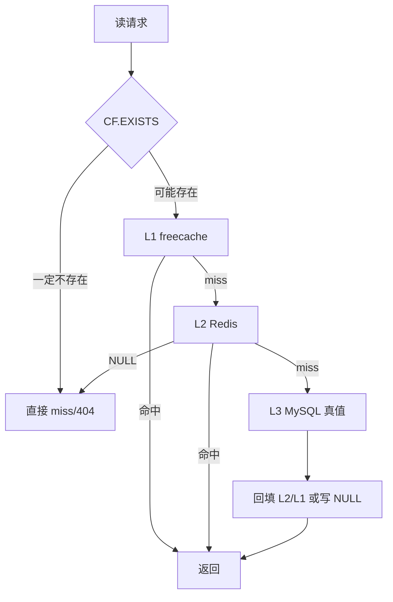

## 3.2 版本号失效

在 `knowpost` 详情和 Feed 里，缓存不是简单删 key，而是：

1. 删当前 key
2. bump version
3. 新读请求走新 key

这非常适合多实例场景，因为它能避开“别的实例 L1 还没删掉”这个经典问题。

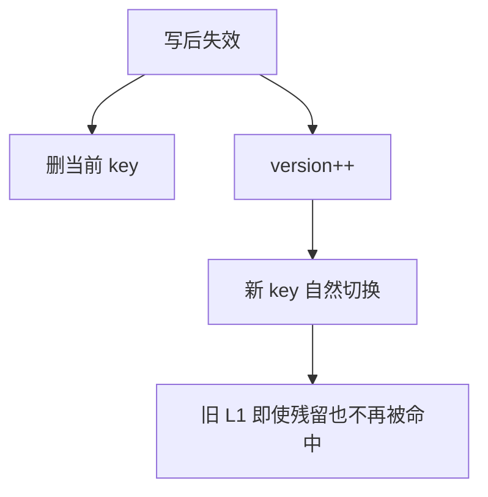

## 3.3 热点 TTL 延长

HotKeyDetector 做的是：

1. 本地缓冲每个 key 的访问计数
2. 定期 flush 到 Redis Hash
3. 统计滑动窗口内热度
4. 计算热度等级
5. 对热点 key 延长 TTL

关键点不是“识别热点”，而是：

**热点 key 命中本身就会让它活得更久。**

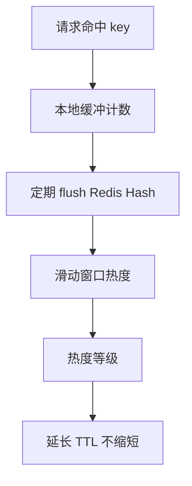

## 3.4 按业务选择缓存模型

这个项目里并没有全局只用一种缓存方式：

1. 知文详情：
   - 整对象缓存
2. 公共 Feed：
   - 页 ID 列表 + item 碎片缓存
3. 我的 Feed：
   - 整页缓存
4. 关系列表：
   - 大 V L1 + Redis ZSet + DB

这说明缓存策略不是“复制粘贴”，而是按访问模式定制。

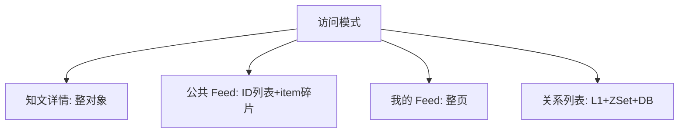

## 4. 设计亮点

## 4.1 热点识别是跨实例近似聚合

HotKeyDetector 不是单机计数器，而是：

1. 本地记录
2. Redis 聚合
3. 本地等级缓存 + Redis 热点标记兜底

这是一种成本可控的热点识别方式，不需要引入额外流处理系统。

## 4.2 TTL 只延长不缩短

TTL 延长通过 Lua 脚本保证“只增不减”，这很重要。

因为多实例并发更新 TTL 时，如果没有这个约束，后写入的实例可能把别的实例刚延长好的 TTL 又缩回去。

## 4.3 大 V 和普通用户分开优化

关系模块里对大 V 的优化很有面试价值：

- 普通用户：Redis ZSet 承接
- 大 V：L1 头部缓存吸收热点

这体现的是：

**用户规模不同，缓存策略也应该不同。**

## 5. 难点与边界

### 5.1 热点识别永远是近似的

当前实现不是全局精确实时统计，而是：

- 本地采样
- 周期 flush
- 滑动窗口聚合

所以它更像“足够好”的工程方案，而不是绝对精确的监控系统。

### 5.2 过度缓存会制造一致性问题

不是缓存越多越好。  
比如关系模块就明确选择：

- 列表缓存
- 单条关系直查

这就是在控制复杂度。

### 5.3 大 V 优化背后其实是读扩散 / 写扩散思维

当某个用户成为热点节点时，你就不能继续假设所有用户的访问模式一样。  
这背后会自然延伸到：

- 读扩散
- 写扩散
- 混合分层

## 6. 面试官高频问题

### Q1：为什么要有本地 L1？Redis 不够吗？

**参考回答：**

Redis 已经很快，但热点请求量特别大时，所有实例都去打 Redis，Redis 仍然会成为集中瓶颈。  
L1 的价值在于把最热点的一小部分数据直接拦在进程内，进一步减少网络往返和 Redis 压力。

### Q2：为什么版本号方案比本地失效广播更适合这个项目？

**参考回答：**

因为它实现和运维复杂度更低。  
广播方案要处理连接、重连、消息丢失和延迟；版本号方案只需要读一个轻量 key，写路径 bump 一下版本，新请求就自然切到新 key。  
这是一种用很小读开销换系统简单性的方式。

### Q3：热点识别为什么不用全量实时精确统计？

**参考回答：**

因为那样成本太高。  
对于缓存 TTL 优化这类场景，我不需要金融级精度，只需要在工程上足够识别出“最近确实很热”的 key。  
本地缓冲 + Redis 聚合已经能达到这个目标。

## 7. 场景题

### 场景题 1：如果某篇知文突然被大流量打爆，你这个系统会怎么应对？

**推荐回答：**

第一层是多级缓存命中，第二层是分布式锁防击穿，第三层是 HotKeyDetector 延长热点 TTL。  
也就是说，这个系统不是等 miss 之后才处理，而是在 hit 期间就尽量让热点 key 延后过期。

### 场景题 2：如果以后要做“关注人 Feed”，大 V 会引发什么设计问题？

**推荐回答：**

最大问题是 fan-out。  
普通用户可以偏写扩散，大 V 不能纯写扩散，否则一次发文就会产生巨量写入。  
所以最终会走混合策略：小号偏写扩散，大 V 偏读扩散或按需合并。

## 8. 最容易讲错的地方

不要把热点优化讲成“我加了缓存”。  
更好的表达是：

1. 我先识别热点模式
2. 再按访问模式选择缓存层次
3. 最后用热点识别去动态延长高价值缓存的寿命

---

# 附录A：工程级扩写

## A1. 穿透 / 击穿 / 雪崩对照

| 问题 | 现象 | 本项目手段 |
|------|------|------------|
| 穿透 | 大量不存在 ID 打 DB | **CF.* + NULL 叠加** |
| 击穿 | 热点 key 过期瞬间打爆 DB | 读穿锁 + 看门狗 |
| 雪崩 | 大量 key 同时过期 | 随机 TTL jitter + 热点延长 |
| 热点 | 单 key 极高 QPS | HotKey 分级延长 TTL |

## A2. RedisBloom CF.* + NULL 叠加（中文流程图）

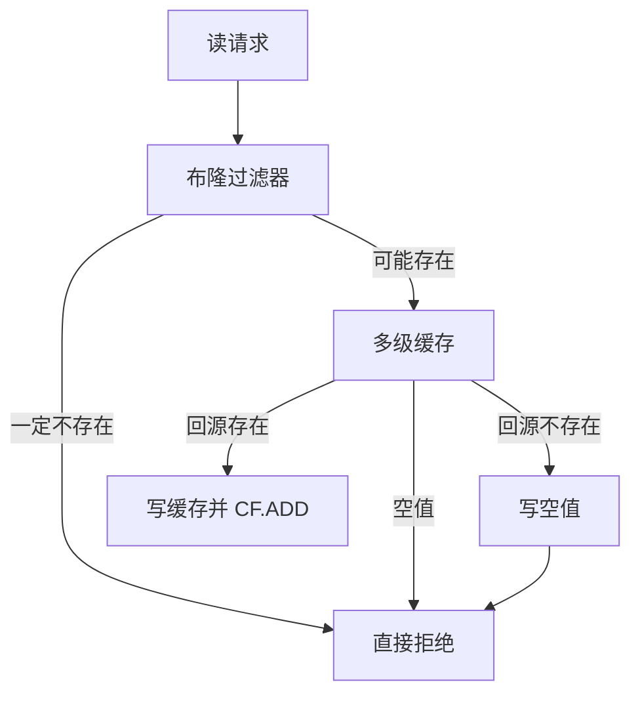

## A3. 热点延长（中文流程图）

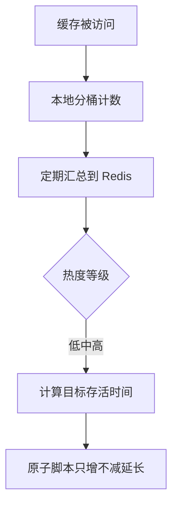

## A4. 60 秒口述

> 缓存按访问模式选型。穿透用 RedisBloom CF 加空值，击穿用读穿锁，热点用滑动窗口延长 TTL，失效用版本号解决多实例 L1 残留。

---

# 附录B：面试细节扩写

## B1. 这篇要讲的不是“用了 Redis”

面试时不要把缓存优化讲成“我把数据放 Redis 里”。这篇真正要讲的是：

1. **不同问题用不同手段**：穿透、击穿、雪崩、热点、失效是不同问题。
2. **不同业务用不同模型**：详情、Feed、关系列表不能套同一个缓存模板。
3. **本地缓存和分布式缓存分工**：L1 吃极热点，Redis 做跨实例共享。
4. **缓存不是无脑延长 TTL**：热点才延长，且 TTL 只增不减，避免并发缩短。
5. **真值和缓存边界清晰**：缓存可以错过、过期、重建，不能替代 MySQL 真值。

## B2. 跨模块缓存地图

| 场景 | L1 | L2 | L3 / 真值 | 失效方式 | 特点 |
|------|----|----|-----------|----------|------|
| 知文详情 | freecache 整对象 | Redis detail JSON / NULL | MySQL `know_posts` + `users` | 版本号 + 删除旧 key | 高并发详情读 |
| 公共 Feed | freecache 整页 | Redis ID 列表 + item 碎片 | MySQL 发布内容列表 | feed version + 删除 item | 列表和条目拆开 |
| 我的 Feed | freecache / Redis 页缓存 | timeline ZSet 或 mine cache | MySQL 作者内容 | mine version | 写扩散优先，读库降级 |
| 关系列表 | 大 V L1 | Redis ZSet | MySQL 双表 | 写后删除 + 异步投影 | 大 V 和普通用户分层 |
| 点赞状态 | 无 | Redis Bitmap | Bitmap 本身是真值 | Lua 状态翻转 | 不适合做对象缓存 |
| 计数快照 | 无 | Redis Hash `cnt:*` | Bitmap 可重建 | dirty repair | 派生快照 |

这张表可以回答“你的缓存策略是不是统一的”：不是统一模板，而是按读写模式定制。

## B3. 缓存问题拆解图

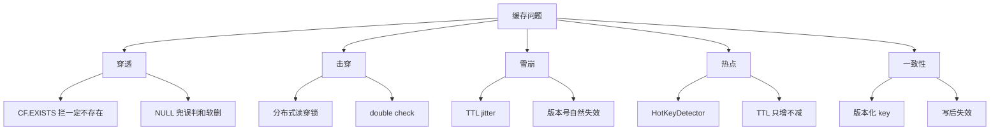

面试时先把问题分类，再讲方案，会比直接堆技术词更稳。

## B4. HotKeyDetector 完整工作流

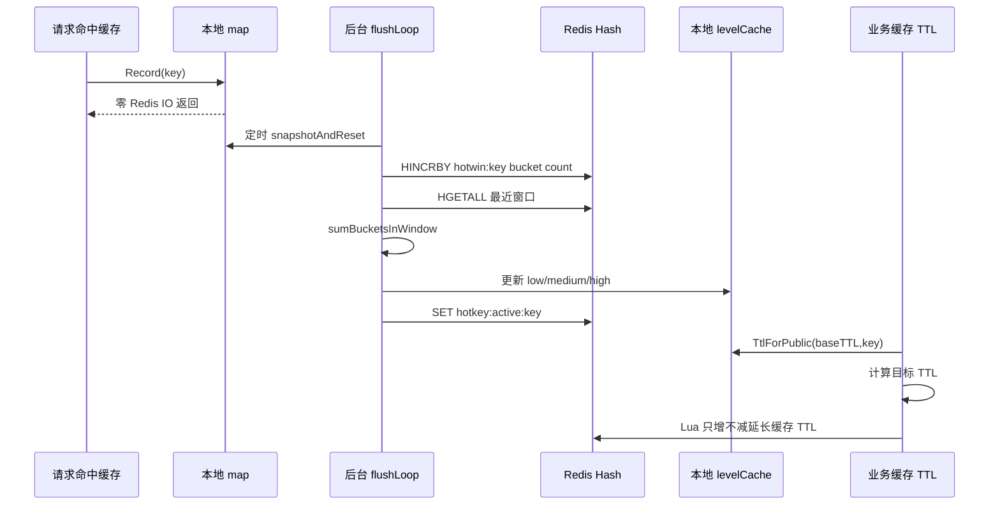

关键点：

1. 每次请求只写本地 map，不直接打 Redis。
2. 跨实例聚合通过 Redis Hash 完成。
3. Redis `hotkey:active:*` 是兜底标记，某实例没有本地等级时也能识别热点。
4. HotKeyDetector 只计算热度和目标 TTL，真正延长缓存 TTL 的 Lua 在 knowpost 缓存层执行。

## B5. 为什么本地 map + Redis Hash，而不是每次请求写 Redis

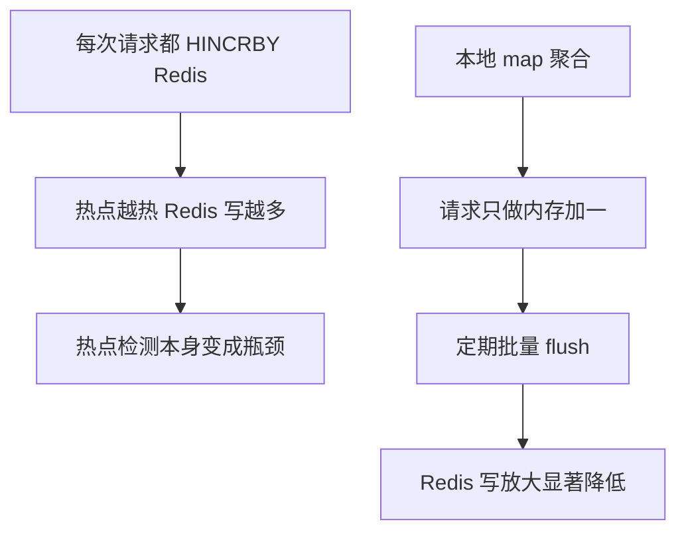

这是很适合面试讲的工程取舍：热点识别是为了保护系统，如果识别动作本身造成 Redis 压力，就违背目标。

## B6. 热度等级和 TTL 延长

| 等级 | 判断依据 | TTL 策略 | 作用 |
|------|----------|----------|------|
| Cold | 低于 low 阈值 | 使用基础 TTL | 普通缓存 |
| Low | 达到低热阈值 | base + extend_low | 轻微热点 |
| Medium | 达到中热阈值 | base + extend_medium | 明显热点 |
| High | 达到高热阈值 | base + extend_high | 极热点 |

TTL 延长不是直接 `EXPIRE key target`，而是 Lua：

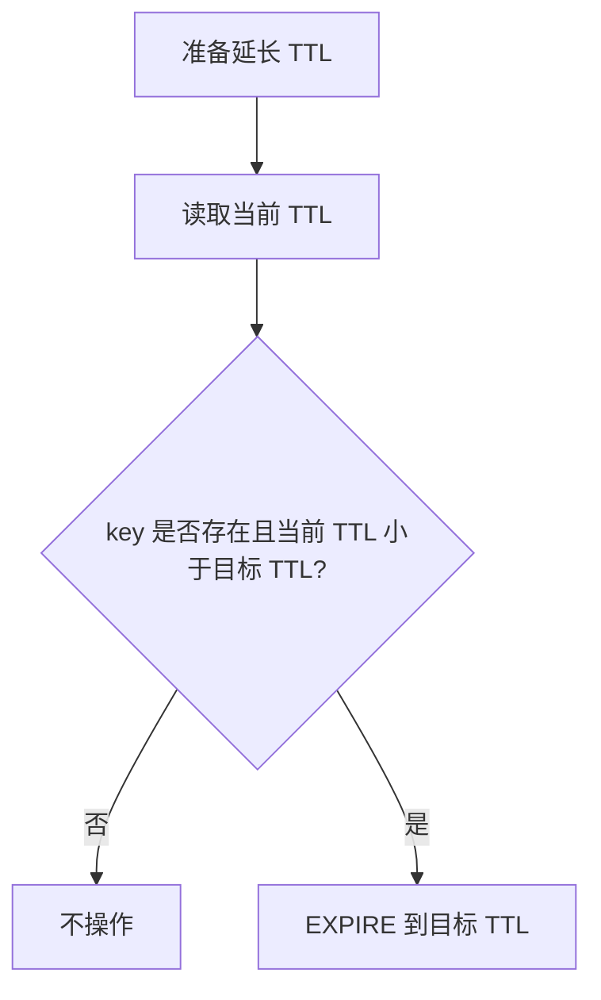

这样能避免多实例并发时，一个实例把另一个实例刚延长的 TTL 缩短。

## B7. RedisBloom CF.* + NULL 为什么要叠加

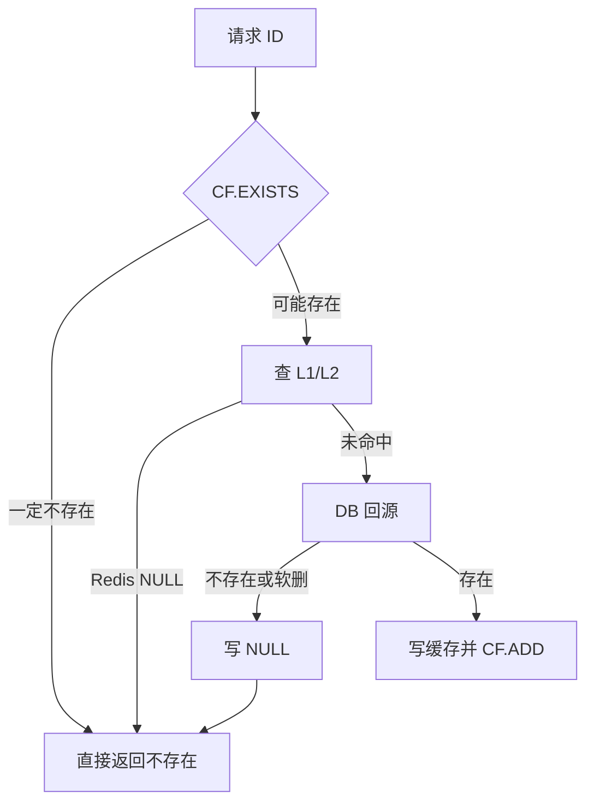

CF 和 NULL 解决的是不同问题：

1. CF.*：适合拦“从未存在过”的随机扫号，且软删 `CF.DEL`。
2. NULL：适合兜误判、删除失败、DB 确认不存在、预热窗口、**模块未安装**。
3. 过滤器/模块故障时 fail-open，不误拦真实内容。
4. 过滤器为第三方 RedisBloom 模块（`redis-stack-server`）；`internal/cache/bloom.go` 仅为客户端薄封装。

## B8. 为什么详情用整对象，Feed 用碎片

| 模型 | 适合场景 | 不适合场景 |
|------|----------|------------|
| 整对象缓存 | 单个详情页，key 和数据一一对应 | 多个列表页包含同一条数据 |
| 整页缓存 | 页内容稳定、更新少 | 单条 item 更新会影响很多页 |
| ID 列表 + item 碎片 | Feed 列表，条目复用多 | 组装逻辑更复杂 |
| ZSet 列表 | 关系链、时间线、有序分页 | 复杂对象内容仍要另查 |

公共 Feed 如果只用整页缓存，一条知文更新可能要清很多页；碎片模型把“排序列表”和“条目内容”拆开，更新时只删 item 并 bump version。

## B9. 版本号失效和广播失效对比

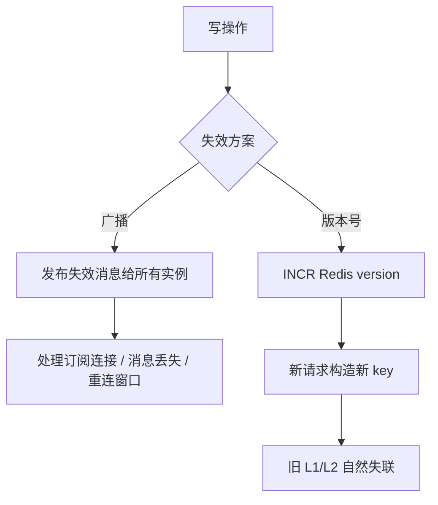

版本号方案的代价是读路径多一次版本查询；收益是多实例环境下不用保证每个实例都收到失效广播。

## B10. 大 V 缓存为什么不是简单加 TTL

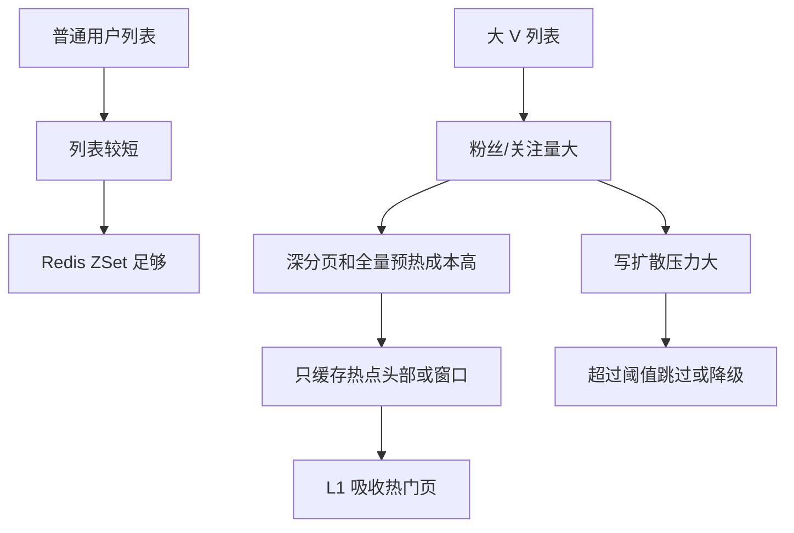

大 V 优化背后是访问模式变化：普通用户可以把列表缓存得相对完整，大 V 更需要窗口化、头部缓存和降级策略。

## B11. 缓存故障边界

| 故障 | 当前影响 | 降级思路 |
|------|----------|----------|
| L1 丢失 | 命中率下降 | 继续查 Redis |
| Redis 缓存 miss | 可能回源 DB | 分布式锁保护 |
| CF 模块故障/缺失 | 不能前置拦截 | fail-open，继续多级缓存 |
| HotKeyDetector 故障 | TTL 不延长 | 业务正常，只是热点保护降级 |
| Redis 整体不可用 | 缓存、锁、计数受影响 | 关键接口需要限流和 DB 保护 |
| 版本号 key 丢失 | 可能回到默认版本 | 写操作再次 INCR，旧缓存自然过期 |

面试重点：热点缓存能力应该是增强项，不应该成为业务正确性的唯一依赖。

## B12. 2 分钟展开回答

> 我这个项目的缓存不是一套模板全局套用。知文详情是 RedisBloom CF + NULL + L1 + Redis + DB：CF.EXISTS 拦不存在 ID，软删 CF.DEL，NULL 兜误判和模块不可用边界，L1 吃进程内热点，Redis 做跨实例共享，DB 是真值。公共 Feed 不适合整页缓存到底，所以拆成 ID 列表和 item 碎片；关系列表用 Redis ZSet，大 V 再叠 L1 头部缓存。热点识别用 HotKeyDetector，本地 map 先聚合请求计数，定期 flush 到 Redis Hash 做跨实例滑动窗口统计，再计算 low/medium/high 热度等级。真正延长 TTL 时用 Lua 只增不减，避免多实例并发把 TTL 缩短。整体思路是先区分穿透、击穿、雪崩和热点，再按业务读写模式选缓存模型。
