# 热点缓存与多级缓存策略

## 1. 模块定位

这不是某一个业务域自己的模块，而是一组跨模块的性能策略，主要体现在：

1. `knowpost` 详情页和 Feed 的多级缓存
2. `relation` 列表的 L1 + ZSet + DB 分层
3. `cache.HotKeyDetector` 的热点识别与 TTL 延长

如果面试官问你“项目里有哪些跨模块的性能优化手段”，这一篇就是答案。

---

### 🎓 教学导学板块

> **🎯 学习目标**
> 1. 理解高并发系统中根据**访问模式 (Access Patterns)** 定制差异化缓存策略的必要性（拒绝“全局一把梭”）。
> 2. 掌握 `HotKeyDetector` 进程内滑动窗口缓冲与 Redis 聚合近实时热点识别机制。
> 3. 掌握动态 TTL 延长 Lua 脚本中 **“只增不减”** 原则如何防止多 API 实例并发更新时的竞态缩短问题。
> 4. 理解普通用户与大 V 用户在关系列表与时间线上的分级缓存设计。
> 
> **📚 前置概念预习**
> - **HotKey (热点 Key)**：短时间内被极高频访问的缓存键，极易在过期瞬时引发数据库击穿。
> - **差异化缓存**：详情页用对象缓存、公共 Feed 用 ID 列表+碎片缓存、大 V 关系用 L1 头部缓存。

---

## 2. 一句话介绍

这个项目没有把缓存当成统一模板，而是按访问模式分层设计：知文详情走 L1 + Redis + DB + 版本号失效，公共 Feed 走整页缓存和碎片缓存组合，关系列表按普通用户和大 V 用户做不同层级优化，同时用 HotKeyDetector 对热点 key 做近实时识别和 TTL 延长，减少周期性回源。

## 3. 核心策略

## 3.1 多级缓存 + 穿透前置

常见组合是：

0. **第三方 RedisBloom Cuckoo CF.*（可选/默认开，配置键 bloom_*）**：算法在 Redis 模块；业务只调 CF 命令，支持 `CF.DEL`
1. L1：进程内 freecache
2. L2：Redis（含详情 `NULL` 空值缓存）
3. L3：MySQL

不同层解决不同问题：

- CF.* 拦「一定不存在」的扫号，减穿透；软删 `CF.DEL`
- NULL 兜「查过不存在 / 过滤器误判 / 模块不可用 / 删除失败」
- L1 解决单实例极低延迟
- L2 解决跨实例共享
- L3 保证最终真值

知文详情默认 **第三方 RedisBloom CF.* + NULL 叠加**（算法在 redis-stack 模块；适配层见 `internal/cache/bloom.go`，说明见 `docs/modules/04`）。

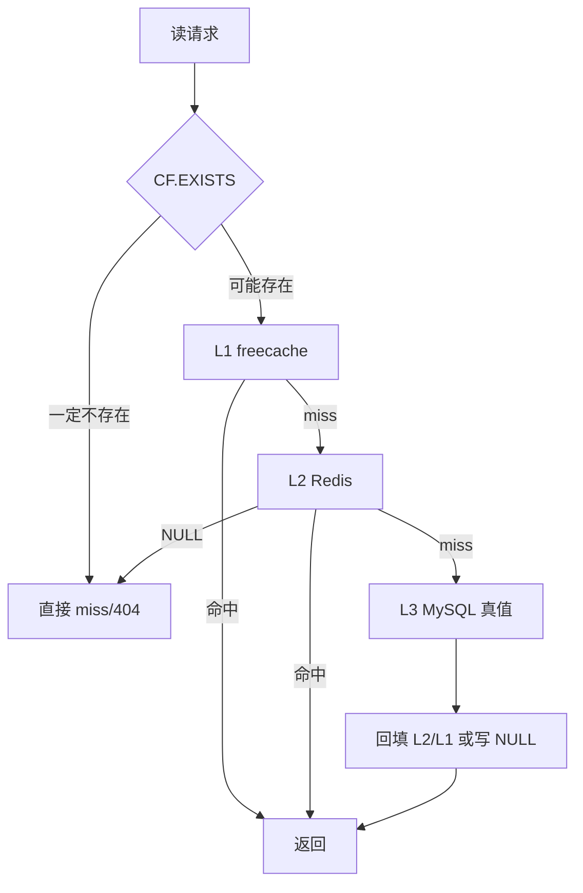

## 3.2 版本号失效

在 `knowpost` 详情和 Feed 里，缓存不是简单删 key，而是：

1. 删当前 key
2. bump version
3. 新读请求走新 key

这非常适合多实例场景，因为它能避开“别的实例 L1 还没删掉”这个经典问题。

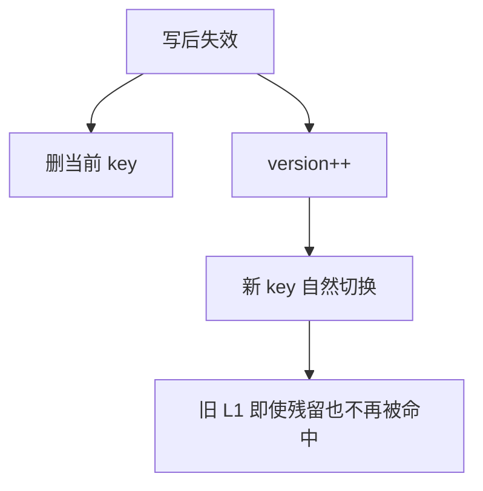

## 3.3 热点 TTL 延长（教学拆解：HotKey 动态维保）

> **💡 现实工程场景痛点：**
> 如果某个突发热点文章（如爆款新闻）设置了固定的 5 分钟 TTL，在第 5 分钟到期的一瞬间，正好有 2 万个并发请求打过来。即使有分布式锁，依然会有大量请求卡顿等待，甚至因为并发抢锁造成 Redis 压力骤增。
> 
> 本项目通过 `HotKeyDetector` 实现了“**越热门的资源活得越久，命中本身即是续期**”的动态维保机制。

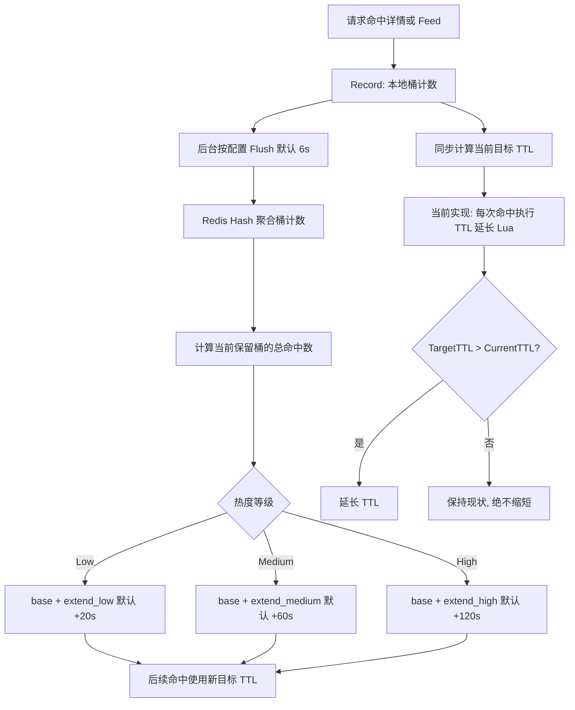

### Step-by-Step HotKey 维保流程：

1. **本地轻量缓冲的是计数，不是整条热点逻辑**：`Record()` 只更新进程内 map；默认每 6 秒 Flush。配置中一个桶为 6 秒、桶数为 10，设计意图是按最近约 60 秒的**命中总数**分级，而不是直接计算瞬时 QPS。
2. **60 秒滑动窗口已按设计落地**：`flushOnce` 将桶计数 `HINCRBY` 到 `hotwin:{cacheKey}` 后，只删除**刚滑出窗口**的桶（`nowBucket-bucket_count` 及一个 slack 桶），因此 `nowBucket-9 .. nowBucket` 共 10 个桶会被完整保留，`sumBucketsInWindow` 得到的是真实的 60 秒命中总数。

   > **历史行为差异（升级需知）**：早期实现在每轮 flush 中删除 `nowBucket-1` 到 `nowBucket-10` 的全部字段，实际只剩当前桶存活，统计口径退化成「约 6 秒桶内的命中数」。阈值 `50/200/500` 本就是按 60 秒窗口设计的，在旧口径下相当于被抬高了约一个数量级，**热点被系统性漏检**。修复后同样的流量会更容易达标，即热点识别与 TTL 延长的触发频率会回升到设计预期水平。若线上曾按旧口径反向调低过阈值，升级时需要复核 `level_low/medium/high`。

   > 顺带说明命令量：旧实现对每个桶单发一条 `HDEL`，命令数为 `键数 × bucket_count`；万级热点键规模下每轮 flush 会产生十万级命令。现在改为一条 `HDEL` 携带全部待删字段，且待删字段通常只有 2 个。

3. **TTL 是“基础 TTL + 延长量”**：HotKeyDetector 使用 `extend_low/medium/high`（默认 +20/+60/+120 秒）叠加业务传入的 base TTL，而不是固定的 30/60/300 秒。`hotkey:active:*` 只存“热”标记，其他实例回退命中时会按 Medium 处理。
4. **命中路径的 Redis IO 已按场景收敛**：
   - 计数上报本身零 Redis IO（只写进程内 map）。
   - **列表场景**（Feed 整页）走 `TTLForPublicBatch`：本地等级缓存未命中的键合并成**一次** MGET，TTL 延长合并成**一次** EVAL；整页均为冷键时直接跳过，不产生任何往返。此前是逐条 `EXISTS + EVAL`，一页 50 条即上百次串行往返，且恰好挂在 L1 命中路径上，把本该几十纳秒的内存读取拖成几十毫秒的网络等待。
   - **单条场景**（知文详情）仍是每次命中执行一次双 key Lua。这是当前实现与理想方案剩余的差距，不要笼统描述为「零 Redis IO」。
5. **Lua 脚本防竞态（只增不减原则）**：脚本原子比较 `CurrentTTL` 和 `TargetTTL`，只有前者较小时才更新，避免多实例把已经延长的 TTL 缩短。

## 3.4 按业务选择缓存模型

这个项目里并没有全局只用一种缓存方式：

1. 知文详情：
   - 整对象缓存
2. 公共 Feed：
   - 页 ID 列表 + item 碎片缓存
3. 我的 Feed：
   - 整页缓存
4. 关系列表：
   - 大 V L1 + Redis ZSet + DB

这说明缓存策略不是“复制粘贴”，而是按访问模式定制。

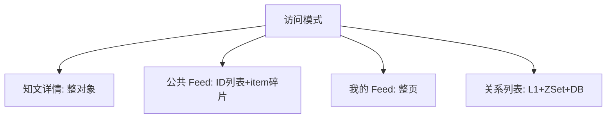

## 4. 设计亮点

## 4.1 热点识别是跨实例近似聚合

HotKeyDetector 不是单机计数器，而是：

1. 本地记录
2. Redis 聚合
3. 本地等级缓存 + Redis 热点标记兜底

这是一种成本可控的热点识别方式，不需要引入额外流处理系统。

## 4.2 TTL 只延长不缩短

TTL 延长通过 Lua 脚本保证“只增不减”，这很重要。

因为多实例并发更新 TTL 时，如果没有这个约束，后写入的实例可能把别的实例刚延长好的 TTL 又缩回去。

## 4.3 大 V 和普通用户分开优化

关系模块里对大 V 的优化很有面试价值：

- 普通用户：Redis ZSet 承接
- 大 V：L1 头部缓存吸收热点

这体现的是：

**用户规模不同，缓存策略也应该不同。**

## 5. 难点与边界

### 5.1 热点识别永远是近似的

当前实现不是全局精确实时统计，而是：

- 本地采样
- 周期 flush
- 滑动窗口聚合

所以它更像“足够好”的工程方案，而不是绝对精确的监控系统。

### 5.2 过度缓存会制造一致性问题

不是缓存越多越好。  
比如关系模块就明确选择：

- 列表缓存
- 单条关系直查

这就是在控制复杂度。

### 5.3 大 V 优化背后其实是读扩散 / 写扩散思维

当某个用户成为热点节点时，你就不能继续假设所有用户的访问模式一样。  
这背后会自然延伸到：

- 读扩散
- 写扩散
- 混合分层

### 5.4 热度等级缓存按窗口整体重建

`levels` 是进程内 map，保存 key → 热度等级。它**每轮 flush 用本轮观测结果整体替换**，而不是增量累加；本轮完全无流量时直接清空。

> **历史行为差异（升级需知）**：早期实现只往 `levels` 里写、从不删除。两个后果：
>
> 1. **内存泄漏**。`levels` 的键空间是「被访问过的缓存键」，在内容型业务里随内容总量线性增长且无上界，长期运行会持续膨胀。注意 `buf` 有 `max_local_keys` 淘汰，而 `levels` 当时没有任何约束。
> 2. **降温的 key 永不退场**。一个曾经上榜的 key 在流量消失后会永久保留旧等级，其 TTL 被无谓地反复延长。
>
> 改为整体替换后，`levels` 的规模始终等于「上一轮窗口内实际被访问的键数」，天然受 `max_local_keys` 约束；`getLevel` 从 Redis 标记回填时也加了同一道上限闸。

热度降温仍不是严格实时的：等级以 flush 为粒度更新，一个 key 至多在一个 flush 周期内沿用上一轮的等级。TTL 延长是性能增强而非业务正确性依赖，这个近似边界可以接受。

## 6. 面试官高频问题

### Q1：为什么要有本地 L1？Redis 不够吗？

**参考回答：**

Redis 已经很快，但热点请求量特别大时，所有实例都去打 Redis，Redis 仍然会成为集中瓶颈。  
L1 的价值在于把最热点的一小部分数据直接拦在进程内，进一步减少网络往返和 Redis 压力。

### Q2：为什么版本号方案比本地失效广播更适合这个项目？

**参考回答：**

因为它实现和运维复杂度更低。  
广播方案要处理连接、重连、消息丢失和延迟；版本号方案只需要读一个轻量 key，写路径 bump 一下版本，新请求就自然切到新 key。  
这是一种用很小读开销换系统简单性的方式。

### Q3：热点识别为什么不用全量实时精确统计？

**参考回答：**

因为那样成本太高。  
对于缓存 TTL 优化这类场景，我不需要金融级精度，只需要在工程上足够识别出“最近确实很热”的 key。  
本地缓冲 + Redis 聚合已经能达到这个目标。

## 7. 场景题

### 场景题 1：如果某篇知文突然被大流量打爆，你这个系统会怎么应对？

**推荐回答：**

第一层是多级缓存命中，第二层是分布式锁防击穿，第三层是 HotKeyDetector 延长热点 TTL。  
也就是说，这个系统不是等 miss 之后才处理，而是在 hit 期间就尽量让热点 key 延后过期。

### 场景题 2：如果以后要做“关注人 Feed”，大 V 会引发什么设计问题？

**推荐回答：**

最大问题是 fan-out。  
普通用户可以偏写扩散，大 V 不能纯写扩散，否则一次发文就会产生巨量写入。  
所以最终会走混合策略：小号偏写扩散，大 V 偏读扩散或按需合并。

## 8. 最容易讲错的地方

不要把热点优化讲成“我加了缓存”。  
更好的表达是：

1. 我先识别热点模式
2. 再按访问模式选择缓存层次
3. 最后用热点识别去动态延长高价值缓存的寿命

---

# 附录A：工程级扩写

## A1. 穿透 / 击穿 / 雪崩对照

| 问题 | 现象 | 本项目手段 |
|------|------|------------|
| 穿透 | 大量不存在 ID 打 DB | **CF.* + NULL 叠加** |
| 击穿 | 热点 key 过期瞬间打爆 DB | 读穿锁 + 看门狗 |
| 雪崩 | 大量 key 同时过期 | 随机 TTL jitter + 热点延长 |
| 热点 | 单 key 极高 QPS | HotKey 分级延长 TTL |

## A2. RedisBloom CF.* + NULL 叠加（中文流程图）

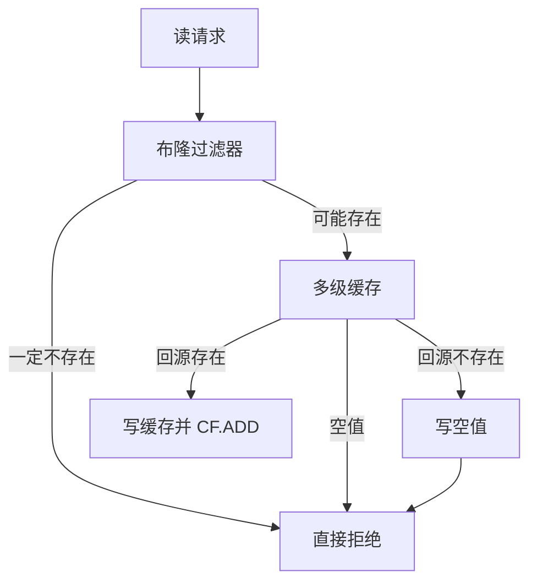

## A3. 热点延长（中文流程图）

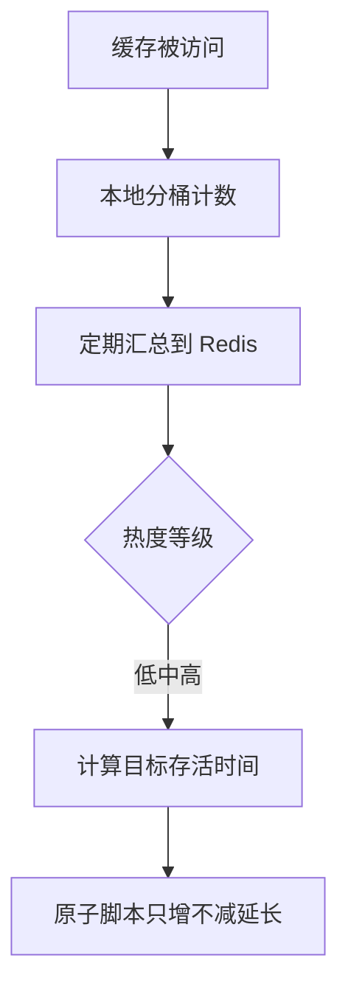

## A4. 60 秒口述

> 缓存按访问模式选型。穿透用 RedisBloom CF 加空值，击穿用读穿锁，热点用滑动窗口延长 TTL，失效用版本号解决多实例 L1 残留。

---

# 附录B：面试细节扩写

## B1. 这篇要讲的不是“用了 Redis”

面试时不要把缓存优化讲成“我把数据放 Redis 里”。这篇真正要讲的是：

1. **不同问题用不同手段**：穿透、击穿、雪崩、热点、失效是不同问题。
2. **不同业务用不同模型**：详情、Feed、关系列表不能套同一个缓存模板。
3. **本地缓存和分布式缓存分工**：L1 吃极热点，Redis 做跨实例共享。
4. **缓存不是无脑延长 TTL**：热点才延长，且 TTL 只增不减，避免并发缩短。
5. **真值和缓存边界清晰**：缓存可以错过、过期、重建，不能替代 MySQL 真值。

## B2. 跨模块缓存地图

| 场景 | L1 | L2 | L3 / 真值 | 失效方式 | 特点 |
|------|----|----|-----------|----------|------|
| 知文详情 | freecache 整对象 | Redis detail JSON / NULL | MySQL `know_posts` + `users` | 版本号 + 删除旧 key | 高并发详情读 |
| 公共 Feed | freecache 整页 | Redis ID 列表 + item 碎片 | MySQL 发布内容列表 | feed version + 删除 item | 列表和条目拆开 |
| 我的 Feed | freecache / Redis 页缓存 | timeline ZSet 或 mine cache | MySQL 作者内容 | mine version | 写扩散优先，读库降级 |
| 关系列表 | 大 V L1 | Redis ZSet | MySQL 双表 | 写后删除 + 异步投影 | 大 V 和普通用户分层 |
| 点赞状态 | 无 | Redis Bitmap | Bitmap 本身是真值 | Lua 状态翻转 | 不适合做对象缓存 |
| 计数快照 | 无 | Redis Hash `cnt:*` | Bitmap 可重建 | dirty repair | 派生快照 |

这张表可以回答“你的缓存策略是不是统一的”：不是统一模板，而是按读写模式定制。

## B3. 缓存问题拆解图

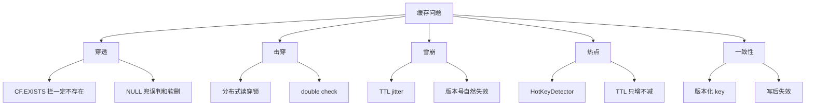

面试时先把问题分类，再讲方案，会比直接堆技术词更稳。

## B4. HotKeyDetector 完整工作流

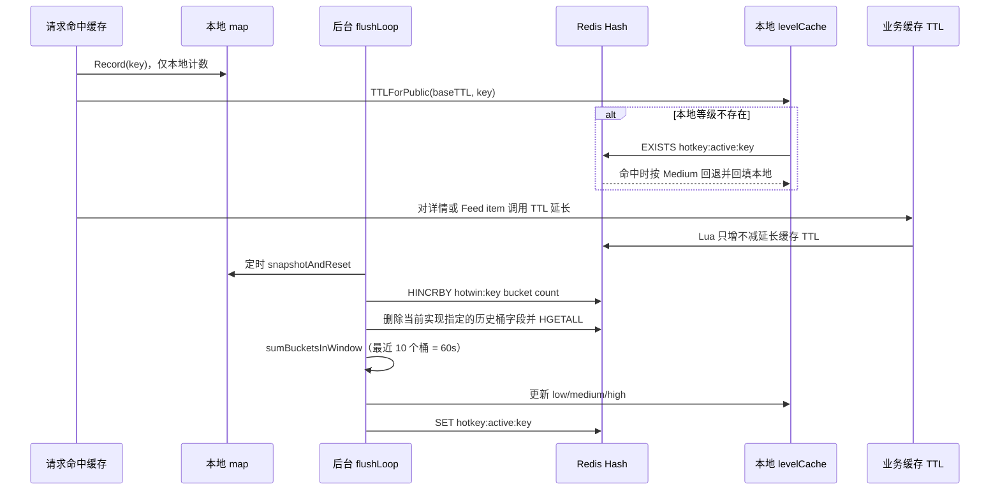

关键点：

1. `Record()` 本身只写本地 map，不直接写 Redis；这只降低了**计数上报**的写放大。
2. 定级所需的 Redis 访问已按场景收敛：列表走 `TTLForPublicBatch`，整页合并为至多一次 MGET + 一次 EVAL，全冷则零往返；单条详情仍是每次命中一次双 key Lua。因此仍不能把完整命中路径笼统描述为“零 Redis IO”。
3. 跨实例计数通过 Redis Hash 完成；`hotkey:active:*` 的**值就是等级整数**，其他实例回退读取时可还原真实 Low/Medium/High（早期只存 "1"，远端一律按 Medium 处理，High 键的信息被丢弃；非法值仍回退 Medium）。
4. HotKeyDetector 只计算热度和目标 TTL，真正延长缓存 TTL 的 Lua 在 knowpost 缓存层执行。
5. 配置声明的 10 个桶现在真实生效：清理逻辑只移除滑出窗口的桶，统计窗口即 `bucket_size_seconds × bucket_count = 60` 秒。

## B5. 为什么计数使用本地 map + Redis Hash，而不是每次请求写 Redis

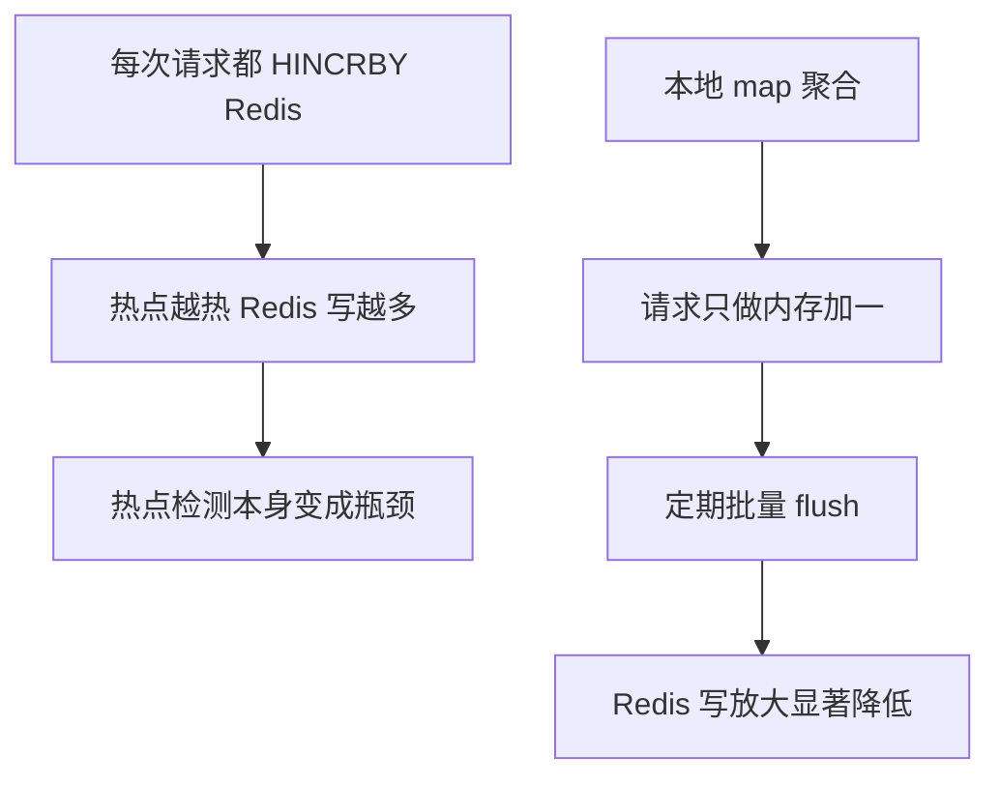

这是针对**计数聚合**的工程取舍：热点识别是为了保护系统，如果每一次 `Record()` 都造成 Redis 写压力，就违背目标。

需要和 TTL 延长路径分开讲：当前业务代码仍会在相关缓存命中时同步执行 Lua 延长 TTL。也就是说，本地 map 减少了 `HINCRBY` 的写放大，但没有消除热点命中路径上的所有 Redis 请求；这部分 `EVAL` 压力是后续可以做采样、限频或异步续期的优化点。

## B6. 热度等级和 TTL 延长

| 等级 | 判断依据 | TTL 策略 | 作用 |
|------|----------|----------|------|
| Cold | 低于 low 阈值 | 使用基础 TTL | 普通缓存 |
| Low | 达到低热阈值 | base + extend_low | 轻微热点 |
| Medium | 达到中热阈值 | base + extend_medium | 明显热点 |
| High | 达到高热阈值 | base + extend_high | 极热点 |

TTL 延长不是直接 `EXPIRE key target`，而是 Lua：

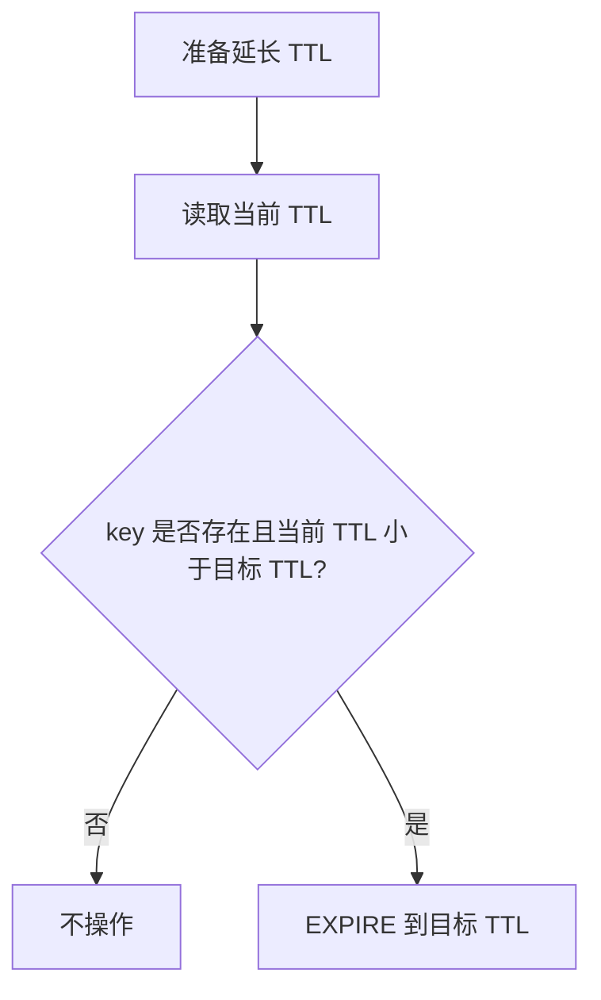

这样能避免多实例并发时，一个实例把另一个实例刚延长的 TTL 缩短。

## B7. RedisBloom CF.* + NULL 为什么要叠加

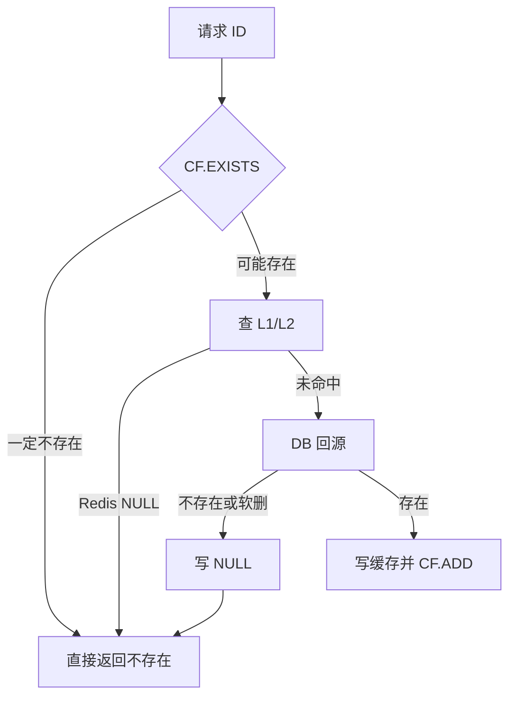

CF 和 NULL 解决的是不同问题：

1. CF.*：适合拦“从未存在过”的随机扫号，且软删 `CF.DEL`。
2. NULL：适合兜误判、删除失败、DB 确认不存在、预热窗口、**模块未安装**。
3. 过滤器/模块故障时 fail-open，不误拦真实内容。
4. 过滤器为第三方 RedisBloom 模块（`redis-stack-server`）；`internal/cache/bloom.go` 仅为客户端薄封装。

## B8. 为什么详情用整对象，Feed 用碎片

| 模型 | 适合场景 | 不适合场景 |
|------|----------|------------|
| 整对象缓存 | 单个详情页，key 和数据一一对应 | 多个列表页包含同一条数据 |
| 整页缓存 | 页内容稳定、更新少 | 单条 item 更新会影响很多页 |
| ID 列表 + item 碎片 | Feed 列表，条目复用多 | 组装逻辑更复杂 |
| ZSet 列表 | 关系链、时间线、有序分页 | 复杂对象内容仍要另查 |

公共 Feed 如果只用整页缓存，一条知文更新可能要清很多页；碎片模型把“排序列表”和“条目内容”拆开，更新时只删 item 并 bump version。

## B9. 版本号失效和广播失效对比

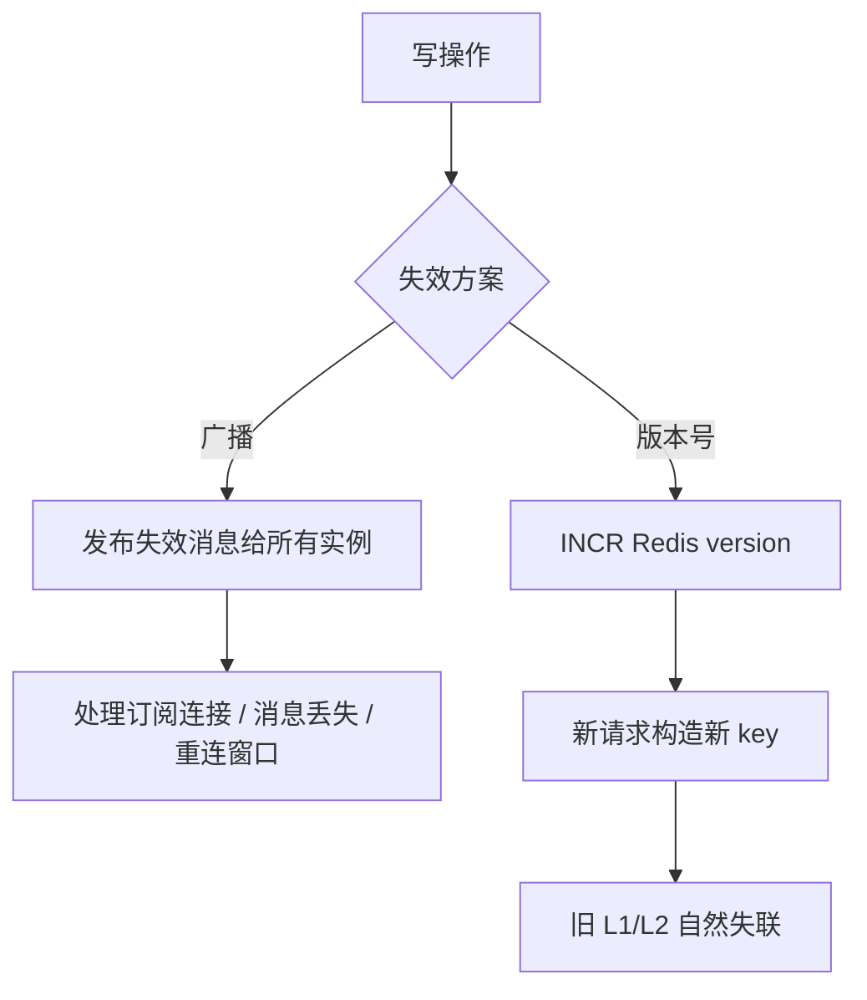

版本号方案的代价是读路径多一次版本查询；收益是多实例环境下不用保证每个实例都收到失效广播。

## B10. 大 V 缓存为什么不是简单加 TTL

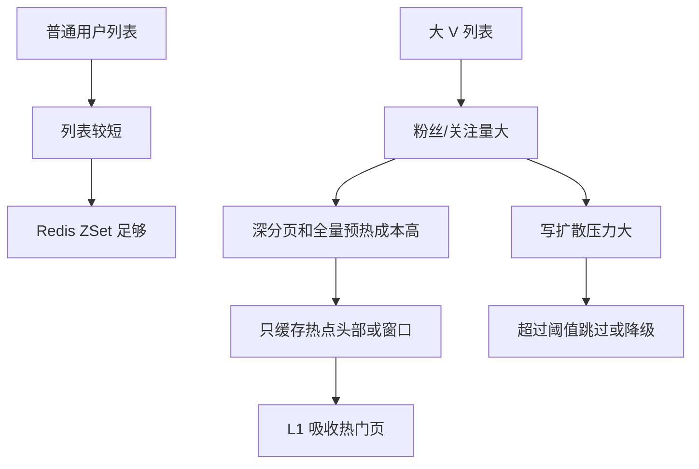

大 V 优化背后是访问模式变化：普通用户可以把列表缓存得相对完整，大 V 更需要窗口化、头部缓存和降级策略。

## B11. 缓存故障边界

| 故障 | 当前影响 | 降级思路 |
|------|----------|----------|
| L1 丢失 | 命中率下降 | 继续查 Redis |
| Redis 缓存 miss | 可能回源 DB | 分布式锁保护 |
| CF 模块故障/缺失 | 不能前置拦截 | fail-open，继续多级缓存 |
| HotKeyDetector 故障 | TTL 不延长 | 业务正常，只是热点保护降级 |
| Redis 整体不可用 | 缓存、锁、计数受影响 | 关键接口需要限流和 DB 保护 |
| 版本号 key 丢失 | 可能回到默认版本 | 写操作再次 INCR，旧缓存自然过期 |

面试重点：热点缓存能力应该是增强项，不应该成为业务正确性的唯一依赖。

## B12. 2 分钟展开回答

> 我这个项目的缓存不是一套模板全局套用。知文详情是 RedisBloom CF + NULL + L1 + Redis + DB：CF.EXISTS 拦不存在 ID，软删 CF.DEL，NULL 兜误判和模块不可用边界，L1 吃进程内热点，Redis 做跨实例共享，DB 是真值。公共 Feed 不适合整页缓存到底，所以拆成 ID 列表和 item 碎片；关系列表用 Redis ZSet，大 V 再叠 L1 头部缓存。热点识别用 HotKeyDetector，本地 map 先聚合请求计数，再定期 flush 到 Redis Hash 计算 low/medium/high 热度等级；业务层随后以 Lua 只增不减地续期缓存，避免多实例把 TTL 缩短。需要如实说明的边界：60 秒滑动窗口现已按设计落地（清理只删滑出窗口的桶），列表场景的 TTL 延长也已批量化为整页一次 EVAL、全冷则零往返；但单条详情的 TTL Lua 仍在缓存命中路径同步执行，这是剩余差距。整体思路是先区分穿透、击穿、雪崩和热点，再按业务读写模式选缓存模型。

---

## 📌 避坑指南与自测思考题

### ⚠️ 生产避坑指南（新手最易踩的坑）

1. **不要把“本地计数批量 flush”误解为“当前 TTL 续期也已批量化”**：
   - 风险做法：每次缓存命中都无条件调用 `EXPIRE`，既产生网络 IO，也可能把更长 TTL 缩短。
   - 当前事实：`Record()` 的计数会在默认 6 秒间隔批量上报；但详情和 Feed item 的 TTL 延长仍在命中路径同步执行 Lua，只是 Lua 保证只增不减。
   - 优化方向：当热点 QPS 很高时，应监控 Redis `EVAL` 的耗时与调用量，并考虑仅在等级变化时、按采样比例或由异步任务续期；不能宣称当前已做到“每次请求零 Redis IO”。

2. **多实例并发延长 TTL 时必须使用 Lua 确保“只增不减”**：
   - 错误做法：实例 A 根据 High 计算 `baseTTL + extend_high`，实例 B 随后根据 Low 计算更短的 `baseTTL + extend_low`，并直接执行 `EXPIRE`。
   - 后果：实例 B 会覆盖实例 A 已设置的更长 TTL，热点 key 可能提前失效并爆发回源。
   - 正确做法：执行 Lua `if targetTTL > currentTTL then redis.call('EXPIRE', KEYS[1], targetTTL) end`。

### 🧐 巩固自测思考题

- **思考题 1**：为什么“我的已发布列表 (Mine Feed)”直接使用整页缓存，而“公共 Feed”一定要拆成“ID 列表 + Item 碎片”？
  - *提示*：“我的 Feed”数据私有度高、写频率低且仅当前作者阅读；“公共 Feed”跨千万用户共享，如果某帖子更新，只需失效单条 Item 碎片即可，免去了全站大量分页 Key 的刷洗。
- **思考题 2**：如果某个 API 节点被强行 kill -9，导致 `HotKeyDetector` 本地 map 中尚未 flush 的计数丢失，影响大吗？
  - *提示*：会丢失该节点最多一个 flush 间隔内的计数，默认约 6 秒；已写入 Redis 的数据和其他节点的计数仍在。结果可能是热点升级延后或短暂降级，而不是业务数据错误。由于统计窗口是 60 秒共 10 个桶，单个 flush 间隔的丢失最多影响窗口内 1/10 的计数，对临界阈值的扰动有限。

---

# 附录C：HotKeyDetector 函数级源码走读（internal/cache/hotkey.go）

| 函数 | 逐步/要点 |
|---|---|
| `NewHotKeyDetector(cfg,rdb,logger)` | 派生 bucketSize/flushInterval/statTTL/markTTL；maxKeys 默认 10 万可配；logger nil→zap.L() |
| `Record(key)` | 纯本地：锁内 `buf[key][当前桶]++`；新键且已达 maxKeys 先 `evictOldestLocked`。**热路径唯一开销是一把互斥锁** |
| `evictOldestLocked()` | 两趟 O(N)：先淘汰"最新桶已滑出窗口"的键（对任何求和无贡献）；不够再按 map 随机序补足 10%。**按 newest 而非 oldest 淘汰**——按 oldest 会优先干掉持续被访问的长热点（旧实现还做 O(N log N) 全排序压在 Record 临界区） |
| `Run(ctx)` / `RunUntilDone(ctx)` | 前者非阻塞（go flushLoop）；后者**阻塞至 ctx 结束**并做 `finalFlush`——BackgroundRunner 契约要求阻塞，否则停机丢最后一窗计数 |
| `finalFlush()` | 独立 2s 超时 context（生命周期 ctx 已取消）跑一轮 flushOnce |
| `flushOnce(ctx)` | ①snapshot 置换本地 buf（空则 `replaceLevels(nil)` 清等级，流量停后旧等级不残留）；②pipeline：逐键逐桶 HINCRBY + **一条 HDEL 携带全部滑出桶**（旧实现每键×BucketCount 条）+ Expire；③pipeline HGETALL 回读 → `sumBucketsInWindow` 60s 求和 → `calcLevel` → 达标键 SET `hotkey:active:{k}`=**等级整数**（markTTL）；④`replaceLevels` 整体替换 |
| `staleBucketFields(now)` | 只删「刚滑出窗口」的桶 + slack（覆盖 flush 跨多桶/失败轮）；残留由 statTTL 与求和过滤兜底 |
| `replaceLevels(levels)` | 整体替换而非合并——levels 键空间随内容量无上界，只写不删=内存泄漏+降温键 TTL 被永续延长 |
| `snapshotAndReset()` | 锁内换 map 指针，O(1) 置换 |
| `sumBucketsInWindow(vals,now)` | 只累加 [now-BucketCount+1, now] 区间内合法桶号 |
| `calcLevel(total)` | 阈值三档 → Cold/Low/Medium/High |
| `TTLForPublic(ctx,base,key)` | `ttlForLevel(base, getLevel(key))`——**加法语义** base+extend_xxx |
| `TTLForPublicBatch(ctx,base,keys)` | 列表专用：本地等级命中直接定级；miss 键合并**一次 MGET**（默认 fail-cold 不延长）→ 解析等级 → 写回本地（受 maxKeys 闸）。逐条 EXISTS+EVAL 的 N 次往返由此消失 |
| `getLevel(ctx,key)` | 本地 → Redis GET 标记（`parseMarkLevel` 解析等级值；redis.Nil 静默 Cold）→ 写回本地（maxKeys 闸） |
| `parseMarkLevel(val)` | 值即等级整数；非法回退 Medium；历史 "1" 恰为 Low（保守方向，旧标记最多存活一个 markTTL） |
