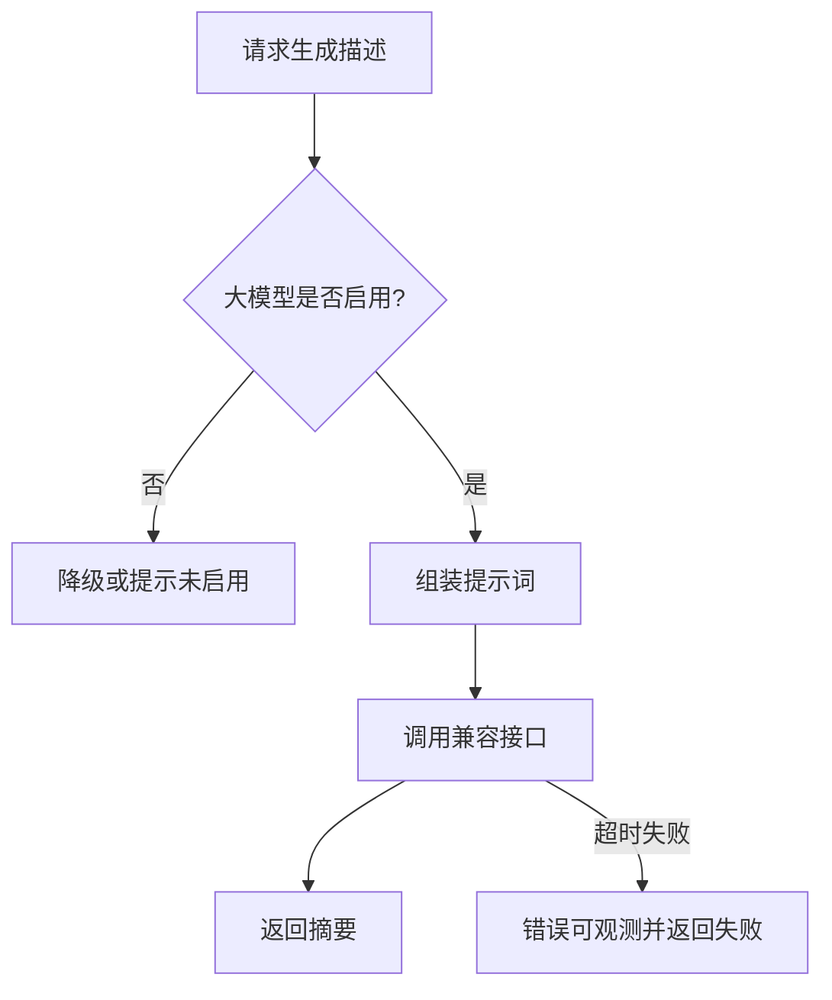

# 10. 大模型与 RAG 模块

## 1. 是什么

模块：`internal/llm`（命名以仓库为准）

能力：

1. 为知文生成摘要描述（可选）  
2. 预留 RAG 问答接口边界  

## 2. 一句话

> **可选能力、按需降级**：主站不因大模型故障起不来；先定接口与超时，再接 embedding 与检索。

## 3. 摘要流程

## 4. 原则

| 原则 | 说明 |
|------|------|
| 非主链路 | 配置关闭则不影响核心业务启动 |
| 超时与限流 | 防止拖垮业务线程 |
| 不落密钥到日志 | API Key 只走配置/环境变量 |
| RAG 分阶段 | 先接口，后向量库与 chunk 策略 |

## 5. 60 秒口述

> LLM 是增强不是底座。摘要可关；RAG 预留边界，避免 AI 绑死主站发布。

---

以配置开关与实际 handler 为准。
