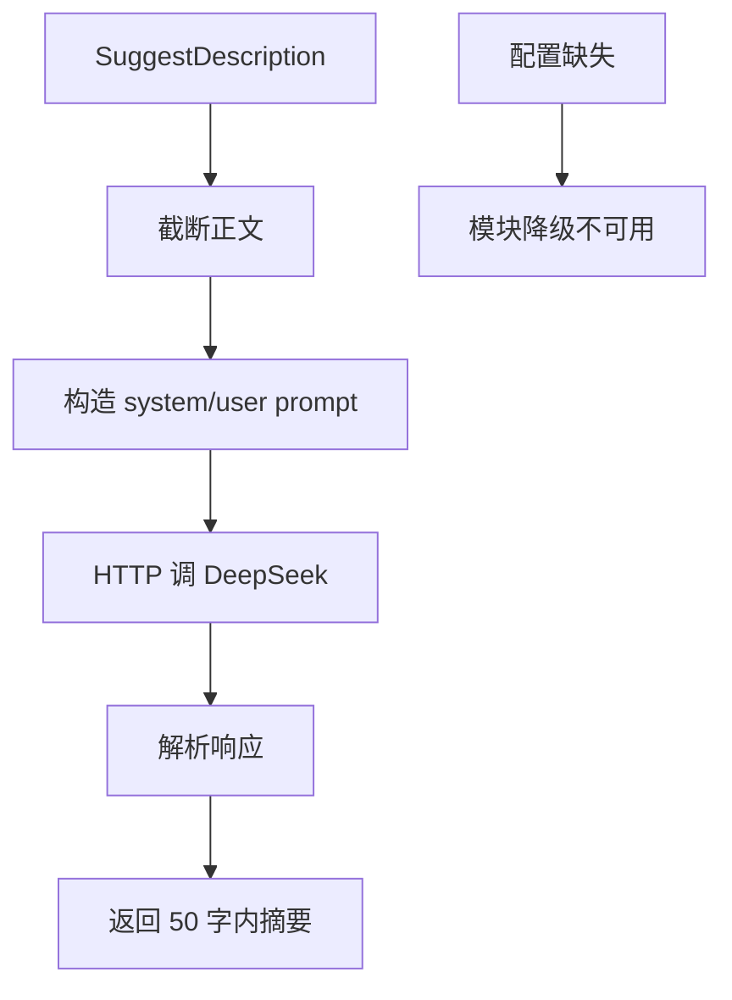
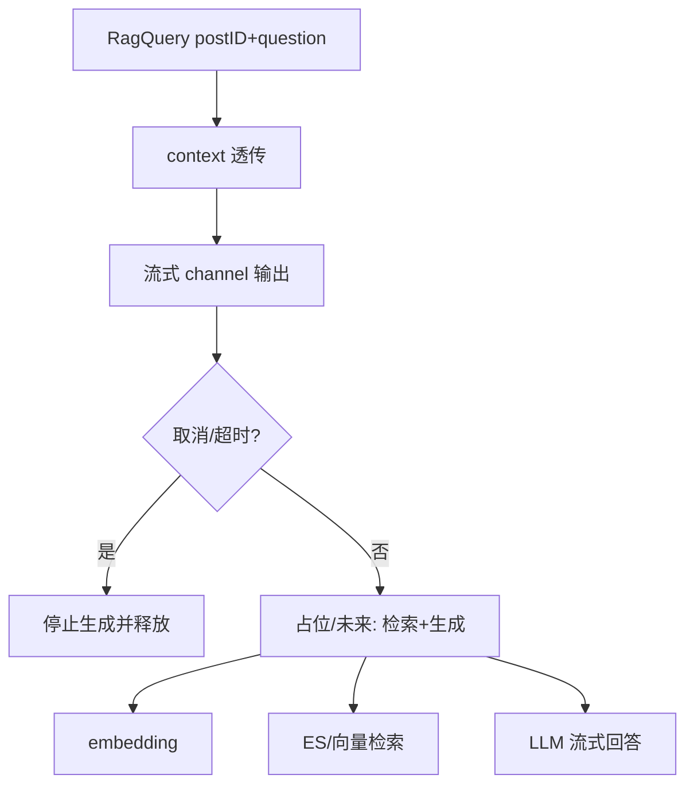
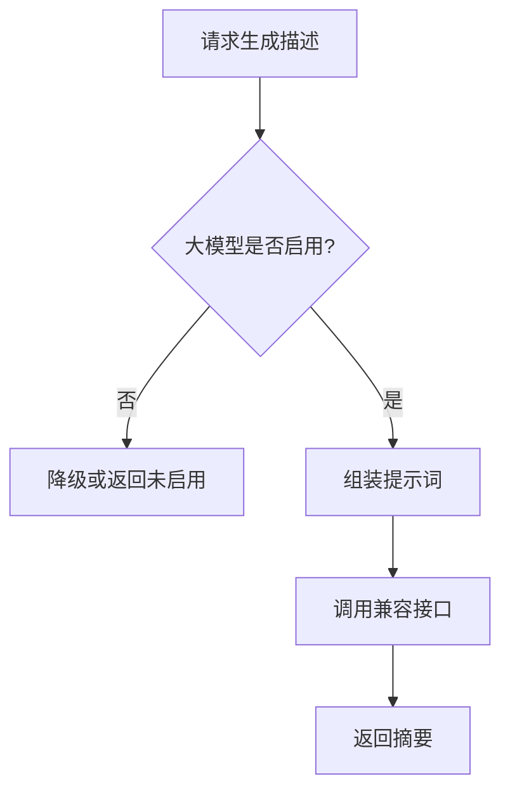
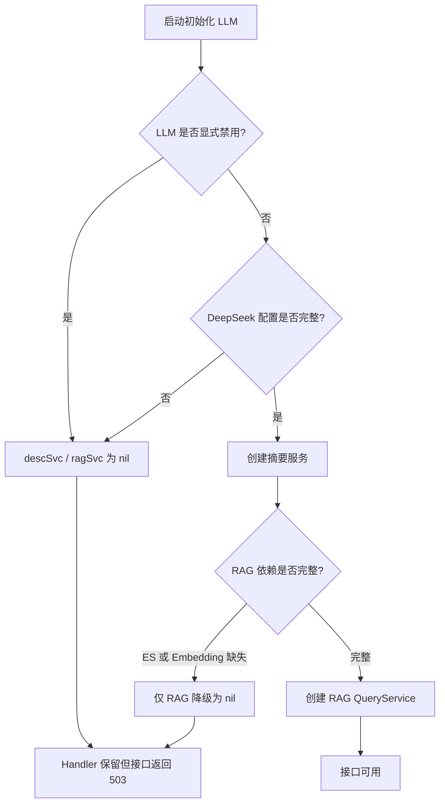
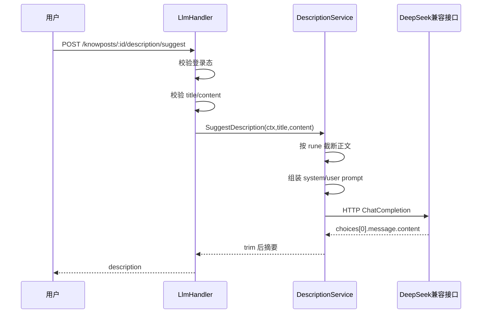
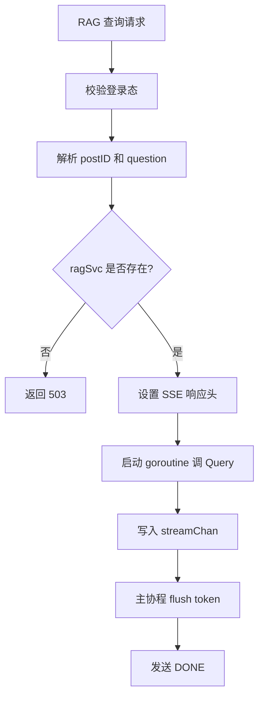
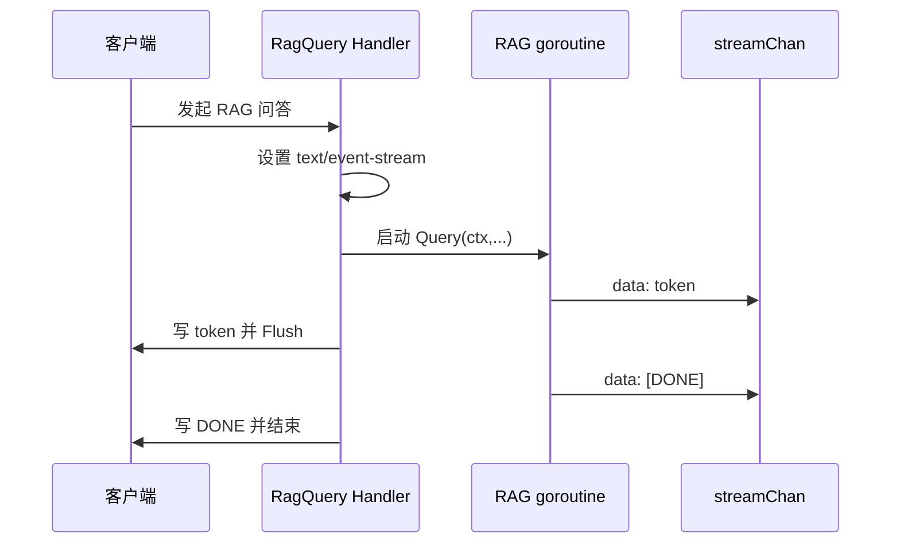
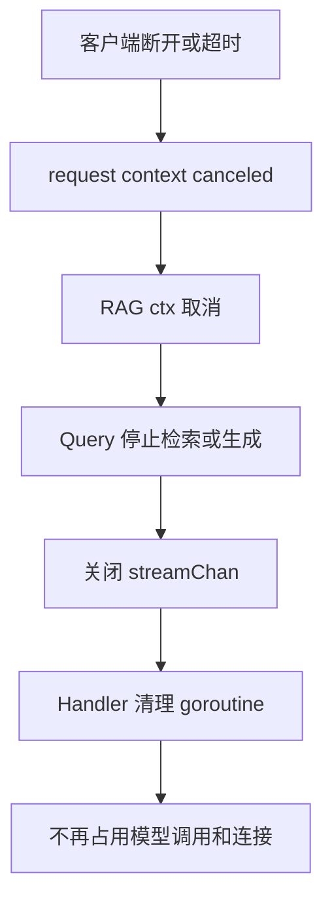
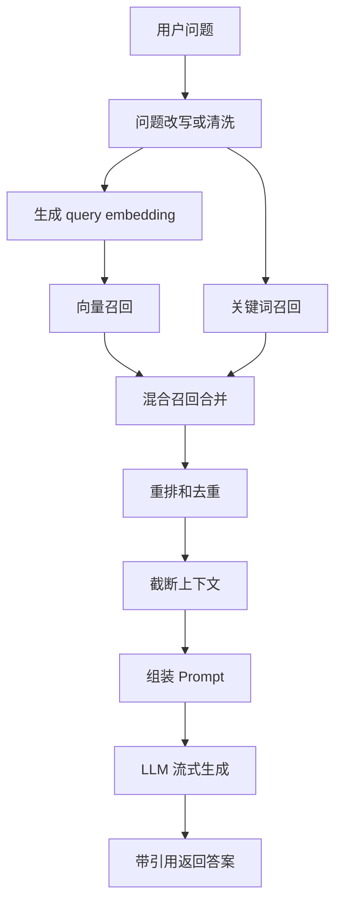
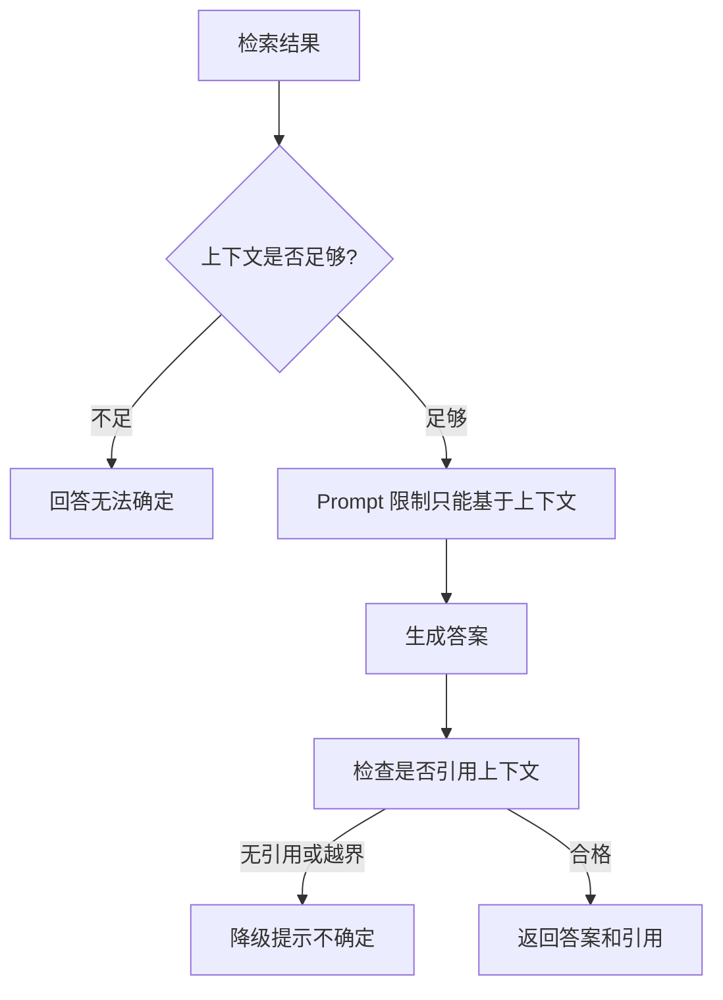

# LLM / RAG 模块

## 1. 模块定位

这个模块目前提供两类能力：

1. 为知文生成摘要描述
2. 预留基于 RAG 的问答接口

它不是当前系统的主链路，而是一个可选增强模块。

## 2. 一句话介绍

LLM 模块当前采用“可选能力、按需降级”的策略：摘要能力通过 DeepSeek 兼容接口直接生成，RAG 问答接口则先把调用边界、上下文传递和流式输出接口搭起来，未来再继续接入 embedding、检索和生成链路，避免 AI 能力反向绑死主站启动。

## 3. 核心流程

## 3.1 摘要生成流程

`SuggestDescription` 流程是：

1. 截断正文，避免 token 过长
2. 构造 system prompt 和 user prompt
3. 通过 HTTP 调 DeepSeek Chat API
4. 解析响应
5. 返回 50 字以内摘要

这个流程虽然简单，但边界是清楚的：

- service 只负责调用和解析
- 配置不完整时整个模块降级

## 3.2 RAG 查询流程

当前 `RagQueryService` 还属于占位实现，但接口设计已经提前考虑了未来扩展：

1. 接收 `context.Context`
2. 接收 `postID + question`
3. 支持流式输出到 channel
4. 在任何阶段都能被取消

这意味着未来接入：

- embedding
- ES / 向量检索
- LLM 流式生成

时，不需要重做 handler 和接口边界。

## 4. 设计亮点

## 4.1 AI 能力可选降级

这个模块最好的地方，不是“用了大模型”，而是：

**大模型不可用时不会拖垮主站。**

在启动层里：

- 配置不完整就不构建
- 构建失败就 warn
- handler 统一返回 `503`

这比把 AI 服务硬塞进主链路成熟得多。

## 4.2 context 全链路透传

不管是摘要还是未来 RAG，这类能力的本质都是外部 IO：

- HTTP 请求
- embedding 调用
- 检索调用
- 流式生成

所以 `context` 透传非常重要。  
客户端断开、上游超时、用户主动取消时，底层外部调用应该尽快停掉。

## 4.3 先建边界，再慢慢补算法

RAG 服务当前不是完整实现，但接口边界已经定好了。  
这是一种更稳妥的演进方式：

1. 先把协议、取消、流式输出抽象对
2. 再逐步接 embedding / retrieval / generation

## 5. 难点与边界

### 5.1 AI 能力不要误入主链路

如果把摘要生成、问答、向量化直接塞进知文发布主链路，会出现：

- 发布延迟明显上升
- 第三方模型抖动拖累主站
- 故障域扩大

所以 AI 能力更适合作为增强，而不是主链路阻塞项。

### 5.2 RAG 难点不在“调接口”，而在链路编排

真正难的是：

1. 如何切片
2. 如何召回
3. 如何去重
4. 如何做 prompt 拼装
5. 如何处理幻觉
6. 如何控制流式中断与超时

面试里如果只说“RAG 就是检索加生成”，通常不够。

## 6. 面试官高频问题

### Q1：为什么这个模块要做成可选能力？

**参考回答：**

因为它不是主站核心能力。  
如果 LLM 服务、embedding 服务或外部网络出问题，不应该导致登录、发文、看详情这些核心链路不可用。  
所以我把它设计成可选模块，初始化失败只影响 AI 接口本身。

### Q2：为什么强调 context 透传？

**参考回答：**

因为 AI 调用通常是长 IO。  
如果客户端断开了，但服务端还继续占着连接和模型配额，那就是典型资源浪费。  
所以 AI 链路必须支持取消，这是工程上比“能不能调通接口”更重要的点。

### Q3：当前 RAG 还没完全接上，为什么你觉得这样设计仍然有价值？

**参考回答：**

因为我先把边界设计对了：请求输入、上下文、流式输出、取消语义已经稳定。  
未来接检索和生成时，只是补内部实现，不用再推翻整个外部接口。

## 7. 场景题

### 场景题 1：如果让你把“知文问答”真正做出来，你会怎么推进？

**推荐回答：**

我会按三层推进：

1. 数据层：
   - 切片
   - 向量化
   - 建索引
2. 检索层：
   - 关键词召回
   - 向量召回
   - 混合重排
3. 生成层：
   - prompt 拼装
   - 上下文截断
   - 流式回答

不会一步到位全做，而是先让链路逐层可验证。

### 场景题 2：如果模型输出经常胡说八道，你怎么降风险？

**推荐回答：**

我会从三个方向收口：

1. 提高检索上下文质量
2. 在 prompt 里限制只允许基于检索内容作答
3. 输出里加入“不确定时明确说明不知道”的约束

必要时还可以给答案加引用片段，增强可解释性。

## 8. 最容易讲错的地方

不要把这个模块说成“已经完整实现了高级 AI 系统”。  
更成熟的说法是：

1. 摘要能力已可用
2. RAG 边界已搭好
3. 未来会继续补检索与生成细节

这种表达既真实，也更工程化。

---

# 附录A：工程级扩写

## A1. 摘要生成（中文流程图）

## A2. 设计原则

- 可选能力：主站不因 LLM 故障起不来。
- RAG 预留接口，先定边界再补 embedding 与检索。

---

# 附录B：流程图扩写

## B1. LLM 可选初始化流程

面试重点：AI 是增强能力，配置不完整不能拖垮主站启动；对应接口显式返回 503，而不是 panic。

## B2. 摘要生成详细流程

这里的工程点不是“调通模型接口”，而是：鉴权、输入截断、超时、context 取消和错误转换都要有边界。

## B3. RAG 当前占位链路

当前实现返回占位消息，但外部接口、SSE 结构、取消语义已经预留好。

## B4. SSE 流式返回流程

这张图能回答“为什么要流式”：AI 生成可能慢，SSE 能让用户尽早看到输出，也能在客户端断开时及时释放资源。

## B5. 请求取消和资源释放

面试重点：AI 链路通常是长 IO，必须支持 context 取消，否则客户端断开后服务端仍会浪费模型配额。

## B6. 完整 RAG 目标流程

如果面试官问“RAG 下一步怎么做”，按这张图讲，不要只说“接个向量库”。

## B7. 防幻觉控制流程

成熟回答：RAG 的风险控制不只是 prompt，还包括检索质量、上下文截断、引用约束和不确定性表达。

## B8. AI 模块 2 分钟口述

> AI 模块我把它设计成增强能力，不让它影响主站启动。摘要生成是真实调用 DeepSeek 兼容接口，入口要求登录，服务层会截断正文、组装 prompt、带 context 发 HTTP 请求并解析结果。RAG 当前更像边界先行：接口、SSE 流式返回、goroutine、取消语义都已经搭好，但真实向量检索和流式生成还需要继续补。后续完整 RAG 会走问题处理、embedding、关键词和向量混合召回、重排、上下文截断、prompt 生成和引用返回。面试时我会诚实区分“已落地的摘要能力”和“已预留边界的 RAG 能力”。

---

# 附录：函数级源码走读（internal/llm）

| 函数 | 要点 |
|---|---|
| `NewKnowPostDescriptionService(cfg,logger)` | 校验 api_key/base_url，不全 → 返回 err，handler 侧降级 503（可选能力不阻塞启动） |
| `SuggestDescription(ctx,title,content)` | 组 chat 请求（system 约束输出风格 + 截断超长 content）→ HTTP 调 DeepSeek/OpenAI 兼容端点 → 解析 choices[0]；超时/非 200/空结果分类报错 |
| `NewRagQueryService(llmCfg,esURL)` | 轻构造，不校验（查询时报错） |
| `RagQueryService.Query(ctx,postID,question,streamChan)` | ①ES 取该帖正文做上下文；②组带上下文的流式 chat 请求；③逐 SSE 行解析 delta 写入 streamChan（"data: [DONE]" 结束）；ctx 取消（客户端断开）即中止上游请求。handler 侧 goroutine 已 recover + 请求级 30s 读超时 |
