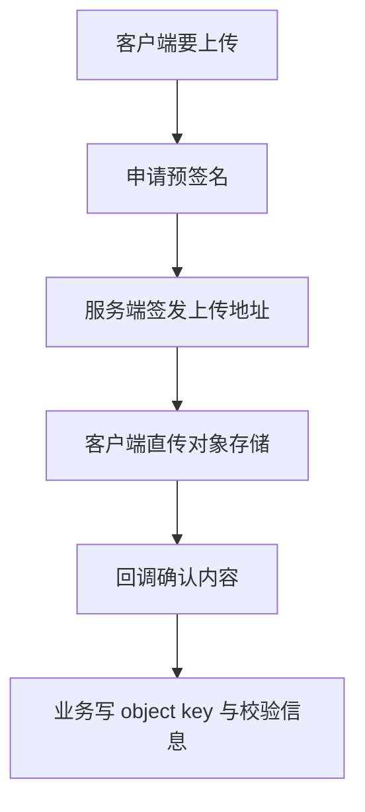

# 11. 对象存储模块

## 1. 是什么

模块：`internal/storage`（或等价）

职责：文件上传与访问，**不存业务元数据**。业务元数据（object key、etag、size、sha256）由知文等模块确认后写库。

## 2. 一句话

> **服务端签名、客户端直传**：业务不代理文件流，降低带宽；用预签名约束路径与时效。

## 3. 直传流程

## 4. 为什么直传

| 好处 | 说明 |
|------|------|
| 省带宽 | 文件不经过业务机 |
| 解耦 | 传输失败不污染业务事务边界 |
| 安全 | 短时签名 + 限定 key 前缀 |

## 5. 与知文协作

见 04：`ConfirmContent` 写回 content 元数据并失效缓存 / 写入布隆（若新建）。

## 6. 风险

1. 预签名过期与时钟  
2. 客户端上传成功但未回调确认 → 孤儿对象  
3. 公开读 URL 的权限模型  

## 7. 60 秒口述

> 上传是预签名直传，业务只确认元数据。知文发布不经过文件代理，存储和库事务边界清晰。

---

以 storage 配置（endpoint、bucket、密钥）为准，密钥禁止进仓库。
