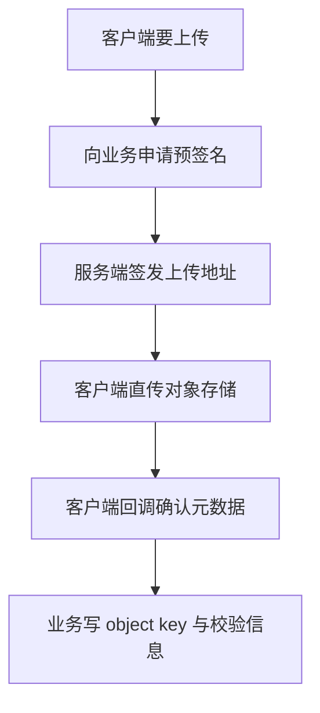
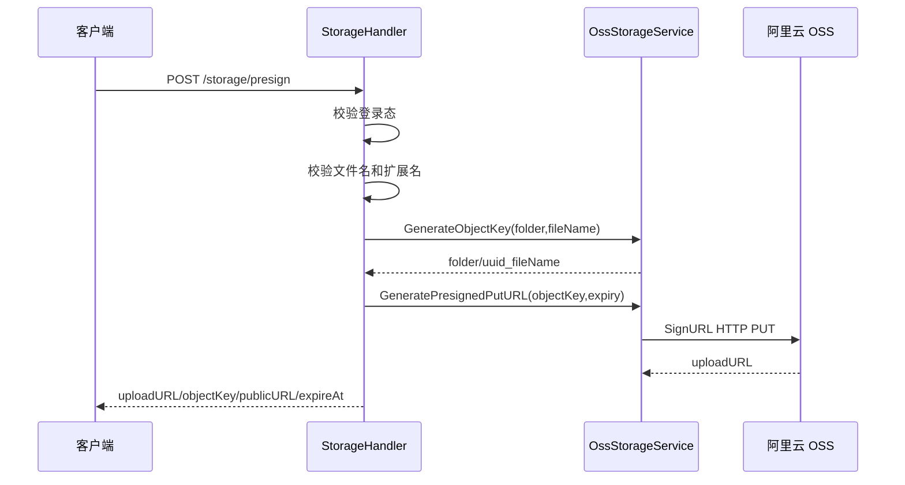
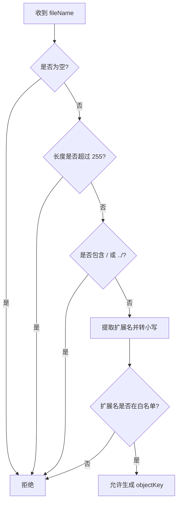
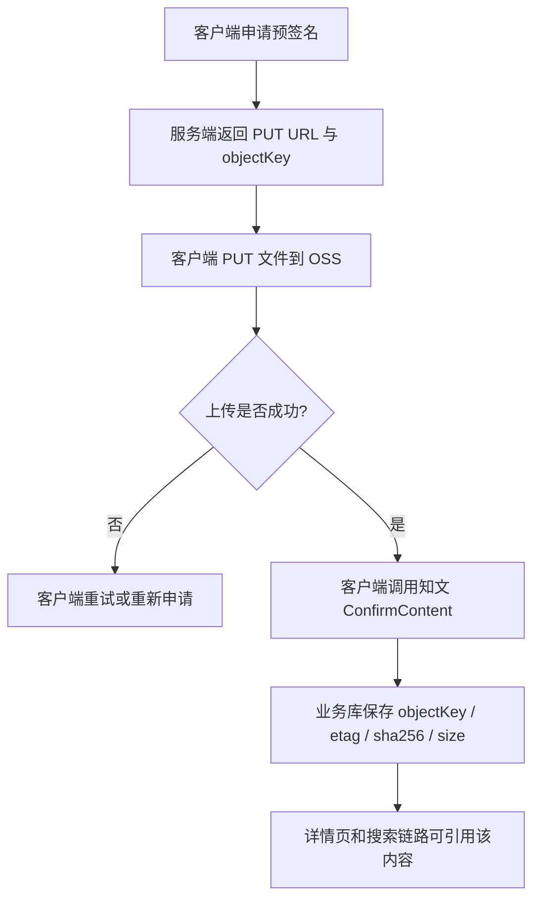
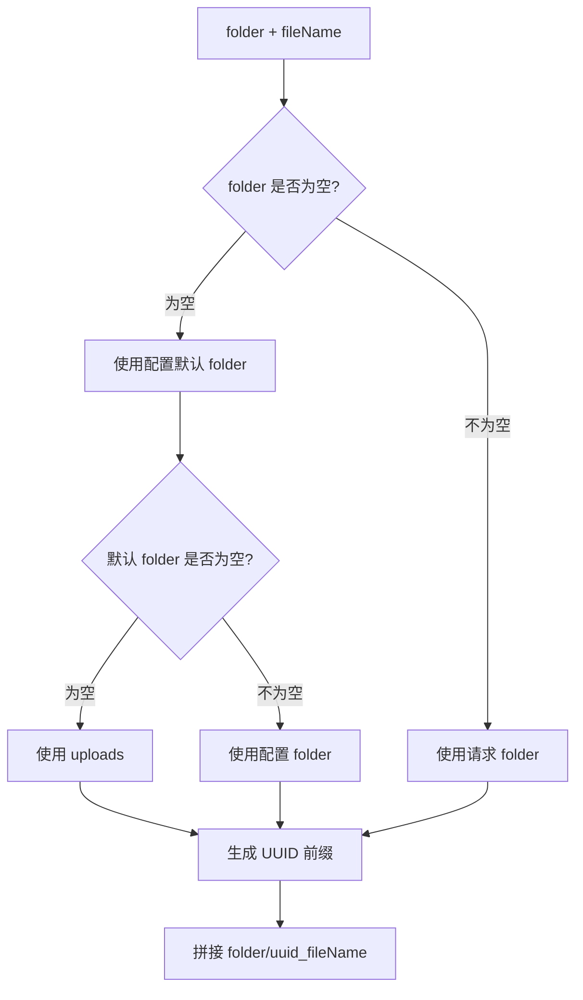
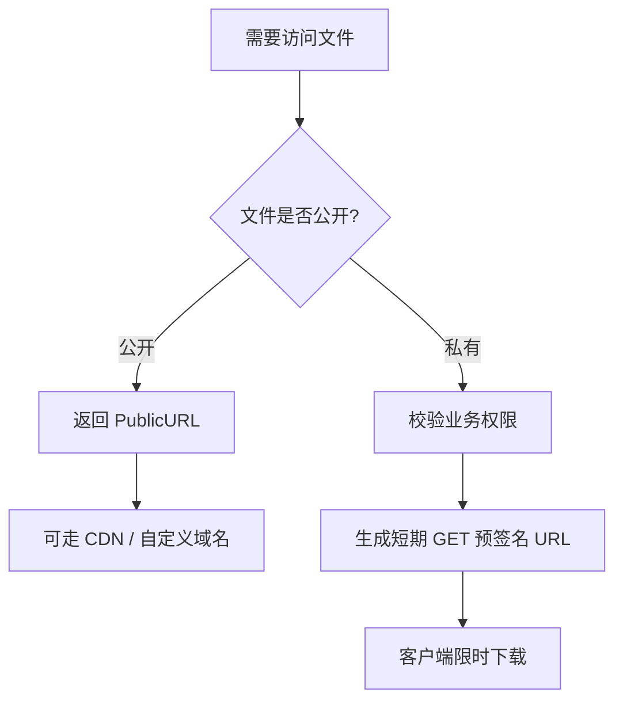
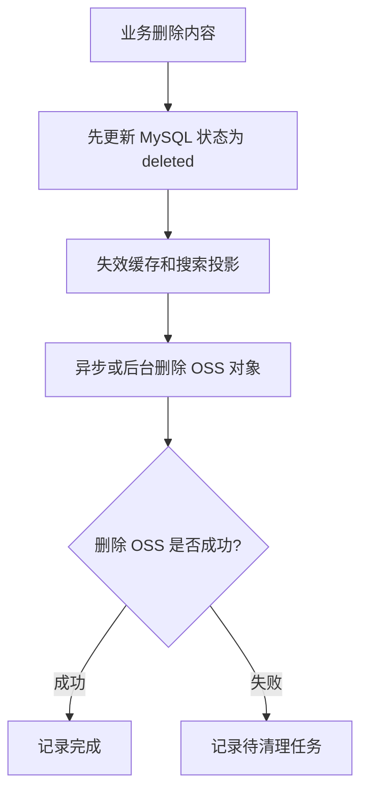
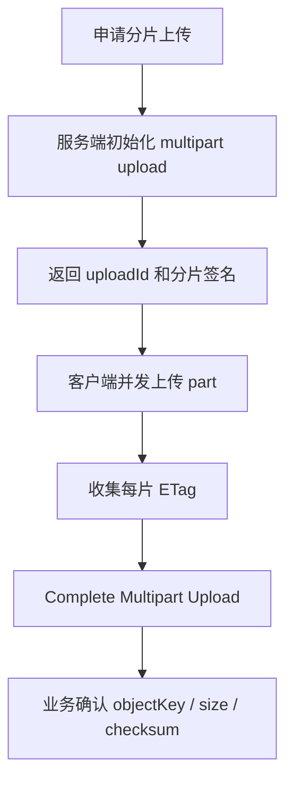

# 对象存储模块

## 1. 模块定位

存储模块负责的是文件上传和访问能力，不直接存业务元数据。

它主要解决：

1. 如何让客户端安全上传文件
2. 如何让服务端知道上传是否完成
3. 如何生成公开或私有访问 URL

## 2. 一句话介绍

对象存储模块采用“服务端签名、客户端直传、业务侧只确认元数据”的模式：服务端不代理文件内容，而是给客户端发 PUT/GET 预签名 URL，上传完成后业务模块再回写 object key、etag、size、sha256 等元数据，从而降低了带宽压力，也把文件传输和业务写库解耦了。

## 3. 核心流程

## 3.1 直传上传流程

完整流程通常是：

1. 客户端请求上传授权
2. storage 模块生成 object key
3. storage 模块返回 PUT 预签名 URL
4. 客户端直接把文件 PUT 到 OSS
5. 上传成功后，业务方调用 `ConfirmContent`
6. 业务模块把 object key / etag / sha256 / size 写回主库

这说明 storage 模块只负责“文件进出 OSS 的能力”，并不负责“内容主数据落库”。

## 3.2 下载流程

有两种常见模式：

1. 公共资源
   - 直接生成 Public URL
2. 私有资源
   - 生成 GET 预签名 URL

## 3.3 元数据确认流程

storage 模块还能通过 OSS HEAD 获取：

- ETag
- Content-Length

这在业务侧很有用，因为可以：

1. 校验上传完成
2. 保存对象大小
3. 记录 ETag 做后续缓存或完整性校验

## 4. 设计亮点

## 4.1 文件不上业务服务中转

这是最重要的设计点。

如果所有文件都先上传到业务服务，再由业务服务转发到 OSS，会带来：

1. 带宽压力
2. 机器流量成本
3. 上传延迟
4. 服务端内存和连接占用

客户端直传对象存储，是内容平台更合理的路径。

## 4.2 业务侧只认元数据，不认文件流

这个边界很清晰：

- storage 负责对象存储能力
- knowpost 负责内容元数据确认

这让上传链路更容易维护和测试。

## 4.3 支持公开 URL 和私有 URL 两种模型

不同资源不应该共用同一种访问策略：

- 公开图片更适合 CDN / 公共域名
- 私有内容更适合限时签名 URL

## 5. 难点与边界

### 5.1 预签名 URL 只是能力，不是权限本身

真正关键的是：

1. 谁能拿到这个 URL
2. URL 有效期多长
3. object key 能不能被随便伪造

所以权限控制不在 OSS SDK，而在业务层发签名之前。

### 5.2 上传完成不等于业务可见

客户端把文件传到 OSS 之后，业务数据还没更新。  
只有业务方确认元数据并写入主表后，这篇知文的内容才真正“生效”。

这两个阶段必须分开理解。

## 6. 面试官高频问题

### Q1：为什么不用服务端代理上传？

**参考回答：**

因为这类内容平台上传量大、文件可能也不小，如果让所有文件都经过业务服务中转，会明显增加带宽、延迟和机器压力。  
服务端签名、客户端直传 OSS 更适合这种场景，业务服务只负责授权和元数据确认。

### Q2：为什么上传完还要业务侧再确认一次？

**参考回答：**

因为“文件在 OSS 上存在”和“业务上允许这份内容生效”不是一回事。  
客户端上传成功后，我还需要把 object key、etag、size、sha256 等元数据写回业务主库，后续详情页和搜索链路才知道要展示哪份内容。

### Q3：私有文件和公共文件怎么区分？

**参考回答：**

公共文件可以直接给 Public URL，适合 CDN 分发；  
私有文件不暴露固定地址，而是按权限校验后给一个短期有效的 GET 预签名 URL。  
这样权限边界会更清晰。

## 7. 场景题

### 场景题 1：如果要支持大文件分片上传，你会怎么改？

**推荐回答：**

我会继续坚持“客户端直传 OSS”的思路，只是把单对象 PUT 升级为 multipart upload：

1. 服务端签发 multipart upload 初始化信息
2. 客户端并发上传分片
3. 客户端上报各分片 ETag
4. 服务端或客户端发起 complete multipart upload
5. 业务侧继续走元数据确认流程

### 场景题 2：如果有人拿着旧的预签名 URL 重放上传怎么办？

**推荐回答：**

这个问题通常从三个方向控制：

1. 缩短签名有效期
2. object key 不可预测
3. 业务侧确认时校验文件元数据和上下文

必要时还可以把 URL 与用户、业务场景做更强绑定。

## 8. 最容易讲错的地方

不要把 storage 模块说成“就是封了一层 OSS SDK”。  
更好的说法是：

**我设计的是一条直传链路，核心价值是把文件流量从业务服务剥离出去。**

---

# 附录A：工程级扩写

## A1. 直传流程（中文流程图）

## A2. 为什么直传

- 省业务机带宽。
- 文件传输与业务写库解耦。
- 权限靠预签名时效与路径约束。

---

# 附录B：流程图扩写

## B1. 预签名 URL 生成流程

面试重点：业务服务只签发上传授权，不承载文件流量。

## B2. 文件名安全校验流程

这张图可以回答“预签名上传会不会被路径遍历利用”：文件名先做白名单和路径字符拦截，object key 由服务端生成。

## B3. 客户端直传与业务确认

关键点：OSS 里有文件不等于业务已生效，必须经过业务确认写入主库。

## B4. ObjectKey 生成流程

服务端生成 object key 的目的：避免用户控制完整路径，也降低同名文件覆盖风险。

## B5. 公开 URL 与私有 GET 预签名

当前文档重点是上传直传；如果未来做私有文件访问，应把权限校验放在生成 GET 预签名前。

## B6. 删除对象的安全顺序

一般不要先删 OSS 再改业务库，否则业务库仍引用对象但文件已经消失，用户会看到破图或下载失败。

## B7. 大文件分片上传演进

这个演进仍然保持“文件流不经过业务服务”的原则，只是把单次 PUT 拆成多片。

## B8. 对象存储 2 分钟口述

> 对象存储模块不是简单封 OSS SDK，而是把文件流量从业务服务里拆出去。客户端先请求预签名 URL，服务端校验登录态、文件名和扩展名，再生成服务端控制的 object key 和短期 PUT URL。客户端直传 OSS 后，还要调用业务确认接口，把 object key、etag、sha256、size 写回主库。这样 OSS 上有文件和业务上生效是两步，权限边界更清晰。公开资源可以返回 PublicURL，私有资源未来应该在权限校验后生成 GET 预签名 URL。大文件场景可以演进成 multipart upload，但原则仍然是不让业务服务中转文件流。
