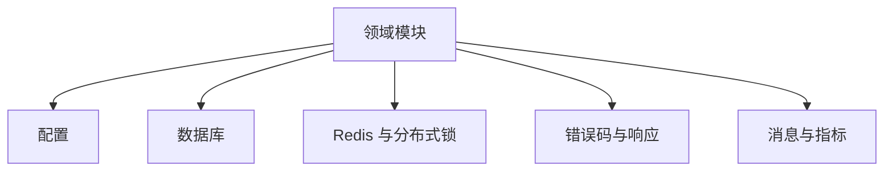

# 12. 共享基础设施与公共组件

## 1. 是什么

| 区域 | 内容 |
|------|------|
| `pkg/config` | 配置结构与默认值 |
| 数据库 | 连接池、迁移 |
| Redis / 锁 | 客户端、`redislock`、读穿锁工具 |
| 错误与响应 | `errcode`、统一 HTTP 响应 |
| 消息 / 指标 | Kafka 封装、metrics |
| 其它 | jsonutil、分页、审计等 |

## 2. 一句话

> 公共层**不做业务规则**；提供配置、连接、锁、错误模型，让领域包保持干净。

## 3. 分层关系

## 4. 原则

1. context 贯穿，超时可取消  
2. 配置 `ApplyDefaults`，关键项校验  
3. 锁必须带 TTL 与安全释放（token）  
4. 日志脱敏  
5. 测试可替换接口（repo / publisher）  

## 5. 与缓存策略关系

- 读穿锁通用实现：`pkg/cacheutil` 等  
- 布隆 / 热点：`internal/cache`  

见 04、09。

## 6. 60 秒口述

> pkg 和基础设施保证工程一致性：配置、池化、锁、错误。业务复杂度留在 domain，公共库保持无聊但可靠。

---

以 `pkg/` 与 `internal/database` 为准。
