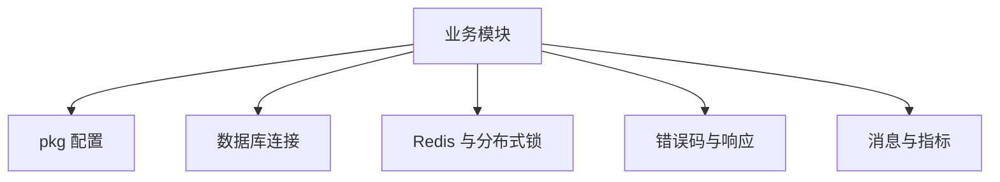
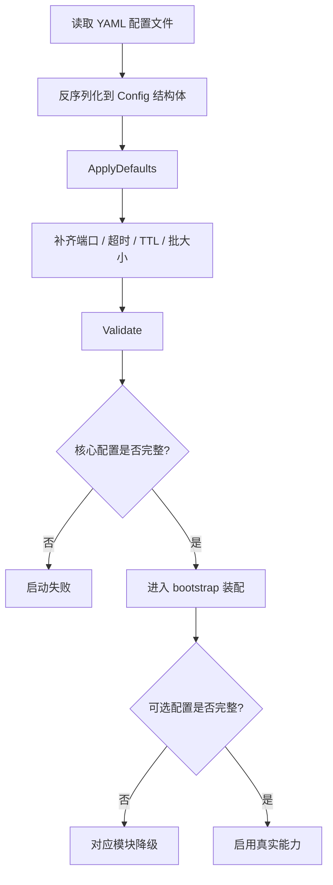
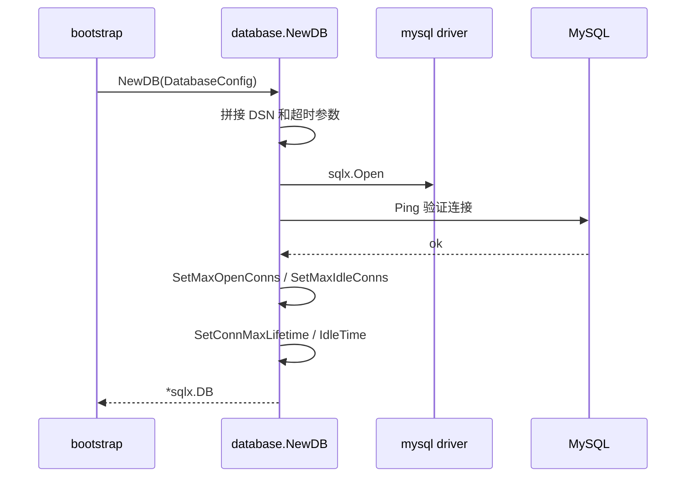
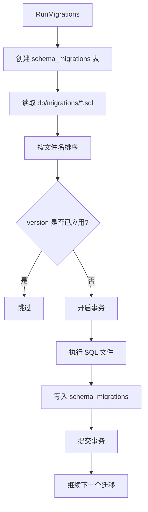
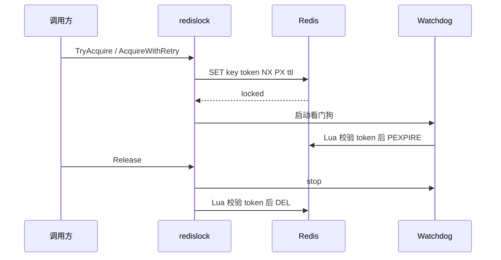
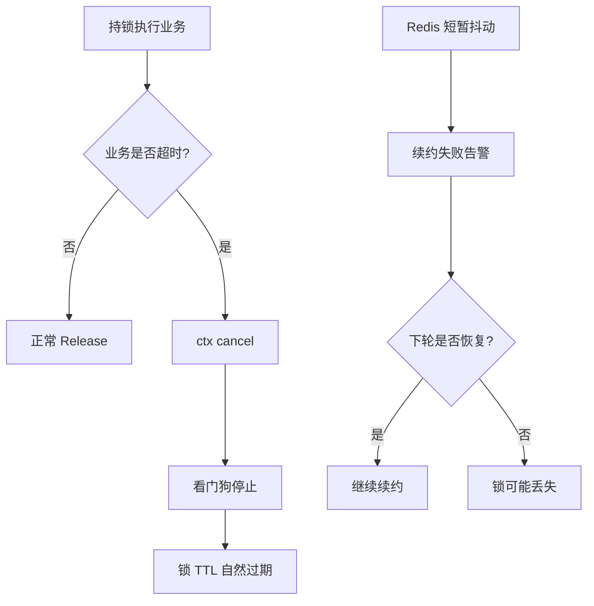
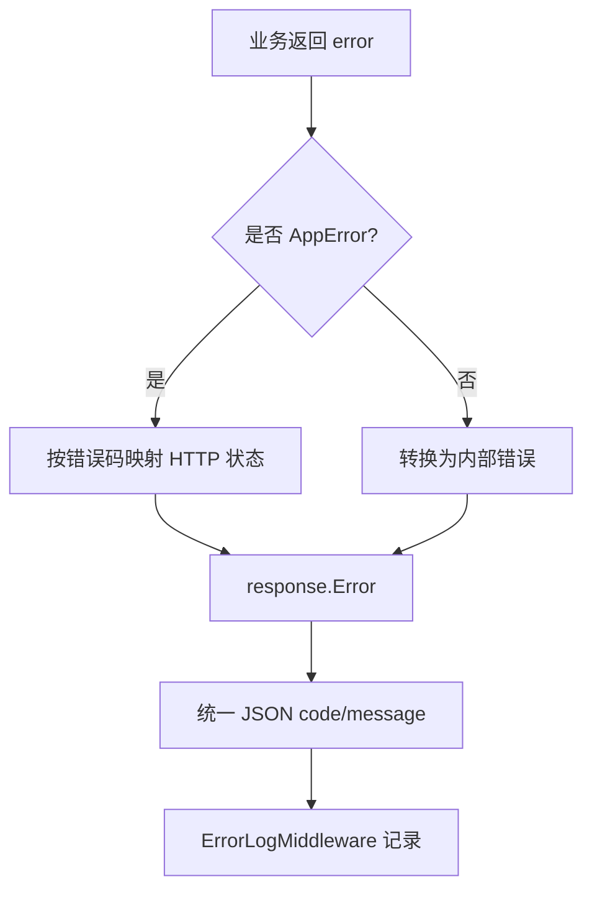
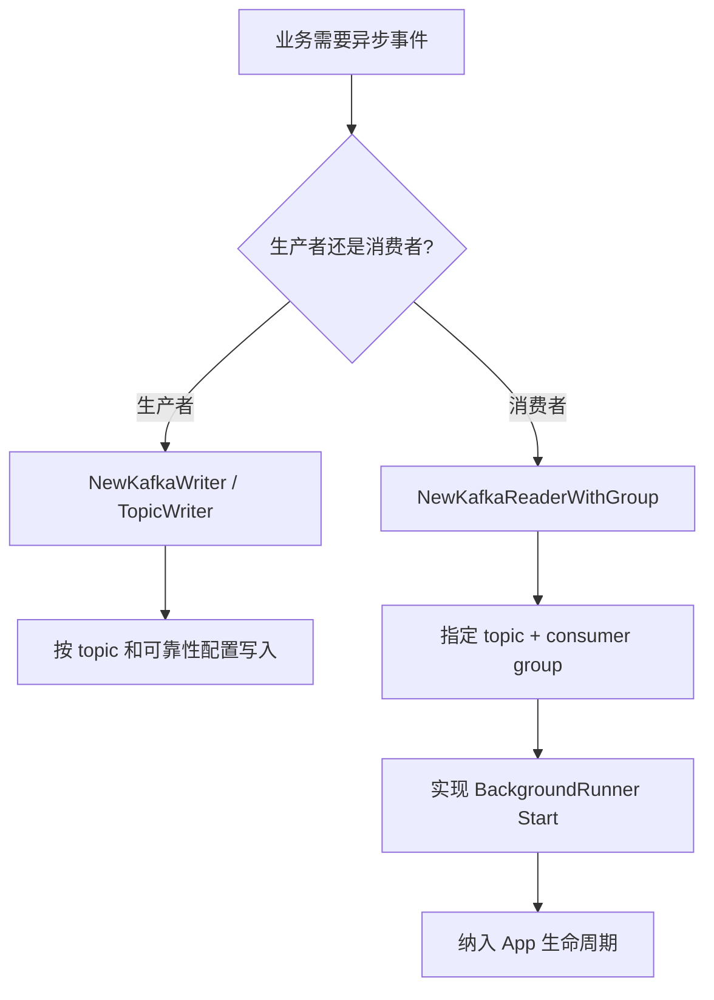
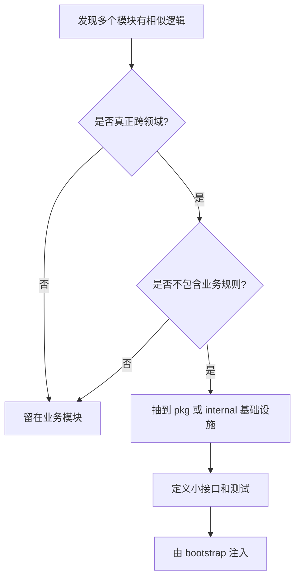

# 共享基础设施与公共组件

## 1. 模块定位

这部分包括：

1. `database`
2. `messaging`
3. `config`
4. `redislock`
5. 其他 `pkg` 层基础组件

它们不直接承载业务，但对整个项目的工程质量影响非常大。

## 2. 一句话介绍

这个项目的基础设施层坚持“共享资源统一工厂化、关键参数配置化、分布式锁可复用化、消息中间件策略化”的思路：MySQL 用 sqlx 保留 SQL 控制力，Redis 和 Kafka 连接由统一工厂创建，配置在启动期做默认值填充和校验，分布式锁则抽成独立组件供 `knowpost`、`counter`、`auth` 等模块复用。

## 3. 核心组件

## 3.1 database

`database.NewDB()` 做了几件关键事：

1. 根据配置构造 DSN
2. 建立 sqlx 连接
3. 启动时 `Ping`
4. 设置连接池参数：
   - `MaxOpenConns`
   - `MaxIdleConns`
   - `ConnMaxLifetime`

Redis client 也由统一工厂创建，连接池参数从配置读取。

## 3.2 messaging

Kafka 工厂根据 topic 类型设置不同保证级别：

1. outbox topic
   - 更高可靠性
   - `RequireAll`
   - 更多重试
2. counter topic
   - 也要求较高可靠性
   - 但整体策略略轻

Reader 则统一通过 consumer group 创建。

## 3.3 config

配置层不只是“读 yaml”，还负责：

1. 默认值填充
2. 启动期校验
3. 区分核心依赖和可选依赖

这个层次决定了很多问题是在“启动时暴露”还是“运行中爆炸”。

## 3.4 redislock

分布式锁组件具备：

1. `SET NX PX` 抢锁
2. token 标识归属
3. Lua 安全释放
4. Lua 安全续约
5. 手写 watchdog
6. `TryAcquire`
7. `AcquireWithRetry`

它被多个模块复用：

- `knowpost` 回源锁
- `counter` rebuild / repair 锁
- `auth` refresh 会话锁
- `relation` 缓存预热锁

## 4. 设计亮点

## 4.1 不用 ORM，而是用 sqlx

这是一个很典型的后端工程取舍。

优点是：

1. SQL 完全可控
2. 更适合复杂查询优化
3. 没有 ORM 隐式行为

特别适合这个项目这种：

- 有不少列表查询
- 有事务 outbox
- 有多模块联表

的系统。

## 4.2 分布式锁抽成公共组件，而不是每个模块各写一套

这很重要，因为分布式锁最怕：

- 每个人各写一个版本
- 细节不一致
- 有人忘记 token 校验
- 有人没做安全释放

抽成 `pkg/redislock` 之后，锁语义可以统一，业务模块只关心“为什么要锁”，不用重复实现“怎么安全加锁”。

## 4.3 配置问题尽量前移到启动期

配置错误如果在运行中才暴露，排查成本很高。  
当前项目通过启动期校验，把很多错误前移到：

- 服务一启动就失败
- 或明确降级成可选能力不可用

这是一种很典型的工程质量思路。

## 5. 难点与边界

### 5.1 分布式锁的难点不是加锁，而是安全续约和安全释放

只会写 `SETNX` 还不够。  
真正要处理的是：

1. 锁是不是自己持有的
2. 续约时 token 是否仍匹配
3. 释放时是否误删别人的锁
4. 长耗时操作如何避免锁提前过期

这个项目的 redislock 组件把这些问题都考虑到了。

### 5.2 Kafka 配置不是一套参数打天下

不同 topic 可靠性要求不同。  
如果所有 writer 都用同样配置，可能会出现：

- 重要链路保护不够
- 非关键链路过度保守

当前项目按 topic 类型做了策略区分，这是正确方向。

### 5.3 启动期配置校验要有边界

不是所有配置缺失都该启动失败。  
关键在于：

- 核心依赖缺失 -> fail fast
- 可选能力缺失 -> degrade

## 6. 面试官高频问题

### Q1：为什么你这个项目不用 ORM？

**参考回答：**

因为这个项目的核心链路里有不少需要精确控制的 SQL，例如：

- 事务 outbox
- 关系列表查询
- feed 分页
- 搜索投影回查

我更看重对 SQL 的控制力和可解释性，所以用 sqlx 做轻量映射，而不是用 ORM 把查询隐藏掉。

### Q2：为什么要自己封一个 redislock？

**参考回答：**

因为多个模块都需要同一种锁语义。  
如果每个模块各写一套，会出现实现不一致、忘记 token 校验或看门狗逻辑不统一的问题。  
抽成公共组件之后，业务层只关心“为什么要锁”，而安全续约和安全释放逻辑可以统一复用。

### Q3：配置为什么要区分核心依赖和可选依赖？

**参考回答：**

因为不同组件对系统可用性的影响不同。  
MySQL、Redis 这种核心依赖缺失，系统就不该启动；  
搜索、LLM、OSS 这种增强能力缺失，系统仍然可以对外提供主站能力，只是对应接口降级。  
这是保证系统韧性的关键。

### Q4：为什么 Kafka writer 要按 topic 区分可靠性策略？

**参考回答：**

因为不同 topic 的业务价值不同。  
outbox 链路是很多派生系统的源头，可靠性要求更高；  
counter 事件也重要，但策略可以略轻一些。  
我不想用一套统一配置去粗暴覆盖所有链路。

## 7. 场景题

### 场景题 1：如果数据库连接经常被打满，你会先看哪里？

**推荐回答：**

我会先从三层排查：

1. 连接池配置是否合理
2. 是否有慢 SQL 或事务过长
3. 是否有缓存策略失效导致回源放大

也就是说，这不一定只是 DB 参数问题，往往和上层读写放大一起有关。

### 场景题 2：如果某个分布式锁持有时间明显超过预期，你会怎么处理？

**推荐回答：**

我会先区分：

1. 是业务逻辑确实变慢了
2. 还是续约策略不合理

再看：

- 锁粒度是否过大
- 是否可以拆临界区
- 是否应该把长任务改成异步

不能只靠把 TTL 调大去掩盖问题。

## 8. 最容易讲错的地方

不要把基础设施层说成“只是工具类”。  
中高级面试官很在意的往往恰恰是这些公共能力，因为它们决定了：

- 项目是否能稳定运行
- 复杂度是否可控
- 业务模块是否能复用统一约束


---

# 附录A：工程级扩写

## A1. 分层



## A2. 原则

- 公共库不做业务规则。
- 锁、超时、context 贯穿。
- 配置集中校验默认值。


---

# 附录B：流程图扩写

## B1. 配置加载与默认值流程



配置层的价值：把错误尽量前置到启动期，避免运行到一半才发现核心配置缺失。

## B2. MySQL 连接池初始化



面试重点：`Open` 不等于连接成功，必须 `Ping`；连接池参数不能用默认值放任不管。

## B3. 数据库迁移流程



这样可以保证迁移幂等执行，避免同一 SQL 重复应用。

## B4. Redis 分布式锁生命周期



关键点：释放和续约都必须校验 token，不能误删或续约别人的锁。

## B5. 分布式锁异常分支



面试时要说明：分布式锁不是万能的，业务临界区要短，长任务应拆异步或分阶段。

## B6. 统一错误响应流程



统一错误响应的好处是：业务模块只关心领域错误，HTTP 状态码和响应格式在公共层收敛。

## B7. 健康检查和可观测链路

```mermaid
flowchart TD
    A[健康检查请求] --> B{GET /health}
    B --> C[存活检查]
    A --> D{GET /ready}
    D --> E[检查 MySQL]
    D --> F[检查 Redis]
    E --> G{依赖是否正常?}
    F --> G
    G -->|是| H[ready]
    G -->|否| I[not ready]
    J[Prometheus enabled] --> K[/metrics 暴露指标]
```

`health` 更偏进程是否活着，`ready` 更偏是否具备接流量能力。

## B8. Kafka Reader / Writer 接入模式



Kafka 不应该散落在业务代码里随手 new，统一工厂和生命周期更容易管理连接、关闭和配置。

## B9. 新增公共组件的判断流程



不要为了复用而复用。公共组件应该抽“机制”，不要抽“业务规则”。

## B10. 共享基础设施 2 分钟口述

> 共享基础设施层解决的是跨模块的一致工程约束。配置层负责 YAML 加载、默认值和启动校验；database 层负责 MySQL、Redis 连接池和迁移；redislock 把 SET NX PX、token、Lua 安全释放和看门狗续约收成一个公共组件；错误码和 response 保证所有接口返回结构一致；Kafka reader/writer、metrics、health check 统一接入 App 生命周期。这里的重点不是工具函数多，而是让业务模块不用重复处理连接池、超时、锁、错误和生命周期这些容易出问题的底层细节。
