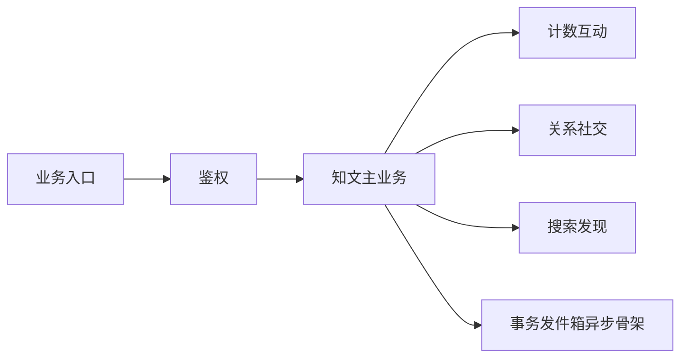
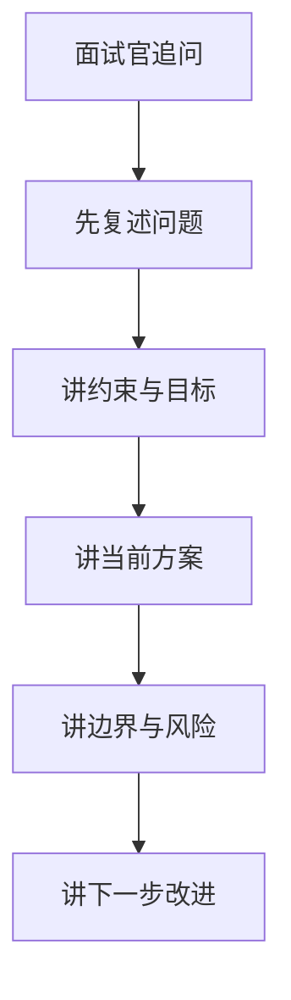
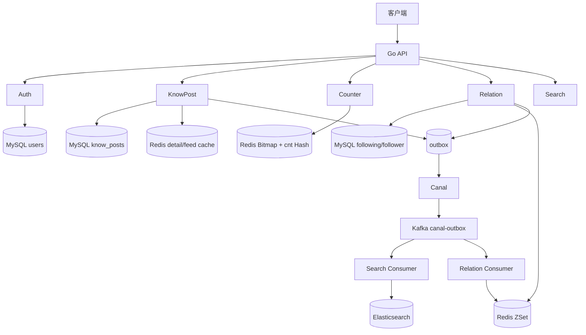

# 项目面试作答手册

这份文档不是讲模块实现，而是专门讲：

**如果面试官围绕这个项目连续追问，你到底该怎么答。**

如果你现在最担心的是：

- “我知道代码怎么写，但不知道面试时怎么说”
- “我怕面试官一追问，我就乱了”
- “我怕被问到设计取舍和边界问题”

那这一篇比背代码更重要。

## 1. 先建立一个正确认知

面试官大多数时候看不到你的代码，所以他问你的方式通常不是：

- “第 123 行为什么这么写？”

而是：

- “你这个模块解决什么问题？”
- “你为什么这么设计？”
- “不用这个方案会怎样？”
- “这个方案有什么代价？”
- “出故障了怎么办？”
- “流量涨 10 倍怎么办？”
- “如果现在重做，你会改哪里？”

所以你在面试里真正要证明的能力，不是“我能复述代码”，而是：

1. 我知道这个模块在整个系统里的位置
2. 我知道它解决了什么核心问题
3. 我知道为什么选这个方案
4. 我知道它的边界和代价
5. 我知道如果继续演进，下一步该往哪走

## 2. 一套通用答题框架

以后你遇到大多数项目追问，都可以先套这个框架。

## 2.1 五段式回答法

回答一个设计问题时，尽量按这五步讲：

### 第一步：先讲问题

不要上来就讲方案，先讲它在解决什么问题。

例如：

- `knowpost` 详情缓存要解决的是多实例下的低延迟读取和一致性
- `counter` 要解决的是高频状态写入和计数快读
- `relation` 要解决的是社交图真值和列表读性能

### 第二步：再讲当前方案

用 2 到 4 句话把现状讲清楚。

例如：

- 我现在把用户状态真值放在 Bitmap，把读优化快照放在 SDS
- 我现在用事务 outbox 保证主数据和异步事件不丢
- 我现在用版本号 key 解决多实例本地缓存一致性

### 第三步：讲为什么这么选

这一层是面试官最想听的。

你要说：

- 为什么不用另外一种更常见的方案
- 为什么这个方案更适合当前业务

### 第四步：主动讲代价和边界

这一层会让你的回答从“会背项目”变成“会做系统设计”。

例如：

- 这个方案不是强一致，而是最终一致
- 这个方案读便宜，但写复杂
- 这个方案实现简单，但多了一次版本号查询

### 第五步：讲下一步怎么演进

这是加分项。

例如：

- 如果流量继续涨，我会往分层缓存或异步化演进
- 如果功能继续扩展，我会补一套专门的列表写模型
- 如果对一致性要求更高，我会改幂等边界或补对账链路

## 2.2 你可以直接背的一套万能句式

当你脑子一片空白时，可以先用下面这个模板救场：

> 这个模块我主要是在解决 `X` 问题。  
> 当前实现我用了 `A + B + C` 这套方案。  
> 这么选主要是因为 `原因1` 和 `原因2`。  
> 它的代价是 `代价1`，所以当前我把边界收在 `边界点`。  
> 如果业务规模继续扩大，我下一步会往 `演进方向` 去做。

只要你能把这五个空补上，回答就不会太差。

## 2.3 高压追问三板斧

如果面试官明显不是在“了解实现”，而是在“挑战你的设计”，你可以强行把回答收回这三步：

1. 先给问题归类
   - 这是在问一致性、复杂度、性能，还是故障恢复
2. 再给当前方案定性
   - 当前主方向是不是对的，代价是什么
3. 最后给改进优先级
   - 如果继续做，先收 correctness，再收性能上限，最后再谈扩展性

你可以直接套这句：

> 这个问题本质上是在问 `一致性/复杂度/恢复`。  
> 我当前方案的主方向我认为是对的，但它确实有 `某个边界`。  
> 如果继续做，我会先优先收 `最影响正确性` 的点，再去做 `性能或功能` 优化。

这套话的价值不是“显得圆滑”，而是防止你被面试官带着跑。

## 3. 项目介绍怎么讲

## 3.1 30 秒版本

> 这是一个知识社区后端项目，核心业务包括知文发布、关系关注、计数、搜索和 AI 增强能力。  
> 我重点做的是内容主链路、计数链路和异步 outbox 链路，把主数据写入、缓存一致性、MQ 幂等和搜索投影这些问题收在一起。  
> 这个项目比较有代表性的点是多级缓存、事务 outbox、Kafka 消费幂等、Bitmap + 快照计数，以及面向大 V 的列表读取优化。

## 3.2 1 分钟版本

> 这是一个从 Java 重构到 Go 的知识社区后端。业务上有知文发布、详情和 Feed，社交上有关注关系，数据上有点赞收藏计数，查询上有 Elasticsearch 搜索，扩展能力上还有摘要和 RAG 接口。  
> 我在设计上比较强调几个点：第一，主数据和派生数据分离，比如搜索和关系投影都通过事务 outbox + Canal + Kafka 做最终一致；第二，缓存不是一把梭，而是按访问模式分层，比如知文详情做了 L1 + Redis + DB，关系列表对大 V 做了特殊优化；第三，计数链路把真值和快照拆开，用 Bitmap 保存用户状态，用 MQ 异步聚合读快照，并补了失败补偿和 epoch fence 来兜住 rebuild 边界。

## 3.3 3 分钟版本

> 这是一个知识内容平台后端，核心模块有 `knowpost`、`counter`、`relation`、`search`。  
> `knowpost` 是业务主线，写路径通过事务 outbox 绑定主数据和异步事件，读路径通过版本号缓存 key、L1/L2/L3 多级缓存和分布式锁回源解决详情页性能和多实例一致性。  
> `counter` 模块是工程难点比较高的一块，我没有把 Redis counter 当唯一真值，而是把用户状态放在 Bitmap，把展示用快照放在 SDS，再通过 Kafka 异步聚合，这样能兼顾写入吞吐和重建能力。  
> `relation` 模块的真值在 MySQL 双表，Redis 只是列表缓存；列表查询按普通用户和大 V 分层优化，异步 consumer 负责把关系变更投影到 Redis 和计数模块。  
> `search` 则是典型的异步索引投影模型，知文变更通过 outbox 进入 Kafka，再由 projector 回查主库并重建 ES 文档，查询侧用 BM25 + function_score + search_after 做搜索和排序。  
> 整个项目我最想强调的是：我在设计时会先分清楚谁是真值、谁是投影、哪里允许最终一致、哪里必须收口幂等和补偿，这样系统会更稳，也更容易讲清楚。

## 4. 面试官最常见的六类追问

面试官的追问通常逃不出下面六类。

## 4.1 为什么这样设计

例如：

- 为什么要用事务 outbox？
- 为什么要用 Bitmap？
- 为什么用版本号，不用广播？
- 为什么单条关系不缓存？

**答题重点：**

1. 先讲问题
2. 再讲方案
3. 再讲为什么不用另一个更常见的方案

## 4.2 代价是什么

例如：

- 你这个方案复杂度高在哪里？
- 多查一个版本号值不值得？
- MQ 异步聚合的问题是什么？

**答题重点：**

不要怕承认代价。  
真正高分的回答不是“没有代价”，而是“我知道代价，并且知道为什么当前值得”。

## 4.3 出故障怎么办

例如：

- Kafka 重复投递怎么办？
- Redis 快照坏了怎么办？
- 搜索索引丢了怎么办？
- OSS 不可用怎么办？

**答题重点：**

从这三个层次答：

1. 先怎么兜住线上
2. 再怎么恢复数据
3. 再怎么避免下次再发生

## 4.4 流量涨了怎么办

例如：

- 如果热点内容流量涨 10 倍？
- 如果大 V 粉丝上千万？
- 如果点赞事件暴涨？

**答题重点：**

从“先分层，再扩容，再改模型”的顺序答，不要一上来就说分库分表。

## 4.5 不这样做行不行

例如：

- 不用双表关系能不能做？
- 不用 ES 能不能做搜索？
- 不用 Redis 锁能不能做？

**答题重点：**

这种问题不是问你唯一答案，而是在看你能不能讲 trade-off。

## 4.6 如果现在重做你会怎么改

这是非常高频的收尾追问。

你可以按下面的顺序答：

1. 哪些地方现在方向是对的，不会推翻
2. 哪些地方现在是工程折中，以后想收口
3. 下一步最值得优先改哪一处

## 5. 你最容易被问住的点，应该怎么救

## 5.1 当你只记得实现，不记得设计理由

你可以这样回：

> 如果从实现上看，我现在是这么做的……  
> 从设计上看，它主要是在解决……  
> 当时我更看重的是……  
> 所以我优先选了这个方案。

先从实现切回问题，再切回理由。

## 5.2 当你知道当前实现有问题

不要慌，也不要硬圆。

更好的答法是：

> 当前实现的主方向是对的，但这里确实还有边界。  
> 这个边界主要体现在……  
> 如果继续做，我会优先从……开始收口。

这类回答通常比“我这个设计完全没问题”更成熟。

## 5.3 当你被问到“为什么不用 X”

别直接说“X 不好”，要说：

1. X 可以做
2. 但它更适合什么场景
3. 当前场景为什么我没选它

例如：

> Pub/Sub 可以做本地缓存失效广播，但它会引入订阅连接、消息丢失和重连期间的不确定性。  
> 当前这个项目里详情缓存更适合用版本号 key，因为实现简单且一致性边界更清晰。

## 5.4 当你完全不会

千万不要硬编。

可以这样答：

> 这个点我当前项目里没有完整落地，所以我不想硬说成已经实现了。  
> 但如果现在让我设计，我会先从这几个方面拆：……  
> 我会优先关注的是……  

## 5.5 当面试官明显在质疑你的方案

这时候最容易犯的错，就是开始和面试官“对抗”。

更稳的答法是：

1. 先承认质疑点里合理的部分
2. 再说明当前方案当时优先解决的是什么
3. 最后给出你认可的下一步改法

例如你可以这样说：

> 这个质疑我认同一部分。  
> 当前方案确实不是最完美的，但它当时优先解决的是 `A`。  
> 现在回头看，如果继续演进，我会优先把 `B` 补上，因为那部分更影响正确性。

这类回答会比“我觉得没问题”成熟得多。

## 5.6 四种最容易减分的回答

下面这四种话，面试里尽量别说：

1. “这个其实没问题。”
   - 听起来像你没看到边界
2. “这个当时就是这么写的。”
   - 听起来像你只会复述实现
3. “这个主要是为了性能。”
   - 太空，没有讲清 trade-off
4. “这个如果真要做，可以上 XXX。”
   - 如果不解释为什么适合当前场景，会显得空泛

更好的说法是：

- “当前主方向是对的，但边界在这里。”
- “我当时优先级放在了正确性 / 主链路延迟 / 工程复杂度。”
- “如果继续做，我会先改这一处，而不是先上更重的通用方案。”

这类回答能保住可信度。

## 6. 针对这个项目，你最该重点练的五个模块

如果时间有限，先把下面五篇吃透：

1. `knowpost`
2. `counter`
3. `relation`
4. `search`
5. `outbox-canal-kafka`

为什么？

- `knowpost` 讲业务主线和缓存
- `counter` 讲真值、快照、补偿和一致性
- `relation` 讲缓存角色、社交图和大 V
- `search` 讲异步投影和检索排序
- `outbox` 讲异步解耦和消费幂等

这五篇能覆盖大多数中高级后端面试追问。

## 7. 可以直接背的高频回答模板

## 7.1 为什么这样设计

> 我先区分了这个模块里的真值和投影。  
> 真值层我放在 `X`，因为它更适合保证正确性；投影层我放在 `Y`，因为它更适合读性能。  
> 这样设计的核心目的是把正确性和性能解耦。  
> 它的代价是 `Z`，但在当前业务规模下这是值得的。

## 7.2 为什么不用另外一种更简单的方案

> 更简单的方案当然能做，但它会把问题转移到 `A`。  
> 当前我更在意 `B`，所以没有选它。  
> 如果后续业务变成 `C`，我会重新评估。

## 7.3 当前实现还有什么边界

> 当前实现主路径是对的，但边界主要在 `A`、`B`、`C` 这几个点。  
> 它们不是方向性错误，更像当前阶段的工程折中。  
> 如果继续演进，我会优先处理 `最影响稳定性/正确性` 的那一个。

## 7.4 如果让我现在重做

> 我不会推翻整个模块，因为 `核心建模` 还是成立的。  
> 我会优先优化的是 `边界问题`，其次才是 `性能上限`，最后才是 `功能扩展`。  
> 也就是说，我会先收正确性，再谈高级优化。

## 8. 项目里最有杀伤力的追问，提前给你列出来

下面这些问题，你最好真的练到能脱口而出。

### 8.1 knowpost

- 你为什么不用本地缓存广播，而用版本号？
- 详情页为什么要做 L1 + Redis + DB 三层？
- 为什么 liked/faved 不直接缓存进详情？
- Feed 为什么公共和我的要两套缓存模型？
- 如果热点内容把 DB 打爆怎么办？

### 8.2 counter

- 为什么不用简单的 Redis `INCR`？
- Bitmap 和 SDS 为什么要分开？
- rebuild 之后旧消息来了怎么办？
- 为什么 publish 失败要补发 delta？
- 如果要查点赞列表，这套设计够不够？

### 8.3 relation

- 为什么要双表？
- 单条关系为什么不缓存？
- relation 为什么不适合直接套 counter 的 epoch fence？
- 大 V 读流量来了怎么办？
- 现在这套关系缓存有没有边界问题？

### 8.4 search

- 为什么搜索索引不能算真值？
- 为什么投影要回查主库，而不是完全相信事件？
- 为什么要用 search_after？
- 为什么热度排序要混进搜索？
- ES 宕机了主站怎么办？

### 8.5 outbox

- 为什么要 outbox？
- 为什么还要 Canal？
- counter consumer 为什么要做水位幂等？
- 坏消息为什么跳过？
- 如果要全量重建索引怎么做？

## 9. 你现在最需要练习的方式

不是继续埋头看代码，而是做下面三件事：

1. 对着每篇模块文档，练 30 秒版本
2. 再练 2 分钟展开版
3. 最后让自己连续回答 3 个追问

建议你每个核心模块至少练到这个程度：

- 不看文档，能先讲清模块定位
- 被问“为什么这样设计”，能回答 trade-off
- 被问“还有什么边界问题”，能诚实且稳定地讲出来

## 10. 最后提醒

你现在怕这种问题，其实不是因为你不懂，而是因为你还没有把“代码理解”转成“口头结构化表达”。

这两者差别很大：

- 会做，不等于会讲
- 会讲流程，不等于会讲取舍
- 会讲现状，不等于会讲演进

所以你接下来复习这些文档时，不要只看，要张嘴练。

先练：

1. 我这个模块解决什么问题
2. 我为什么这么设计
3. 它的边界在哪里
4. 如果继续做我会怎么改

只要你把这四句练顺，面试抗压能力会明显提高。

再往前一步，你要逼自己练到：

1. 面试官质疑你的设计时，你不会急着辩解
2. 面试官追问边界时，你能主动承认但不失控
3. 面试官问“如果重做”时，你能给出有优先级的演进方案

做到这三点，你的回答就不只是“会做项目”，而是已经接近“能带着项目演进”的层次了。

---

# 附录A：结合本项目的高频答法

## A1. 通用四句模板

1. 问题是什么（业务 + 工程约束）  
2. 我选了什么方案  
3. 边界与风险是什么  
4. 下一步会改什么  

## A2. 知文穿透怎么答

> 我们用布隆过滤器和空值缓存叠加。布隆拦一定不存在的扫号，空值兜误判和软删；过滤器空或 Redis 故障 fail-open，不误拦真内容。

## A3. 计数一致性怎么答

> 位图是权威状态，计数是派生。Lua 保证翻转原子，Kafka 水位保证重复消费不重复加，脏修用位图重算绝对值。

## A4. 异步链路怎么答

> 业务与发件箱同事务，Canal 读日志进 Kafka，下游幂等消费。换的是最终一致和可恢复，不是强一致跨存储事务。

---

# 附录B：口述流程图（面试白板可画）

## B1. 项目整体怎么讲

## B2. 被追问时怎么兜底

---

# 附录C：项目介绍完整答辩稿

这一节不是让你死背，而是给你一套可裁剪的表达。面试时根据时间选择 30 秒、1 分钟或 3 分钟版本。

## C1. 30 秒版本

> 我这个项目是一个知识内容社区后端，核心功能包括用户鉴权、知文发布、点赞收藏、关注关系、Feed、搜索和 AI 辅助。  
> 技术上我主要做了三件事：第一，用分层架构把 Handler、Service、Repository 和 bootstrap 装配拆清楚；第二，用 Redis 多级缓存、可删除 Cuckoo 过滤器、分布式锁和热点 TTL 处理高并发读；第三，用事务 outbox、Canal、Kafka 和消费端幂等处理搜索、关系缓存、计数等异步一致性问题。

## C2. 1 分钟版本

> 这是一个从 Java 重构到 Go 的知识社区后端。业务主线是用户发布知文，其他用户可以浏览、搜索、点赞、收藏和关注作者。  
> 我在架构上把 MySQL、Redis、Elasticsearch、Kafka 的角色分清楚：MySQL 保存内容和关系真值，Redis 保存缓存、高频状态和计数快照，ES 只做搜索投影，Kafka 用来承接异步事件。  
> 知文详情做了 Cuckoo + NULL + L1 + Redis + DB + 分布式锁，解决穿透和击穿（软删可从 Cuckoo Delete）；计数模块用 Bitmap 保存点赞收藏状态，用 Kafka 异步聚合 Hash 快照，再用 dirty repair 从 Bitmap 重建；关系模块用 following/follower 双表保存真值，用 Redis ZSet 做列表投影；搜索通过 outbox + Canal + Kafka 回查 MySQL 后写 ES。  
> 这个项目我最想强调的是：我不是只堆中间件，而是先区分真值和投影，再为每条链路设计缓存、幂等、补偿和降级。

## C3. 3 分钟版本

> 这个项目可以按三层来讲。第一层是业务能力：用户鉴权、资料、知文、点赞收藏、关注关系、搜索、对象存储和 AI 能力。第二层是工程能力：统一启动装配、全局中间件、配置校验、分布式锁、Kafka writer、错误码和测试。第三层是高并发和一致性能力：多级缓存、事务 outbox、Canal/Kafka 异步链路、消费端幂等和失败修复。  
> 内容模块是主线。写路径里，草稿用雪花 ID，上传正文走 OSS 直传，业务侧只确认元数据；发布、删除、置顶和可见性修改都在事务内写 outbox；软删后从 Cuckoo 过滤器 Delete。读路径里，详情先过 Cuckoo，再查 L1 freecache，然后查 Redis，最后在分布式锁保护下回源 MySQL；不存在的数据写 NULL 哨兵，防止扫号穿透。  
> 计数模块是高频写难点。点赞和收藏不是简单 Redis INCR，而是先用 Bitmap 存每个用户的状态，Lua 保证只有状态真正翻转才发 delta。消费者按 Kafka partition 批量聚合，通过 Redis 水位避免重复加；如果发布或刷盘失败，实体会进入 dirty set，后台 repair 用 Bitmap 的绝对值重建 SDS 计数快照。  
> 关系模块用 MySQL 双表保存关注和粉丝真值，Redis ZSet 只是读优化。Follow/Unfollow 同事务写双表和 outbox，关系事件异步投影到 ZSet，并更新用户维度关注数。这个模块我也会主动讲边界，比如 dedupe 先落标、排序语义、深分页和大 V 冷启动，这些是后续演进重点。  
> 搜索模块不把 ES 当真值。知文变更进入 outbox 后，由 Canal 投递 Kafka，Search Consumer 解析事件后回查 MySQL 和计数快照，再构建 ES 文档。查询侧用 BM25、function_score、标签过滤和 search_after。  
> 总体上，这个项目的工程价值在于：真值可控，缓存可失效，消息可重放，消费可幂等，失败可修复。

## C4. 白板总图

## C5. 项目亮点怎么排优先级

如果面试官让你“挑一个最有技术含量的点讲”，不要把所有模块都平铺。建议按岗位侧重点选择：

| 面试官关注 | 优先讲 | 为什么 |
|------------|--------|--------|
| 高并发读 | 知文详情缓存 | Cuckoo、NULL、L1/L2、锁、热点 TTL 都能展开 |
| 高频写 | 点赞收藏计数 | Bitmap、Lua、Kafka、水位、repair 都有深度 |
| 架构设计 | Outbox 异步链路 | 能讲事务边界、最终一致、幂等、坏消息 |
| 社交系统 | 关注关系和 Feed | 双表、大 V、读扩散/写扩散、ZSet 投影 |
| 搜索工程 | 搜索投影 | ES 不做真值、回查主库、search_after |

## C6. 高频追问的标准收口

### 问：你这个项目最大的难点是什么？

> 最大难点不是某个接口，而是不同数据模型的一致性边界。内容、关系、计数、搜索都不是一套存储能解决的，所以我先划分真值和投影。MySQL 保存内容和关系真值，Bitmap 保存点赞状态真值，Redis Hash 和 ES 都是派生投影。然后再为每个投影设计失效、幂等或重建机制。

### 问：你的项目和普通 CRUD 后端区别在哪里？

> 普通 CRUD 主要关注数据库增删改查，这个项目多了高并发读、高频互动写和异步投影。比如详情读取要考虑穿透、击穿和多实例缓存一致性；点赞要考虑重复点击、重复消费和快照修复；搜索不能直接双写 ES，要通过 outbox 保证主库和事件一致。

### 问：你如何证明这个系统可恢复？

> 我会从三条链路回答。知文缓存错了可以通过版本号失效和 DB 回源恢复；计数快照错了可以从 Bitmap 真值重建；搜索索引错了可以从 MySQL 全量或增量重建。核心原则是派生数据不能成为唯一真值。

### 问：如果流量涨 10 倍，你先改哪里？

> 我不会第一反应就分库分表。先看瓶颈：如果是详情读，就加强热点识别、预热和缓存 TTL；如果是点赞写，就扩 Kafka partition、优化批量聚合和 repair 限流；如果是 Feed，就区分普通用户和大 V，用写扩散、读扩散或混合模型；如果是搜索，就看 ES 查询慢日志和索引 mapping。

### 问：这个项目还有哪些不足？

> 我会主动讲三个。第一，relation consumer 的失败恢复还可以更细，比如失败任务表和阶段化补偿；第二，写扩散当前要诚实区分算法实现和生产接线状态；第三，搜索和计数都需要更完整的运维监控，包括 backlog、坏消息、repair 次数、ES 写入失败率。

## C7. 面试答题检查清单

每个模块回答前，先在脑子里过这 6 个问题：

1. 这个模块的业务目标是什么？
2. 哪个存储是真值？
3. 哪些数据是缓存或投影？
4. 写路径如何保证不丢？
5. 读路径如何保证快？
6. 出错以后如何恢复？

只要这 6 点讲清楚，面试官追问也不会散。
