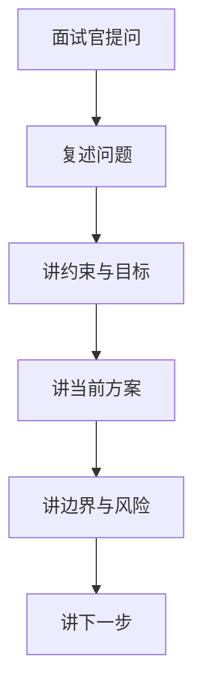

# 13. 项目面试作答手册

## 1. 先立住心态

你怕的往往不是「代码不会」，而是：

- 不会组织语言  
- 一追问就乱  
- 分不清设计取舍  

本篇只练：**怎么答**。

## 2. 通用四句模板（永远用）

1. **问题是什么**（业务痛点 + 工程约束）  
2. **我选了什么方案**（一句话架构）  
3. **边界与风险是什么**（主动讲）  
4. **下一步改什么**（显示判断力）  

## 3. 项目 3 分钟介绍骨架

1. 这是一个内容社区后端（知文、互动、关系、搜索）。  
2. 写路径：事务发件箱，异步投影搜索与关系。  
3. 读路径：多级缓存；详情 **布隆+空值** 防穿透。  
4. 互动：位图真值 + Kafka 聚合计数。  
5. 关系：双表 + 有序集合；Feed 写扩散有上限。  
6. 我最熟 04/05/06/08，可以深入。  

## 4. 高频杀伤力题（背答案骨架）

### 4.1 缓存穿透怎么防？

> 详情最前用 Redis 布隆拦一定不存在的 ID；回源确认不存在写 NULL 短 TTL。空布隆和 Redis 故障 fail-open。软删布隆不能删，靠 NULL 兜。

### 4.2 点赞怎么保证不重复计？

> 位图 Lua 原子翻转，只有 changed 才发事件；消费者按分区 Redis 水位跳过已处理 offset；先 apply 再 commit。

### 4.3 为什么不用 MySQL 直接计数？

> 热点行与写放大；Redis+Kafka 把互动写从主库挪开，接受最终一致并用位图重建兜底。

### 4.4 为什么关注双表？

> 双向列表索引友好；同事务 + 发件箱保证双写与事件原子。

### 4.5 写扩散还是读扩散？

> 普通作者写扩散读快；超大 V 写放大严重所以熔断，读侧降级。要讲清**接线是否完成**。

### 4.6 消息会不会丢？

> 业务与 outbox 同事务，事件先在库；下游至少一次 + 幂等；要监控 lag 与失败表。

## 5. 被追问时的「软着陆」

| 情况 | 说法 |
|------|------|
| 不确定实现细节 | 我按当前分支记忆是…，我更确定的是设计目标… |
| 已知 bug | 主动讲，并说修复思路 |
| 未完成能力 | 区分设计与落地（如 fanout） |
| 不会的深水区 | 承认边界，给排查思路 |

## 6. 口述练习清单（10 分钟）

- [ ] 知文详情读路径（含布隆）  
- [ ] 点赞写与水位  
- [ ] 关注双表 + 异步投影  
- [ ] outbox → Canal → Kafka  
- [ ] 穿透/击穿/雪崩对照表  

## 7. 不要踩的坑

1. 背名词不讲约束  
2. 把理想设计说成已上线  
3. 只说优点不说风险  
4. 计数还说「主路径二进制 SDS」——**当前是 Hash**  

## 8. 结束语模板

> 以上是我们在「正确性优先、可恢复、可水平扩展互动」约束下的取舍。如果继续做，我会优先补 fanout 闭环 / repair 分布式 / 私有内容缓存边界。

---

配合 04/05/06/08/09 一起用。
