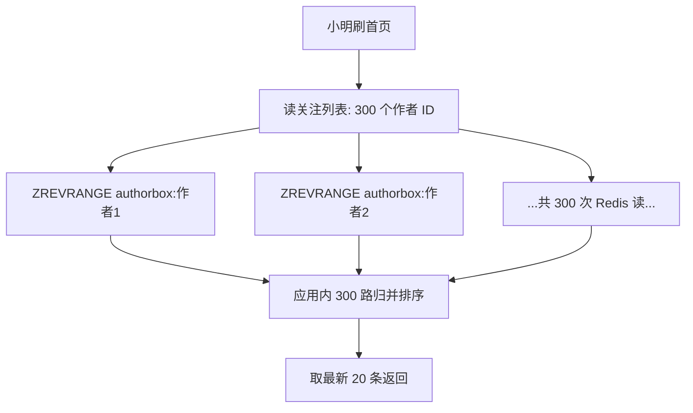
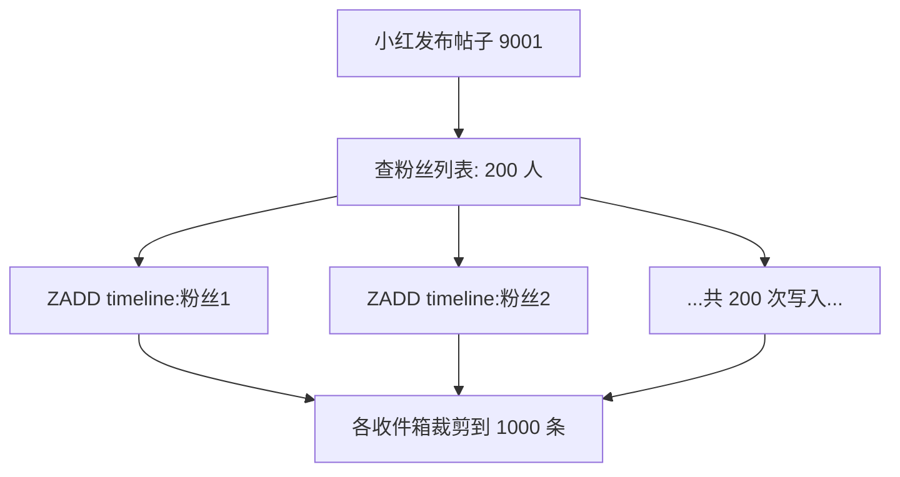
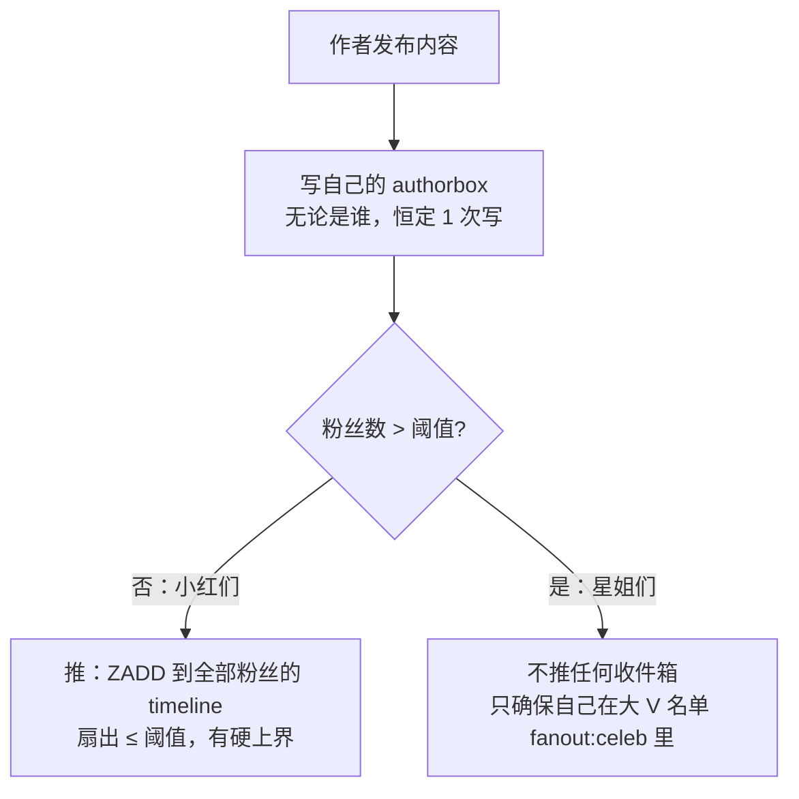
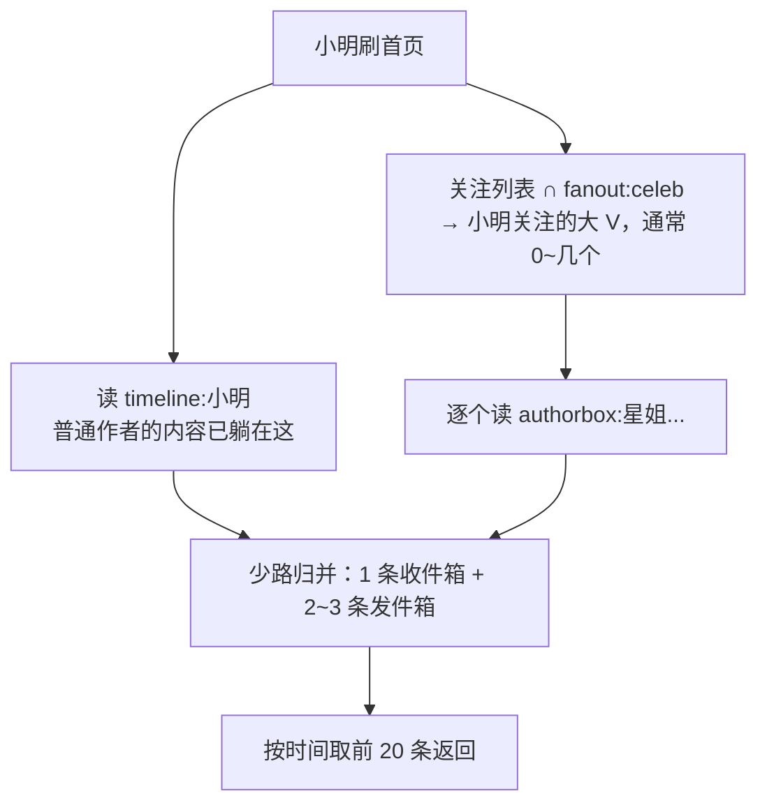
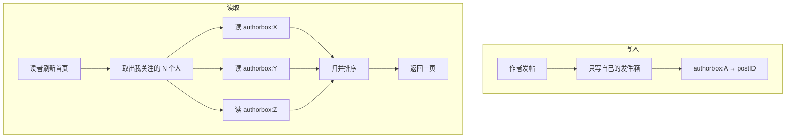
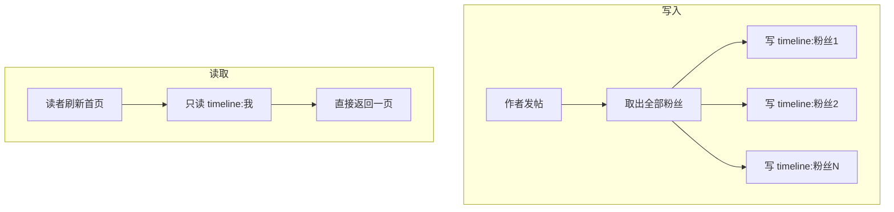
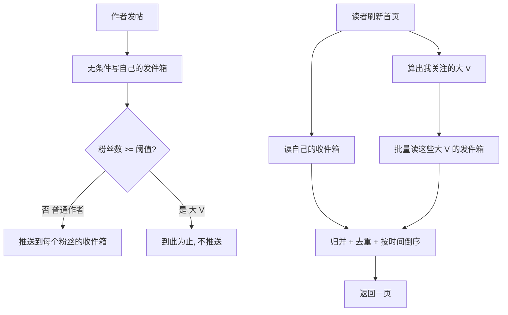
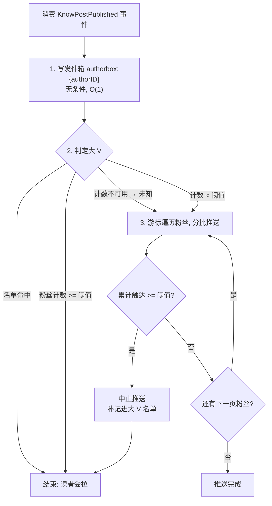
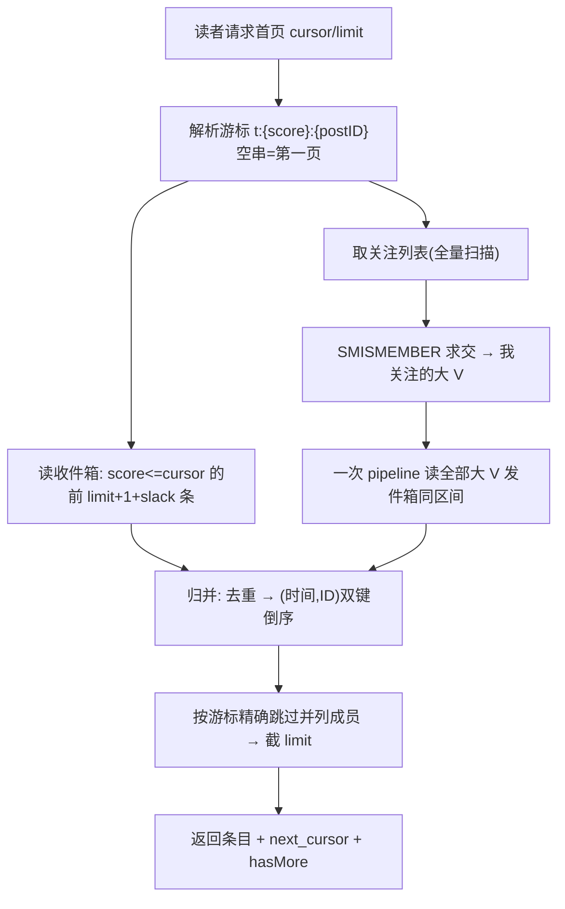

# 信息流扩散：读扩散、写扩散与推拉结合

> 对应代码：`internal/fanout/`
> 相关模块：`internal/relation`（关注关系）、`internal/knowpost`（内容与 Feed 接口）、`internal/outbox`（事务性事件投递）

---

## 0. 这篇要回答的问题

「用户 A 发了一条内容，他的 10 万个粉丝怎么在自己的首页看到它？」

这个问题看起来只是「查一下关注关系再查一下内容」，但它是社交类系统里最经典、也最容易做错的架构题。本文按下面的顺序展开：

0. **零基础导引：从一条 SQL 开始，一步一步推导出扩散方案（第 0.5 章）**——如果你从没接触过「读扩散/写扩散」这组词，请从这里开始，它假设你只会写 CRUD，不预设任何背景。
1. 三种扩散模型的原理与代价（第 1~3 节）——第 0.5 章的系统化整理，适合复习与速查
2. 为什么必须是混合方案（第 4 节）
3. 本项目的具体实现：键设计、写路径、读路径（第 5~7 节）
4. 三个最容易被忽略的正确性问题（第 8 节）
5. 容量估算与参数怎么定（第 9 节）
6. 故障与降级（第 10 节）
7. 面试问答与常见误区（第 11~12 节）

---

### 🎓 教学导学板块

> **🎯 学习目标**
> 1. 能说清读扩散与写扩散各自把成本压在了哪一侧，以及为什么「读多写少」不足以直接推出结论。
> 2. 理解大 V 问题的本质不是「数据量大」，而是**单次写操作的扇出无上界**。
> 3. 掌握推拉结合的分流依据、身份切换的处理，以及归并读取的实现要点。
> 4. 理解关注/取关为什么必须联动信息流，以及不联动会产生什么用户可见的 bug。
>
> **📚 前置概念预习**
> - **扇出（Fan-out）**：一次输入触发的下游操作数量。发一条帖要写 10 万个收件箱，扇出就是 10 万。
> - **收件箱 / 发件箱（Inbox / Outbox）**：信息流的两种存储视角。收件箱按读者组织，发件箱按作者组织。
> - **写放大**：一次逻辑写入在存储层被放大成多次物理写入。

---

# 第 0.5 章 零基础导引：从一条 SQL 开始，推导出整个扩散体系

> 这一章为**完全没接触过信息流场景**的读者写。它不用任何黑话开头，
> 从「你已经会的东西」（MySQL、一条 JOIN）出发，每一步只引入一个新问题，
> 让你亲眼看着朴素方案是**怎么死的**、每一次改进又是**被哪个具体数字逼出来的**。
> 读完这一章，第 1~4 节的系统化整理对你来说就只是复习。
> 如果你已经能脱口说出「推模式写放大、拉模式读放大」，可以直接跳到第 1 节。

## 0.5.1 先说清楚：什么是「信息流」？

打开微博/朋友圈/B 站动态，首页那个**按时间倒序排列、只包含你关注的人发的内容**的列表，就是信息流（Feed，也叫 Timeline）。它的需求用一句话就能说完：

> **我关注了一批人，把他们发的内容合在一起，按时间从新到旧给我，支持一页一页往下翻。**

在本项目里它就是 `GET /api/v1/knowposts/feed/home` 这个接口。需求如此简单，以至于任何会写 CRUD 的人都能在五分钟内写出第一版——这正是它的迷惑性所在。

参与这个故事的角色，下文会反复使用：

| 角色 | 设定 | 代表 |
|---|---|---|
| **小明** | 普通用户，关注了 300 人 | 信息流的**读者** |
| **小红** | 普通作者，有 200 个粉丝 | 普通**作者** |
| **星姐** | 头部大 V，有 100 万粉丝 | 大 V 作者 |

数据库里只有两张表，你在本项目里都见过：

```sql
-- 关注关系表（internal/relation，表 following，字段与 001_initial_schema.sql 一致）
-- 「小明关注了小红」= 一行 (from_user_id=小明, to_user_id=小红)
CREATE TABLE following (
    from_user_id  BIGINT,   -- 谁在关注
    to_user_id    BIGINT,   -- 关注了谁
    created_at    DATETIME(3)
);

-- 内容表（internal/knowpost，表 know_posts）
CREATE TABLE know_posts (
    id           BIGINT,
    creator_id   BIGINT,  -- 作者
    publish_time DATETIME,
    status       VARCHAR(16)  -- published / draft / deleted
);
```

## 0.5.2 方案零：一条 JOIN，五分钟写完

不查任何资料，你的第一直觉大概率是这条 SQL：

```sql
-- 小明刷首页
SELECT p.*
FROM know_posts p
JOIN following f ON f.to_user_id = p.creator_id
WHERE f.from_user_id = {小明}
  AND p.status = 'published'
ORDER BY p.publish_time DESC
LIMIT 20;
```

**这条 SQL 完全正确。** 数据永远新鲜（发布即可见）、取关立即生效、没有任何一致性问题。课程设计、内部工具、千级用户的小站，用它毫无问题——先把这句话立住，因为后面所有复杂度都必须回答「你比这条 SQL 好在哪」。

那它什么时候死？把数字代进去：

- 小明关注了 **300** 人。这条 JOIN 要先从 `following` 里捞出 300 个作者 ID，然后在 `know_posts` 上做一次「`creator_id IN (300 个值) ORDER BY publish_time DESC` 」。
- MySQL 对这种查询没有完美索引可用：`(creator_id, publish_time)` 索引意味着 300 个作者各自有序，**跨作者的全局时间序必须现场归并/排序**。300 路归并取前 20 条，或者更糟——把几百上千行捞出来 filesort。
- 一个用户刷一次首页 = 一次这样的查询。信息流是典型「读多写少」场景：一条内容平均被读几百次，刷新频率远高于发布频率。假设 10 万日活、每人每天刷 20 次，就是 **每天 200 万次 300 路归并**，全部压在 MySQL 上。
- 翻页更痛：`LIMIT 4000, 20` 意味着 MySQL 先归并出 4020 行再丢掉 4000 行。

**结论：方案零的问题不是「错」，而是把最贵的计算（多路归并排序）放在了发生次数最多的动作（读）上，而且每次读都重算一遍，毫无复用。** 数据库 CPU 会先于任何别的资源被打爆。

于是自然的问题是：这个归并结果能不能**缓存**？能不能**提前算好**？这两个方向分别对应了下面两种模型。

## 0.5.3 换个视角：邮局比喻

在写任何代码之前，先建立一个贯穿全文的比喻——**报纸投递**。你（读者）订阅了几家报社（作者），每天想看到它们的新报纸，有两种组织方式：

- **方式 A：你自己跑腿（拉/Pull）。** 报社印好报纸放在自家门口的架子上（**发件箱**）。你每天早上跑遍你订的每一家报社，各拿一份最新的，自己按时间理好再看。报社毫不费力，跑腿的成本全在你。
- **方式 B：邮递员送上门（推/Push）。** 报社每印一份新报纸，邮递员立刻抄送一份到**每个订户家的信箱**（**收件箱**）。你看报时只需打开自家信箱，按顺序已经理好。你毫不费力，成本全在投递那一刻。

两种方式**没有优劣，只是把同一份成本搬到了不同时刻、不同人身上**：

| | 方式 A（拉） | 方式 B（推） |
|---|---|---|
| 报社出新刊时 | 放自家架子上，1 次动作 | 邮递员送 N 户，N 次动作 |
| 你看报时 | 跑 M 家报社 + 自己排序 | 开一次自家信箱 |
| 成本压在 | **读的时刻**（每天发生） | **写的时刻**（出刊才发生） |

对应到工程术语：方式 A 叫**读扩散**（fan-out on read，读的时候扩散开去各处取），方式 B 叫**写扩散**（fan-out on write，写的时候扩散开去各处送）。「扩散/扇出」指的就是**一次动作触发的下游动作数量**——方式 A 一次阅读扇出 M 次取件，方式 B 一次出刊扇出 N 次投递。

> 记忆锚点：**扩散发生在哪个动词上，成本就挂在哪个动词上。**

## 0.5.4 读扩散：把「架子」搬进 Redis

回到方案零。它每次读都重做两件事：① 找每个作者的最新内容；② 跨作者归并。读扩散的思路是把 ① 用缓存变便宜，② 保留在读时做。

给每个作者建一个**发件箱**——Redis 的有序集合（ZSet），成员是帖子 ID，分数是发布时间戳（秒；本项目取秒，见 keys.go 注释）。本项目的键就叫 `authorbox:{authorID}`（见第 5 节键表）：

```text
authorbox:小红   = { (post=9001, score=1719300000), (post=8990, score=1719200000), ... }
authorbox:老王   = { (post=9005, score=1719310000), ... }
authorbox:星姐   = { (post=9010, score=1719320000), ... }
```

小明刷首页时：

1. 取出小明的关注列表（300 人，本项目由 relation 模块的 ZSet 缓存提供，见 06 号文档）；
2. 对每个作者的 `authorbox` 各取最新一小段（`ZREVRANGEBYSCORE`，Redis 内存操作，微秒级）；
3. 在应用内存里做 **300 路归并**，取时间最大的 20 条返回。



比起方案零，进步在于**单次取件从 MySQL 页扫描变成了 Redis 内存读**；但账本的形状没变：

- **读成本 = O(关注数)**。关注 300 人就是每刷一次 300 次 Redis 读（可以 pipeline 合并网络往返，但 300 次键访问省不掉）+ 一次 300 路归并。
- **翻页要带 300 个游标。** 第二页必须知道「每一路上次读到哪」，否则每页都从头归并。
- 写成本极低：发帖只写自己的 `authorbox`，**1 次写，扇出恒为 1**。星姐发帖和小红发帖一样便宜——**读扩散天然不怕大 V**。

> 一句话总结读扩散：**作者只管往自家架子上放，读者刷一次跑一遍所有架子。写 O(1)，读 O(关注数)。**

它适合什么场景？关注数天然有上界、读频不高的场景——典型如微信朋友圈（好友上限 5000，实际人均几百）。它不适合的，正是「读多写少 + 关注数不设限」的微博式场景：最频繁的动作（刷新）背着最重的成本（几百路归并），怎么优化都只是常数级缓解。

## 0.5.5 写扩散：把归并搬到写的时刻

倒过来想：归并结果对同一个读者来说是**稳定的**——300 个作者没发新帖，归并一万次结果都一样。那为什么每次读都重算？不如**在内容产生的那一刻，就把它放进每个该看到它的人的列表里**。

给每个**读者**建一个**收件箱**，同样是 ZSet，本项目键名 `timeline:{userID}`：

```text
timeline:小明 = { (post=9010, score=1719320000),   ← 星姐的
                  (post=9005, score=1719310000),   ← 老王的
                  (post=9001, score=1719300000) }  ← 小红的
```

小红发帖 9001 时，系统做的事（本项目在 `internal/fanout/fanout_service.go` 的 `pushToFollowers`）：

1. 查出小红的粉丝列表（200 人）；
2. 对每个粉丝执行 `ZADD timeline:{粉丝} 1719300000 9001` ——**一次发帖，200 次写**；
3. 顺手 `ZREMRANGEBYRANK` 把每个收件箱裁到固定长度（本项目 1000 条），防止无限膨胀。



小明刷首页时只做一件事：

```text
ZREVRANGEBYSCORE timeline:小明 → 前 20 条
```

**1 次 Redis 读，零归并，天然按时间有序，游标只有一个。** 这就是为什么微博式产品的首页可以做到几十毫秒内返回。

代价同样清楚——三笔账：

1. **写放大**：一条帖子物理上被写了 200 份（准确说是 200 份「帖子 ID + 时间戳」的引用，不是正文，见下面的常见误解）。
2. **存储放大**：同一条帖子 ID 出现在 200 个收件箱里。
3. **关系变更要补账**：取关后收件箱里还留着对方的历史条目，得删（`ZREM`）；新关注后收件箱里没有对方的旧内容，得补（从 `authorbox` 拉最近若干条灌进来）。读扩散完全没有这两个问题，因为它每次读都实时看关注列表。

> ⚠️ **新手最常见的误解**：以为写扩散是把**帖子正文**复制 N 份。不是。收件箱里只存 `(帖子ID, 时间戳)` 这一对，正文永远只有一份，读的时候再按 ID 去内容缓存取（本项目为 `feed:item:{postID}`，见 04 号文档）。所以单条收件箱条目只有几十字节，而不是几 KB——这决定了下面容量估算的量级。

> 一句话总结写扩散：**邮递员在出刊时挨家投递，读者开箱即看。写 O(粉丝数)，读 O(1)。**

## 0.5.6 用数字对账：两种模型各自的死穴

比喻建立了直觉，数字才能定方案。设一条收件箱条目约 60 字节（ID + 分数 + ZSet 结构开销），对四种典型用户算一笔账：

| 场景 | 读扩散 | 写扩散 |
|---|---|---|
| **小红发帖**（200 粉） | 写 1 次自己的 authorbox | 写 200 个收件箱，~12 KB，毫秒级完成 |
| **小明刷首页**（关注 300） | 300 次 Redis 读 + 300 路归并 | **1 次 Redis 读** |
| **星姐发帖**（100 万粉） | 写 1 次自己的 authorbox | **写 100 万个收件箱** |
| **僵尸粉刷首页**（一年没登录） | 不刷就零成本 | 他的收件箱始终被更新、占着内存 |

重点看两个死穴：

**写扩散的死穴——星姐那一行。** 100 万次 `ZADD`，就算 pipeline 每批 500、Redis 单实例 10 万 QPS 写，也要 **10 秒以上**才能扩散完；期间队列里全是这一个人的任务，别人的发帖排在后面（队头阻塞）；100 万 × 60B ≈ **60 MB** 内存增量——星姐一天发 10 条就是 600 MB。更荒诞的是：100 万粉丝里可能 90 万是僵尸粉，**这些写入永远不会被读到**。大 V 问题的本质不是「数据大」，而是**单次写操作的扇出无上界**（详细展开见第 2 节「大 V 问题」）。

**读扩散的死穴——小明那一行乘以全站。** 每次刷新 300 路归并，无法预计算、无法复用，读 QPS 越高烧得越多，而「刷新」恰恰是全站最高频动作。

把两个死穴放在一起，会发现它们**恰好错开**：

- 写扩散只有在**粉丝多**的作者身上才爆炸——而这样的作者全站占比不到万分之一；
- 读扩散只有在**每路都要跑**的时候才昂贵——如果 300 个关注里只有 2 个需要现场拉，归并就只有 2 路。

两个模型互为补丁。这就是混合方案（推拉结合）的由来。

## 0.5.7 推拉结合：按作者体量分而治之

规则只有一句话：

> **普通作者推（写扩散），大 V 拉（读扩散）；每个读者的首页 = 自己的收件箱 ⊕ 自己关注的少数大 V 的发件箱。**

以「粉丝数是否超过阈值」划分（本项目 `celebrity_threshold`，默认 5000，怎么定见第 9 节）：

**写路径分流**（对应第 6 节）：



**读路径归并**（对应第 7 节）：



再对一遍账，看两个死穴是否都被拆掉：

| 场景 | 混合方案下的成本 |
|---|---|
| 小红发帖（200 粉） | 推 200 个收件箱——扇出小，瞬间完成 ✅ |
| 星姐发帖（100 万粉） | **1 次写自己的 authorbox，扇出恒为 1** ✅ |
| 小明刷首页（关注 300，其中 2 个大 V） | 1 次收件箱 + 2 次发件箱 + **3 路归并**（不是 300 路）✅ |
| 僵尸粉 | 收件箱只收普通作者内容且封顶 1000 条；大 V 内容根本不进来 ✅ |

写扇出有了硬上界（阈值），读归并路数从「关注数」缩到「关注的大 V 数」（人均个位数）。两边的无上界都被砍掉了——这就是所有大型信息流系统（微博、Twitter）殊途同归的结构。

代价是引入了三个新问题，也是这个方案真正的工程难度所在（比喻讲到这里为止，答案都在正文里）：

1. **身份是动态的**：小红涨粉过阈值变成大 V 那一刻，已推进收件箱的旧内容和不再推送的新内容如何衔接？→ 第 2/8.3 节（本项目用「不回刷 + 读路径以 `fanout:celeb` 名单现场判定」消化）。
2. **两边都不管「刚关注/刚取关」**：新关注的人的旧内容不在我收件箱、取关的人的旧内容还在——必须由关注事件联动补/删。→ 第 8.1/8.2 节（`relation_hooks.go`）。
3. **归并本身有坑**：跨多路的游标怎么设计才能不重不漏？→ 第 7 节（复合游标 `t:{score}:{postID}`）。

## 0.5.8 比喻 → 本项目落地对照表

最后把这一章的每个概念钉到真实代码上，后面各节展开时可以随时回来对照：

| 比喻 | 术语 | 本项目实现 | 代码位置 |
|---|---|---|---|
| 报社门口的架子 | 发件箱 | `authorbox:{authorID}`（ZSet，所有作者都写） | `fanout_service.go` `writeAuthorBox` |
| 你家信箱 | 收件箱 | `timeline:{userID}`（ZSet，封顶 1000 条） | `fanout_service.go` `pushToFollowers` |
| 邮递员挨家投递 | 写扩散/推 | 粉丝分批 `ZADD`，批大小 500 | `pushBatch` |
| 自己跑报刊亭 | 读扩散/拉 | 读时现场读大 V 的 authorbox | `timeline_reader.go` `HomeTimeline` |
| 「哪些报社不送货上门」名单 | 大 V 名单 | `fanout:celeb`（全局 SET，带滞回的注册表） | `celebrity.go` |
| 出刊这件事的通知 | 扩散事件 | knowpost 的 outbox 事件经 Canal→Kafka 消费 | `consumer.go` |
| 换订阅后补/退旧报纸 | 关注联动 | 关注补灌 / 取关清理收件箱 | `relation_hooks.go` |

> 到这里，你已经拥有了读懂本文其余部分所需的全部概念。第 1~4 节是这套推导的系统化整理（附精确的复杂度表），第 5 节起进入本项目的实现细节。

---

## 1. 读扩散（Pull / Fan-out on read）

### 原理

每个作者只维护自己的**发件箱**。读者刷新首页时，遍历自己关注的所有人，取出各自的最新内容，在内存里归并排序。



### 代价

| 维度 | 复杂度 |
|------|--------|
| 写 | **O(1)** —— 与粉丝数无关 |
| 读 | **O(N)** —— N = 读者关注数 |
| 存储 | **O(内容总量)** —— 每条内容只存一份 |

### 适用与不适用

- ✅ 关注数普遍很少、写入频繁的场景
- ✅ 关注/取关要**立即**生效（因为没有任何副本需要清理）
- ❌ 读是高频操作。把 O(N) 压在读路径上，等于把成本放在了系统最热的地方
- ❌ 深翻页极其昂贵：要翻到第 10 页，每个发件箱都得多取 10 页的量

---

## 2. 写扩散（Push / Fan-out on write）

### 原理

作者发帖时，主动把内容 ID **复制**进每一个粉丝的**收件箱**。读者刷新时只读自己的收件箱。



### 代价

| 维度 | 复杂度 |
|------|--------|
| 写 | **O(F)** —— F = 作者粉丝数 |
| 读 | **O(1)** —— 一次 ZSet 范围查询 |
| 存储 | **O(内容总量 × 平均粉丝数)** —— 每条内容被复制 F 份 |

### 大 V 问题

这是写扩散唯一但致命的软肋。注意问题的本质**不是数据量大**，而是：

> 单次写操作的扇出**没有上界**，且这个上界由用户行为（涨粉）决定，系统无法控制。

一个 100 万粉丝的账号发一条帖：

- 需要 100 万次 ZADD，即使按 500 一批用 pipeline，也是 2000 次 Redis 往返
- 这些写入必须在秒级完成，否则粉丝刷不到新内容
- 若该账号连发几条，或多个大 V 同时活跃，消费者会被瞬间打满
- 收件箱存储被放大 100 万倍

**本项目此前的做法是「放弃」**：粉丝数超过 `FanoutMaxFans` 就 `return nil` 跳过整条扩散，而且没有任何读路径兜底。结果是大 V 的帖子永远到不了任何粉丝的信息流——这不是降级，是功能缺失。

---

## 3. 两种模型的对比

| | 读扩散（Pull） | 写扩散（Push） |
|---|---|---|
| 写复杂度 | O(1) | O(粉丝数) ⚠️ 无上界 |
| 读复杂度 | O(关注数) ⚠️ 压在热路径 | O(1) |
| 存储 | 一份 | 复制 F 份 |
| 深翻页 | 昂贵 | 便宜 |
| 关注生效 | 立即 | 需回填 |
| 取关生效 | 立即 | 需清理副本 |
| 怕什么 | 关注特别多的**读者** | 粉丝特别多的**作者** |

**关键观察**：两者怕的是完全不同的东西。

- 「关注了几千人的读者」——存在，但关注数通常有产品上限，且分布集中
- 「拥有百万粉丝的作者」——存在，且粉丝数分布是**长尾**的，头部账号可以比中位数高 5~6 个数量级

所以「读多写少所以用写扩散」是个不完整的推理。真正的结论是：

> 对绝大多数作者，写扩散的扇出很小，是划算的；
> 对极少数头部作者，写扩散的扇出无法承受，必须换策略。

这直接推出了混合方案。

---

## 4. 推拉结合（Hybrid Fan-out）

### 核心思想

**按作者的粉丝数分流**，而不是全局选一种模型：

- 粉丝数 < 阈值的**普通作者** → 走推（写扩散）
- 粉丝数 ≥ 阈值的**大 V** → 走拉（读扩散）

读者的首页 = 自己的收件箱（推来的） ⊕ 所关注大 V 的发件箱（拉来的），归并排序。



### 为什么这样就解决了

| | 成本上界 | 由什么决定 |
|---|---|---|
| 写 | O(CelebrityThreshold) | **配置项**，系统可控 |
| 读 | O(读者关注的大 V 数) | 通常个位数到几十 |

两侧的成本都被封死在一个**系统可控**的量上，不再随任何用户行为无界增长。这是混合方案的全部价值。

---

## 5. 本项目的键设计

只用四类 Redis 键，职责严格分离：

| 键 | 类型 | member / 值 | score | 用途 |
|---|---|---|---|---|
| `timeline:{userID}` | ZSet | postID | 发布时间戳（秒） | **收件箱**，推路 |
| `authorbox:{authorID}` | ZSet | postID | 发布时间戳（秒） | **发件箱**，拉路 |
| `fanout:celeb` | SET | userID | — | 大 V 名单 |
| `z:following:{userID}` | ZSet | 关注对象 userID | 关注时间 | 关注列表（relation 模块已有，此处只读） |

### 设计决策 1：发件箱对**所有**作者都写，而不只是大 V

初看这是浪费——普通作者的内容已经推给粉丝了，为什么还要留一份？

三个理由：

1. **身份会切换**。作者的粉丝数是增长的。如果只有大 V 才写发件箱，一个普通作者升级成大 V 的那一刻，他此前的帖子在发件箱里是空的，而这些帖子又已经不会再被推送——读者会看到一段内容空洞。
2. **它是取关清理的唯一数据源**。取关时要从收件箱里删掉某作者的帖子，得先知道「他有哪些帖子」，发件箱正是这个索引（详见 8.2）。
3. **成本可以忽略**。一次 ZADD + 一次 ZREMRANGEBYRANK + 一次 EXPIRE，是 O(1) 的，与粉丝数无关。

### 设计决策 2：大 V 名单用一个全局 SET

大 V 在任何社区里都是**少数**（几百到几千量级），全局一个 SET 完全放得下。读路径用「我的关注列表 ∩ 该集合」求交，一次 `SMISMEMBER` 批量判定即可。

替代方案是给每个用户维护一个「我关注的大 V」集合，但那需要在「某作者升级为大 V」时更新他所有粉丝的该集合——又变成一次 O(粉丝数) 的操作，恰好是我们要消除的东西。

---

## 6. 写路径

代码：`internal/fanout/fanout_service.go` 的 `FanoutPost`



### 执行顺序本身很重要

**先写发件箱，再判定、再推送**。因为发件箱是内容可达性的兜底：即使随后的推送失败、或者判定出错，读者仍能通过拉路看到这条帖子。

### 大 V 判定：两级 + 自我修正

这是本实现里最需要理解的一处设计。

**快路**：读 `cnt:user:{id}` 的 `follower` 字段。命中且达到阈值 → 大 V，直接结束，不用遍历粉丝。

**慢路**：粉丝计数是 Redis 中的增量值，可能因消费失败、键过期或重建而**失真或缺失**。如果完全依赖它：

> 一次计数丢失 → 真实大 V 被判成普通作者 → 触发一次几十万粉丝的写扩散风暴。

所以计数不可用时不能盲目推送，而是**边推边数**：一边分批推送，一边累计真实触达量，一旦超过阈值就立即中止推送，并把作者补记进大 V 名单。

```go
if reached >= s.cfg.CelebrityThreshold {
    s.markCelebrity(ctx, event.CreatorID)
    return nil          // 已推出去的部分不回滚：收件箱里多几条是无害的
}
```

这个设计的价值在于：**判定不依赖任何外部状态的正确性**。计数器坏了，系统最多多推 `CelebrityThreshold` 条就会自己发现并纠正，而不会失控。

**惰性降级（名单的退出机制）**：名单命中时若粉丝计数可信且已跌破 `threshold × 0.8`，`IsCelebrity` 当场把作者移出名单——掉粉的大 V 在下一次发帖判定时自动回到推模式，无需任何离线任务。0.8 的滞回带防止阈值附近的账号在推/拉两种模式间反复横跳（每次切回推模式都要补一轮全量扩散）。名单与判定逻辑封装在 `CelebrityRegistry`，写路径（Service）与读路径（TimelineReader）共享同一份，读路径不再为借一个查询而依赖整个写侧。

### 幂等

`ZADD` 对同一 member 是覆盖语义，重复消费同一条 Kafka 消息不会产生重复条目。因此 `FanoutPost` 可以安全地被重投——这也是消费端可以放心用「至少一次」投递的前提。

### 为什么走 canal-outbox 而不是独立主题

原设计留了一个 `fanout` 主题和一个 `FanoutPublisher`，让写路径直接发消息。两个问题：

1. **它从未被接线**。`NewFanoutPublisher` 在整个生产代码里没有任何调用方，该主题永远没有生产者，收件箱恒为空。
2. **即使接上也是双写**。「数据库事务提交」和「Kafka 投递」是两个独立操作，进程在两者之间崩溃就会丢事件，粉丝永久看不到那条帖子。

现在复用已有的事务性 outbox 链路：

```
写库 + 写 outbox 表（同一事务）
  → Canal 捕获 binlog
  → Kafka canal-outbox
  → fanout.Consumer 过滤 KnowPostPublished
```

投递保证与搜索投影完全一致，不需要为扩散单独维护一套可靠性机制。

> **事件要自描述**：`KnowPostPublished` 的 outbox 载荷追加了 `creator_id` 和 `published_at`。扩散需要作者 ID 才知道推给谁的粉丝，需要发布时间才能给条目定序。让事件自带这些字段，消费者就不必为每条消息回查一次数据库——这也是 outbox 模式的应有之义：事件应当自描述，而不只是一个「去查吧」的通知。

---

## 7. 读路径

代码：`internal/fanout/timeline_reader.go` 的 `HomeTimeline`



### 为什么是游标而不是 offset

信息流是**动态列表**：offset 分页在翻页期间有新帖插入时，同一条会被推到下一页（重条）或被越过（跳条）。游标以 `(发布时间, postID)` 双键定位——postID 兜住并列时间戳（同一秒多条发布是常态），查询用**包含式** score 上界、并列成员在应用侧按双键精确跳过，翻页不重不漏。该游标约定与 likers 列表一致（`t:{ts}:{id}` 复合串，客户端不透明回传）。

### 三个实现要点

**1. 每一路都要取到 `limit + 1 + 并列冗余` 条**

来源各自按时间有序，游标之后的前 limit 条必然落在各来源「游标之后的前 limit+slack 条」里；多取的 1 条用于判断 `hasMore`，slack 覆盖同秒并列。

**2. 必须去重**

一个作者跨越大 V 阈值的那条帖子，会**既推给了一部分粉丝、又进了发件箱**，于是同一条帖子同时出现在两路里。不去重就会在信息流里看到重复内容。

**3. 排序要稳定**

```go
sort.Slice(merged, func(i, j int) bool {
    if merged[i].Score != merged[j].Score {
        return merged[i].Score > merged[j].Score
    }
    return merged[i].PostID > merged[j].PostID  // score 相同时的兜底
})
```

score 是秒级时间戳，同一秒内发布多条是常态。如果不加第二排序键，两次请求可能得到不同顺序，翻页时会出现重复或漏项。

### 复杂度

| 项 | 量 |
|---|---|
| Redis 往返 | 1（收件箱） + 1（关注列表，通常命中缓存） + 1（批量拉发件箱的 pipeline） |
| 归并 | O(M log M)，M = 收件箱条数 + 各大 V 发件箱条数之和，受配置上限约束 |

### 深度上限

首页信息流只保证前 `TimelineMaxItems`（默认 1000）条可翻，超出返回空页。

这是信息流产品的通行做法，不是偷懒：越往后翻价值越低，而归并与内存代价线性上升。需要看更早内容的场景应走「作者主页」（`/knowposts/feed/mine` 或按作者查询），那里可以走数据库分页，没有深度限制。

---

## 8. 三个最容易被忽略的正确性问题

这一节是本文最值得记住的部分。它们都不会在「跑通 demo」时暴露，但都会在真实使用中被用户发现。

### 8.1 关注之后，信息流里什么都没有

**现象**：用户关注了某个作者，刷新首页，看不到该作者的任何内容，以为关注没生效。

**原因**：写扩散只在**发帖那一刻**推送给当时的粉丝。刚关注的人不在那批粉丝里，所以在对方发下一条帖之前，收件箱里不会有该作者的任何内容。对于发帖不频繁的作者，这个空窗可能长达数天。

**解决**：关注成功后从对方发件箱回填最近若干条（`FollowBackfillLimit`，默认 20）。

```go
func (s *Service) OnFollow(ctx context.Context, followerID, authorID uint64) error
```

成本有界：一次 ZRANGE + 一次 ZADD，与粉丝数无关。

关注大 V 时**不回填**——读者会通过拉路直接读到对方发件箱的全部近期内容，回填反而在收件箱里留下重复条目。

### 8.2 取关之后，还在看到对方的内容

**现象**：用户取关了某个作者，但首页仍然持续出现对方的历史内容。

**原因**：写扩散把帖子**复制**进了粉丝收件箱。取关只是删除了关注关系，这些副本不会自动消失。

这是纯写扩散方案最容易被忽略、也最容易被用户投诉的一环。

**解决**：取关时从对方发件箱取出其帖子 ID，批量 `ZREM` 出自己的收件箱。

```go
func (s *Service) OnUnfollow(ctx context.Context, followerID, authorID uint64) error
```

这也正是「发件箱对所有作者都写」的关键理由——它是这里唯一可用的清理依据。

**已知边界**：只能清掉发件箱仍保留的那部分（最多 `AuthorBoxMaxItems` 条）。更早的帖子会随收件箱的长度裁剪自然淘汰。

### 8.3 作者身份切换时的内容空洞

**现象**：某作者粉丝数刚过阈值，粉丝的信息流里出现一段该作者内容的断层。

**原因**：切换前的帖子走推（在收件箱里），切换后的走拉（在发件箱里）。如果发件箱只从切换那一刻才开始写，切换前的帖子就两边都不在。

**解决**：发件箱**无条件**对所有作者写入。这样身份切换在任何时刻都是安全的。

---

## 9. 参数怎么定

配置段：`fanout`（见 `config/config.yaml`）

| 参数 | 默认值 | 怎么定 |
|---|---|---|
| `celebrity_threshold` | 5000 | 见下方详述 |
| `batch_size` | 500 | 单次 pipeline 的粉丝数。太小往返多，太大单次阻塞久 |
| `max_fans` | 100000 | 兜底保护，正常情况下 threshold 先生效 |
| `timeline_max_items` | 1000 | 收件箱条数 = 首页深度上限 |
| `timeline_ttl_hours` | 168（7 天） | 不活跃用户的收件箱自然回收 |
| `author_box_max_items` | 200 | 决定「拉」能覆盖的历史深度，也决定取关能清理多少 |
| `author_box_ttl_hours` | 720（30 天） | 发件箱要比收件箱活得久（它是兜底数据源） |
| `follow_backfill_limit` | 20 | 关注后立刻能看到几条，0 表示不回填 |
| `max_pull_authors` | 200 | 读路径单次最多拉几个大 V |

### `celebrity_threshold` 的取舍

这是唯一需要认真权衡的参数。

- **调大** → 更多作者走推。写放大上升，但读路径更省（要拉的作者更少）。
- **调小** → 更多作者走拉。写入更轻，但读路径要合并的发件箱变多，读延迟上升。

定量地看：

```
单次发帖的最坏写入量 = celebrity_threshold
单次读首页的最坏拉取数 = min(读者关注的大 V 数, max_pull_authors)
```

实践中的定法：统计粉丝数分布，取一个让 **99% 以上的作者走推**的分位点。这样：

- 绝大多数发帖是低扇出的推送
- 只有头部 1% 的账号走拉，而读者关注的大 V 数天然很少

### 存储估算

以 100 万用户、人均关注 200、人均粉丝 200 估算：

```
收件箱：100 万用户 × 1000 条 × (8 字节 member + 8 字节 score + ZSet 开销 ≈ 64 字节)
      ≈ 64 GB   ← 这是写扩散的主要存储成本
发件箱：假设 10 万活跃作者 × 200 条 × 64 字节 ≈ 1.3 GB
大 V 名单：几千个 userID，可忽略
```

收件箱是大头。降低 `timeline_max_items` 是最直接的省内存手段，代价是首页深度变浅。

---

## 9.5 生命周期联动与观测

**删除与可见性收紧会清理发件箱**：消费者同时订阅 `KnowPostDeleted` 与 `KnowPostVisibilityUpdated`（载荷带 `creator_id`/`visible`），删除或转为非 public/followers 时执行 `RemovePost` 清发件箱——否则死 ID 会持续占据 `AuthorBoxMaxItems` 的槽位，还会被关注回填复制进新粉丝的收件箱。收件箱副本无法穷举清理（粉丝可能极多），由读路径批量取详情时过滤兜底渲染。

**关注流的可见性档位**：批量取详情用 `FindFeedRowsByIDs(ids, {public, followers})`——关注流按定义只含「我关注的作者」，followers-only 内容对关注者应当可见（早期复用 public-only 查询，该可见性等级对粉丝形同虚设）；公共 Feed 维持仅 public。

**大 V 识别覆盖全部关注列表**：`followedCelebrities` 分页扫完整个关注列表（护栏 2 万），`MaxPullAuthors` 只约束**产出**（要拉多少个大 V）。早期实现收集到 MaxPullAuthors 个「关注对象」就停，实际只查了最近关注的 500 人——早年关注的大 V 从首页凭空消失。

**重放防护**：扩散是**动作类**消费者，新组从 Latest 位点起步（投影类消费者才该回放历史重建投影）；缺 `published_at` 的历史事件直接跳过——早期用「当前时间」兜底，叠加历史回放会把陈年旧帖刷满收件箱顶部。

**降级内容空窗（诚实边界）**：作者大 V 时期的帖子只在发件箱（当时不推送）；
惰性降级后读者不再拉其发件箱，这批帖子会从关注流消失、直到被新帖稀释。
补救需要对现存粉丝补一轮回填——O(粉丝数×箱深)，正是混合方案要消除的写放大量级；
在"降级是罕见事件"（0.8 滞回带保证）的前提下，接受空窗是清醒的取舍而非疏漏。

**Prometheus 指标**：`fanout_posts_total{mode=push|pull|promoted|guard}`（各模式帖子数）、`fanout_pushed_followers_total`（写放大直接观测）、`home_timeline_pulled_authors_total`（读成本直接观测）。

## 10. 故障与降级

| 故障 | 行为 | 影响 |
|---|---|---|
| Kafka 未配置 | 写路径静默关闭，读路径正常 | 收件箱为空，首页只剩大 V 内容（走拉路） |
| 扩散消费者挂掉 | 监督器带退避自动重启，`/health/runners` 上报 | 恢复前新帖不进收件箱；恢复后从 offset 续推 |
| 粉丝列表查询失败 | 返回 error，消息重投 | 依赖 Kafka 重试，最终一致 |
| 拉路失败（关注列表/发件箱不可用） | **降级为只返回推路结果**，记 Warn | 大 V 内容缺失，但首页仍可用 |
| 粉丝计数不可用 | 走「边推边数」慢路 | 行为仍正确，只是每次都要开始遍历才发现是大 V |
| 取关清理失败 | 记 Warn，取关本身成功 | ⚠️ 用户会继续看到已取关作者的内容，**需纳入监控** |

**降级原则**：信息流是可用性优先的功能。拉路失败时返回不完整的首页，远好于整个首页报错。但取关清理失败是用户可感知的错误行为，必须告警。

---

## 11. 面试高频问答

### Q1：读扩散和写扩散怎么选？

**参考回答：**

先说清两者的成本压在哪一侧：读扩散写 O(1)、读 O(关注数)；写扩散写 O(粉丝数)、读 O(1)。

很多人会说「读多写少所以选写扩散」，但这个推理不完整。真正的判据是**分布**：关注数通常有产品上限且分布集中，而粉丝数是长尾的，头部账号可以比中位数高 5~6 个数量级。所以写扩散的问题不是「写得多」，而是**单次写的扇出没有上界，且这个上界由用户涨粉决定，系统控制不了**。

因此结论是分流：对绝大多数作者写扩散很划算，对头部账号必须换成拉。这就是推拉结合。

### Q2：大 V 发帖为什么不能直接写扩散？

**参考回答：**

一个 100 万粉的账号发一条帖，要写 100 万个收件箱。即使按 500 一批用 pipeline，也是 2000 次 Redis 往返，还得在秒级完成，否则粉丝刷不到。多个大 V 同时活跃时消费者会被直接打满，而且收件箱存储被放大 100 万倍。

我们的做法是让大 V 只写自己的发件箱（O(1)），读者读首页时再去拉。这样写侧的扇出被 `celebrity_threshold` 封死，读侧的成本被「读者关注的大 V 数」封死——两边都变成系统可控的量。

### Q3：怎么判断一个作者是不是大 V？计数不准怎么办？

**参考回答：**

两级判定。快路是读粉丝计数，命中就直接判。但粉丝计数是 Redis 里的增量值，可能因为消费失败、键过期或重建而失真——如果完全依赖它，一次计数丢失就会让真实大 V 被判成普通作者，触发一次几十万粉丝的扩散风暴。

所以计数不可用时走慢路：**边推边数**。一边分批推送一边累计真实触达量，超过阈值就立刻中止推送，并把作者补记进大 V 名单，后续帖子直接走拉路。已推出去的部分不回滚，收件箱里多几条是无害的。

这个设计的关键是**判定不依赖任何外部状态的正确性**，是自我修正的。计数器坏了，系统最多多推一个阈值的量就会自己发现。

### Q4：取关之后历史内容怎么处理？

**参考回答：**

这是写扩散最容易漏的一点。写扩散是把帖子**复制**进收件箱的，取关只删关注关系，副本不会消失，用户会持续看到已取关作者的内容。

我们的处理是：取关时从对方的发件箱拿到他的帖子 ID 列表，批量 ZREM 出自己的收件箱。这也是我们**对所有作者都写发件箱**（而不只是大 V）的一个关键理由——它是这里唯一可用的清理索引。

边界是只能清掉发件箱还留着的那部分，更早的靠收件箱长度裁剪自然淘汰。

### Q5：刚关注一个人，首页为什么看不到他的内容？

**参考回答：**

因为写扩散只在发帖那一刻推给当时的粉丝，新关注者不在那批人里。在对方发下一条之前，收件箱里不会有他的任何内容——对发帖不频繁的作者，这个空窗可能好几天，用户会以为关注没生效。

我们在关注成功后从对方发件箱回填最近 20 条，成本是一次 ZRANGE 加一次 ZADD，与粉丝数无关。关注大 V 时不回填，因为读者本来就会拉。

### Q6：归并读取有什么坑？

**参考回答：**

三个。

第一，每一路都要取到 `limit+1+并列冗余` 条，不能只取 limit——归并后靠前的位置可能全来自某一路，另一路取少了会漏；分页必须用 (时间,ID) 复合游标而不是 offset，动态列表的 offset 翻页会跳条重条。

第二，必须去重。作者跨越大 V 阈值的那条帖子会既推了一部分粉丝、又进了发件箱，两路都有。

第三，排序要稳定。score 是秒级时间戳，同秒多条是常态，必须加第二排序键（我们用 postID 倒序），否则两次请求顺序可能不同，翻页会重复或漏项。

### Q7：为什么扩散事件走 canal-outbox 而不是单独一个 Kafka 主题？

**参考回答：**

单独主题意味着写路径要「提交数据库事务 + 投递 Kafka」，这是一次双写，进程在两者之间崩溃就会丢事件，粉丝永久看不到那条帖子。

复用事务性 outbox 就没这个问题：写库和写 outbox 表在同一个事务里，再由 Canal 捕获 binlog 投递。投递保证和搜索投影完全一致，不用为扩散单独维护一套可靠性机制。

补充一点：我们给发布事件的载荷加了 `creator_id` 和 `published_at`。扩散需要作者 ID 才知道推给谁，需要发布时间才能定序。事件自带这些字段，消费者就不用为每条消息回查数据库——事件应该是自描述的，而不只是一个「去查吧」的通知。

---

## 12. 最容易讲错的地方

**❌ 「我们用了写扩散，性能很好」**

没有说清大 V 怎么办。面试官下一句一定问这个。

**✅ 正确表达**：我们按粉丝数分流，普通作者推、大 V 拉，读的时候归并。这样写侧扇出和读侧拉取数都被配置项封死。

---

**❌ 「读多写少，所以用写扩散」**

推理不完整。选型的依据是分布的长尾程度，不只是读写比。

**✅ 正确表达**：关注数分布集中而粉丝数是长尾的，所以写扩散对多数作者划算、对头部账号不可行，这才推出分流。

---

**❌ 只讲读写路径，不讲关注/取关**

这恰恰是能区分「看过文章」和「真做过」的地方。取关不清理是一个用户立刻能感知的 bug。

**✅ 正确表达**：主动补充关注回填和取关清理，并说明发件箱为什么要对所有作者都写。

---

**❌ 「信息流可以无限翻页」**

不能，也不该。

**✅ 正确表达**：首页有深度上限（我们是 1000 条），这是行业惯例；要看更早内容走作者主页，那条路走数据库分页。

---

## 13. 一分钟口述版

> 信息流扩散有三种做法。读扩散是作者只写自己的发件箱，读者读的时候遍历关注列表归并——写 O(1)、读 O(关注数)。写扩散是发帖时把内容复制进每个粉丝的收件箱——写 O(粉丝数)、读 O(1)。
>
> 两者怕的东西不一样：读扩散怕关注特别多的读者，写扩散怕粉丝特别多的作者。而粉丝数是长尾分布，头部账号能比中位数高五六个数量级，所以纯写扩散在大 V 场景下扇出无上界，直接不可行。
>
> 我们用推拉结合：按粉丝数分流，普通作者走推，大 V 只写发件箱由读者拉。读首页时把收件箱和所关注大 V 的发件箱归并去重。这样写侧扇出被阈值封死，读侧成本被「关注的大 V 数」封死，两边都是系统可控的量。
>
> 三个细节值得说：发件箱对所有作者都写，因为作者身份会切换、而且它是取关清理的唯一索引；大 V 判定用「粉丝计数快路 + 边推边数慢路」，不依赖计数器的正确性，可以自我修正；关注要回填、取关要清理，否则用户会遇到「关注了看不到」和「取关了还在推」这两个能立刻感知的 bug。
>
> 扩散事件走事务性 outbox 而不是单独主题，避免「事务提交 + Kafka 投递」的双写丢事件。

---

## 附录：关键代码索引

| 关注点 | 位置 |
|---|---|
| 三种模型的取舍说明 | `internal/fanout/fanout_service.go` 包注释 |
| 键设计与「发件箱为何全写」 | `internal/fanout/keys.go` |
| 参数取舍 | `internal/fanout/config.go` |
| 大 V 判定与自我修正 | `internal/fanout/celebrity.go`、`fanout_service.go` 的 `pushToFollowers` |
| 推拉归并读取 | `internal/fanout/timeline_reader.go` |
| 关注回填 / 取关清理 | `internal/fanout/relation_hooks.go` |
| 事件消费与过滤 | `internal/fanout/consumer.go` |
| 装配与配置映射 | `internal/bootstrap/init_fanout.go` |
| 关注流 HTTP 接口 | `internal/knowpost/handler.go` 的 `GetHomeFeed` |
| 全链路测试 | `internal/fanout/fanout_test.go` |

---

# 附录B：函数级源码走读（internal/fanout）

## B1. `fanout_service.go` — 写路径

#### `NewService(redisClient, followerLister, followerCounter, logger, cfg) *Service`
- cfg 经 `withDefaults()` 补零值；内部构造 `CelebrityRegistry`（阈值来自 cfg）；followerCounter 可 nil→判定全走边推边数。

#### `FanoutPost(ctx, event) error`
- **逐步**：①`writeAuthorBox` **无条件先写发件箱**（O(1)，内容可达性兜底+取关清理索引）；②`celebrities.IsCelebrity`：known&&celebrity → 记 pull 指标返回（读者拉）；③否则 `pushToFollowers`。
- **幂等**：ZADD 覆盖语义，Kafka 重投安全。

#### `writeAuthorBox(ctx, event) error`
- pipeline：ZAdd(score=CreatedAt) + `ZREMRANGEBYRANK 0 -(AuthorBoxMaxItems+1)` 裁剪 + Expire(AuthorBoxTTL)。

#### `pushToFollowers(ctx, event) error`
- **逐步**：游标循环 `FollowersCursor(batchSize)`（游标不透明串，空/不推进/短页即止）→ 每批 `pushBatch` → 累计 reached：≥CelebrityThreshold → `Mark`+promoted 指标+停止（**边推边数自我修正**，已推部分无害不回滚）；≥FanoutMaxFans → guard 兜底同理；正常走完记 push 指标 + pushed_followers 累加。

#### `pushBatch(ctx, fans, member, score) error`
- 单 pipeline：每粉丝 ZAdd+裁剪(TimelineMaxItems)+Expire(TimelineTTL)；失败整批上抛交重投。

#### `RemovePost(ctx, authorID, postID) error`
- ZRem 发件箱该帖（删除/可见性收紧时由消费者调用）；收件箱副本不穷举清理，读路径 DB 过滤兜底渲染。

## B2. `celebrity.go` — CelebrityRegistry

| 函数 | 逐步/要点 |
|---|---|
| `IsCelebrity(ctx,authorID)` | ①SISMEMBER 名单：命中且计数可信且 `count < threshold×80%` → 当场 `demote`（SREM+日志）返回 false——**惰性降级**，名单不再只进不出；滞回带防推/拉横跳；②未命中 → 计数快路（known=false 交慢路） |
| `Mark(ctx,id)` | SADD；写路径越阈值时调用 |
| `Among(ctx,ids)` | 一次 SMISMEMBER 批量判定，保持输入序（读路径求"我关注的大 V"） |

## B3. `timeline_reader.go` — 读路径

#### 游标函数：`encodeTimelineCursor / parseTimelineCursor / (c) after(e) / (c) rangeMax()`
- `t:{score}:{postID}` 双键；`after`：score 严格小于，或相等时 postID 严格小于（与归并排序同序）；`rangeMax`：未设 +inf，否则**包含式** score（并列交给 after 精确跳过）。

#### `HomeTimeline(ctx, userID, cursor, limit) ([]TimelineEntry, string, bool, error)`
- **逐步**：解析游标 → need=limit+1+16（并列冗余；各源按时间有序，游标后前 limit 条必在各源前 need 条内）→ `readInbox`（收件箱区间读）∥`readCelebrityBoxes`（**失败降级只发推路** + Warn，不炸整页）→ `mergeTimelines(…, 0)` 去重双键倒序 → 逐条 `cur.after` 过滤取 limit+1 → hasMore/尾条编游标。

#### `readCelebrityBoxes(ctx, userID, cur, need)`
- `followedCelebrities` → 空即返 → pulled_authors 指标 → 单 pipeline 逐大 V `ZREVRANGEBYSCORE(max=rangeMax, count=need)`；单箱失败跳过不连坐。

#### `followedCelebrities(ctx, userID) ([]uint64, error)`
- **逐步**：500/页游标扫**整个**关注列表（护栏 40 页=2 万，触顶 Warn）；每页 `Among` 批判；**MaxPullAuthors 只约束产出**收满即止。旧实现按"收集到 MaxPullAuthors 个关注对象"停——只查最近 500 人，早年关注的大 V 从首页消失。

#### `mergeTimelines(pushed, pulled, limit)`
- map 去重（越阈值那条帖两路都有）→ (score, postID) 双键倒序（并列稳定可分页）→ limit>0 才截断。

#### `HomeTimelinePage(...)` 
- knowpost 消费的窄形态：ID 序列 + nextCursor + hasMore；score 保留到编码进游标为止（信息不在边界上提前丢弃）。

## B4. `relation_hooks.go` + `consumer.go`

| 函数 | 要点 |
|---|---|
| `OnFollow(ctx,follower,author)` | 大 V 跳过（读者会拉，回填反留重复）；否则 ZRevRangeWithScores 发件箱前 FollowBackfillLimit 条 → pipeline ZAdd 进收件箱+裁剪+续期。成本有界与粉丝数无关 |
| `OnUnfollow(ctx,follower,author)` | 取发件箱全量成员（≤AuthorBoxMaxItems）→ ZRem 出收件箱——**发件箱是唯一清理索引**（"对所有作者都写发件箱"的关键理由） |
| `NewConsumer(reader,svc,logger)` | 包一层 outbox.Consumer；`SetFailedMessageRecorder` 透传死信 |
| `HandleRow(ctx,row)` | 类型过滤（Published/Deleted/VisibilityUpdated 之外放行）→ 载荷解析（坏载荷 Warn 跳过不卡分区）→ 删除或可见性收紧(`!visibleInFeeds`) → `RemovePost`（缺 creator_id 的史前事件跳过）→ 发布事件：**缺 published_at 直接跳过**（重放防护——旧兜底"当前时间"会把陈年旧帖刷满收件箱）→ `FanoutPost`（err 上抛触发重试/死信） |
