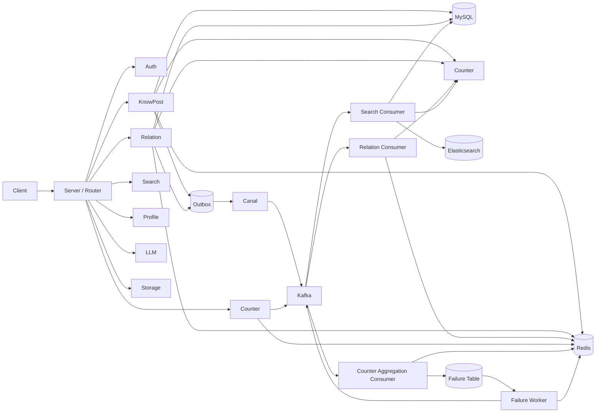

# 模块面试文档索引

这组文档不是代码注释的重复版，而是专门面向面试复盘整理的“讲项目”材料。

目标有三个：

1. 帮你快速讲清楚这个项目各模块的职责和调用关系。
2. 帮你把“我会写代码”提升到“我能解释为什么这么设计”。
3. 帮你提前准备面试官常见的宏观追问、架构追问和场景题追问。

## 0. 面试前 1 小时速记路线

如果你离面试只剩 1 小时，不要平均分配时间，建议按下面顺序过：

1. 先看 [项目面试作答手册](interview-playbook.md)
   - 重点看“通用答题框架”“高压追问怎么接”“高频杀伤力问题”
2. 再看 [计数模块](counter.md)、[关系模块](relation.md)、[搜索模块](search.md)
   - 每篇重点看“一句话介绍”“设计亮点”“边界问题”“继续深挖时怎么答”
3. 再看 [知文模块](knowpost.md) 和 [Outbox + Canal + Kafka 异步链路](outbox-canal-kafka.md)
   - 这两篇负责把主业务和异步架构串起来
4. 最后闭眼练 10 分钟口述
   - 每个核心模块只练四句：它解决什么问题、为什么这么设计、边界在哪里、如果继续做先改什么

如果你现在最怕的是“连续追问时脑子断掉”，那你应该优先背：

1. `counter` 的真值 / 快照 / epoch fence
2. `relation` 的真值 / 投影 / recoverability 边界
3. `search` 的投影 / 最终一致 / 排序模型

## 1. 推荐讲项目顺序

如果面试官让你做 5 到 10 分钟项目介绍，推荐顺序如下：

1. 先讲 [启动装配与生命周期](bootstrap-server.md)
2. 再讲 [知文模块](knowpost.md)
3. 再讲 [计数模块](counter.md)
4. 再讲 [关系模块](relation.md)
5. 再讲 [搜索模块](search.md)
6. 最后补充 [Outbox + Canal + Kafka 异步链路](outbox-canal-kafka.md)

原因很简单：

- `knowpost` 是业务主线，最容易让面试官理解产品价值。
- `counter`、`relation`、`search` 是这个项目最有工程含量的三块。
- `outbox` 链路是把这些模块串起来的架构亮点。

如果时间更短，只讲下面四块也够：

1. `bootstrap/server`
2. `knowpost`
3. `counter`
4. `relation + search + outbox`

## 2. 项目模块地图

当前后端可以从“业务模块”和“支撑模块”两层去理解。

如果你现在最怕的不是“看不懂代码”，而是“面试官连续追问时容易乱”，建议先看：

- [项目面试作答手册](interview-playbook.md)
  - 先学怎么答，再学答什么

### 2.1 业务模块

- [启动装配与生命周期](bootstrap-server.md)
- [鉴权模块](auth.md)
- [资料模块](profile.md)
- [知文模块](knowpost.md)
- [计数模块](counter.md)
- [关系模块](relation.md)
- [搜索模块](search.md)
- [LLM / RAG 模块](llm.md)
- [对象存储模块](storage.md)

### 2.2 支撑模块

- [热点缓存与多级缓存策略](cache-hotkey.md)
- [Outbox + Canal + Kafka 异步链路](outbox-canal-kafka.md)
- [共享基础设施与公共组件](shared-infra.md)
- [项目面试作答手册](interview-playbook.md)

## 3. 模块关系总览

## 4. 如何使用这些文档

每篇文档都尽量按同一套结构组织：

1. 模块定位
2. 核心流程
3. 设计亮点
4. 技术难点与边界问题
5. 面试官高频问题
6. 参考回答
7. 场景题延伸

建议你分三轮使用：

### 第一轮：建立整体认知

按顺序读：

1. `interview-playbook`
2. `bootstrap-server`
3. `knowpost`
4. `counter`
5. `relation`
6. `search`
7. `outbox-canal-kafka`

目标是先把“怎么答”和“系统大图”一起记住。

### 第二轮：建立模块理解

按顺序读：

1. `bootstrap-server`
2. `knowpost`
3. `counter`
4. `relation`
5. `search`
6. `outbox-canal-kafka`

目标是把系统的大图和每个核心模块的 trade-off 记住。

### 第三轮：背“可说出口”的表达

不要只看标题，要重点看：

- 每个模块的“3 句话版本”
- 面试问答里的参考回答
- 场景题的拆解思路

目标是把“代码理解”转化成“口头表达能力”。

### 第四轮：查缺补漏

重点关注：

- 哪些模块你能讲流程，但讲不出 trade-off
- 哪些模块你能讲 happy path，但讲不出边界问题
- 哪些模块你能讲实现，但讲不出为什么不用别的方案

这轮补的是“高级感”。

## 5. 这套文档最应该重点掌握哪几篇

如果你面试的是 Go 后端 / 中高级后端岗位，最值得重点吃透的是：

1. [知文模块](knowpost.md)
2. [计数模块](counter.md)
3. [关系模块](relation.md)
4. [搜索模块](search.md)
5. [Outbox + Canal + Kafka](outbox-canal-kafka.md)
6. [共享基础设施](shared-infra.md)

因为这几篇基本覆盖了：

- 缓存一致性
- 分布式锁
- 异步解耦
- MQ 幂等
- 数据投影
- 最终一致性
- 热点优化
- 搜索与排序

## 6. 阅读提醒

这套文档会明确指出一些“当前实现已有亮点”和“当前实现仍有边界问题”的地方。

这不是在否定项目，而是在帮你准备两类更高级的面试追问：

1. “你这个方案为什么这样做？”
2. “如果继续优化，你会改哪里？”

真正有价值的项目介绍，不是把系统讲成完美无缺，而是：

- 你知道它哪里设计得好
- 你也知道它哪里还有工程折中
- 并且你能讲出下一步怎么演进
