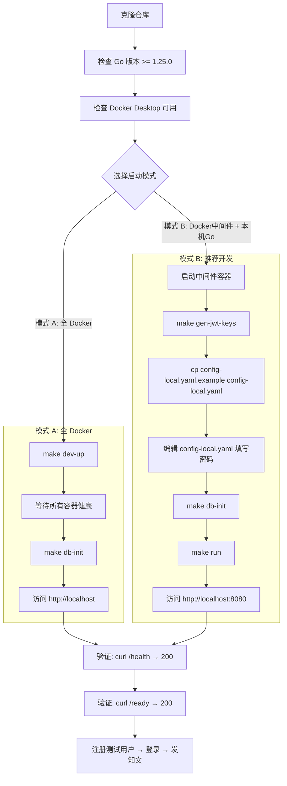
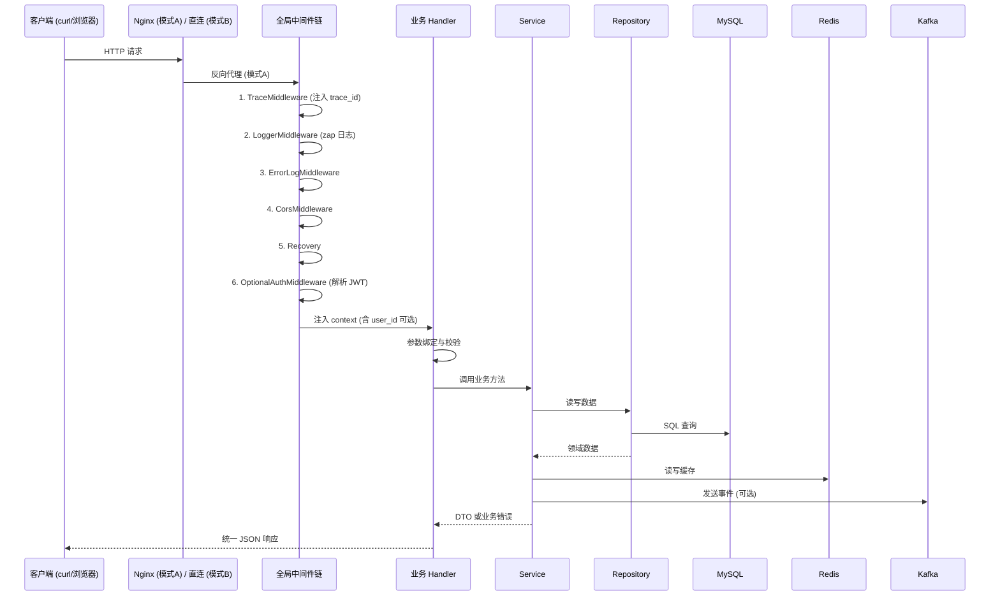
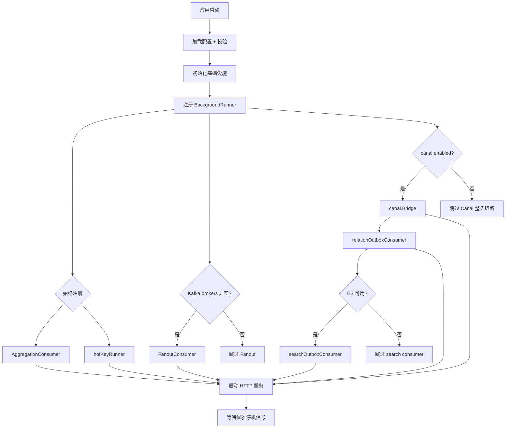
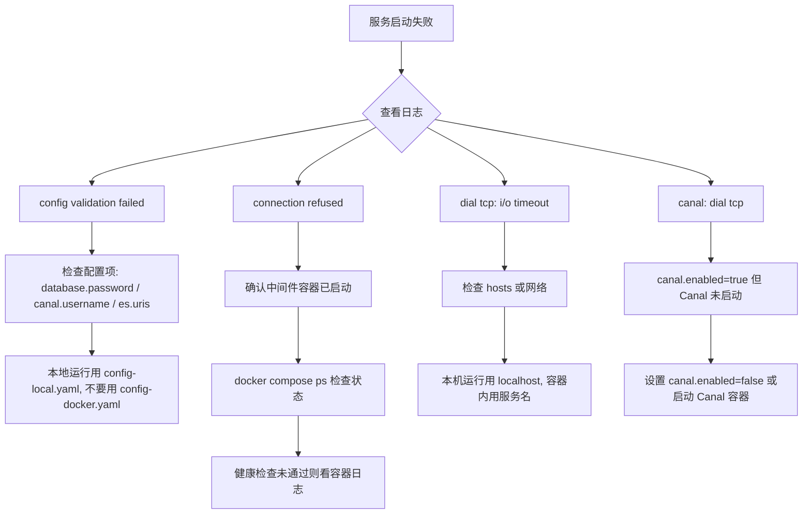
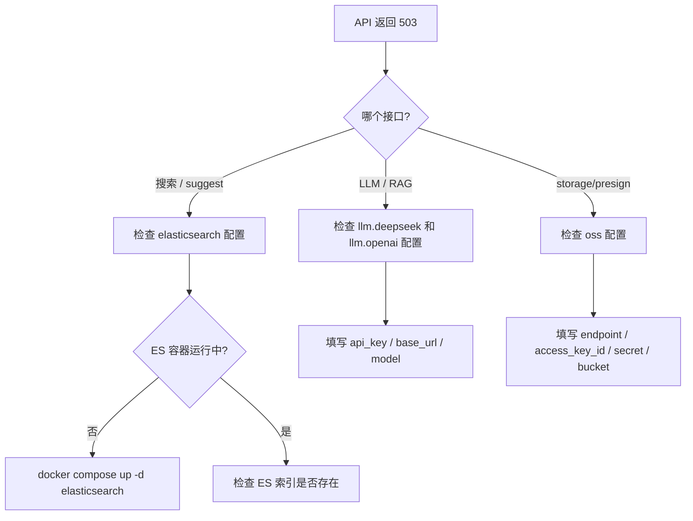
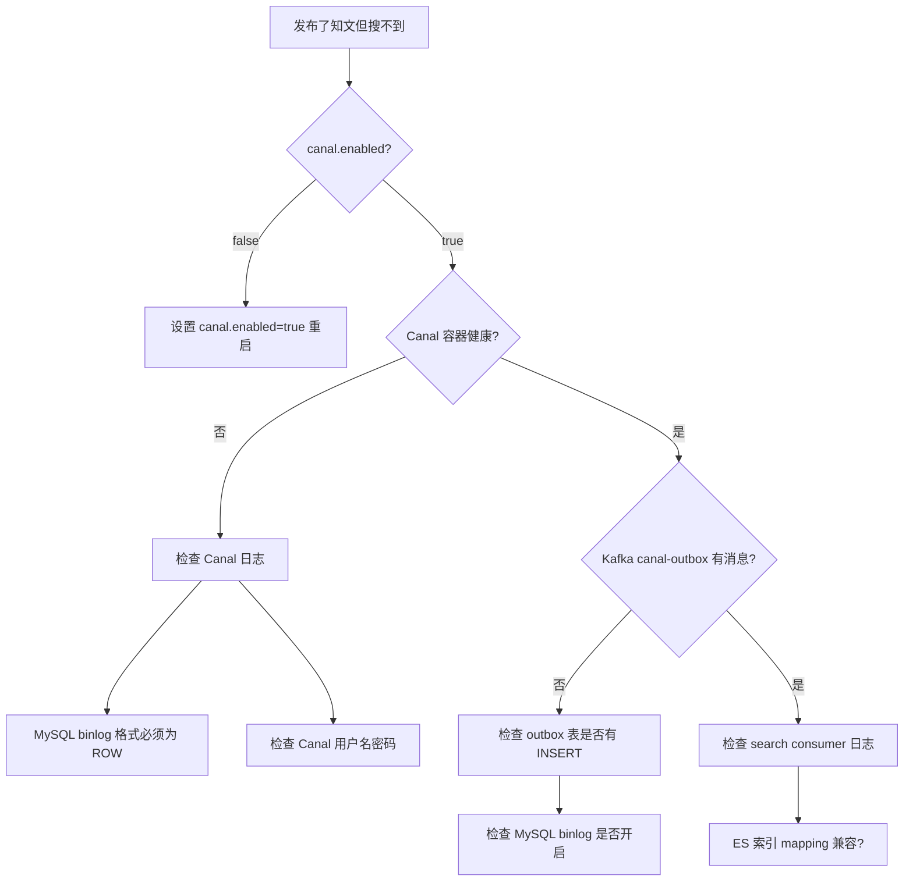
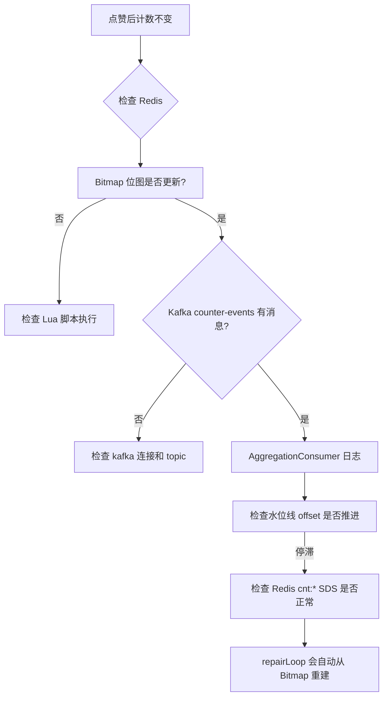

# 本地开发与接口调试手册

> 本文档面向首次接触本项目的开发者，提供从零开始搭建开发环境、理解配置选择、调试接口的全流程指南。
>
> 跨模块协作细节见 [`跨模块流程图.md`](跨模块流程图.md)，单模块深挖见 [`docs/modules/`](modules/)。

---

## 目录

1. [首次启动流程](#1-首次启动流程)
2. [配置选择指南](#2-配置选择指南)
3. [请求生命周期](#3-请求生命周期)
4. [后台 Runner 启动条件](#4-后台-runner-启动条件)
5. [故障排查决策树](#5-故障排查决策树)
6. [接口调试技巧](#6-接口调试技巧)
7. [常见问题 FAQ](#7-常见问题-faq)

---

## 1. 首次启动流程



### 首次启动检查清单

| # | 步骤 | 验证命令 | 预期结果 |
|---|------|---------|---------|
| 1 | Go 版本 | `go version` | go 1.25.0+ |
| 2 | Docker 运行中 | `docker ps` | 无报错 |
| 3 | 中间件就绪 | `curl http://localhost:8080/health` | `{"status":"ok"}` |
| 4 | 数据库初始化 | `docker compose exec mysql mysql -uroot -proot123 zhiguang -e "SHOW TABLES;"` | 有表 |
| 5 | JWT 密钥 | `ls config/keys/` | `private.pem` + `public.pem` |
| 6 | 注册用户 | `curl -X POST http://localhost:8080/api/v1/auth/register -d '...'` | 201 + token |
| 7 | 登录 | `curl -X POST http://localhost:8080/api/v1/auth/login -d '...'` | 200 + token |

---

## 2. 配置选择指南

```mermaid
flowchart TD
    A[选择配置文件] --> B{运行环境}
    B -->|Docker 容器内| C[config/config-docker.yaml]
    B -->|本机开发| D[config/config-local.yaml]
    B -->|生产部署| E[自定义配置]
    
    C --> C1[注意: ${...} 不展开]
    C1 --> C2[需 Docker Compose secrets 注入密码]
    
    D --> D1[从 example 复制]
    D1 --> D2[修改 database.password 和 canal 配置]
    
    E --> E1[参考 config.yaml 结构]
    
    subgraph 配置决策["关键配置决策"]
        F{canal.enabled?}
        F -->|true| G[需要 canal.username 和 password 非空]
        F -->|false| H[不启动异步投影链路]
        G --> I[确保 MySQL 已开启 binlog ROW 格式]
        
        J{elasticsearch 配置?}
        J -->|完整| K[搜索 & LLM/RAG 可用]
        J -->|不完整| L[搜索/LLM 返回 503]
        
        M{oss 配置?}
        M -->|完整| N[预签名上传可用]
        M -->|不完整| O[storage 接口返回 503]
    end
    
    D2 --> F
    F --> J
    J --> M
```

### 配置文件对照

| 配置项 | `config-local.yaml`（本机开发） | `config-docker.yaml`（容器内） | 说明 |
|--------|-------------------------------|-------------------------------|------|
| `database.host` | `localhost` | `mysql` | Docker 内用服务名 |
| `database.password` | 明文 | `${DB_PASSWORD:-root123}`（不展开） | 容器内用 secrets |
| `redis.host` | `localhost` | `redis` | Docker 内用服务名 |
| `kafka.brokers` | `localhost:9092,9093,9094` | `kafka:9092,kafka2:9092,kafka3:9092` | 内网通信 |
| `elasticsearch.uris` | `http://localhost:9200` | `http://elasticsearch:9200` | 内网通信 |
| `auth.jwt.private_key_path` | `config/keys/private.pem` | `/run/secrets/jwt_private_key` | Secrets 挂载 |
| `canal.enabled` | `false`（推荐） | `true` | 本地可关闭 |
| `server.mode` | `debug` | `release` | debug 模式启用 pprof |

### 环境变量速查

| 环境变量 | 默认值 | 用途 |
|----------|--------|------|
| `MYSQL_ROOT_PASSWORD` | `zhiguang_root_admin` | Docker Compose MySQL root 密码 |
| `MYSQL_PASSWORD` | `zhiguang_app_user` | Docker Compose MySQL 应用用户密码 |
| `GOCACHE` | `$(pwd)/.gocache` | 本地 Go 缓存目录（Makefile 自动设置） |

---

## 3. 请求生命周期



### 响应结构

```json
// 成功
{
  "code": 0,
  "message": "success",
  "data": { ... }
}

// 业务错误
{
  "code": 10001,
  "message": "知文不存在",
  "data": null
}

// 系统错误
{
  "code": 50000,
  "message": "内部服务错误",
  "data": null
}
```

### 鉴权方式

| 方式 | 说明 | 使用场景 |
|------|------|---------|
| **全局可选** | `OptionalAuthMiddleware` 解析 JWT，不拒绝未登录请求 | 公共 Feed、详情、搜索 |
| **Handler 内强制** | `middleware.GetUserID(ctx)` 返回 `0` 则 401 | 写操作、个人数据 |
| **路由级强制** | `AuthMiddleware` 包裹路由 | `GET /auth/me` |

获得 token 后，在请求头中携带：

```
Authorization: Bearer <access_token>
```

---

## 4. 后台 Runner 启动条件



### Runner 详细说明

| Runner | 启动条件 | 依赖 | 关闭影响 |
|--------|----------|------|---------|
| `AggregationConsumer` | 始终 | Kafka `counter-events` topic | 点赞/收藏计数不会自动折叠，dirty set 堆积 |
| `hotKeyRunner` | 始终 | Redis | 热点 Key 不会自动延长 TTL |
| `FanoutConsumer` | Kafka brokers 非空 | Kafka `fanout` topic（通常无消息） | 无影响（生产端未闭环） |
| `canal.Bridge` | `canal.enabled=true` | Canal Server、MySQL binlog | 搜索/关系异步投影不更新 |
| `relationOutboxConsumer` | `canal.enabled=true` | Kafka `canal-outbox` topic | 关注列表/粉丝数不自动更新 |
| `searchOutboxConsumer` | `canal.enabled=true` + ES 可用 | ES、MySQL | 搜索索引不自动更新 |

---

## 5. 故障排查决策树

### 5.1 服务启动失败



### 5.2 API 返回 503



### 5.3 搜索索引不更新



### 5.4 点赞/收藏计数不更新



---

## 6. 接口调试技巧

### 6.1 快速验证健康状态

```bash
# 健康检查
curl -s http://localhost:8080/health | jq .

# 就绪检查
curl -s http://localhost:8080/ready | jq .
```

### 6.2 注册 + 登录 + 获取 token

```bash
# 注册
curl -s -X POST http://localhost:8080/api/v1/auth/register \
  -H "Content-Type: application/json" \
  -d '{"username":"testuser","password":"Test1234!","email":"test@example.com"}' | jq .

# 登录
TOKEN=$(curl -s -X POST http://localhost:8080/api/v1/auth/login \
  -H "Content-Type: application/json" \
  -d '{"username":"testuser","password":"Test1234!"}' | jq -r '.data.access_token')
echo $TOKEN
```

### 6.3 使用 token 访问受保护接口

```bash
# 获取当前用户信息
curl -s http://localhost:8080/api/v1/auth/me \
  -H "Authorization: Bearer $TOKEN" | jq .

# 创建草稿
curl -s -X POST http://localhost:8080/api/v1/knowposts/draft \
  -H "Authorization: Bearer $TOKEN" \
  -H "Content-Type: application/json" \
  -d '{"title":"测试文章","content":"正文内容"}' | jq .
```

### 6.4 查看 Redis 数据

```bash
# 进入 Redis 容器
docker compose exec redis redis-cli

# 常用命令
KEYS cnt:*          # 查看计数快照
KEYS bm:*           # 查看 Bitmap 键
KEYS hotkey:*       # 查看热点统计
GET cf:knowpost:ids # 查看 Bloom 过滤器
```

### 6.5 查看 Kafka 消息

```bash
# 进入 Kafka 容器
docker compose exec kafka kafka-console-consumer \
  --bootstrap-server kafka:9092 \
  --topic counter-events \
  --from-beginning \
  --max-messages 10

# 查看 topic 列表
docker compose exec kafka kafka-topics \
  --bootstrap-server kafka:9092 \
  --list
```

### 6.6 查看 Elasticsearch 索引

```bash
# 查看索引
curl -s http://localhost:9200/_cat/indices | column -t

# 搜索文档
curl -s "http://localhost:9200/zhiguang-ai-index/_search?q=test" | jq .
```

---

## 7. 常见问题 FAQ

### Q1: 启动后 `health` 返回 200，但 `ready` 返回 503？

**原因**：`ready` 检查比 `health` 更严格，可能等待某些依赖（如 ES）就绪。容器编排中 `start_period` 内不会算作失败。

**解决**：等待 20-30 秒后重试，或检查容器日志。

### Q2: `make db-init` 报错 `Access denied`？

**原因**：`db/schema.sql` 中的密码与 `docker-compose.yml` 中设置的 `MYSQL_ROOT_PASSWORD` 不一致。

**解决**：确认 `make db-init` 命令中的 `-proot123` 与 `docker-compose.yml` 中的 `MYSQL_ROOT_PASSWORD` 默认值匹配。

### Q3: 本机运行 `make run` 时连接 MySQL 超时？

**原因**：MySQL 容器未启动，或 `config-local.yaml` 中的 `database.host` 写成了 `mysql`（容器内服务名）。

**解决**：本机运行使用 `localhost`，容器内运行使用 `mysql`。

### Q4: Canal 容器启动后一直重启？

**原因**：Canal 需要 MySQL 开启 binlog 且格式为 ROW。检查 `docker-compose.yml` 中 MySQL 的 command 参数。

**解决**：
```bash
# 确认 MySQL binlog 已开启
docker compose exec mysql mysql -uroot -proot123 -e "SHOW VARIABLES LIKE 'log_bin';"
docker compose exec mysql mysql -uroot -proot123 -e "SHOW VARIABLES LIKE 'binlog_format';"
```

### Q5: 如何重置整个开发环境？

```bash
# 停止并删除所有容器和卷
make dev-down
docker compose down -v

# 重建
make dev-up
# 等待所有容器就绪
make db-init
make gen-jwt-keys
```

### Q6: 频繁修改代码，每次都要重启服务吗？

推荐使用 **模式 B**（Docker 中间件 + 本机 Go 服务），修改 Go 代码后只需 `Ctrl+C` 终止再 `make run` 即可。如需热重载，可使用 `air` 或 `nodemon` 等工具。

### Q7: `config-docker.yaml` 中的 `${DB_PASSWORD:-root123}` 为什么没有被展开？

Go 的 `yaml.Unmarshal` **不会** 展开 shell 变量语法。`${...}` 仅在 Docker Compose 的 `environment` 字段中由 Docker 解析。`config-docker.yaml` 仅供容器内运行使用，密码通过 Docker secrets 注入。本机开发必须使用 `config-local.yaml`。

---

> **文档维护**：修改了启动流程、配置格式、Runner 注册逻辑后，请同步更新本文档。