# 跨模块流程图

> 本文档**专门画跨模块协作链路**，不重复单模块内部细节。  
> 单模块深挖请看 [`docs/modules/`](modules/00-文档目录与面试导读.md)。  
> 图中节点以**当前源码接线**为准；标注「最终一致」的路径均为异步派生，不是强同步。  
> 算法已实现但**生产路径未完整接线**的能力，会单独用「接线缺口」标出，面试勿讲成已全链路落地。

## 0. 怎么用这份文档

| 场景 | 先看哪张图 |
|------|------------|
| 面试官让先介绍项目 | §1 系统全景 + §2 模块依赖 |
| **先看有没有写错/漏写** | **§0.1 源码接线核对** |
| 讲发布 / 搜索 | §3 发布知文端到端 |
| 讲点赞高并发 | §4 点赞/收藏跨模块 |
| 讲关注与粉丝时间线 | §5 关注关系 + §6 Feed |
| 讲详情读路径如何拼计数 | §7 详情读跨模块 |
| 讲搜索如何建索引 | §8 搜索投影 |
| 讲鉴权如何串请求 | §9 鉴权横切 |
| 讲进程怎么装起来 | §10 启动与后台 Runner |
| 讲一致性边界 | §11 真值 / 投影 / 缓存分层 |

阅读约定：

- **实线箭头**：同步调用或同事务写入  
- **虚线箭头**：异步（Canal / Kafka / 后台 loop）  
- **菱形**：分支 / 降级 / 开关  
- **接线缺口**：代码有类/测试，但 bootstrap 未把生产端与消费端接成闭环  

### 0.1 源码接线核对（对照 `internal/bootstrap`，2026-07 核对）

| 链路 | 设计意图 | 当前落地 | 面试怎么说 |
|------|----------|----------|------------|
| knowpost/relation → outbox → Canal → `canal-outbox` | 事务绑定事件 | **已接线**（`canal.enabled=true`） | 可讲完整 |
| `canal-outbox` → search consumer | ES 投影 | **已接线**（且 ES 配置完整） | 可讲完整 |
| `canal-outbox` → relation consumer | ZSet 投影 + 用户计数 | **已接线**（装配在 `initSearch`，随 canal 开关启动） | 可讲完整 |
| like/fav → Bitmap → `counter-events` → SDS | 状态真值 + 异步快照 | **已接线**；repair 在 **AggregationConsumer 内** dirty loop | 勿单独编造 FailureWorker 进程 |
| following/follower 数 | 关系变更后更新展示数 | **不经 Kafka**：`EventProcessor` 直接 `HIncrBy` SDS | 与 like/fav **不是**同一条 counter-events |
| posts 用户指标槽位 | SDS schema 有 `posts` | **未见生产写入点** | 勿讲成「发布自动 posts++」 |
| 信息流扩散 fanout | 推拉结合 | **已闭环**：消费 `canal-outbox` 的 `KnowPostPublished`；普通作者推入 `timeline:{fanID}`，大 V 只写 `authorbox:{authorID}` 由读者拉；读首页归并两路。独立 `fanout` topic 已移除（避免双写丢事件） | 讲「按粉丝数分流，两侧成本都被配置封死」 |
| 失败表 `ReplayFailedMessages` | 失败记录可补偿 | **有 API 方法 + 落库**；**无独立 BackgroundRunner 周期调用** | 在线兜底靠 dirty set + repairLoop |
| outbox DirectPoll / PollConsumer | 无 Canal 时轮询 outbox | **有实现与单测**；bootstrap **未**在 `canal.enabled=false` 时启用 | 勿讲成双模式自动切换 |
| 全局鉴权 | 身份注入 | **OptionalAuth 全局** + Handler 内强制登录 | 公开接口也能拿到可选 user_id |
| HotKeyDetector | 热点 TTL | **已接线**为 `hotKeyRunner` | 常被文档漏写 |

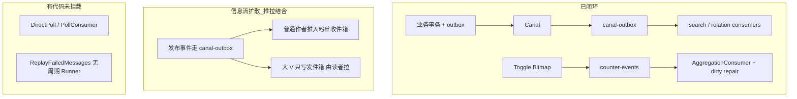

---

## 1. 系统全景（业务入口 × 存储 × 异步）

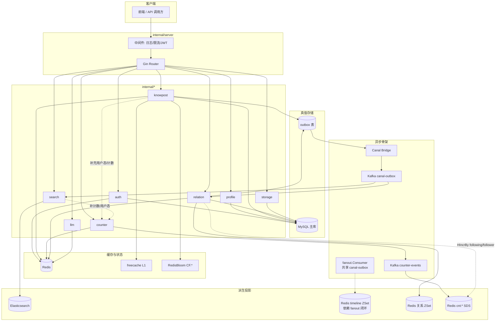

讲解要点（面试口述）：

1. **MySQL 是业务真值**；Redis / ES / timeline 是投影或缓存。  
2. **两条已闭环异步骨干**：`outbox → Canal → canal-outbox`（内容/关系投影）与 `counter-events`（like/fav 增量）。  
3. **knowpost / relation 写主数据时同事务写 outbox**，避免「库成功、消息丢」。  
4. **like/fav 不走 outbox**：Bitmap 真值 + Kafka → SDS；**following/follower 也不走 counter-events**，是 relation 消费端直接改 SDS。  
5. **扩散复用 `canal-outbox`**；独立 `fanout` topic 已移除，避免「事务提交 + Kafka 投递」双写丢事件。  

---

## 2. 模块依赖关系（谁调用谁）

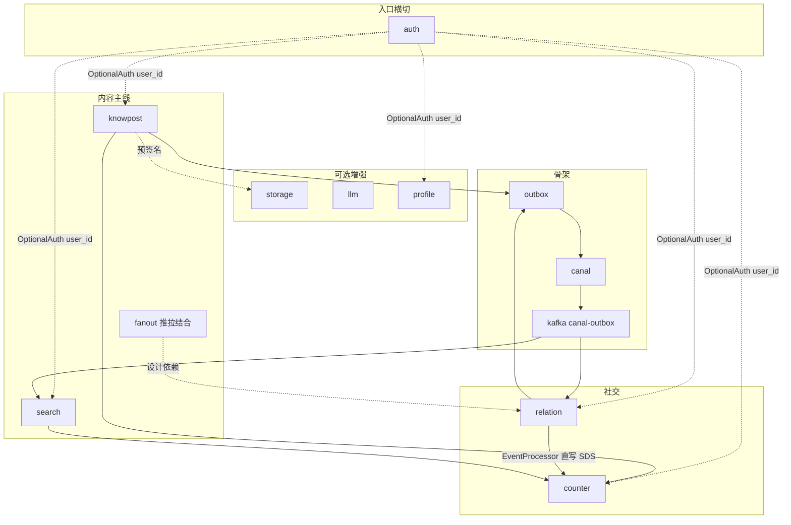

| 依赖方向 | 含义 | 典型调用点 | 是否走 Kafka |
|----------|------|------------|--------------|
| knowpost → counter | 详情/Feed 补 like/fav 数与用户态 | `detail_service` / feed 组装 | 读 SDS/Bitmap，否 |
| search → counter | 索引投影补热度；查询补 liked/faved | `KnowPostProjector` / 查询 DTO | 读，否 |
| relation → counter | 关注/取关后 ± following/follower | `EventProcessor` → `UserCounter` | **否**（`HIncrBy`） |
| like/fav 写 | toggle 发 delta | `CounterEventProducer` | **是** `counter-events` |
| fanout → relation | 写扩散取粉丝列表 | `FanoutService` | 消费 `canal-outbox`（独立 fanout topic 已移除） |
| knowpost/relation → outbox | 同事务事件投递 | `runKnowPostTx` / Follow 事务 | 经 Canal → `canal-outbox` |

---

## 3. 发布知文端到端（knowpost × outbox × canal × search）

> **注意**：本节只画**已闭环**的搜索投影链路。写扩散见 §6（已闭环，含推拉结合与归并）。

### 3.1 时序总图（已闭环）

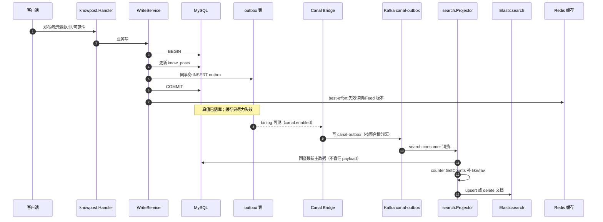

### 3.2 流程图（含失败与开关）

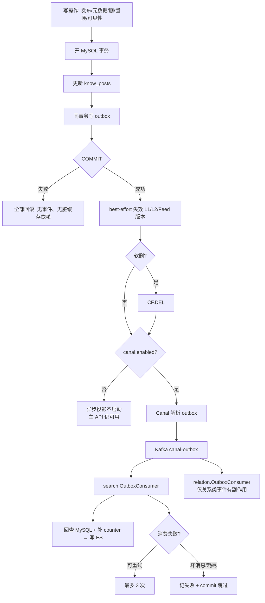

跨模块要点：

1. **knowpost 只保证主库 + outbox 原子**；ES 最终一致。  
2. **search 投影**解析 payload 的 `entity/op/id`，再 **回查 MySQL** 全量字段，并用 counter 补热度。  
3. **`canal.enabled=false`**：不启 Canal Bridge、relation/search outbox consumer；**不自动切** DirectPoll。  
4. 草稿创建、OSS 正文确认等轻路径**不一定写 outbox**（见模块 04）。  
5. 发布成功 **不会**自动 `posts++`（schema 有槽位，生产路径未见写入）。  

相关文档：[04 知文](modules/04-知文内容缓存与Feed模块.md) · [07 搜索](modules/07-搜索投影模块.md) · [08 异步链路](modules/08-事务消息-Canal-Kafka异步链路.md)

---

## 4. 点赞 / 收藏跨模块（counter × Kafka × 读路径）

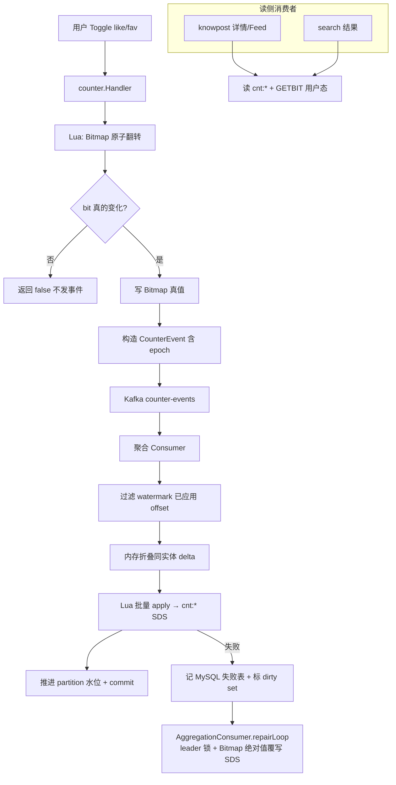

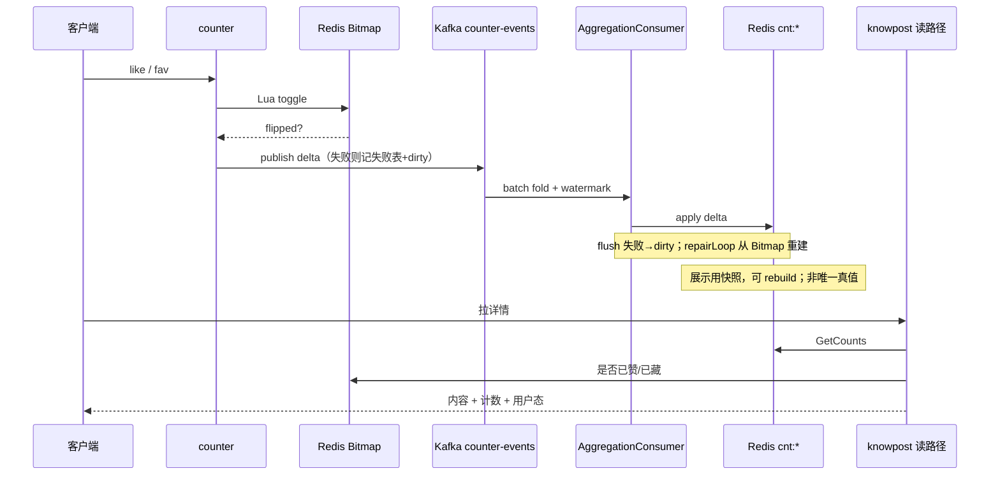

跨模块要点：

1. **counter 与 outbox 链路独立**——点赞不写 MySQL outbox。  
2. knowpost / search **只读 counter 接口**，不直接操作 Bitmap 细节。  
3. 重复点赞不发事件，降低 MQ 写放大。  
4. **没有独立 `CounterFailureWorker` Runner**：在线补偿是 **dirty set + `AggregationConsumer.repairLoop`**；`ReplayFailedMessages` 可对失败表做绝对值重建，但 **bootstrap 未挂周期任务**。  
5. rebuild marker 降低重建与增量并发风险（**尚未实现 event epoch / generation fence**）。  
6. **不要把 following/follower 当成走 counter-events**（见 §5）。  

相关文档：[05 计数](modules/05-点赞收藏计数模块.md)

---

## 5. 关注 / 取关跨模块（relation × outbox × counter × Redis 投影）

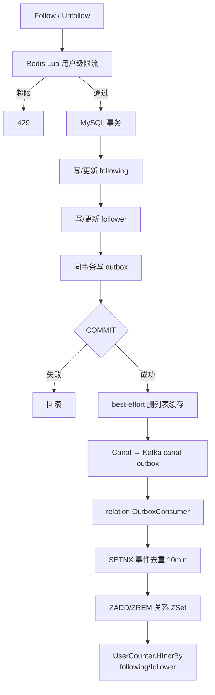

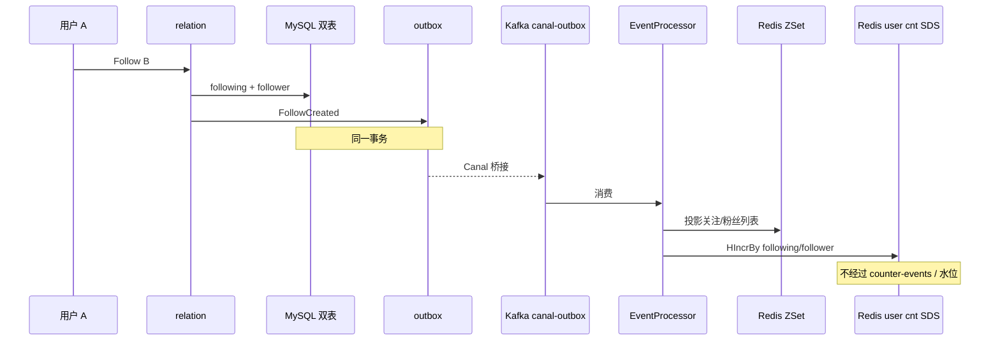

跨模块要点：

1. **真值在 MySQL 双表**；Redis ZSet 是列表投影。  
2. **关注数/粉丝数**：在 relation **异步消费端** 直接改 SDS，不是 Follow 事务内改，也 **不是** like/fav 的 Kafka 聚合链路。  
3. 单条 `IsFollowing` **直查 DB**，不走缓存（一致性优先）。  
4. 已知边界：dedupe 若过早落标，可能导致副作用半成功后重试被吞（见模块 06）。  
5. relation consumer 与 search consumer **共用** `canal-outbox`、不同 group；装配在 `initSearch`，随 `canal.enabled` 启动。  

相关文档：[06 关系](modules/06-关注关系与Feed扩散模块.md) · [08 异步链路](modules/08-事务消息-Canal-Kafka异步链路.md)

---

## 6. Feed 与写扩散（knowpost × relation × fanout）

### 6.1 信息流扩散：推拉结合

完整原理、键设计、参数取舍与故障降级见
[`docs/modules/14-信息流扩散`](modules/14-信息流扩散-读扩散写扩散与推拉结合.md)，这里只画跨模块接线。

**写路径：**

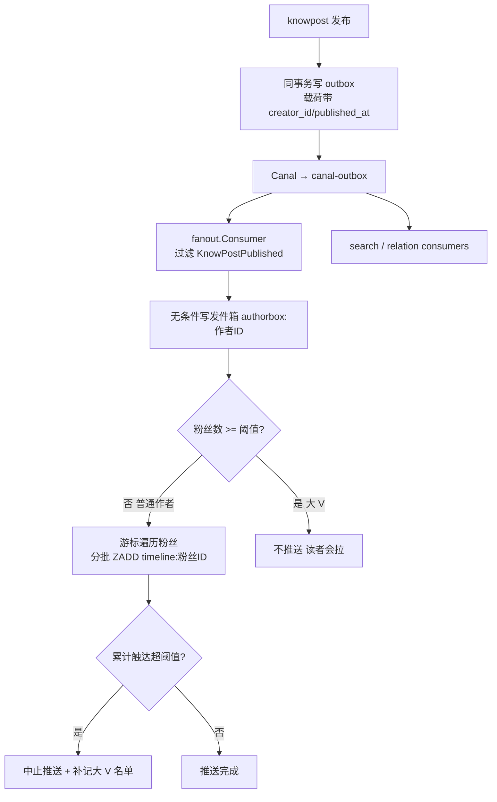

**读路径：**

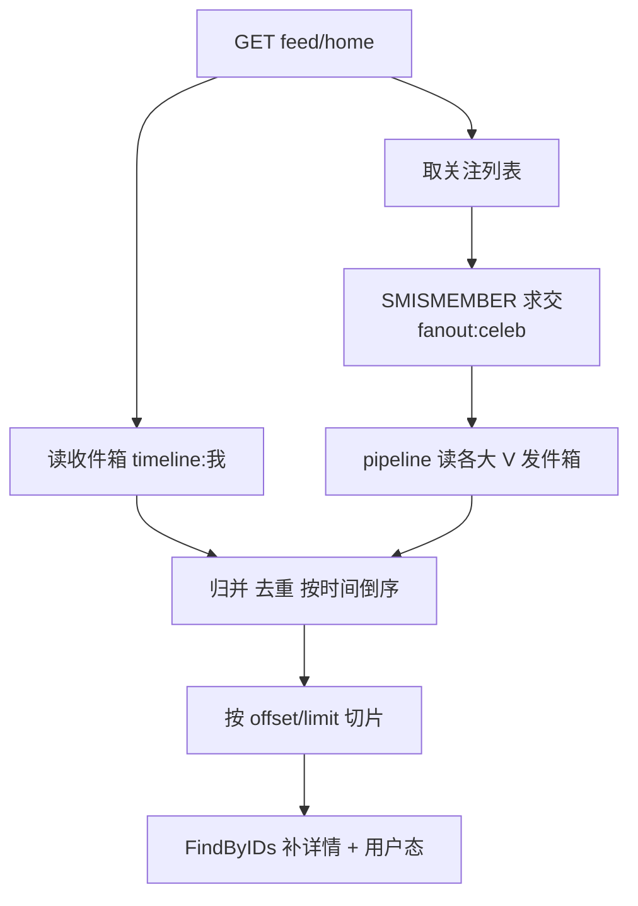

| 组件 | 状态 |
|------|------|
| `fanout.Service.FanoutPost` | 写路径：分流推/拉，边推边数自我修正 |
| `fanout.TimelineReader` | 读路径：推拉归并去重分页 |
| `fanout.Consumer` | 订阅 `canal-outbox`，过滤 `KnowPostPublished` |
| 独立 `fanout` topic | **已移除**（需双写，中间崩溃会丢事件） |
| 关注 / 取关钩子 | `OnFollow` 回填、`OnUnfollow` 清理收件箱副本 |

### 6.2 读 Feed（三个接口语义互不相同）

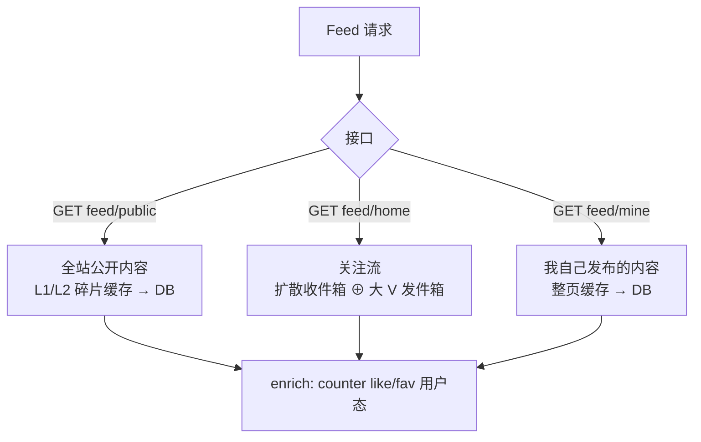

跨模块要点：

1. 三个接口语义严格分离。此前 `/feed/mine` 调用的 `GetMineFeed` 会在 timeline 有数据时返回**关注流**、
   否则返回**我的已发布**——同一接口两种语义，已拆分修复。
2. 关注流的帖子 ID 由扩散模块给出，`knowpost` 只负责补详情与叠加用户态，两者通过窄接口解耦。
3. 关注流有深度上限（`fanout.timeline_max_items`，默认 1000）；看更早内容走作者维度查询。
4. 缓存失效靠版本号 / best-effort 删键。

相关文档：[04 知文 Feed](modules/04-知文内容缓存与Feed模块.md) · [06 关系/Fanout](modules/06-关注关系与Feed扩散模块.md)

---

## 7. 详情读路径跨模块（knowpost × cache × counter）

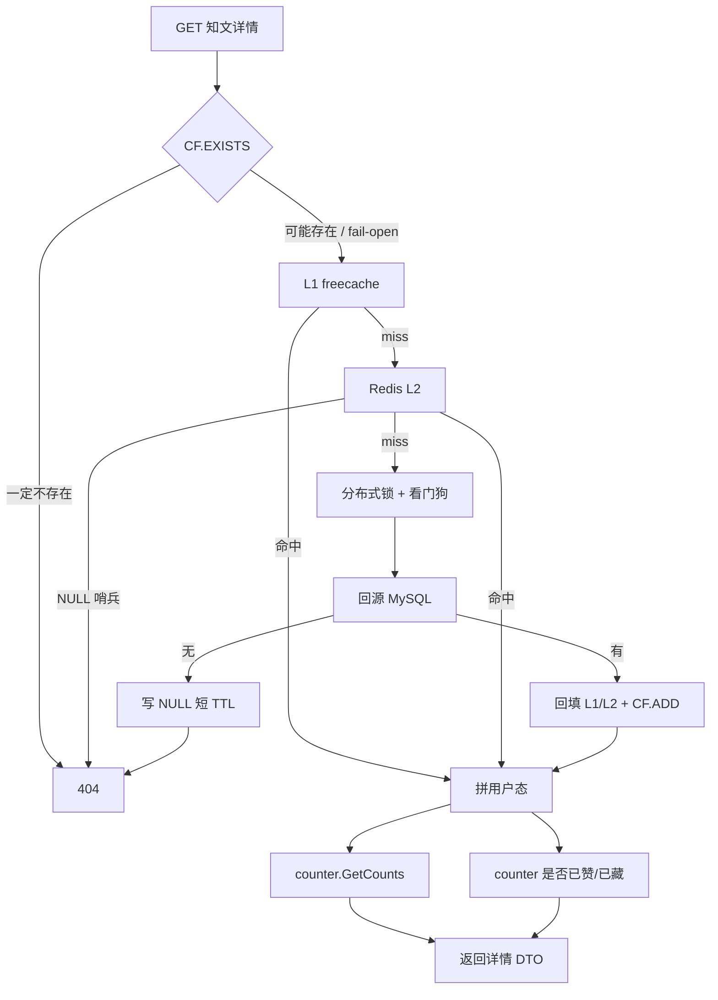

跨模块要点：

1. **内容缓存与互动状态分离**：缓存存公共详情，用户态每次向 counter 查。  
2. CF 与 NULL **叠加**防穿透；CF 故障 fail-open，不误杀全站。  
3. 锁 + 看门狗避免长尾回源时锁过期导致击穿。  

相关文档：[04 知文](modules/04-知文内容缓存与Feed模块.md) · [09 多级缓存](modules/09-热点缓存与多级缓存策略.md)

---

## 8. 搜索跨模块（查询侧 × 投影侧 × counter）

### 8.1 在线查询

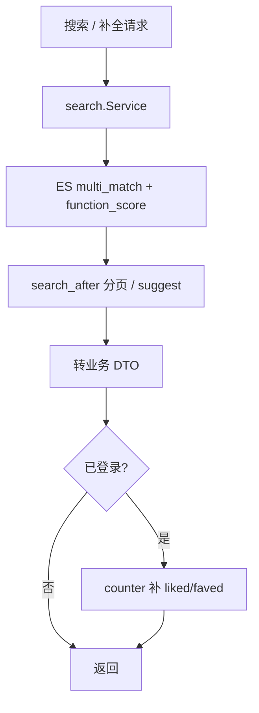

### 8.2 异步建索引

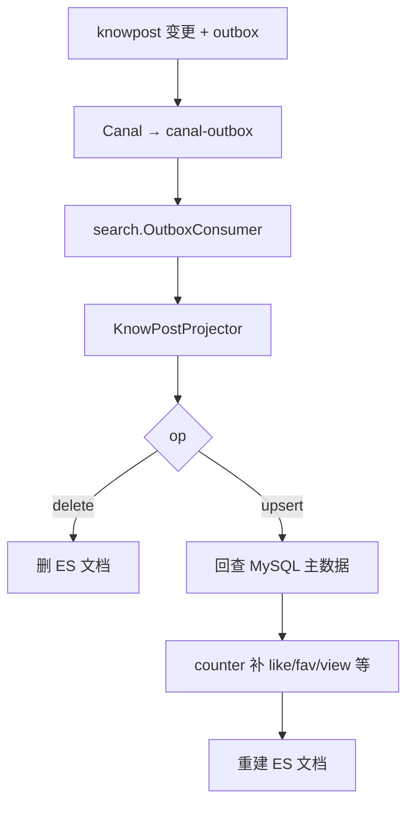

跨模块要点：

1. **ES 永不作为写真值**；主库变更驱动投影。  
2. 索引文档带热度字段时依赖 counter，**搜索排序与计数快照最终一致**。  
3. 在线查询与投影 consumer 职责拆分，便于独立扩容与幂等策略。  

相关文档：[07 搜索](modules/07-搜索投影模块.md)

---

## 9. 鉴权横切（auth × 全业务 Handler）

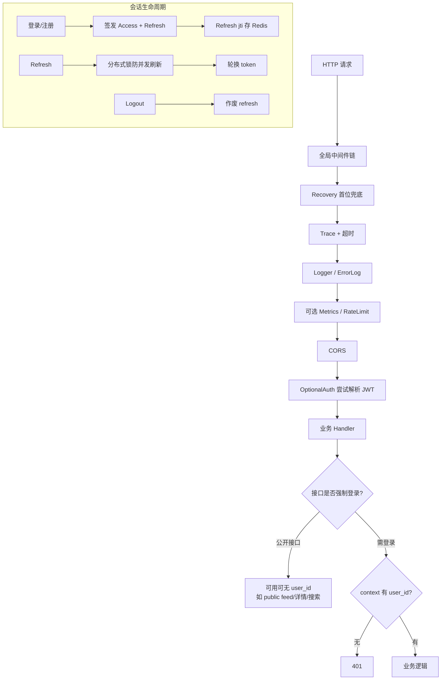

跨模块要点：

1. 全局是 **OptionalAuth**，不是全局强制 401；强制登录在 **Handler 内**判断。  
2. 这样公开接口也能在有 token 时补 liked/faved。  
3. auth **不参与**业务事务；Refresh/重置密码用分布式锁。  

相关文档：[02 鉴权](modules/02-鉴权与安全模块.md)

---

## 10. 启动装配与后台 Runner（bootstrap × 全模块）

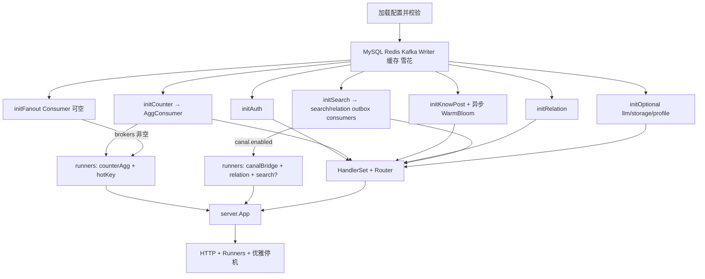

### 10.1 实际注册的 BackgroundRunner（对照 `app.go`）

| Runner | 启动条件 | 职责 |
|--------|----------|------|
| `AggregationConsumer` | 始终注册（依赖 Kafka reader） | 消费 `counter-events`；内嵌 **dirty repairLoop** |
| `hotKeyRunner` | 始终注册 | HotKeyDetector 后台 flush |
| `fanout.Consumer` | Kafka brokers 非空 | 消费 `canal-outbox`，过滤 `KnowPostPublished` 后扩散 |
| `canal.Bridge` | `canal.enabled=true` | binlog → `canal-outbox` |
| relation outbox consumer | `canal.enabled=true` | 关系投影 + HIncrBy 用户计数 |
| search outbox consumer | `canal.enabled=true` 且 ES 可用 | ES 投影 |

**不存在**独立 Runner：

- `CounterFailureWorker`（失败表无周期自动重放；有 `ReplayFailedMessages` 方法）
- outbox `DirectPoll` / `PollConsumer`（`canal.enabled=false` 时 **不会**自动启用）

相关文档：[01 启动装配](modules/01-启动装配与生命周期.md)

---

## 11. 一致性分层总图（面试白板推荐）

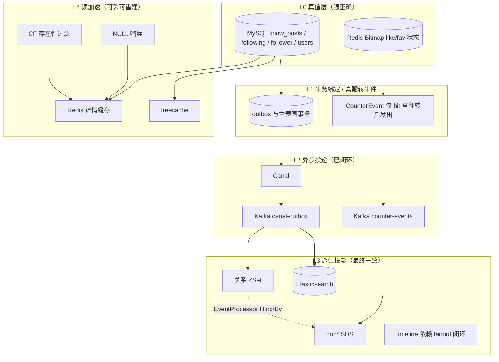

口述四句：

1. **先保证 L0**：主库和 Bitmap 不能错。  
2. **用 L1 绑事件**：outbox / 真翻转事件，解决双写丢消息。  
3. **L2/L3 接受延迟**：搜索、关系列表、like/fav 展示数最终追平；timeline 看 fanout 是否闭环。  
4. **L4 只加速**：缓存 miss 或版本失效就回源，绝不把缓存当真值。  

---

## 12. Kafka / 计数路径对比（别混成一条）

| 维度 | canal-outbox | counter-events | 用户 following/follower |
|------|--------------|----------------|-------------------------|
| 触发源 | MySQL outbox binlog | Toggle 真翻转后应用发 Kafka | relation EventProcessor |
| 生产者 | Canal Bridge | CounterEventProducer | 无独立消息 |
| 消费者 | search / relation groups | AggregationConsumer | 同 relation consumer 内 |
| 幂等 | ES 覆盖、SETNX+ZSet 等 | partition watermark + epoch | SETNX + HIncrBy（半成功风险） |
| 失败处理 | 重试后跳过坏消息 | 失败表记录 + dirty repairLoop | 依赖重试/人工；无独立 repair 表 |
| 目标 | ES / 关系 ZSet | 实体 cnt SDS like/fav | 用户 cnt SDS |

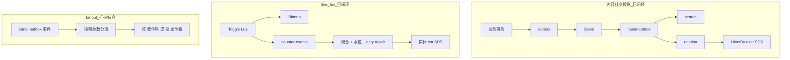

---

## 13. 对象存储 / LLM 与主链路的关系（可选依赖）

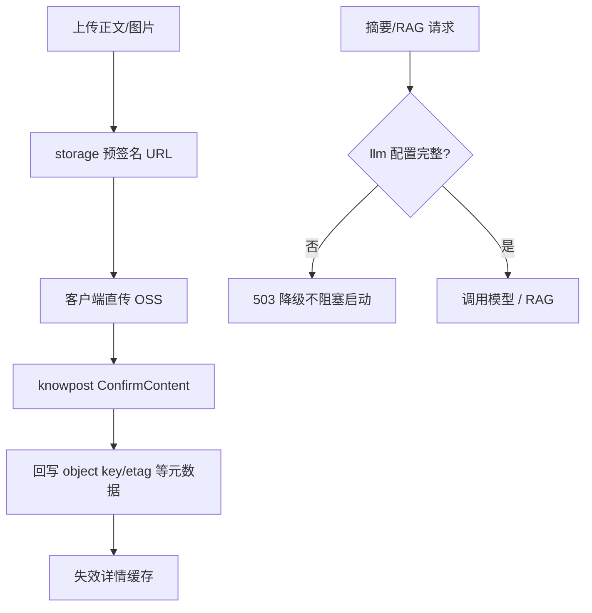

要点：OSS / LLM **配置不全时降级**，不拖垮主业务启动（见 README 与模块 10/11）。

---

## 14. 端到端场景速查

### 场景 A：用户注册后发第一篇知文（搜索投影与粉丝时间线均已闭环）

```mermaid
sequenceDiagram
    participant U as 新用户
    participant AUTH as auth
    participant KP as knowpost
    participant ASYNC as Canal/canal-outbox
    participant SCH as search
    participant FE as 任意客户端

    U->>AUTH: 注册/登录拿 token
    U->>KP: 发布知文
    KP->>ASYNC: outbox 可见
    ASYNC->>SCH: 索引可搜（最终一致）
    FE->>SCH: 搜索可见新帖
    Note over KP: 发布事件经 canal-outbox 触发扩散<br/>普通作者推入粉丝 timeline，大 V 由读者拉取
```

### 场景 B：用户点赞后搜索结果热度上升（最终一致）

```mermaid
sequenceDiagram
    participant U as 用户
    participant CTR as counter
    participant K as counter-events
    participant SDS as cnt:*
    participant SCH as search 投影/查询

    U->>CTR: like
    CTR->>K: delta
    K->>SDS: 聚合后 like++
    Note over SCH: 下次投影重建或查询读计数时看到新热度
    SCH-->>U: function_score 结果变化（有延迟）
```

### 场景 C：关注大 V 后列表与粉丝数

```mermaid
sequenceDiagram
    participant A as 用户 A
    participant REL as relation
    participant DB as MySQL
    participant K as canal-outbox
    participant EP as EventProcessor
    participant CTR as counter
    participant Z as Redis ZSet

    A->>REL: Follow 大V
    REL->>DB: 双表 + outbox
    K->>EP: FollowCreated
    EP->>Z: 投影列表
    EP->>CTR: following/follower +1
```

---

## 15. 维护约定

1. 改了跨模块调用关系、Kafka 主题、outbox 事件类型、fanout 接线，**必须同步本文**。  
2. 单模块内部算法变更（Lua 细节、TTL 数值）优先改 `docs/modules/0x-*.md`，本文只在「协作边界」变化时更新。  
3. 图中节点保持**中文**；新增链路优先用 mermaid `flowchart` / `sequenceDiagram`。  
4. 目录索引见 [00-文档目录与面试导读](modules/00-文档目录与面试导读.md)。  

---

## 附录：模块文档索引

| 编号 | 文档 |
|------|------|
| 00 | [文档目录与面试导读](modules/00-文档目录与面试导读.md) |
| 01 | [启动装配与生命周期](modules/01-启动装配与生命周期.md) |
| 02 | [鉴权与安全](modules/02-鉴权与安全模块.md) |
| 03 | [资料](modules/03-资料模块.md) |
| 04 | [知文与 Feed](modules/04-知文内容缓存与Feed模块.md) |
| 05 | [点赞收藏计数](modules/05-点赞收藏计数模块.md) |
| 06 | [关注与 Feed 扩散](modules/06-关注关系与Feed扩散模块.md) |
| 07 | [搜索投影](modules/07-搜索投影模块.md) |
| 08 | [Outbox-Canal-Kafka](modules/08-事务消息-Canal-Kafka异步链路.md) |
| 09 | [多级缓存](modules/09-热点缓存与多级缓存策略.md) |
| 10 | [大模型与 RAG](modules/10-大模型与RAG模块.md) |
| 11 | [对象存储](modules/11-对象存储模块.md) |
| 12 | [共享基础设施](modules/12-共享基础设施与公共组件.md) |
| 13 | [面试作答手册](modules/13-项目面试作答手册.md) |
